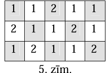
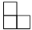

# <lo-sample/> LV.VOL.2010.9.1

Vai iespējams, ka kvadrātvienādojuma $x^{2}-a^{2}x+b^{2}=0$, $a$ un $b$ naturāli
skaitļi, saknes ir divu dažādu naturālu skaitļu kvadrāati?

<small>

* questionType:
* domain:

</small>

## Atrisinājums

Saskaņā ar Vjeta teorēmu $x_{1}+x_{2}=a^{2}$ un $x_{1}x_{2}=b^{2}$.

Pieņemsim, ka eksistē divi dažādi naturāli skaitļi $y_{1}$ un $y_{2}$, kuriem būtu
spēkā $x_{1}=y_{1}{ }^{2}$ un $x_{2}=y_{2}{ }^{2}$. Tad
$b^{2}=y_{1}^{2}y_{2}^{2}=\left(y_{1}y_{2}\right)^{2}$, tātad $b=y_{1}y_{2}$ ir
naturāls skaitlis pie visām naturālām $y_{1}$ un $y_{2}$ vērtībām;
$y_{1}^{2}+y_{1}{ }^{2}=a^{2}$. Izvēloties, piem., $y_{1}=3$ un $y_{2}=4$, tātad $a=5$,
iegūstam vienādojumu $x^{2}-5^{2}x+12^{2}=0$, kura saknes ir $3^{2}$ un $4^{2}$.

# <lo-sample/> LV.VOL.2010.9.2

Trijstūrī $ABC$ nogriežņi $AM$ un $CN$ ir bisektrises, un punkts $O$ ir $CN$
viduspunkts. Zināms, ka $\sphericalangle ABC=90^{\circ}$ un caur punktiem $B, M, O$
un $N$ var novilkt riņķa līniju. Atrast $\sphericalangle BAC$ vērtību.

<small>

* questionType:
* domain:

</small>

## Atrisinājums

Ja caur punktiem $B, M, O$ un $N$ var novilkt riņķa līniju, tad
$\sphericalangle NBM+\sphericalangle NOM=180^{\circ} \quad$ un
$\sphericalangle NOM=90^{\circ}$ (skat. 1.zīm.). Tā kā $OM$ $\triangle NMC$ ir gan
augstums, gan mediāna, tad $\triangle NMC$ ir vienādsānu trijstūris. $CN$ ir bisektrise,
tātad $\sphericalangle ACN=\sphericalangle NCM=\sphericalangle CNM$. No tā seko, ka
$AC || MN$. Tad $\sphericalangle CAM=\sphericalangle NAM=\sphericalangle AMN$, tātad
$\triangle MNA$ ir vienādsānu trijstūris. Iegūstam, ka $AN=MN=MC$ un $ANMC$ ir
vienādsānu trapece, tāpēc $\sphericalangle NAC=\sphericalangle MCA$. Tā kā
$\triangle ABC$ ir vienādsānu taisnleņķa trijstūris, tad
$\sphericalangle BAC=\sphericalangle NAC=45^{\circ}$.

# <lo-sample/> LV.VOL.2010.9.3

Par *skaistu* sauksim tādu naturālu skaitli, kas nedalās ne ar vienu no cipariem savā
decimālajā pierakstā (neviens skaitlis nedalās ar $0$).

Kāds lielākais daudzums pēc kārtas sekojošu naturālu skaitļu visi var būt $skaisti$?

<small>

* questionType:
* domain:

</small>

## Atrisinājums

Aplūkosim $11$ tādus pēc kārtas sekojošus naturālus skaitļus no $k$ līdz $k+10$
(ieskaitot), ka skaitļa $k$ pēdējais cipars ir $1$. Skaitlis $k$ beidzas ar $1$ un
dalās ar $1$; $k+4$ beidzas ar $5$- tātad dalās ar $5$; skaitlis $k+10$ arī beidzas ar
$1$. Tātad, skaitlli $k$, $k+4$ un $k+10$ nav skaisti. Starp $k$ un $k+4$ ir $3$
skaitļi; starp $k+4$ un $k+10$ ir $5$ skaitļi. Tāpēc nevar būt vairāk nekā $5$ pēc
kārtas sekojoši *skaisti* skaitļi.

Piemēram, skaitļi $866, 867, 868, 869, 870$ visi ir *skaisti*, tātad var būt $5$ pēc
kārtas sekojoši *skaisti* skaitļi.

# <lo-sample/> LV.VOL.2010.9.4

Rūtiņu lapā novietoti divi taisnstūri (var būt sakrītoši) tā, ka to malas iet pa rūtiņu
malām. Teiksim, ka punkts pieder taisnstūrim, ja tas atrodas taisnstūra iekšpusē vai
uz tā kontūra.

Cik no $8$ šo divu taisnstūru virsotnēm var vienlaicīgi piederēt arī otram taisnstūrim?

<small>

* questionType:
* domain:

</small>

## Atrisinājums

**Atbilde:** no astoņām divu taisnstūru virsotnēm vienlaicīgi otram arī taisnstūrim var
piederēt $0, 2, 3$, $4, 5, 6$ vai $8$ virsotnes, skat., piem., 2.zīm.

**Pierādījums.** (A) Pierādīsim, ka otram taisnstūrim nevar piederēt tieši viena
virsotne.

Pieņemsim pretējo, ka šāda (*īpaša*) virsotne tomēr atrodas- tā ir vienīgā no astoņām
virsotnēm, kas vienlaicīgi pieder arī otram taisnstūrim. Šī virsotne nevar sakrist ar
kādu no otra taisnstūra virsotnēm, jo tad arī otra taisnstūra virsotnei, ar kuru sakrīt
*īpašā* virsotne, būtu spēkā šī īpašība, t.i., būtu vismaz divas virsotnes ar minēto
īpašību. Tātad *īpašā* virsotne var atrasties tikai otra taisnstūra iekšpusē vai arī uz
kādas no tā malām. 3.zīmējumā ir parādīta situācija, kad īpašā virsotne ir otra
taisnstūra iekšpusē.

Aplūkosim, kur var atrasties tās divas virsotnes, kurām ar īpašo virsotni ir kopīga
mala. Vienai virsotnei $(V_{x})$ jāatrodas uz tās pašas horizontāles, uz kuras atrodas
īpašā virsotne. $V_{x}$ nevar atrasties otra taisnstūra iekšpusē vai uz tā malas, jo
tad arī $V_{x}$ būtu ar meklēto īpašību. Citai virsotnei $(V_{y})$ jāatrodas uz tās
pašas vertikāles, uz kuras atrodas īpašā virsotne. $V_{y}$ nevar atrasties otra
taisnstūra iekšpusē vai uz tā malas, jo tad arī $V_{y}$ būtu ar minēto īpašību. Tātad
gan $V_{x}$, gan $V_{y}$ atrodas ārpus otra taisnstūra. Bet tādā gadījumā pirmā
taisnstūra (kura trīs virsotnes ir *īpašā* virsotne, $V_{x}$ un $V_{y}$ iekšpusē
atrodas kāda no otrā taisnstūra virsotnēm.

Līdzīgi analizē gadījumu, kad $īpašā$ virsotne atrodas uz otra taisnstūra kontūra.

Esam ieguvuši pretrunu, tātad nevar būt tieši viena virsotne, kas pieder arī otram
taisnstūrim.

(B) Pierādīsim, ka otram taisnstūrim nevar piederēt tieši septiņas virsotnes.

Ieviesīsim koordinātu sistēmu un apskatīsim doto taisnstūru virsotņu koordinātes.
Pieņemsim, ka viena taisnstūra $ABCD$ virsotnes ir ar koordinātām
$A\left(x_{11}; y_{11}\right), B\left(x_{11}; y_{12}\right), C\left(x_{12}; y_{12}\right)$
un $D\left(x_{12}; y_{11}\right)$; un ir spēkā sakarības
$x_{11} < x_{12}$ un $y_{11} < y_{12}$, bet otra
taisnstūra ($KLMN$) virsotnes ir ar koordinātām
$K\left(x_{21}; y_{21}\right), L\left(x_{21}; y_{22}\right), M\left(x_{22}; y_{22}\right)$
un $N\left(x_{22}; y_{21}\right)$.

Pieņemsim pretējo- ir iespējams divus taisnstūrus novietot tā, ka tieši septiņas no
astoņām virsotnēm vienlaikus pieder arī otram taisnstūrim. Šis apgalvojums ir
līdzvērtīgs apgalvojumam, ka var novietot divus taisnstūrus tā, ka **tieši viena** no
astoņām virsotnēm **nepieder** otram taisnstūrim. Varam pieņemt, ka šī vienīgā
"nepiederošā" virsotne ir virsotne $M\left(x_{22}; y_{22}\right)$.

Tātad virsotņu koordinātas vienlaicīgi saista šādas sakarības:

$x_{11} \leq x_{21} \leq x_{12}$ un $y_{11} \leq y_{21} \leq y_{12}$ (jo
$K \left(x_{21} ; y_{21}\right)$ pieder taisnstūrim $ABCD$) $\tag{1}$

$x_{11} \leq x_{21} \leq x_{12}$ un $y_{11} \leq y_{22} \leq y_{12}$ (jo
L( $x_{21}; y_{22}$ ) pieder taisnstūrim $ABCD$) $\tag{2}$

$x_{11} \leq x_{22} \leq x_{12}$ un $y_{11} \leq y_{21} \leq y_{12}$ (jo
$N\left(x_{22}; y_{21}\right)$ pieder taisnstūrim $ABCD$) $\tag{3}$

Bet no (2) un (3) nosacījumiem seko, ka vienlaicīgi

$x_{11} \leq x_{22} \leq x_{12}$ un $y_{11} \leq y_{22} \leq y_{12}$

tātad arī virsotne $M \left(x_{22}; y_{22}\right)$ pieder taisnstūrim $ABCD$. Esam
ieguvuši pretrunu, tātad pieņēmums, ka tieši viena virsotne nepieder otram taisnstūrim,
ir aplams, tāpēc tieši septiņas no astoņām abu taisnstūru virsotnēm nevar vienlaikus
piederēt arī otram taisnstūrim.

# <lo-sample/> LV.VOL.2010.9.5

Taisnstūris ar izmēriem $5 \times n$ rūtiņas izkrāsots šaha galdiņa kārtībā. Vienā
gājienā drīkst mainīt trīs blakus rūtiņu, kas atrodas vienā rindā vai kolonnā,
krāsojumu uz pretējo. Vai, veicot šādus gājienus vairākkārt, var panākt, ka visas
rūtiņas ir vienā krāsā, ja

**(A)** $n=5$,

**(B)** $n=3$?

<small>

* questionType:
* domain:

</small>

## Atrisinājums

**(A)** Tā kā galarezultātu nosaka tikai tas, cik reizes katrai rūtiņai ir mainīta
        krāsa, nav svarīgi, kādā secībā gājieni tiek izdarīti. 4.zīm. parādīts
		piemērs, kurā ar treknāku līniju apvilktas rūtiņas, kurām tiek mainīta krāsa
		vienā gājienā.

**(B)** Katrā rūtiņā ierakstīsim skaitli $1$ vai $2$ kā redzams 5.zīmējumā:

Sākumā skaitļu summa pelēkajās rūtiņāas ir $11$. Pilnībā baltam laukumam (nav nevienas
pelēkās rūtiņas) tā ir $0$, bet pilnībā pelēkam laukumam tā ir vienāda ar visus
ierakstīto skaitļu summu, t.i. $20$. Mainot krāsojumu jebkurās trīs secīgās rūtiņās,
skaitļu kopsumma iekrāsotajās rūtiņās mainās (palielinās, samazinās vai nemainās, t.i.,
izmainās par $0$) par pāra skaitli: $(1+1)-2=0$; $(1+2)-1=2$. Tā kā no nepāra skaitļa
$11$, tam pieskaitot vai atņemot pāra skaitļus, nevar iegūt pāra skaitli, uzdevuma
prasības izpildīt nav iespējams.

# <lo-sample/> LV.VOL.2010.10.1

Trijstūra malu garumi ir $a, b$ un $c$. Pierādīt, ka

$$\frac{a}{b+c-a}+\frac{b}{a+c-b}+\frac{c}{a+b-c} \geq 3$$

<small>

* questionType:
* domain:

</small>

## Atrisinājums

Apzīmēsim $b+c-a=2x$, $a+c-b=2y$ un $a+b-c=2z$, tātad $a=y+z$, $b=x+z$ un $c=x+y$. Tā
kā $a, b, c$ ir trijstūra malu garumi, tad $x, y, z$ ir pozitīvi skaitļi. Lietojot
ieviestos apzīmējumus, doto nevienādību var pārrakstīt:

$$\begin{equation*}
\frac{y+z}{2x}+\frac{x+z}{2y}+\frac{x+y}{2z}=\frac{1}{2}\left(\left(\frac{y}{x}+\frac{x}{y}\right)+\left(\frac{z}{x}+\frac{x}{z}\right)+\left(\frac{z}{y}+\frac{y}{z}\right)\right) \geq 3 \tag{1}
\end{equation*}$$

Ievērosim, ka patvaļīgiem pozitīviem skaitļiem $x$ un $y$ ir spēkā nevienādība
\begin{equation*} 
\frac{x}{y}+\frac{y}{x} \geq 2 \tag{*}
\end{equation*}

$$\begin{equation*}
\frac{x}{y}+\frac{y}{x} \geq 2 \Rightarrow \frac{x^{2}+y^{2}}{xy} \geq 2 \Rightarrow x^{2}+y^{2}-2xy=(x-y)^{2} \geq 0 \tag{*}
\end{equation*}$$

Pielietojot katrai iekavai pierādāmajā nevienādībā (1) nevienādību (*), iegūstam

$$\frac{1}{2}\left(\left(\frac{y}{x}+\frac{x}{y}\right)+\left(\frac{z}{x}+\frac{x}{z}\right)+\left(\frac{z}{y}+\frac{y}{z}\right)\right) \geq \frac{1}{2}(2+2+2)=3$$

Nevienādība (1) ir patiesa, tātad patiesa ir arī dotā nevienādība.

# <lo-sample/> LV.VOL.2010.10.2

Dots, ka
$\left|a_{1}-a_{2}\right|=2\left|a_{2}-a_{3}\right|=3\left|a_{3}-a_{4}\right|=\ldots=20\left|a_{20}-a_{1}\right|$.

Pierādīt, ka $a_{1}=a_{2}=a_{3}=\ldots=a_{20}$.

<small>

* questionType:
* domain:

</small>

## Atrisinājums

Apzīmējam kopējo vērtību ar $x$. Tad $a_{1}-a_{2}=\mp x$,
$a_{2}-a_{3}=\mp \frac{x}{2}$, $\ldots$, $a_{20}-a_{1}=\mp \frac{x}{20}$. Saskaitot
$x\left(\mp 1 \mp \frac{1}{2} \mp \ldots \mp \frac{1}{20}\right)=0$. Ja $x \neq 0$, tad
iekava ir $0$. Izsakot to kā racionālu skaitli ar mazāko iespējamo saucēju, saskaitāmajā
$\frac{1}{19}$ skaitītājs nedalīsies ar $19$, bet visos citos- dalīsies (jo $19$ ir
pirmskaitlis). Tāpēc kopējais skaitītājs ar $19$ nedalīsies, un daļa būs nesaīsināma.
Tāpēc tā nav vesels skaitlis, tāpēc nav arī $0$. Pretruna, tāpēc $x=0$.

# <lo-sample/> LV.VOL.2010.10.3

Šaurleņķu trijstūrī $ABC$ leņķa $BAC$ bisektrise krusto malu $BC$ punktā $D$. Punkti
$M$ un $N$ ir attiecīgi malu $AB$ un $AC$ viduspunkti. Pierādīt, ka
$\sphericalangle MDN \geq \sphericalangle BAC$.

<small>

* questionType:
* domain:

</small>

## Atrisinājums

Ar $E$ apzīmēsim no virsotnes $A$ vilktā augstuma pamatu, ar $F$- malas $BC$
viduspunktu. Pierādīsim, ka $D$ atrodas starp $E$ un $F$ (vai ar tiem sakrīt, ja $ABC$
ir vienādsānu trijstūris) (skat. 6.zīm.).

Ja $AC=AB$ tad punkti $E, D$ un $F$ sakrīt. Ja malas ir dažādas, tad varam pieņemt, ka
$AC < AB$ (otru gadījumu analizē līdzīgi). Tā kā $AD$ ir bisektrise, tad no bisektrišu
īpašības seko, ka $\frac{AC}{AB}=\frac{CD}{DB} < 1=\frac{CF}{FB}$, tātad $D$ ir pa
kreisi (skat. 6.zīm.) no punkta $F$.

Lietojot Pitagora teorēmu, iegūstam

$\frac{CE^{2}}{EB^{2}}=\frac{AC^{2}-AE^{2}}{AB^{2}-AE^{2}} < \frac{AC^{2}}{AB}$,
tātad punkts $E$ atrodas pa kreisi no punkta $F$.

$EM$ it taisnleņķa trijstūra $AEB$ mediāna, tāpēc $EM=AM=MB$. Līdzīgi $EN$ ir
taisnleņķa trijstūra $AEC$ mediāna, tāpēc $EN=AN=NC$. Tātad
$\triangle ANM=\triangle ENM$ ( $mmm$ ), no kurienes seko, ka
$\sphericalangle NAM=\sphericalangle NEM$. Tā kā $N, M$ un $F$ ir attiecīgi malu
$AC, AB$ un $BC$ viduspunkti, tad $\triangle ANM=\triangle FMN$ ( $mmm$ ), tāpēc
$\sphericalangle NAM=\sphericalangle NFM$. Tātad
$\sphericalangle NEM=\sphericalangle NAM=\sphericalangle NFM$, tāpēc caur punktiem
$E, $N, M$ un $F$ var novilkt riņķa līniju. Ja punkti $E$ un $F$ sakrīt ($ABC$
vienādsānu) tad $\sphericalangle NAM=\sphericalangle NDM$. Ja $E$ un $F$ ir dažādi
punkti, tad $D$ atrodas riņķa iekšpusē uz hordas $EF$, tātad
$\sphericalangle NDM > \sphericalangle NEM=\sphericalangle NAM$.

# <lo-sample/> LV.VOL.2010.10.4

Mūzikas festivālā piedalās $7$ mūziķi. Katru dienu uzstājas tieši $4$ no viņiem. Kāds
ir mazākais iespējamais dienu skaits festivālā, pēc kura katriem diviem mūziķiem būs
tāda diena, kurā viņi abi ir uzstājušies?

<small>

* questionType:
* domain:

</small>

## Atrisinājums

Mazākais iespējamais dienu skaits festivālā ir $5$.

Apzīmējam mūziķus ar $1,2,3,4,5,6,7$, tad viens iespējams uzstāšanos grafiks, piemēram,
ir:

$1.$ diena: $1,2,3,4$.

$2.$ diena: $1,5,6,7$.

$3.$ diena: $2,5,6,7$.

$4.$ diena: $3,5,6,7$.

$5.$ diena: $4,5,6,7$.

Pierādīsim, ka ar $4$ dienām nepietiek. Ja festivālā ir $4$ dienas, tad kopā ir
$4 \cdot 4=16$ uzstāšanās. Tas nozīmē, ka kāds mūziķis uzstājies ne vairāk kā $2$
dienās. Pieņemsim, ka tas ir mūziķis $1$. Lai $1$ būtu uzstājies kopā ar katru citu
mūziķi, nepieciešams, lai viņš vienā dienā muzicē kopā ar vieniem trīs mūziķiem
(piemēram, $2, 3$ un $4$) un otrā dienā- kopā ar trim pārējiem mūziķiem ( $5, 6$ un $7$).

Ir vēl $2$ dienas, kad uzstājušies $2, 3, 4, 5, 6, 7$ (kaut kādās kombinācijās).
Vismaz viens no viņiem ir uzstājies tikai vienā no šīm divām dienām. Pieņemsim, ka tas
ir $2$. Lai viņš būtu uzstājies kopā ar katru citu mūziķi, nepieciešams, lai vienā
dienā muzicētu kopā, piemēram, $2, 5, 6$ un $7$.

Ja atlikušajā dienā neuzstājas kāds no mūziķiem $3$ vai $4$, tad viņš nebūs muzicējis
kopā ar $5, 6$ un $7$. Savukārt, ja atlikušajā dienā uzstājas gan $3$, gan $4$, tad
noteikti neuzstājas viens no mūziķiem $5, 6, 7$, tad šis mūziķis nav uzstājies kopā ar
$3$ un $4$. Tāpēc ar $4$ dienām nepietiek.

# <lo-sample/> LV.VOL.2010.10.5

Vai kvadrātu ar izmēriem $9 \times 9$ rūtiņas var sadalīt $13$ taisnstūros ar izmēriem
$2 \times 3$ rūtiņas un vienā stūrītī ?

<small>

* questionType:
* domain:

</small>

## Atrisinājums

Pieņemsim, ka ir izdevies kvadrātu ar izmēriem $9 \times 9$ rūtiņas sagriezt uzdevumā
prasītajās figūrās. Simetrijas dēļ var uzskatīt, ka šajā sadalījumā *stūrītis* ir
orientēts tieši tā kā redzams zīmējumā: . (Ja tā nav, varam
kvadrātu pagriezt ap centru tā, lai *stūrītis* nonāk šādā stāvoklī.) Izkrāsosim kvadrātu
ar izmēriem $9 \times 9$ rūtiņas trīs krāsās, kā parādīts 7.zīmējumā.

Katrā krāsā ir iekrāsots vienāds rūtiņu daudzums- pa $27$ katrā krāsā. Katrs
taisnstūris ar izmēriem $2 \times 3$ rūtiņas pārklāj tieši divas katras krāsas rūtiņas,
tātad $13$ šādi taisnstūri kopā pārklāj pa $26$ katras krāsas rūtiņām.

*Tā kā stūrītis pārklāj divas vienas krāsas rūtiņas, tad prasītais sadalījums neeksistē.*

# <lo-sample/> LV.VOL.2010.11.1

Dots, ka $a+b+c+d=8$.

Pierādīt, ka $ab+ac+ad+bc+bd+cd-a^{2}-b^{2}-c^{2}-d^{2} \leq 8$.

<small>

* questionType:
* domain:

</small>

## Atrisinājums

$$
\begin{aligned}
& a b+a c+a d+b c+b d+c d-a^{2}-b^{2}-c^{2}-d^{2}= \\
& =\frac{(a+b+c+d)^{2}}{8}-3 \frac{(a-b)^{2}+(a-c)^{2}+(a-d)^{2}+(b-c)^{2}+(b-d)^{2}+(c-d)^{2}}{8} \leq 8
\end{aligned}
$$

## Atrisinājums

$$
\begin{aligned}
& a b+a c+a d+b c+b d+c d-a^{2}-b^{2}-c^{2}-d^{2} \\
& =\frac{(a+b+c+d)^{2}}{2}-3 \frac{a^{2}+b^{2}+c^{2}+d^{2}}{2} \leq \frac{(a+b+c+d)^{2}}{2}-\frac{3(a+b+c+d)^{2}}{8}=8
\end{aligned}
$$

kur otrajā solī izmantota nevienādība starp vidējo aritmētisko un vidējo kvadrātisko.

# <lo-sample/> LV.VOL.2010.11.2

Atrast visas tādas pozitīvu skaitļu virknes $a_{1}, a_{2}, \ldots$, kurām katram $k \geq 1$ izpildās nosacījums:

$$
a_{1}^{3}+a_{2}^{3}+\ldots+a_{k}^{3}=\left(a_{1}+a_{2}+\ldots+a_{k}\right)^{2}
$$

<small>

* questionType:
* domain:

</small>

## Atrisinājums

Izmantosim matemātisko indukciju, lai pierādītu, ka $a_{i}=i, i=1 ; 2 ; \ldots ; n$.

Pie $n=1$ iegūstam $a_{1}^{3}=a_{1}^{2}$, no kurienes $a_{1}=1$.

Pieņemsim, ka jau pierādīts, ka $a_{i}=i$ pie $i=1 ; 2 ; \ldots ; k$. Apskatām vienādību

$$
a_{1}^{3}+\ldots+a_{k}^{3}+a_{k+1}^{3}=\left(a_{1}+\ldots+a_{k}+a_{k+1}\right)^{2}
$$

Atverot iekavas,

$$
\left(a_{1}^{3}+\ldots+a_{k}^{3}\right)+a_{k+1}^{3}=\left(a_{1}+\ldots+a_{k}\right)^{2}+2 a_{k+1}\left(a_{1}+\ldots+a_{k}\right)+a_{k+1}^{2}
$$

no kurienes, izmantojot doto, dalot ar $a_{k+1}$ un izmantojot induktīvo hipotēzi,

$$
a_{k+1}^{2}-a_{k+1}-k(k+1)=0
$$

Pēc Vjeta teorēmas vai nu $a_{k+1}=-k$, vai $a_{k+1}=k+1$. Tā kā virkne sastāv no pozitīviem skaitļiem, der tikai otrā iespēja.

# <lo-sample/> LV.VOL.2010.11.3

Šaurleņķu trijstūrī ABC nogriežņi BQ un CP ir augstumi. Caur punktiem $\mathrm{A}, \mathrm{P}$ un Q ir novilkta riņķa līnija $\boldsymbol{u}$. No punkta Q pret taisni AB vilktais perpendikuls krusto riņķa līniju a punktā T. Zināms, ka TB ir r.l. a pieskare un $A T=T B$. Pierādīt, ka $A B=A C$.

<small>

* questionType:
* domain:

</small>

## Atrisinājums

1) No dotā seko, ka $\triangle \mathrm{ATB}$ ir vienādsānu un $\sphericalangle T A B=\sphericalangle T B A$ (skat. 8.zīm.).

$\sphericalangle \mathrm{BTP}=\sphericalangle \mathrm{TAP}$ (рēc hordas-pieskares un ievilktā leņķika īpašībām), Tāpēc $\sphericalangle B T P=\sphericalangle T B P$ un $\triangle \mathrm{BPT}$ ir vienādsānu, t. i., $T \mathrm{P}=\mathrm{BP}$.

2) No tā, ka $\triangle \mathrm{ATB}$ ir vienādsānu, seko, ka $A M=M B$. No tā un no $M Q \perp A B$ savukārt seko, ka $\triangle \mathrm{BQA}$ ir vienādsānu. Tāpēc $\sphericalangle \mathrm{BAQ}=\sphericalangle \mathrm{ABQ}=45^{\circ} . \quad \sphericalangle \mathrm{PTQ}=\sphericalangle \mathrm{PAQ} \quad \mathrm{k} a \mathrm{a}$ ievilktie leņķi, kas balstās uz vienu loka. Tādē] $\sphericalangle \mathrm{PTQ}=\sphericalangle \mathrm{PBQ}$.

No tā, ka $\sphericalangle \mathrm{BTP}=\sphericalangle \mathrm{TBP} \quad$ un
$\sphericalangle \mathrm{PTQ}=\sphericalangle \mathrm{PBQ}$, seko, $k a \quad \sphericalangle \mathrm{BTQ}=\sphericalangle \mathrm{TBQ}$.

Tāpēc $\triangle \mathrm{TBQ}$ ir vienādsānu un TQ =BQ. No tā

un no 1), 2) seko, ka $\triangle \mathrm{TPQ}=\triangle \mathrm{BPQ}$. Tāpēc $\sphericalangle \mathrm{TQP}=\sphericalangle \mathrm{BQP}(*)$.

No $\sphericalangle \mathrm{BMQ}=\sphericalangle \mathrm{BPC}=90^{\circ}$ izriet, ka PC $\| \mathrm{TQ}$. Tāpēc $\sphericalangle \mathrm{QPC}=\sphericalangle \mathrm{TQP}$. Savukārt ap Q, P, B un C var apvilkt riņ̧a līniju, jo $\sphericalangle \mathrm{BQC}=\sphericalangle \mathrm{BPC}=90^{\circ}$. Tādēl šajā riņ̧a līnijā $\sphericalangle \mathrm{QPC}=\sphericalangle \mathrm{QBC}$ un $\sphericalangle \mathrm{PQB}=\sphericalangle \mathrm{PCB}$ abos gadījumos kā leņi̧i, kas balstās uz vienu loku. No tā un no (*) iegūstam, ka $\sphericalangle \mathrm{QBC}=\sphericalangle \mathrm{PCB}$.

Tālāk $\sphericalangle \mathrm{ACP}=90^{\circ}-\sphericalangle \mathrm{PAC}=45^{\circ}=\sphericalangle \mathrm{ABQ}$. Iegūstam, ka $\sphericalangle \mathrm{QBC}+\sphericalangle \mathrm{ABQ}=\sphericalangle \mathrm{PCB}+\sphericalangle \mathrm{ACP}$ vai $\sphericalangle A B C=\sphericalangle A C B$, no kā seko vajadzīgais.

# <lo-sample/> LV.VOL.2010.11.4

Par Fibonači skaitļu virkni sauc virkni $\mathrm{F}_{1}=1 ; \mathrm{F}_{2}=1 ; \mathrm{F}_{i+2}=\mathrm{F}_{i}+\mathrm{F}_{i+1}$ pie $i \geq 1$. Pierādīt, ka katram naturālam skaitlim $n$ Fibonači skaitļu virknē ir tāds virknes loceklis, kas dalās ar $n$.

<small>

* questionType:
* domain:

</small>

## Atrisinājums

Katram naturālam $n$ aplūkosim virkni $\left\{G_{i}\right\} i \geq 1$, kur $G_{i}$ ir atlikums, ko iegūst $F_{i}$ dalot ar $n$. Ja $n=1$, tad katrs Fibonači virknes loceklis dalās ar $n$.

Ja $n>1$, tad $F_{1}$ un $F_{2}$ atlikums, dalot ar $n$, ir 1, tātad $G_{1}=G_{2}=1$.

Aplūkosim virknes G īpašības:

1) Virkne $\left\{G_{i}\right\}$ ir periodiska, jo katrai fiksētai $n$ vērtībai virknes $\left\{G_{i}\right\}$ elementi var pienemt vērtības no 0 līdz $n-1$, tātad divu secīgu elementu pāris var pieņemt $n^{2}$ dažādas vērtības. Tā kā virkne ir bezgalīga, tad kāds no pāriem atkārtosies, un tā kā divi secīgi virknes $\left\{\mathrm{G}_{i}\right\}$ elementi viennozīmīgi nosaka visus tālākos virknes elementus, tad virkne $\left\{\mathrm{G}_{i}\right\}$ būs periodiska.
2) Tā kā no katriem diviem Fibonači virknes locekļiem viennozīmīgi var iegūt visus iepriekšējos ( $\mathrm{F}_{i-2}=\mathrm{F}_{i}-\mathrm{F}_{i-1}, i \geq 3$ ), arī no katriem diviem secīgiem virknes $\left\{\mathrm{G}_{i}\right\}$ elementiem viennozīmīgi var atjaunot iepriekšējos elementus, tāpēc virknei $\left\{\mathrm{G}_{i}\right\}$ nav priekšperioda.

No 1) un 2) seko, ka virknē $\left\{\mathrm{G}_{i}\right\}$ noteikti ir tāds $k$, ka $\mathrm{G}_{k}=\mathrm{G}_{k+1}=1, k>2$, tad $\mathrm{G}_{k-1}=0$. Tātad eksistē tāds Fibonači virknes loceklis $\mathrm{F}_{k-1}$, kas dalās ar $n$.

# <lo-sample/> LV.VOL.2010.11.5

Starp 10 pilsētām ir uzbūvēti 24 ceļi. Katrs ceļčs savieno divas pilsētas un starp katrām 2 pilsētām ir ne vairāk kā viens ceļš, ceļi ārpus pilsētām nekrustojas. Zināms, ka no katras pilsētas ir iespējams aizbraukt uz katru citu, braucot tikai pa ceļiem (iespējams, caur citām pilsētām).

a) Pierādīt, ka no katras pilsētas ir iespējams aizbraukt uz katru citu, izbraucot caur ne vairāk kā 3 pilsētām.

b) Pierādīt, ka, ja ir tikai 23 ceļi, a) punkta apgalvojums nav spēkā.

<small>

* questionType:
* domain:

</small>

## Atrisinājums

a) Pieņemsim, ka ir 2 pilsētas, īsākais ceļš starp kurām iet caur vismaz četrām citām pilsētām. Tad šajā ceļā noteikti ir 2 tādas pilsētas, starp kurām īsākais ceļš iet tieši caur 4 citām pilsētām.

Apzīmēsim šīs 2 pilsētas ar $A_{1}$ un $A_{6}$, bet četras pilsētas starp tām - ar $A_{2}, A_{3}, A_{4}$ un $A_{5}$ (skat. 9.zīm.). Ja kāda cita pilsēta $B$ ir savienota ar 4 vai vairāk no $A_{1}, A_{2}, \ldots A_{6}$, tad šo pilsētu var izmantot, lai „saīsinātu" īsāko ceļu starp $A_{1}$ un $A_{6}$. Piemēram, zīmējumā redzamajā gadījumā posmu $A_{2}-A_{3}-A_{4}-A_{5}$ var aizstāt ar $A_{2}-B-A_{5}$. Tāpēc šāda situācija nav iespējama.

Tāpēc, katra cita pilsēta $B$ var būt savienota ne vairāk kā ar 3 no $A_{1}, A_{2}, \ldots . A_{6}$. Līdz ar to, ceļu skaits ir ne vairāk kā:

- 5 ceļi ceļā no $\mathrm{A}_{1}$ uz $\mathrm{A}_{6}$;
- Pa 3 ceļiem no katras citas pilsētas B uz $\mathrm{A}_{1}, \mathrm{~A}_{2}, \ldots \mathrm{A}_{6}$ (kopā, tas var dot 4\$\cdot\$3=12 ceļus, jo ir 4 citas pilsētas B).
- 6 ceļi starp pārējām 4 pilsētām $B_{1}, B_{2}, B_{3}, B_{4}$, jo no 4 pilsētām var izveidot (4:3):2=6 pilsētu pārus.

Tātad ir ne vairāk kā 5+12+6=23 ceļi.

b) Ja $\mathrm{A}_{1}, \mathrm{~A}_{2}, \ldots \mathrm{A}_{6}$ savieno, kā parādīts zīmējumā, katru citu pilsētu $\mathrm{B}_{i}, i=1, \ldots, 4$, savieno ar $\mathrm{A}_{4}$, $A_{5}$ un $A_{6}$ un katras 2 pilsētas $B_{i}$ un $B_{j}$ savieno savā starpā, tad izveidojas 23 ceļi un īsākajā ceļā $\operatorname{starp} A_{1}$ un $A_{6}$ ir 4 pilsētas. (Tajā noteikti jābūt $A_{2}, A_{3}, A_{4}$ un vēl vienai pilsētai starp $A_{4}$ un $A_{6}$.)

# <lo-sample/> LV.VOL.2010.12.1

Doti $n$ skaitļi $-2 \leq x_{1}, x_{2}, \ldots, x_{n} \leq 2$, kuru summa ir 0 . Pierādīt, ka

$$
\left|x_{1}^{3}+x_{2}^{3}+\ldots+x_{n}^{3}\right| \leq 2 n
$$

<small>

* questionType:
* domain:

</small>

## Atrisinājums

Varam apzīmēt $x_{i}=2 \cos \alpha_{i}, i=1,2, \ldots, n$. Ievērojam, ka

$$
\cos 3 \alpha=\cos 2 \alpha \cos \alpha-\sin 2 \alpha \sin \alpha=4 \cos ^{3} \alpha-3 \cos \alpha
$$

no kurienes $2 \cos 3 \alpha=8 \cos ^{3} \alpha-6 \cos \alpha$. Tāpēc

$x_{1}^{3}+x_{2}^{3}+\ldots+x_{n}^{3}=\left(2 \cos 3 \alpha_{1}+\ldots+2 \cos 3 \alpha_{n}\right)+6\left(\cos \alpha_{1}+\ldots+\cos \alpha_{n}\right)$. Tā kā otrā iekava ir 0 , tad

$$
\left|x_{1}^{3}+\ldots+x_{n}^{3}\right| \leq\left|2 \cos 3 \alpha_{1}\right|+\ldots+\left|2 \cos 3 \alpha_{n}\right| \leq 2 n \text {, k.b.j. }
$$

# <lo-sample/> LV.VOL.2010.12.2

Dota skaitļu virkne $a_{1}=1 ; a_{2}=1 ; a_{i}=p \cdot a_{i-1}+q \cdot a_{i-2}$ pie $i \geq 3(p, q-$ doti naturāli skaitļi). Zināms, ka katram naturālam skaitlim $n$ eksistē tāds virknes loceklis $a_{k}$, ka $a_{k}$ dalās ar $n$.

Pierādīt, ka $p=q=1$.

<small>

* questionType:
* domain:

</small>

## Atrisinājums

Apskatīsim virknes, kurām vismaz viens no koeficientiem $p$ vai $q$ ir lielāks nekā 1 jeb $p+q>2$. Ar matemātisko indukciju pierādīsim, ka visi virknes $\left\{a_{i}\right\}$ locekļi dod atlikumu 1, dalot ar $p+q-1$ (tā kā $p+q>2, \operatorname{tad} p+q-1>1)$.

## Indukcijas bāze:

$a_{1}=a_{2}=1$, tātad atlikums, dalot tos ar $p+q-1$, arī ir 1 .

## Induktīvais pieņēmums:

Pieņemsim, ka katram $i \leq k$ dotās virknes loceklis $a_{i}$ dod atlikumu 1, dalot ar $p+q-1$.

## Induktī̄ā pāreja:

Apskatīsim virknes locekli $a_{k+1}$ pēc modulala $p+q-1$ :

Saskaņā ar induktīvo pieņēmumu, $a_{k}$ un $a_{k-1}$ dod atlikumu 1, dalot ar $p+q-1$.

Tātad $a_{k+1}=p \cdot a_{k}+q \cdot a_{k-1} \equiv p \cdot 1+q \cdot 1=p+q=(p+q-1)+1$, t.i., $a_{k+1}$ arī dod atlikumu 1, dalot ar $p+q-1$.

Tātad, ja $p+q>2$, ir tāda $n$ vērtība $n=p+q-1$, kurai neviens virknes $\left\{a_{i}\right\}$ loceklis nedalās ar $n$.

Tā kā zināms, ka katram naturālam skaitlim $n$ eksistē tāds virknes loceklis $a_{k}$, ka $a_{k}$ dalās ar $n$, tad nevar būt $p+q>2$. Bet $p$ un $q$ ir naturāli skaitļi, tātad $p=q=1$.

Piezīme. Pie $p=q=1$ tiek iegūta Fibonači skaitļu virkne, kurai minētās īpašības pierādījums dots 11.4. uzdevuma risinājumā.

# <lo-sample/> LV.VOL.2010.12.3

Trijstūrī ABC mediānas $\mathrm{AK}, \mathrm{BG}$ un CF krustojas punktā O . Uz malas CB atzīmēti punkti P un Q tā, ka $\mathrm{CP}=\mathrm{BQ}<\mathrm{CK}$. AP krusto BG punktā D, bet CF - punktā H. AQ krusto BG punktā J, bet CF punktā E.

Pierādīt, ka trijstūru OHD un OEJ laukumi ir vienādi.

<small>

* questionType:
* domain:

</small>

## Atrisinājums

Izmantosim īpašību, ka ja diviem trijstūriem ir vienādi augstumi, tad pamatu garumu attiecība ir vienāda ar trijstūru laukumu attiecību. No trijstūru mediānu attiecībām iegūstam, ka

$\mathrm{L}_{\mathrm{OAG}}=\mathrm{L}_{\mathrm{OGC}}=\mathrm{L}_{\mathrm{OAF}}=\mathrm{L}_{\mathrm{OFB}}=\mathrm{L}_{\mathrm{OBK}}=\mathrm{L}_{\mathrm{OCK}}=\mathrm{L}^{*}$

Vienlielus trijstūrus apzīmēsim ar vienādiem cipariem, mūs interesējošos trijstūrus atzīmēsim ar x un y (skat. 10.zīm.).

$$
\begin{align*}
& \mathrm{L}_{\mathrm{ADO}}=\mathrm{L}_{\mathrm{ODC}} \text {, tātad } \mathrm{L}_{2}=\mathrm{L}_{x}+\mathrm{L}_{5}  \tag{1}\\
& \text { un } \mathrm{L}_{\mathrm{AOE}}=\mathrm{L}_{\mathrm{OEB}}, \text { tātad } \mathrm{L}_{3}=\mathrm{L}_{y}+\mathrm{L}_{6} \tag{2}
\end{align*}
$$

$\frac{\mathrm{L}_{\mathrm{ADC}}}{\mathrm{L}_{\mathrm{ADB}}}=\frac{\mathrm{CP}}{\mathrm{CB}-\mathrm{CP}}=\frac{\mathrm{BQ}}{\mathrm{CB}-\mathrm{BQ}}=\frac{\mathrm{L}_{\mathrm{ABE}}}{\mathrm{L}_{\mathrm{ACE}}}$.

$$
\begin{align*}
& \frac{2 \mathrm{~L}_{1}}{\mathrm{~L}_{2}+2 \mathrm{~L}^{*}}=\frac{2 \mathrm{~L}_{4}}{\mathrm{~L}_{3}+2 \mathrm{~L}^{*}} \\
& \frac{2 \mathrm{~L}_{1}}{3 \mathrm{~L}^{*}-\mathrm{L}_{1}}=\frac{2 \mathrm{~L}_{4}}{3 \mathrm{~L}^{*}-\mathrm{L}_{4}} \tag{3}
\end{align*}
$$

Tātad $\mathrm{L}_{1}=\mathrm{L}_{4}$ un $\mathrm{L}_{2}=\mathrm{L}_{3}$.

$\mathrm{L}_{\text {Ао }}=2 \mathrm{~L}_{\text {олк }}$ un $\mathrm{L}_{\text {онА }}=2 \mathrm{~L}_{\text {онк }}$

$$
\begin{align*}
& \mathrm{L}_{3}+\mathrm{L}_{y}=2 \mathrm{~L}_{8}  \tag{4}\\
& \text { in } \mathrm{L}_{2}+\mathrm{L}_{x}=2 \mathrm{~L}_{7}  \tag{5}\\
& \frac{\mathrm{L}_{\mathrm{ABJ}}}{\mathrm{L}_{\mathrm{AKJ}}}=\frac{\mathrm{L}_{\mathrm{ACH}}}{\mathrm{L}_{\mathrm{AHK}}} \\
& \frac{2 \mathrm{~L}_{4}+\mathrm{L}_{6}}{\mathrm{~L}_{3}+\mathrm{L}_{y}+\mathrm{L}_{8}}=\frac{2 \mathrm{~L}_{1}+\mathrm{L}_{5}}{\mathrm{~L}_{2}+\mathrm{L}_{x}+\mathrm{L}_{7}}
\end{align*}
$$

Izmantojot vienādības (4) un (5), iegūstam:

$\frac{2 \mathrm{~L}_{4}+\mathrm{L}_{6}}{\frac{3}{2}\left(\mathrm{~L}_{3}+\mathrm{L}_{y}\right)}=\frac{2 \mathrm{~L}_{1}+\mathrm{L}_{5}}{\frac{3}{2}\left(\mathrm{~L}_{2}+\mathrm{L}_{x}\right)}$.

Pareizinām abas puses ar $\frac{3}{2}$ un ievietojam $\mathrm{L}_{6}=\mathrm{L}_{3}-\mathrm{L}_{y}$ (no (1)), un $\mathrm{L}_{5}=\mathrm{L}_{2}-\mathrm{L}_{x}$ (no (2)):

$$
\frac{2 \mathrm{~L}_{4}+\mathrm{L}_{3}-\mathrm{L}_{y}}{\left(\mathrm{L}_{3}+\mathrm{L}_{y}\right)}=\frac{2 \mathrm{~L}_{1}+\mathrm{L}_{2}-\mathrm{L}_{x}}{\left(\mathrm{L}_{2}+\mathrm{L}_{x}\right)}
$$

No (3) ievietojam $\mathrm{L}_{4}=\mathrm{L}_{1}$ un $\mathrm{L}_{3}=\mathrm{L}_{2}$ :

$$
\begin{aligned}
& \frac{2 \mathrm{~L}_{1}+\mathrm{L}_{2}-\mathrm{L}_{y}}{\left(\mathrm{L}_{2}+\mathrm{L}_{y}\right)}=\frac{2 \mathrm{~L}_{1}+\mathrm{L}_{2}-\mathrm{L}_{x}}{\left(\mathrm{L}_{2}+\mathrm{L}_{x}\right)} \\
& 2\left(\mathrm{~L}_{1}+\mathrm{L}_{2}\right)\left(\mathrm{L}_{x}-\mathrm{L}_{y}\right)=0
\end{aligned}
$$

$L_{1}+L_{2} \neq 0$, tad jābūt $L_{x}-L_{y}=0$ jeb $L_{x}=L_{y}$, k.b.j.

# <lo-sample/> LV.VOL.2010.12.4

Naturāli skaitļi no 1 līdz $k$ kaut kādā secībā ir uzrakstīti pa apli (katrs tieši vienu reizi). Zināms, ka katram $d, 2 \leq d \leq k-1$, izpildās sekojoša īpašība: dalot ar $k$ visas iespējamās $d$ pēc kārtas sekojošu skaitļu summas, iegūst visus iespējamos atlikumus.

Vai ir iespējams, ka a) $k=7$, b) $k=8$ ?

<small>

* questionType:
* domain:

</small>

## Atrisinājums

a) To var izdarīt, piemēram, izvietojot skaitļus pa apli pēc kārtas: 1234567.

Tā kā mums svarīgs tikai atlikums, dalot ar 7 , tad vajadzības gadījumā pēc 7 sekojošos skaitļus 1,2 , $3 \ldots$ varam aizvietot ar $8,9,10 \ldots$ un uzskatī̄, ka visas blakusesošo skaitļu summas ir secīgu naturālu skaitļu summas:

$$
m+(m+1)+\ldots+(m+d-1)=\frac{(2 m+d-1) d}{2}=m d+\frac{(d-1) d}{2}
$$

Pie fiksēta $d$, paņemot divus dažādus $m$ : $m_{1}<m_{2}$, šo vērtību atlikumi nevar sakrist, jo to starpība $\left(m_{2}-m_{1}\right) d$ ar 7 nedalās ( $d$ ir skaitlis no 2 līdz 6, $\left(m_{2}-m_{1}\right)$ - skaitlis no 1 līdz 6). Tāpēc visām dažādām $m$ vērtībām no 1 līdz 7 visi atlikumi ir dažādi, tātad katrs no tiem parādās tieši vienu reizi.

b) To nevar izdarīt. Nevar pat panākt, lai aprakstītā īpašība izpildītos pie $d=2$ : visu dažādo divu blakusesošo elementu summu summa ir $2(1+2+\ldots+8)=72$, kas dalās ar 8 , bet visu iespējamo atlikumu, dalot ar 8 , summa ir $0+1+2+\ldots+7=28$, kas ar 8 nedalās.

# <lo-sample/> LV.VOL.2010.12.5

Dotas 100 kredītkartes, katrā no kurām atrodas dažādas naudas summas. Ir pieejama tāda ierīce, kurā ieliekot 4 kredītkartes, tā paziņo, kurā no šīm četrām kredītkartēm ir otra lielākā naudas summa.

Pierādīt, ka lietojot šo ierīci a) 100 reizes, b) 99 reizes, var noskaidrot, kurā no visām kredītkartēm ir lielākā naudas summa.

<small>

* questionType:
* domain:

</small>

## Atrisinājums

Dosim risinājumu b) gadījumam. Skaidrs, ka, ja uzdevuma prasības var izpildīt ar 99 ierīces lietojumiem, tad ar 100 lietojumiem to arī var izdarīt.

Ar matemātisko indukciju pierādīsim, ka, ja ir $n$ kredītkartes, ( $n \geq 5$ ), tad ar $n$ - 1 ierīces lietojumiem pietiek, lai atrastu gan kredītkarti ar vislielāko naudas summu, gan kredītkarti ar otro lielāko naudas summu.

Induktīvā bāze. Pierādīsim, ka starp 5 kredītkartēm ar 4 ierīces lietojumiem var atrast kredītkarti ar lielāko naudas summu.

Apzīmēsim kredītkartes ar 1, 2, 3, 4, 5. Pieņemsim, ka kredītkartē 1 ir vislielākā naudas summa, kredītkartē 2 - otra lielākā, utt., kredītkartē 5 - starp šīm piecām vismazākā naudas summa.

Iespējami 5 veidi, kā lietot ierīci:

a) Ievieto $1,2,3$, 4. Ierīce paziņo - 2 .

b) Ievieto $1,2,3,5$. Ierīce paziņo - 2 .

c) Ievieto $1,2,4,5$. Ierīce paziņo - 2 .

d) Ievieto $1,3,4,5$. Ierīce paziņo - 3 .

e) Ievieto $2,3,4,5$. Ierīce paziņo - 3.

Tātad ierīce vienmēr paziņos 2 vai 3 . Tāpēc iespējams šāds algoritms kredītkaršu 1 un 2 identificēšanai.

1. Ievietosim ierīcē jebkuras 4 kredītkartes. Pieņemsim, ka ierīce paziņo A. Tad A=2 vai $A=3$.
2. Izmēğināsim visas četru kredītkaršu kombinācijas, kas satur A. (Tādu pavisam ir 4, un viena no tām jau ir izmēǵināta.)

a) Ja trijos no četriem gadījumiem ierīce pazino A , tad $\mathrm{A}=2.1$ ir kredītkarte, kas nebija ievietota ierīcē vienīgajā gadījumā, kad ierīce neziņoja 2 (tad bija ievietotas kredītkartes 2, 3, 4, 5.)

b) Ja divos no četriem gadījumiem ierīce paziņo A , tad $\mathrm{A}=3$. 2 ir kredītkarte, ko ierīce paziņo pārējos divos gadījumos. 1 ir kredītkarte, kas nebija ievietota ierī̄ē tajā reizē, kad ierīcē bija gan 2, gan arī $\mathrm{A}=3$, un ierīce paziņoja $\mathrm{A}(=3)$.

Induktīvais pieņēmums. Pieņemsim, ka starp $5 \leq k \leq n$ kredītkartēm, lietojot ierīci $k-1$ reizi, var noteikt kartes ar vislielāko un otro lielāko naudas summu.

Induktīīā pāreja. Ja mums ir $n+1$ kredītkarte, tad:

1. Izvēlēsimies $n$ kredītkartes (visas, atskaitot karti X). Saskaņā ar induktīvo pienēemumu, starp tām ar $n$ - 1 ierīces lietojumu var atrast kredītkartes A un $B$, kas satur lielāko un otro lielāko naudas summu starp šīm $n$ kredītkartēm.
2. $n$-tajā ierīces lietošanas reizē ievietosim ierīcē kredītkartes $\mathrm{X}, \mathrm{A}$, B un jebkuru citu kredītkarti. Iespējami šādi varianti:

a) Ierīce pazino, ka otrā lielākā naudas summa ir kartē B. Tad kredītkartē $X$ ir mazāk naudas nekā kredītkartēs A un B, tātad A un B joprojām paliek kartes ar vislielākajām naudas summām.

b) Ierīce paziņo, ka otrā lielākā naudas summa ir kartē A. Tad kredītkartē X ir visvairāk naudas, kartē A ir otra lielākā naudas summa.

c) Ierīce paziņo, ka otrā lielākā naudas summa ir kartē X. Tad kartē A ir visvairāk naudas, bet kartē X - otra lielākā naudas summa.

