# <lo-sample/> LV.VOL.2011.9.1

Doti $4023$ kvadrātvienādojumi formā $x^{2}+ax+b=0$. Starp visu vienādojumu $a$
vērtībām sastopami visi veselie skaitļi no $-2011$ līdz $2011$ (ieskaitot), 
tāpat arī starp $b$ vērtībām sastopami visi veselie skaitļi no $-2011$ līdz 
$2011$ (ieskaitot). Vai var gadīties, ka visiem dotajiem vienādojumiem saknes 
ir veseli skaitļi?

<small>

* questionType:ProveDisprove
* domain:Alg

</small>

## Atrisinājums

Apskatām vienādojumu, kuram $b=2011$, t.i., $x^{2}+ax+2011=0$. Pēc Vjeta 
teorēmas, ja $x_{1}$ un $x_{2}$ ir šī vienādojuma saknes, tad $x_{1}x_{2}=2011$
un $x_{1}+x_{2}=-a$. Tā kā $2011$ ir pirmskaitlis, ja $x_{1}$ un $x_{2}$ ir 
veseli skaitļi, tad vai nu $x_{1}$ un $x_{2}$ ir $1$ un $2011$ (tātad 
$a=-2012$), vai $x_{1}$ un $x_{2}$ ir $-1$ un $-2011$ (tātad $a=2012$). Tā kā 
$-2011 \leq a \leq 2011$, apskatāmajam vienādojumam nav veselu sakņu ne pie 
kādām pieļaujamajām $a$ vērtībām. Tāpēc nav iespējams, ka visiem dotajiem 
vienādojumiem saknes ir veseli skaitļi.

# <lo-sample/> LV.VOL.2011.9.2

Uz taisnleņķa trīsstūra garākās katetes kā diametra konstruēta riņķa līnija, 
kas no hipotenūzas atšķeļ nogriezni, kura garums vienāds ar īsākās katetes 
garumu. Aprēķināt hipotenūzas un īsākās katetes garumu attiecību!

<small>

* questionType:FindAll
* domain:Geom

</small>

## Atrisinājums

Pieņemsim, ka $\sphericalangle C=90^{\circ}$, $AC>BC$ (skat. 1.zīm.). 
$\sphericalangle CDA=90^{\circ}$ (ievilkts leņķis, kas balstās uz diametru), 
tātad $CD$ ir $\triangle ABC$ augstums un 
$\triangle ABC-\triangle ACD-\triangle CBD$. Apzīmēsim 
$AC=b,\ BC=a,\ AB=c,\ CD=h$, $a^{2}+b^{2}=c^{2}$. Nevar būt, ka $BD=BC$ (tad 
$\triangle CBD$ būtu vienādsānu ar taisnu leņķi pie pamata - nav iespējams), 
tāpēc $AD=BC=a$. No $\triangle ABC-\triangle ACD$ seko 

$$\begin{equation}
\frac{AB}{AC}=\frac{BC}{CD} \Rightarrow \frac{AB}{BC}=\frac{AC}{CD} \Rightarrow \frac{c}{a}=\frac{b}{h} \tag{1}
\end{equation}$$

No $\triangle ACD-\triangle CBD$ seko 
$\frac{CD}{BD}=\frac{DA}{CD} \Rightarrow \frac{h}{c-a}=\frac{a}{h} \Rightarrow h^{2}=a(c-a)$.
Ievietojot šo sakarību un vienādībā (1), iegūstam 
$\frac{c}{a}=\frac{\sqrt{c^{2}-a^{2}}}{\sqrt{a(c-a)}}=\sqrt{\frac{(c-a)(c+a)}{a(c-a)}}=\sqrt{\frac{c}{a}+1}$.
Apzīmējot $\frac{c}{a}=k$, iegūstam $k=\sqrt{k+1} \Rightarrow k^{2}=k+1$. 
Iegūtā vienādojuma saknes ir $\frac{1 \pm \sqrt{5}}{2}$. Tā kā $k>0$, tad 
meklētā attiecība ir $\frac{c}{a}=k=\frac{1+\sqrt{5}}{2}$.

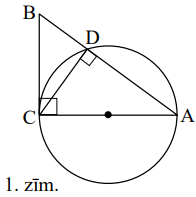

# <lo-sample/> LV.VOL.2011.9.3

Parādīt, ka no visiem trīsciparu skaitļiem, kuru pierakstā nav cipara $0$, var 
izvēlēties $81$ trīsciparu skaitli tā, lai vienlaicīgi izpildītos šādas trīs 
īpašības:

1. visos izvēlētajos skaitļos izsvītrojot pirmo ciparu, katrs divciparu 
   skaitlis, kas nesatur $0$, tiek iegūts tieši vienu reizi;

2. visos izvēlētajos skaitļos izsvītrojot otro ciparu, katrs divciparu 
   skaitlis, kas nesatur $0$, tiek iegūts tieši vienu reizi;

3. visos izvēlētajos skaitļos izsvītrojot trešo ciparu, katrs divciparu 
   skaitlis, kas nesatur $0$, tiek iegūts tieši vienu reizi.

<small>

* questionType:Prove
* domain:NT

</small>

## Atrisinājums

Meklēto $81$ skaitli varam atrast, piemēram, sekojošā veidā konstruējot $9$ 
grupas par $9$ skaitļiem katrā grupā.

| **1. grupa** | **2.grupa** | **...** | **$\boldsymbol{i}$-tā grupa** | **...** | **9.grupa** |
| :--- | :--- | :--- | :--- | :--- | :--- |
| $111$ | $212$ |  | $\overline{\mathrm{ili}}$ |  | $919$ |
| $122$ | $223$ |  | $\overline{\overline{i2(i+1)}}$, ja $i<9$, vai $\overline{i2(i+1-9)}$, ja $i \geq 9$ |  | $921$ |
| $133$ | $234$ |  | $\overline{i3(i+2)}$, ja $i<8$, vai $\overline{i3(i+2-9)}$, ja $i \geq 8$ |  | $932$ |
| $\ldots$ | $\ldots$ |  | $\ldots$ |  | $\ldots$ |
| $199$ | $291$ |  | $\overline{i9(i-1)}$, ja $i>1$, vai $199$, ja $i=1$ |  | $998$ |

Viegli pārbaudīt, ka minētie skaitļi apmierina uzdevuma nosacījumus.

# <lo-sample/> LV.VOL.2011.9.4

Doti četri atsvari, kuru masas ir savā starpā atšķirīgas. Šie atsvari visos 
iespējamos veidos tika sadalīti pāros, un katrā gadījumā uz sviras svariem tika
salīdzinātas abu pāru masas. Vai, zinot visu šo svēršanu rezultātus (nevienā 
svēršanā svaru kausi nebija līdzsvarā), iespējams noteikt:

**(A)** vienu atsvaru, kurš ir **vai nu** vissmagākais, **vai** visvieglākais;  
**(B)** **gan** vissmagāko, **gan** visvieglāko atsvaru?

(Svari nerāda masu starpību, bet ļauj tikai noteikt, uz kura kausa ir lielāks 
smagums.)

<small>

* questionType:ProveDisprove,ProveDisprove
* domain:Comb

</small>

## Atrisinājums

Četrus atsvarus $A,\ B,\ C,\ D$ pa pāriem var sadalīt trīs dažādos veidos: $AB$
un $CD,\ AC$ un $BD,\ AD$ un $BC$. Tātad pavisam tika veiktas trīs svēršanas.

Pieņemsim, ka atsvaru masas ir $x>y>z>t$. Tad divu svēršanu rezultāti vienmēr 
ir noteikti viennozīmīgi: $x+y>z+t$ un $x+z>y+t$. Trešajā svēršanā ir iespējami
abi rezultāti.

1. Ja $x+t>y+z$, tad atsvars ar masu $x$ vienmēr ir bijis uz smagākā kausa, 
   tāpēc ir vissmagākais, bet nevar noteikt visvieglāko atsvaru (visi pārēji ir
   $1$ reizi bijuši uz smagākā kausa un $2$ reizes uz vieglākā).
2. Ja $x+t<y+z$, tad atsvars ar masu $t$ vienmēr ir bijis uz vieglākā kausa, 
   tāpēc ir visvieglākais atsvars, bet nevar noteikt vissmagāko atsvaru (visi 
   pārēji ir $1$ reizi bijuši uz vieglākā kausa un $2$ reizes uz smagākā).

Tātad, saskaitot cik reizes katrs atsvars ir bijis uz vieglākā kausa un cik 
reizes - uz smagākā, var atrast vai nu vissmagāko, vai visvieglāko atsvaru - to
kurš visas trīs reizes bijis uz smagākā / vieglākā kausa. Taču abus divus 
atsvarus - gan smagāko, gan vieglāko - vienlaicīgi noteikt nevar.

# <lo-sample/> LV.VOL.2011.9.5

Trīs spēlētāji sēž pie apaļa galda un spēlē kādu spēli, kas sastāv no vairākām 
kārtām. Katrā kārtā viens no spēlētājiem uzvar un iegūst $3$ punktus, nākamais 
spēlētājs pie galda pulksteņrādītāja virzienā zaudē divus punktus, bet trešais 
zaudē vienu punktu. Pēc visu kārtu punktu saskaitīšanas izrādījās, ka vienam no
spēlētājiem summā ir $0$ punktu. Vai var būt, ka kādam no pārējiem spēlētājiem 
summā ir **(A)** $48$, **(B)** $49$ punkti?

<small>

* questionType:ProveDisprove,ProveDisprove
* domain:Comb

</small>

## Atrisinājums

Pieņemsim, ka spēlētāji ap galdu pulksteņrādītāja virzienā sēž secībā 
$A$, $B$, $C$. Saskaitīsim cik kārtās katrs spēlētājs ir ieguvis $3$ punktus. 
Spēlētājam $A$ šo kārtu skaitu apzīmēsim ar $a$, spēlētājam $B$ - ar $b$, 
spēlētājam $C$ - ar $c$. Tad kopējais spēlētāja $A$ kopsummā iegūto punktu 
skaits ir $3a-2c-b$, spēlētāja $B$ punktu skaits ir $3b-2a-c$, bet spēlētāja 
$C$ punktu skaits ir $3c-2b-a$. Pieņemsim, ka spēlēs beigās spēlētājs $A$ 
kopsummā ieguva $0$ punktus (citos gadījumos spriedumi līdzīgi). Tātad 
$3a-2c-b=0$ jeb $b=3a-2c$. Tad spēlētāja $B$ iegūtu punktu kopsumma ir 
$3(3a-2c)-2a-c=7(a-c)$, bet spēlētāja $C$ iegūto punktu kopsumma ir $7(c-a)$. 
Tātad pārējo spēlētāju iegūto punktu kopsumma dalās ar $7$, tāpēc nevienam 
spēlētājam nevar būt $48$ punkti. Spēlētāja $B$ punktu summa var būt $49$, ja, 
piemēram, $A$ ir uzvarējis $7$ kārtās, $B$ ir uzvarējis $21$ kārtā, bet $C$ nav
uzvarējis nevienā kārtā.

# <lo-sample/> LV.VOL.2011.10.1

Atrisināt vienādojumu

$$|||x-2011|-2011|-2011|=|||x-1201|-1201|-1201|$$

<small>

* questionType:FindAll
* domain:Alg

</small>

## Atrisinājums

Aplūkosim funkcijas $f(x)=||x-a|-a|-a|$, kur $a$ - reāls, pozitīvs skaitlis, 
grafiku (skat. 2.zīm.).

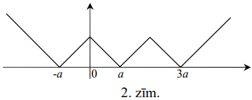

Viegli ievērot, ka, lai atrisinātu doto vienādojumu, nepieciešams atrast divu 
šādu funkciju (pie $a=2011$ un $a=1201$) grafiku krustpunktus (skat. 3.zīm.).

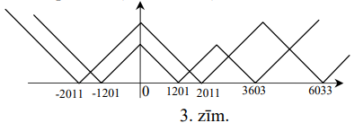

Šiem grafikiem ir četri krustpunkti, kas arī dotā vienādojuma atrisinājumi:

$$\begin{aligned}
& x_{1}=\frac{-2011+(-1201)}{2}=-1606, x_{2}=\frac{1201+2011}{2}=1606, \\
& x_{3}=\frac{2011+3603}{2}=2807, x_{4}=\frac{3603+6033}{2}=4818 .
\end{aligned}$$

# <lo-sample/> LV.VOL.2011.10.2

Trijstūra $ABC$ ($AB>BC$) bisektrise $BD$ krusto tam apvilkto riņķa līniju 
$\omega$ punktā $M$. Uz malas $AB$ izvēlēts punkts $N$ tā, ka $CN \perp BM$. 
$MN$ un $CN$ vēlreiz krusto $\omega$ attiecīgi punktos $K$ un $O$. Pierādīt, 
ka $AO=OK$.

<small>

* questionType:Prove
* domain:Geom

</small>

## Atrisinājums

Trijstūrī $NBC$ taisne $BX$ ir gan bisektrise, gan augstums (skat. 4.zīm.). 
Tāpēc $NB=BC$ un $NX=XC$.

Trijstūrī $NMC$ taisne $MX$ ir gan mediāna, gan augstums. Tāpēc $NM=MC$.

$\Delta NBC \sim \Delta NOA$, tāpēc $OA=ON; \Delta NMC \sim \Delta NOK$, tādēl 
$OK=ON$.

$AO=OK=ON$, k.b.j.

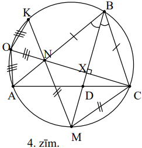

# <lo-sample/> LV.VOL.2011.10.3

Vai tabulā ar izmēriem $6 \times 6$ rūtiņas var aizkrāsot **(A)** sešas, 
**(B)** septiņas rūtiņas tā, lai no tabulas nevarētu izgriezt ne taisnstūri 
$1 \times 5$ rūtiņas (tas var būt novietots gan horizontāli, gan vertikāli), ne
figūru , kurā neviena rūtiņa nav aizkrāsota? (Griezuma
līnijām jāiet pa rūtiņu malām.)

<small>

* questionType:ProveDisprove
* domain:Geom

</small>

## Atrisinājums

**(A)** Atbilde: nevar.

Katrā rindā un katrā kolonnā jābūt vismaz vienai aizkrāsotai rūtiņai (ja tādas 
rindas vai kolonnas nebūtu, tad no tās varētu izgriezt figūru $1 \times 5$ 
rūtiņas). Tā kā ir tieši sešas aizkrāsotas rūtiņas, tad katrā rindā un katrā 
kolonnā ir tieši viena aizkrāsota rūtiņa. Aplūkosim to kolonnu, kurā aizkrāsotā
rūtiņa atrodas pirmajā rindā. Šajā kolonnā vienīgā aizkrāsotā rūtiņa atrodas 
pirmajā rindā, līdz ar to $2.-6.$ rindas rūtiņas veido neaizkrāsotu rūtiņu 
taisnstūri ar izmēru $1 \times 5$ rūtiņas.

**(B)** Atbilde: var, skat., piem., 5.zīm.

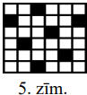 

# <lo-sample/> LV.VOL.2011.10.4

Dots polinoms $f(x)$ ar veseliem koeficientiem. Vai iespējams, ka 
$f(2011)=100$, bet $f(11)=1000$?

<small>

* questionType:ProveDisprove
* domain:NT
* topic:PolynomialDifferenceDivisibility
* topic:AdvancedIdentities
* concepts:integer-polynomial

</small>

## Atrisinājums

Ja $f(x)=a_{n}x^{n}+\ldots+a_{1}x+a_{0}$ ir polinoms, tad 
$f(x)-f(y)=a_{n}\left(x^{n}-y^{n}\right)+\ldots+a(x-y) \vdots(x-y)$. Tā kā 
$f(2011)-f(11)=-900$ nedalās ar $2011-11=2000$, polinoms nevar pieņemt šādas 
vērtības.

# <lo-sample/> LV.VOL.2011.10.5

Kādam mazākajam $n$ ir spēkā apgalvojums: jebkuriem $n$ plaknē novietotiem 
punktiem (nekādi trīs no tiem nav uz vienas taisnes), var atrast divus 
platleņķa trijstūrus ar virsotnēm šajos punktos tā, lai šo trijstūru virsotnes 
nesakrīt.

<small>

* questionType:FindOptimal
* domain:Geom

</small>

## Atrisinājums

Tā kā vajag izveidot divus trijstūrus bez kopīgām virsotnēm, tad būs vajadzīgi 
vismaz seši punkti. 6.zīm. parādīts piemērs ar $6$ punktiem, no kuriem nevar 
izveidot divus platleņķa trijstūrus bez kopīgām virsotnēm. Punkts $O$ ir riņķa 
līnijas centrs un punkti $A,\ B,\ C,\ D,\ E$ atrodas uz riņķa līnijas, pie tam 
$\sphericalangle AOE$ ir šaurs. Tā kā ir tikai seši punkti un jāizveido divi 
trijstūri, tad katram punktam jābūt kāda trijstūra virsotnei. Bet jebkurš no 
trijstūriem, kura viena virsotne ir $O$, ir šaurleņķu. Tātad $n \geq 7$.

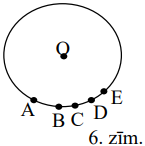

Pierādīsim, ka ar septiņiem punktiem vienmēr pietiek.

**Lemma 1.** *Ja izliekts četrstūris nav taisnstūris, tad kādas trīs no tā 
virsotnēm veido platleņķa trijstūri.*

$\underline{Pierādījums.}$ Izliekta četrstūra iekšējo leņķu summa ir 
$360^{\circ}$, tātad, ja ne visi tā leņķi ir $90^{\circ}$, tad kāds no leņķiem 
būs lielāks par $90^{\circ}$ - šī virsotne un divas tās blakus virsotnes veido 
platleņķa trijstūri.

**Lemma 2.** *Ja dots trijstūris* $ABC$ *un punkts* $D$ *tā iekšpusē, tad 
vismaz divi no trijstūriem* $ABD,\ BCD,\ CAD$ *ir platleņķa.*

$\underline{Pierādījums.}$ Aplūkosim leņķus $ADB,\ BDC,\ CDA$ (skat. 7.zīm.). 
Šo leņķu summa ir $360^{\circ}$ un katrs no tiem ir mazāks nekā $180^{\circ}$, 
tātad vismaz divi no šiem leņķiem ir lielāki par $90^{\circ}$.

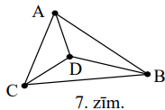

Apskatīsim divus gadījumus, kā dotie $7$ punkti var būt izvietoti.

1) Tie veido izliektu septiņstūri, skat. 8.zīm.

Izliekta septiņstūra iekšējie leņķi ir mazāki par $180^{\circ}$ un to summa ir 
$180^{\circ} \cdot(7-2)$. Pieņemsim, ka šauro vai taisno leņķu skaits ir vismaz
$4$, tad šo četru leņķu summa nepārsniedz $360^{\circ}$ un pārējo trīs leņķu 
summa ir mazāka par $3 \cdot 180^{\circ}$, tātad visu septiņu leņķu summa ir 
mazāka par $5 \cdot 180^{\circ}$ - pretruna. Tātad šauro vai taisno iekšējo 
leņķu skaits nav lielāks par $3$.

Aplūkosim virsotņu pārus 
$(A,\ D),\ (D,\ G),\ (G,\ C),\ (C,\ F),\ (F,\ B),\ (B,\ E),\ (E,\ A)$. Tā kā no
leņķiem ar virsotnēm punktos $A,\ B,\ C,\ D,\ E,\ F,\ G$ ne vairāk kā trīs 
leņķi nav plati un katrs no leņķiem pāros parādās tieši divas reizes, tad kādā 
no pāriem būs divi plati leņķi. Šie divi punkti kopā ar blakus virsotnēm veido 
divus platleņķa trijstūrus bez kopīgiem punktiem.

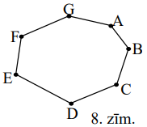

2) Dotie septiņi punkti neveido izliektu septiņstūri.

Tātad varam izvēlēties četrus punktus un apzīmēt tos tā, ka $A,\ B,\ C$ veido 
trijstūri un $D$ atrodas tā iekšpusē; pārējos punktus apzīmēsim ar $E,\ F,\ G$.
No Lemmas $2$ seko, ka vismaz divi no trijstūriem $ABD,\ BCD,\ CAD$ ir 
platleņķa; varam pieņemt, ka tie ir $\triangle ABD$ un $\triangle BCD$. Ja 
punkti $E,\ F,\ G,\ C$ neveido taisnstūri, tad no tiem var izveidot platleņķa 
trijstūri (saskaņā ar Lemmām $1$ un $2$), un $A,\ B,\ D$ veido otru platleņķa 
trijstūri. Ja $E,\ F,\ G,\ C$ veido taisnstūri, tad $E,\ F,\ G,\ A$ neveido 
taisnstūri (citādi $A$ un $C$ atrastos vienā punktā), un no tiem var izveidot 
platleņķa trijstūri, otru platleņķa trijstūri veido punkti $B,\ C,\ D$.

# <lo-sample/> LV.VOL.2011.11.1

Dots, ka $a^{2}+b^{2}+c^{2}=1$ un $m^{2}+n^{2}+p^{2}=1$. Pierādīt, ka 
$-1 \leq am+bn+cp \leq 1$. $(a, b, c, m, n, p$ - reāli skaitļi).

<small>

* questionType:Prove
* domain:Alg

</small>

## Atrisinājums

Apskatīsim vektorus ar koordinātēm $(a; b; c)$ un $(m; n; p)$. Tad no dotajām 
sakarībām seko, ka šo vektoru garums ir $1$. Savukārt izteiksme $am+bn+cp$ 
izsaka šo vektoru skalāro reizinājumu. Tā kā 
$\vec{x} \cdot \vec{y}=|\vec{x}| \cdot|\vec{y}| \cdot \cos \left(\hat{x}^{n}, \vec{y}\right)$
un $-1 \leq \cos (\vec{x}, \vec{y}) \leq 1$, tad 
$-1 \leq \vec{x} \cdot \vec{y}=am+bn+cp \leq 1$, k.b.j.

# <lo-sample/> LV.VOL.2011.11.2

Trapeces $ABCD$ sānu malas $AD$ garums ir vienāds ar pamatu $AB$ un $CD$ garumu
summu. Pierādīt, ka leņķu $BAD$ un $ADC$ bisektrises krustojas sānu malas $BC$ 
viduspunktā.

<small>

* questionType:Prove
* domain:Geom

</small>

## Atrisinājums

Uz malas $AD$ var atrast tādu iekšēju punktu $E$, ka $AE=AB$ un $ED=CD$ (skat. 
9.zīm.).

$\sphericalangle BEC=180^{\circ}-\left(\frac{180^{\circ}-\sphericalangle EAB}{2}+\frac{180^{\circ}-\sphericalangle EDC}{2}\right)=\frac{\sphericalangle EAB+\sphericalangle EDC}{2}=90^{\circ}$,
tātad trijstūrim $BEC$ apvilktās riņķa līnijas centrs atrodas hipotenūzas $BC$ 
viduspunktā $F$ un $EF=BF=CF$. Aplūkosim trijstūrus $ABF$ un $AEF$: $AF$ kopīgā
mala, $AB=AE$ un $BF=EF$, tāpēc $\triangle ABF=\triangle AEF$ $(mmm)$, un $AF$ 
ir $\sphericalangle BAD$ bisektrise. Līdzīgi pierāda, ka $DF$ ir 
$\sphericalangle ADC$ bisektrise. Tātad $F$ ir šo bisektrišu krustpunkts, 
k.b.j.

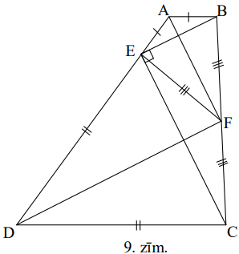

# <lo-sample/> LV.VOL.2011.11.3

Atrast visus pirmskaitļus $p$, kuriem skaitlis $p^{p^{2}-5}+2$ arī ir 
pirmskaitlis.

<small>

* questionType:FindAll
* domain:NT

</small>

## Atrisinājums

Atbilde: $p=3$.

Pārbaudām, ka $p=2$ neder, bet $p=3$ der. Ja $p>3$, šķirosim gadījumus: 1) 
$p=3k+1$ un 2) $p=3k+2$.

1) Ja $p=3k+1$, tad $p^{n}$ katram $n$ dod atlikumu $1$, dalot ar $3$, tātad 
   $p^{p^{2}-5}+2$ dalās ar $3$.
2) Ja $p>3$, tad $p$ ir nepāra skaitlis un $p^{2}-5$ ir pāra skaitlis. Tad 
   $p^{2m}=(3k+2)^{2m}=\left(9k^{2}+6k+3+1\right)^{m}=(3t+1)^{m}$ dod atlikumu 
   $1$, dalot ar $3$. Tātad arī šajā gadījumā $p^{p^{2}-5}+2$ dalās ar $3$.

Tā kā $p^{p^{2}-5}+2>3$ un dalās ar $3$, tas nav pirmskaitlis.

# <lo-sample/> LV.VOL.2011.11.4

Aplī izvietoti $2011$ punkti, no kuriem $707$ nokrāsoti sarkanā, bet pārējie - 
zaļā krāsā. Tika izvēlēts viens punkts un, sākot no tā, pulksteņa rādītāja 
virzienā veikts pilns aplis, uz katra loka starp diviem blakus punktiem 
uzrakstot pa naturālam skaitlim pēc šāda likuma:

- ja pēc zaļa punkta seko sarkans punkts, tad uz loka uzrakstīja $1$,
- ja pēc zaļa seko zaļš, tad uzrakstīja $2$,
- ja pēc sarkana - sarkans, tad uzrakstīja $3$,
- ja pēc sarkana - zaļš, tad uzrakstīja $4$.

Kāda ir visu uzrakstīto skaitļu summa?

<small>

* questionType:FindAll
* domain:Comb

</small>

## Atrisinājums

Katru punktu nosacīti sadalīsim divās daļās: tajā, kas atrodas loka sākumā un 
tajā, kas atrodas loka beigās. Pieņemsim, ka uz katra loka uzrakstītais 
skaitlis ir tā sākuma un beigu puspunktu summa. Ar $z_{s}$ apzīmēsim zaļā 
sākuma puspunkta vērtību, ar $z_{b}$ - zaļā beigu puspunkta vērtību, ar 
$s_{s}$ - sarkanā sākuma puspunkta vērtību un ar $s_{b}$ - sarkanā beigu 
puspunkta vērtību. Iegūstam vienādojumu sistēmu:

$$\left\{\begin{array}{l}
z_{s}+s_{b}=1 \\
z_{s}+z_{b}=2 \\
s_{s}+s_{b}=3 \\
s_{s}+z_{b}=4
\end{array}\right.$$

kuras atrisinājums ir $z_{s}=0, z_{b}=2, s_{s}=2, s_{b}=1$.

Katrs punkts ir viena loka sākums un viena loka beigas, tātad meklējamajā summā
katra punkta vērtība tiek ieskaitīta tieši vienu reizi. Līdz ar to visu uz 
lokiem uzrakstīto skaitļu summa ir 
$707\left(s_{s}+s_{b}\right)+1304\left(z_{s}+z_{b}\right)=707 \cdot 3+1304 \cdot 2=4729$.

# <lo-sample/> LV.VOL.2011.11.5

Plaknē doti $n$ punkti. Zināms, ka jebkura trijstūra laukums, kura virsotnes 
atrodas šajos punktos, nepārsniedz $1~\mathrm{cm}^{2}$. Pierādīt, ka var 
uzzīmēt trijstūri ar laukumu $4~\mathrm{cm}^{2}$ tā, ka visi dotie punkti 
atradīsies šī trijstūra iekšpusē vai uz tā malām.

<small>

* questionType:Prove
* domain:Geom

</small>

## Atrisinājums

No visiem trijstūriem ar virsotnēm dotajos punktos izvēlamies trijstūri $ABC$ 
ar vislielāko laukumu (vai vienu no šādiem trijstūriem. ja to ir vairāk). Caur 
katru trijstūra $ABC$ virsotni novilksim taisni, kas ir paralēla trijstūra 
pretējai malai. Šīs taisnes krustojas punktos $K,\ L,\ M$ (skat. 10.zīm.).

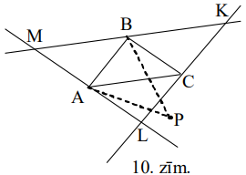

Aplūkosim taisni $KL$. Tā dala plakni divās pusplaknēs. Pierādīsim, ka visi 
dotie punkti atrodas tajā pusplaknē, kurā atrodas trijstūris $ABC$. Tiešām, ja 
kāds no dotajiem punktiem $P$ atrastos pretējā pusē, tad trijstūra $ABP$ 
laukums būtu lielāks par trijstūra $ABC$ laukumu (šiem trijstūriem ir vienādi 
pamati, bet trijstūra $ABP$ augstums ir lielāks par trijstūra $ABC$ augstumu). 
Līdzīgi, aplūkojot taisnes $ML$ un $MK$, mēs secinām, ka visi dotie punkti 
pieder trijstūrim $MKL$. Tā kā $S_{MKL}=4 \cdot S_{ABC} \leq 4~\mathrm{cm}^{2}$,
tad prasītais apgalvojums pierādīts.

# <lo-sample/> LV.VOL.2011.12.1

Kurš no skaitļiem $\sqrt[3]{9}+\sqrt[3]{4}-2$ un 
$\sqrt[3]{6}+\sqrt[3]{12}-2 \sqrt[3]{2}$ ir lielāks?

<small>

* questionType:ProveDisprove
* domain:Alg

</small>

## Atrisinājums

Atverot iekavas un savelkot līdzīgos locekļus nevienādībā

$$(\sqrt[3]{3}-\sqrt[3]{2})^{2}+(\sqrt[3]{4}-\sqrt[3]{2})^{2}+(\sqrt[3]{3}-\sqrt[3]{4})^{2}>0$$

iegūstam 
$2 \sqrt[3]{9}+2 \sqrt[3]{4}+4 \sqrt[3]{2}-2 \sqrt[3]{6}-2 \sqrt[3]{12}-4>0$,

no kurienes savukārt seko 
$\sqrt[3]{9}+\sqrt[3]{4}-2>\sqrt[3]{6}+\sqrt[3]{12}-2 \sqrt[3]{2}$.

# <lo-sample/> LV.VOL.2011.12.2

Trijstūrī $ABC$ nogriežņi $AM$ un $CN$ ir mediānas, kuru viduspunkti ir 
attiecīgi $P$ un $Q$. $AC$ krusto taisnes $BP$ un $BQ$ attiecīgi punktos $X$ un
$Y$. Pierādīt, ka $AX=XY=YC$

<small>

* questionType:Prove
* domain:Geom

</small>

## Atrisinājums

$\triangle APX=\triangle MPR$, jo $AX \parallel RM$ un $AP=PM$ (skat. 11.zīm.).
Tādēļ $AX=RM$. Savukārt $RM$ ir $\triangle XBC$ viduslīnija, tāpēc $XC=2RM$.

Iegūstam, ka $2AX=XC$ jeb $2AX=XY+YC\ (1)$.

Līdzīgi iegūstam, ka $2YC=AX+XY\ (2)$.

No $(1)$ atņemot $(2)$, iegūstam $AX=YC$. Ievietojot to $(1)$, iegūstam 
$2AX=XY+AX$ jeb $AX=XY$, tātad $AX=XY=YC$, k.b.j.

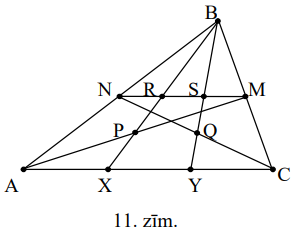

# <lo-sample/> LV.VOL.2011.12.3

Pierādīt, ka neeksistē tādi naturāli skaitļi $n$ un $m$, kuriem ir patiesa 
vienādība $(2n)^{2n}-1=m^{3}$.

<small>

* questionType:Prove
* domain:NT

</small>

## Atrisinājums

Pieņemsim pretējo, ka tādi skaitļi $m$ un $n$ eksistē. 
$m^{3}=(2n)^{2n}-1=\left((2n)^{n}-1\right)\left((2n)^{n}+1\right)$. Tā kā 
$(2n)^{n}-1$ un $(2n)^{n}+1$ ir savstarpēji pirmskaitļi, tad

$$(2n)^{n}-1=a^{3},\ (2n)^{n}+1=b^{3}.$$

Iegūstam pretrunu: $2=b^{3}-a^{3}=(b-a)\left(b^{2}+ab+a^{2}\right)$, jo 
$b^{2}+ab+a^{2}>2$.

# <lo-sample/> LV.VOL.2011.12.4

Atrast visas stingri augošas funkcijas $g(x)$, kas definētas reāliem skaitļiem,
pieņem reālas vērtības un kas visiem reāliem skaitļiem $x$ apmierina vienādību 
$g(g(x))+g(x)=2x$

<small>

* questionType:FindAll
* domain:Alg

</small>

## Atrisinājums

Pieņemsim, ka kādam $x \quad g(x)>x$. Tad $g(g(x))>g(x)$, jo funkcija ir 
stingri augoša un $g(g(x))+g(x)>x+x=2x$ - pretruna.

Gadījumā, ja $g(x)<x$, tad $g(g(x))<g(x)$, jo funkcija augoša, un 
$g(g(x))+g(x)<x+x=2x$ - pretruna.

Atliek vienīgi gadījums, kad $g(x)=x$. Pārbaude liecina, ka šis atrisinājums 
der.

# <lo-sample/> LV.VOL.2011.12.5

Virkni $V$, kas sastāv no cipariem $0,\ 1,\ 2,\ \ldots,\ 9$ sauc par 
*universālu*, ja jebkuru virkni, kurā katrs cipars sastopams tieši vienu reizi, 
var iegūt no $V$, izsvītrojot tajā dažus ciparus. Pierādīt, ka *universāla* 
virkne satur vismaz $55$ ciparus.

<small>

* questionType:Prove
* domain:NT

</small>

## Atrisinājums

Ar indukciju pierādīsim vispārīgāku apgalvojumu.

*Virkni, kas sastāv no cipariem* $c_{1}, c_{2}, \ldots, c_{k}$ *sauc par 
universālu, ja no tās, izsvītrojot dažus ciparus, var iegūt jebkuru virkni, 
kurā katrs no cipariem* $c_{1}, c_{2}, \ldots, c_{k}$ *ir tieši vienu reizi. 
Tad universālas virknes garums nevar būt mazāks par* $\frac{k(k+1)}{2}$.

$\underline{Indukcijas bāze.}$ Ja $k=1$, tad $\frac{k(k+1)}{2}=1$ un netukšā 
virknē ir vismaz $1$ simbols.

Tagad pieņemsim, ka apgalvojums ir pierādīts $k$ cipariem un pierādīsim to 
$k+1$ ciparam. Pieņemsim, ka ir *universāla* virkne garumā $S$. Pēc Dirihlē 
principa vismaz viens no cipariem $c$ nav starp pirmajiem $k$ *universālās* 
virknes cipariem. Izsvītrosim visus ciparus $c$ un visus ciparus, kas ir pirms 
pirmā cipara $c$. Atlikušās virknes garums būs ne vairāk kā $S-k-1$, jo tika 
izsvītrots vismaz viens $c$ un vismaz $k$ cipari pirms pirmā $c$.

Atlikusī virkne ir *universāla*, jo, ja virkni $ca_{1}a_{2} \ldots a_{k}$ 
varēja iegūt no sākotnējās virknes, tad šīs virknes daļa 
$a_{1}a_{2} \ldots a_{k}$ atradās pēc pirmā $c$, un tāpēc neviens no tās 
cipariem netika izsvītrots. Tāpēc pēc induktīvā pieņēmuma 
$S-k-1 \geq \frac{k(k+1)}{2} \Rightarrow S \geq \frac{k(k+1)}{2}+(k+1)=\frac{(k+1)(k+2)}{2}$.

