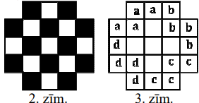
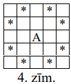

# <lo-sample/> LV.VOL.2012.9.1

**(A)** Vai piecu pēc kārtas ņemtu naturālu skaitļu reizinājums var būt 
skaitlis $20112012$?

**(B)** Vai četru pēc kārtas ņemtu naturālu skaitļu reizinājums var būt 
skaitlis $20112012$?

<small>

* questionType:
* domain:

</small>

## Atrisinājums

**(A)** No pieciem pēc kārtas ņemtiem naturāliem skaitļiem viens dalās ar $5$. 
Tātad arī to reizinājums dalās ar $5$, bet $20112012$ ar $5$ nedalās.

**(B)** No četriem pēc kārtas ņemtiem naturāliem skaitļiem ir divi pāra 
skaitļi, no kuriem viens dalās ar $4$. Tātad to reizinājums dalās ar $8$, bet 
$20112012$ ar $8$ nedalās.

# <lo-sample/> LV.VOL.2012.9.2

Pierādīt, ka nav iespējams izveidot trijstūri, kura augstumu garumi ir 
$4~\mathrm{cm},\ 7~\mathrm{cm}$ un $10~\mathrm{cm}$.

<small>

* questionType:
* domain:

</small>

## Atrisinājums

Pieņemsim, ka šādu trijstūri iespējams izveidot. Pieņemsim, ka šī trijstūra 
laukums ir $S$, tad tā malu garumi ir $\frac{2S}{4}, \frac{2S}{7}$ un 
$\frac{2S}{10}$. Divu īsāko malu garumu summai jābūt lielākai par trešās malas 
garumu. Bet 
$\frac{2S}{7}+\frac{2S}{10}=\frac{17}{70} 2S=\frac{34}{140} 2S<\frac{35}{140} 2S=\frac{2S}{4}$ - 
pretruna. Tātad šādu trijstūri izveidot nav iespējams.

# <lo-sample/> LV.VOL.2012.9.3

Kvadrātvienādojuma $x^{2}+p_{1}x+q_{1}=0$ saknes ir $a$ un $b$, 
kvadrātvienādojuma $x^{2}+p_{2}x+q_{2}=0$ saknes ir $b$ un $c$, bet 
kvadrātvienādojuma $x^{2}+p_{3}x+q_{3}=0$ saknes ir $a$ un $c$. Zināms, ka 
$q_{1} \leq q_{2} \leq q_{3} \leq 0$. Kādas ir iespējamās $q_{2}$ vērtības?

<small>

* questionType:
* domain:

</small>

## Atrisinājums

**Atbilde:** $q_{2}=0$. 

Pēc Vjeta teorēmas $q_{1}=ab,\ q_{2}=bc,\ q_{3}=ac$. Tātad 
$ab \leq bc \leq ac \leq 0$. Ja neviens no skaitļiem $a,\ b$, $c$ nav nulle, 
tad divi no tiem ir vai nu abi pozitīvi, vai abi negatīvi, tāpēc to reizinājums
ir lielāks nekā nulle. Tātad vismaz viens no skaitļiem $a,\ b,\ c$ ir $0$. Tad 
$q_{3}=ac=0$, tātad $a$ vai $c$ ir $0$. Ja $c=0$, tad $q_{2}=bc=0$. Ja 
$a=0,\ c \neq 0$, tad $q_{1}=ab=0$ un no nevienādības $0 \leq q_{2} \leq 0$ 
seko, ka $q_{2}=0$.

# <lo-sample/> LV.VOL.2012.9.4

Trijstūra $ABC$ iekšpusē izvēlēts punkts $E$ tā, ka 
$AB^{2}-BE^{2}+EC^{2}=AC^{2}$. Pierādīt, ka $AE \perp BC$!

<small>

* questionType:
* domain:

</small>

## Atrisinājums

Atradīsim $AE$ un $BC$ krustpunktu $D$ un pieņemsim, ka 
$\sphericalangle ADB=\alpha \leq 90^{\circ}$.

Novilksim perpendikulus $BF$ un $CG$ pret $AD$ (skat. 1.zīm.).

Pielietojot Pitagora teorēmu taisnleņķa trijstūros $ABF,\ BEF,\ ACG$ un $ECG$, 
iegūstam:

$$\begin{align*}
& AB^{2}-BE^{2}=\left(AF^{2}+BF^{2}\right)-\left(BF^{2}+EF^{2}\right)=AF^{2}-EF^{2}= \\
& =(AF-EF)(AF+EF)=AE(AF+EF) \\
& AC^{2}-EC^{2}=\left(AG^{2}+CG^{2}\right)-\left(EG^{2}+CG^{2}\right)=AG^{2}-EG^{2}= \\
& =(AG-EG)(AG+EG)=AE(AG+EG)
\end{align*}$$

Pēc dotā $AB^{2}-BE^{2}=AC^{2}-EC^{2}$ jeb $AF+EF=AG+EG$. Pieskaitot abām pusēm
$AE$, iegūstam $AE+AF+EF=AE+AG+EG$ jeb $2AF=2AG$. Tātad punkti $F$ un $G$ 
sakrīt ar $AD \perp BC$.

# <lo-sample/> LV.VOL.2012.9.5

Kādu lielāko skaitu 1.zīm. attēloto figūru var izgriezt no 2.zīm. attēlotās 
figūras? Griezuma līnijām jāiet pa rūtiņu malām.

<small>

* questionType:
* domain:

</small>

## Atrisinājums

Izkrāsosim doto figūru šaha galdiņa veidā, skat. 2.zīm.

Katra izgriežamā figūriņa aizņem tieši divas baltas un divas melnas rūtiņas. Tā
kā ir deviņas baltas rūtiņas, tad var izgriezt ne vairāk kā četras figūriņas. 
To, ka četras figūriņas var izgriezt, skat., piem., 3.zīm. (vienas figūrinas 
rūtiņas apzīmētas ar vienādiem burtiem).

# <lo-sample/> LV.VOL.2012.10.1

Kādām $a$ vērtībām vienādojumu sistēmai

$$\left\{\begin{array}{l}
x+y=2 \\
x^{2}+y^{2}=a \\
x^{3}+y^{3}=a+2
\end{array}\right.$$

ir atrisinājums reālos skaitļos?

<small>

* questionType:
* domain:

</small>

## Atrisinājums

**Atbilde:** $a=3$.

Kāpinot pirmo vienādojumu kvadrātā un atņemot otro, iegūst $2xy=4-a$ jeb 
$xy=2-\frac{a}{2}$. Tad 
$x^{3}+y^{3}=(x+y)\left(x^{2}-xy+x^{2}\right)=2\left(a-2+\frac{a}{2}\right)=3a-4=a+2$
jeb $a=3$.

Ievietojot dotajā sistēmā $a=3$, un atrisinot to, iegūstam atrisinājumus 
$x=1 \pm \sqrt{\frac{1}{2}}, y=1 \mp \sqrt{\frac{1}{2}}$.

# <lo-sample/> LV.VOL.2012.10.2

2. Trijstūra $ABC$ katra mala sadalīta septiņās vienādās daļās (skat. 3.zīm.). 
Pierādīt, ka $S_{A_{1}B_{1}C_{1}}+S_{A_{2}B_{2}C_{2}}>S_{ABC}$.

<small>

* questionType:
* domain:

</small>

## Atrisinājums

Aprēķināsim $S_{A_{1}B_{1}C_{1}}$ (skat. 4.zīm.).

$S_{A_{1}B_{1}C_{1}}=S_{ABC}-S_{A_{1}B_{1}C}-S_{AB_{1}C_{1}}-S_{A_{1}BC_{1}} \cdot \Delta A_{1}B_{1}C$
augstums pret malu $A_{1}C$ ir $\frac{1}{7} \frac{1}{7}$ no $\triangle ABC$ 
augstuma pret malu $BC$. $A_{1}C=\frac{6}{7} BC$. Tātad 
$S_{A_{1}B_{1}C}=\frac{6}{49} S_{ABC}$. Līdzīgi arī 
$S_{AB_{1}C_{1}}=S_{A_{1}BC_{1}}=\frac{6}{49} S_{ABC}$. Tātad 
$S_{A_{1}B_{1}C_{1}}=\frac{31}{49} S_{ABC}$.

Līdzīgi var aprēķināt 
$S_{A_{2}B_{2}C_{2}}=S_{ABC}-S_{A_{2}B_{2}C}-S_{AB_{2}C_{2}}-S_{A_{2}BC_{2}}$.
$\Delta A_{2}B_{2}C$ augstums pret malu $A_{2}C$ ir $\frac{2}{7}$ no 
$\triangle ABC$ augstuma pret malu $BC$. $A_{2}C=\frac{5}{7} BC$. Tātad 
$S_{A_{2}B_{2}C}=\frac{10}{49} S_{ABC}$. Līdzīgi, arī 
$S_{AB_{2}C_{2}}=S_{A_{2}BC_{2}}=\frac{10}{49} S_{ABC}$. Tātad 
$S_{A_{2}B_{2}C_{2}}=\frac{19}{49} S_{ABC}$ un 
$S_{A_{1}B_{1}C_{1}}+S_{A_{2}B_{2}C_{2}}=\frac{50}{49} S_{ABC}>S_{ABC}$.

# <lo-sample/> LV.VOL.2012.10.3

Naturāla skaitļa $N$ decimālajā pierakstā izmantots tikai cipars $6$. Pierādīt,
ka skaitļa $N^{2}$ decimālajā pierakstā nav cipara $0$.

<small>

* questionType:
* domain:

</small>

## Atrisinājums

Ja $N=\underbrace{666 \ldots}_{n "6"}$, tad

$N^{2}=\underbrace{66 \ldots 6}_{n "6"} \cdot \underbrace{66 \ldots 6}_{n "6"}=6 \cdot 6 \cdot \underbrace{11 \ldots 1}_{n "1"} \cdot \underbrace{11 \ldots 1}_{n "1"}=4 \cdot 9 \cdot \underbrace{11 \ldots 1}_{n "1"} \cdot \underbrace{11 \ldots 1}_{n "1"}=\underbrace{44 \ldots}_{n "4"} \cdot \underbrace{99 \ldots 9}_{n "9"}=$

$=\underbrace{44 \ldots 4}_{n "4"} \cdot(\underbrace{100 \ldots 0}_{n "0"}-1)=\underbrace{44 \ldots}_{n "4"} \underbrace{00 \ldots 0}_{n "0"}-\underbrace{44 \ldots 4}_{n "4"}=\underbrace{44 \ldots}_{n-1 "4"} 43 \underbrace{55 \ldots .56}_{n-1 "5"}.$

# <lo-sample/> LV.VOL.2012.10.4

Trijās no piecstūra virsotnēm atrodas kauliņi $A,\ B,\ C$. Atļauts pārbīdīt 
kauliņu pa piecstūra diagonāli uz citu virsotni, ja tā ir brīva. Vai, atkārtoti
pārbīdot šos kauliņus, var panākt, lai kauliņš $A$ atrastos savā vietā, bet 
kauliņi $B$ un $C$ būtu samainīušies vietām?

<small>

* questionType:
* domain:

</small>

## Atrisinājums

Aplūkosim piecstūri $A_{1}A_{2}A_{3}A_{4}A_{5}$. Ievērosim, ka kauliņi var tikt
pārvietoti tikai pa ciklu $A_{1}A_{3}A_{5}A_{2}A_{4}A_{1}$, nemainot secību. 
Tātad kauliņi $B$ un $C$ nevar samainīties vietām.

# <lo-sample/> LV.VOL.2012.10.5

Divi spēlētāji uz $N \times N$ rūtiņas liela laukuma spēlē sekojošu spēli. 
Spēlētāji gājienus izdara pēc kārtas, katrā gājienā novietojot šaha zirdziņu uz
pagaidām neapdraudēta lauciņa (visu zirdziņu krāsa ir vienāda). Spēlētājs, kurš
nevar izdarīt kārtējo gājienu, zaudē. Kurš no spēlētājiem, pareizi spēlējot, 
uzvar, ja **(A)** $N=12$, **(B)** $N=21$?

(Ja šaha zirdziņš atrodas rūtiņā $A$, tad tas apdraud visas ar $\ast$ apzīmētās
rūtiņas, skat. 4.zīm.)

<small>

* questionType:
* domain:

</small>

## Atrisinājums

Pieņemsim, ka laukums ir izkrāsots šaha galdiņa veidā. Jebkuram šādi krāsotam 
kvadrātam piemīt centrālā simetrija. Ievērosim, ka, šaha zirdziņu novietojot uz
vienas krāsas lauciņa, tas apdraud pretējas krāsas lauciņus.

**(A)** Uzvar otrais spēlētājs. Neatkarīgi no tā, kāds ir pirmā spēlētāja 
pirmais gājiens, otrais spēlētājs var izdarīt gājienu, kas simetrisks attiecībā
pret laukuma centru - šis lauciņš ir tādā pašā krāsā, kā lauciņš, uz kura tikko
uzlikts šaha zirdziņš, tātad tikko izdarītais gājiens neapdraud šo lauciņu. 
Līdz ar to, ja pirmais spēlētājs varēs izdarīt gājienu, tad arī otrajam 
spēlētājam būs iespējams izdarīt simetrisko gājienu.

**(B)** Uzvar pirmais spēlētājs. Pirmajā gājienā zirdziņš jānovieto laukuma 
centrā, un pēc tam jāspēlē simetriski otrā spēlētāja gājieniem kā aprakstīts 
(A) punktā.

# <lo-sample/> LV.VOL.2012.11.1

Pierādīt, ka eksistē bezgalīgi daudz naturālu skaitļu $a$, kuriem skaitlis 
$n^{4}+a$ ir salikts skaitlis visiem naturāliem skaitļiem $n>1$.

<small>

* questionType:
* domain:

</small>

## Atrisinājums

Izvēlēsimies 
$a=4k^{4}$. Tad $n^{4}+4k^{4}=\left(n^{2}-2nk+2k^{2}\right)\left(n^{2}+2nk+2k^{2}\right)$
ir salikts skaitlis. Tā kā par $k$ var izvēlēties jebkuru naturālu skaitli, tad
ir bezgalīgi daudz atbilstošo $a$ vērtību.

# <lo-sample/> LV.VOL.2012.11.2

$3 \times 3$ rūtiņu tabulā katrā no rūtiņām ierakstīts pa atšķsirīgam naturālam
skaitlim. Ja rūtiņā ierakstītais skaitlis ir lielākais savā rindā, savā kolonnā
vai diagonālē, kurā ir vismaz divas rūtiņas, tad šī rūtiņa tiek iekrāsota. Cik 
rūtiņas tabulā var būt iekrāsotas?

<small>

* questionType:
* domain:

</small>

## Atrisinājums

Nezaudējot vispārīgumu, varam pieņemt, ka tabulā pa reizei ierakstīti skaitļi 
no $1$ līdz $9$.

1) Pierādīsim, ka iekrāsoto rūtiņu skaits nepārsniedz $7$. Nekad nevar būt 
   iekrāsota rūtiņa, kurā ierakstīts $1$ (jo katrā no virzieniem kādā rūtiņā 
   būs ierakstīts lielāks skaitlis). Ja nav iekrāsota rūtiņa ar $2$, tad jau 
   divas rūtiņas ir neiekrāsotas un kopējais iekrāsoto rūtiņu skaits 
   nepārsniedz $7$. Ja rūtiņa ar $2$ ir iekrāsota, tad tas iespējams tikai tad,
   ja $1$ un $2$ abi atrodas uz "īsās" diagonāles (skat. 5.zīm.).

   Aplūkosim tabulas stūra rūtiņas (skat. 6.zīm.). Rūtiņa ar mazāko no šiem 
   četriem skaitļiem nebūs iekrāsota, jo visos virzienos ir kāda rūtiņa, kurā 
   ierakstīts lielāks skaitlis. Tātad vēl vismaz viena rūtiņa ir neiekrāsota un
   kopējais iekrāsoto rūtiņu skaits nepārsniedz $7$.

2) pierādīsim, ka iekrāsotas ir vismaz $5$ rūtiņas.

   Aplūkosim četras rūtiņas, kas atrodas tabulas sānu malu vidū (skat. 7.zīm. 
   iekrāsotās rūtiņas). Tās pa pāriem veido četras īsās diagonāles. Tātad 
   vismaz divas no tām ir iekrāsotas. Aplūkosim visus trīs iespējamos 
   variantus:

      a. visas četras vidus rūtiņas ir iekrāsotas (skat. 7.zīm.). Bet tad jābūt
	     iekrāsotai vismaz vēl vienai rūtiņai uz garās diagonāles. Līdz ar to 
		 kopējais iekrāsoto rūtiņu skaits ir vismaz $5$.

      b. iekrāsotas trīs vidus rūtiņas (skat. 8.zīm.). Aplūkosim rūtiņas, kas 
	     atzīmētas ar " $x$ ". Katrām divām " $x$ " rūtiņām ir kopīgs viens 
		 rūtiņu virziens (augšējā rinda, abas garās diagonāles). Katrā no šiem 
		 virzieniem jābūt kādai iekrāsotai rūtiņai. Ar vienas rūtiņas 
		 iekrāsošanu nevar "nosegt" visus trīs virzienus uzreiz. Tātad kopējais
		 iekrāsoto rūtiņu skaits ir vismaz $3+2=5$.

      c. iekrāsotas ir divas vidus rūtiņas (skat. 9.zīm.). Tā kā tās "nosedz" 
	     visas četras īsās diagonāles, tad tām jābūt kādas rindas vai kolonnas 
		 pretējām rūtiņām. Tā kā vairāk neviena sānu malu vidus rūtiņa nav 
		 iekrāsota, tad vidējā kolonnā jābūt iekrāsotai centrālajai rūtiņai 
		 (skat. 10.zīm.). Tas nozīmē, ka vēl pa vienai iekrāsotai rūtiņai jābūt
		 tabulas augšējā un apakšējā rindā un kopējais iekrāsoto rūtiņu skaits 
		 ir vismaz $5$.

Tātad iekrāsoto rūtiņu skaits ir vismaz $5$ un ne vairāk par $7$. 11., 12. un 
13.zīm. skat. piemērus katram no gadījumiem.

# <lo-sample/> LV.VOL.2012.11.3

Taisne, kas iet caur trijstūra mediānu krustpunktu, dala trijstūri divās daļās.
Kāda ir maksimālā šo daļu laukumu attiecība?

<small>

* questionType:
* domain:

</small>

## Atrisinājums

Izvēlēsimies vienu trijstūra malu (piem., $BC$) un caur mediānu $AD,\ BE$ un 
$CF$ krustpunktu $M$ novilksim tai paralēlu taisni, kas malas $AB$ un $AC$ 
krusto attiecīgi punktos $G$ un $H$ (skat. 14.zīm.).

Trijstūra $AGH$ laukums ir $\frac{4}{9}$ no trijstūra $ABC$ laukuma (seko no 
Talesa teorēmas un mediānu īpašības). Tātad četrstūra $BGHC$ un trijstūra $AGH$
laukumu attiecība ir $5:4$. Pierādīsim, ka šī arī ir lielākā iespējamā 
trijstūra daļu laukumu attiecība. Aplūkosim, kas notiek, ja taisni $GH$ pagriež
ap punktu $M$, iegūstot taisni $JK$. Tad $S_{AJK}=S_{AGH}-S_{KMH}+S_{GMJ}$. 
Novelkam $HL \parallel AB(L \in JK). \sphericalangle KHL=\sphericalangle BAC$, 
tāpēc $S_{KHL}>0,\ S_{GMJ}=S_{MHL}$ pēc pazīmes ($\ell m \ell$): $GM=MH$ ($AM$ 
ir $\triangle GAH$ mediāna), $\sphericalangle GMJ=\sphericalangle LMH$ un
$\sphericalangle MGJ=\sphericalangle MHL$. Tātad, neatkarīgi no punkta $J$ 
izvēles, $S_{GMJ}>S_{MKH}$. Aplūkosim četrstūra $BJKC$ un trijstūra $AJK$ 
laukumu attiecību:

$$\frac{S_{BJKC}}{S_{AKK}}=\frac{S_{BGHC}-S_{GMJ}+S_{MKH}}{S_{AGH}+S_{GMJ}-S_{MKH}}<\frac{S_{BGHC}}{S_{AGH}}=\frac{5}{4}.$$

Brīdī, kad $J$ punkts "sasniegs" $B$ (vai $K$ "sasniegs" $C$), abu daļu laukumi
būs vienādi (mediāna dala trijstūri vienlielās daļās), t.i., šo laukumu 
attiecība būs $1$.

Analogi pierāda, ka $S_{BJM} \geq S_{EKM}$, tāpēc 
$\frac{S_{BJKC}}{S_{AJK}}=\frac{S_{BEC}+S_{BJM}-S_{EKM}}{S_{ABE}-S_{BJJ}+S_{EKM}} \geq \frac{S_{BEC}}{S_{ABE}}=1$.
Tātad $1 \leq \frac{S_{BJKC}}{S_{AJK}} \leq \frac{5}{4}$.

# <lo-sample/> LV.VOL.2012.11.4

Dota naturālu skaitļu virkne $\left\{a_{i}\right\}$, kur $a_{1}=5$ un katram 
$n>1\ a_{n}=a_{1} a_{2} \ldots a_{n-1}+4$. Pierādīt, ka visiem $n \geq 1$ ir 
spēkā sakarība $a_{n}-\sqrt{a_{n+1}}=2$.

<small>

* questionType:
* domain:

</small>

## Atrisinājums

Ievērosim, ka $a_{n}$ ir augoša skaitļu virkne un visi tās locekļi ir lielāki 
vai vienādi ar $5$.

$$\begin{gathered}
a_{n}=a_{1}a_{2} \ldots a_{n-1}+4 \\
\left(a_{n}\right)^{2}=a_{1}a_{2} \ldots a_{n-1}a_{n}+4a_{n} \\
\left(a_{n}\right)^{2}-4a_{n}+4=a_{1}a_{2} \ldots a_{n-1}a_{n}+4 \\
\left(a_{n}-2\right)^{2}=a_{n+1}
\end{gathered}$$

Tā kā $a_{n}-2>0$ visām $n$ vērtībām, varam vilkt kvadrātsakni no abām 
vienādojuma pusēm.

$a_{n}-2=\sqrt{a_{n+1}}$ jeb $a_{n}-\sqrt{a_{n+1}}=2$ visiem $n>1$.

Atliek pārbaudīt gadījumu, ka 
$n=1:a_{1}=5,\ a_{2}=5+4=9,\ a_{1}-\sqrt{a_{2}}=5-\sqrt{9}=2$. Tātad sakarība 
ir spēkā visiem $n \geq 1$.

# <lo-sample/> LV.VOL.2012.11.5

Divi zēni pēc kārtas griež apaļu kūku, katru reizi nogriežot pa vienam gabalam,
kura virspuse ir dotās kūkas virspuses sektora formā, pie tam gabala virspuses 
laukumam jābūt ne mazākam kā $\frac{1}{100}$ un ne lielākam kā $\frac{1}{2}$ no
sākotnēja kūkas virspuses laukuma (skat. 5.zīm.).

Zaudē tas spēlētājs, kurš vairs nevar nogriezt nevienu atļautā lieluma gabalu. 
Kurš no zēniem uzvarēs, pareizi spēlējot?

<small>

* questionType:
* domain:

</small>

## Atrisinājums

Otrais spēlētājs vienmēr var uzvarēt. Lai to panāktu, pēc katra pirmā spēlētāja
gājiena viņš nogriež sev sektoru, kas ir simetrisks tikko nogrieztajam pirmā 
spēlētāja sektoram attiecībā pret riņķa centru. Tādā veidā otrais spēlētājs 
vienmēr varēs veikt gājienu, jo, ja pirmais spēlētājs sev varēja nogriezt kādu 
sektoru, tad pirms viņa gājiena šis sektors vēl nebija nogriezts un attiecīgi 
tam simetriskais sektors arī nebija nogriezts (ievērojam, ka sektora laukums 
nav lielāks par $\frac{1}{2}$, tāpēc simetriski sektori nepārklājas). Atliek 
ievērot tikai to, ka spēle noteikti beigsies, jo ar katru gājienu riņķa 
pieejamais laukums samazinās vismaz par $\frac{1}{100}$ no pilnā riņķa laukuma 
vērtības.

# <lo-sample/> LV.VOL.2012.12.1

Divām naturālu skaitļu virknēm $\left\{a_{i}\right\}$ un $\left\{b_{i}\right\}$
katram $i \geq 1$ ir spēkā sakarības:

$a_{b_{i}}=b_{a_{i}}$ un $\left|a_{i}-b_{i}\right|>2012$.

Atrast vienu šādu virkņu piemēru.

<small>

* questionType:
* domain:

</small>

## Atrisinājums

Der, piemēram, virknes $a_{i}=i+2013$ un $b_{i}=i$.

$a_{b_{i}}=a_{i}=i+2013,\ b_{a_{i}}=b_{i+2013}=i+2013,\ a_{i}-b_{i}=2013>2012$.

# <lo-sample/> LV.VOL.2012.12.2

Trijstūra $ABC$ leņķa $ACB$ bisektrise un leņķa $ABC$ papildleņķa bisektrise 
krustojas punktā $D$. Pierādīt, ka trijstūrim $BCD$ apvilktās riņķa līnijas 
centrs atrodas uz trijstūrim $ABC$ apvilktās riņķa līnijas.

<small>

* questionType:
* domain:

</small>

## Atrisinājums

Apzīmēsim $\sphericalangle ACD=\sphericalangle BCD=\alpha$ un 
$\sphericalangle ABD=\sphericalangle DBX=\beta$ (skat. 15.zīm.). Tad 
$\sphericalangle ABC=180^{\circ}-2 \beta$,
$\sphericalangle BAC=180^{\circ}-\sphericalangle ABC-\sphericalangle ACB=2 \beta-2 \alpha=2(\beta-\alpha)$ un
$\sphericalangle BDC=180^{\circ}-\sphericalangle DBA-\sphericalangle ABC-\sphericalangle DCB=180^{\circ}-\beta-\left(180^{\circ}-2 \beta\right)-\alpha=\beta-\alpha$.

Aplūkosim divas riņķa līnijas, kas apvilktas attiecīgi trijstūriem $BDC$ un 
$ABC$. Abas satur hordu $BC$. Trijstūrim $BDC$ apvilktajā riņķa līnijā uz šīs
hordas balstās ievilktais leņķis $BDC$. Tātad atbilstošā centra leņķa lielumam 
jābūt divreiz lielākam par $\sphericalangle BDC$ jeb jābūt vienādam ar 
$2(\beta-\alpha)=\sphericalangle BAC$, kas sakrīt ar ap trijstūrim $ABC$ 
apvilktās riņķa līnijas ievilktā leņķa, kas balstās uz hordu $BC$, lielumu.

Tātad ap trijstūri $BDC$ apvilktās riņķa līnijas centrs atradīsies uz ap 
trijstūri $ABC$ apvilktās riņķa līnijas.

# <lo-sample/> LV.VOL.2012.12.3

Atrisināt naturālos skaitļos vienādojumu 
$n=\left[\frac{n}{2}\right]+\left[\frac{n}{3}\right]+\left[\frac{n}{4}\right]+\ldots+\left[\frac{n}{n+2012}\right]$

($[x]$ ir veselā daļa no $x$ - lielākais veselais skaitlis, kas nepārsniedz 
$x$; piem., $[3]=3,[4,6]=4,[0,2]=0$ u.tml.)

<small>

* questionType:
* domain:

</small>

## Atrisinājums

Acīmredzot vērtības $n=1$ un $n=2$ neder par vienādojuma saknēm, tāpēc apskatām
gadījumu kad $n \geq 3$. Vienādojuma labajā pusē ir $n-1$ saskaitāmie, kuri 
visi nav mazāki par $1$ ($\left[\frac{n}{n+i}\right]=0$ katram 
$i=1,2, \ldots, 2012$ ), tāpēc šajā gadījumā

$$\left[\frac{n}{2}\right]+\left[\frac{n}{3}\right]+\ldots \geq\left[\frac{n}{2}\right]+1+1+\ldots+1=\left[\frac{n}{2}\right]+n-2$$

Tāpēc $n \geq\left[\frac{n}{2}\right]+n-2$, jeb 
$2 \geq\left[\frac{n}{2}\right]$. No pēdējās nevienādības seko, ka 
$\frac{n}{2}<3$ un tāpēc $n \leq 5$. Tāpēc $3 \leq n \leq 5$. Pārbaude rāda, ka
der vērtības $n=4$ un $n=5$.

# <lo-sample/> LV.VOL.2012.12.4

Kvadrātā ar izmēriem $N \times N$ rūtiņas dažas rūtiņas ir nokrāsotas tā, ka 
katrai nokrāsotai rūtiņai tieši trīs kaimiņu rūtiņas ir nenokrāsotas, bet 
katrai nenokrāsotai rūtiņai ir tieši viena nokrāsota kaimiņu rūtiņa. Vai šāds 
krāsojums ir iespējams, ja **(A)** $N=6$, **(B)** $N=8$?

Rūtiņas sauc par kaimiņu rūtiņām, ja tām ir kopīga mala.

<small>

* questionType:
* domain:

</small>

## Atrisinājums

**(A)** nav iespējams.

Aplūkosim laukuma apakšējās malas rūtiņas (skat. 16.zīm.)

Ievērosim, ka neviena stūra rūtiņa nevar būt iekrāsota (jo katrai no tām ir 
tikai divas kaimiņu rūtiņas). Pieņemsim, ka rūtiņas $n1$ iekrāsotā kaimiņu 
rūtiņa ir $A$ (ja izvēlētos apakšējās rindas blakus rūtiņu, tad tālākie 
spriedumi būtu simetriski jāattiecina uz kreiso malu). $A$ ir tikai trīs 
kaimiņu rūtiņas - tātad tās visas ir neiekrāsotas un arī $n2$ ir neiekrāsota 
(tātad $A$ ir $n2$ iekrāsotā kaimiņu rūtiņa un $n3$ ir neiekrāsota). Vienīgā 
$n3$ kaiminu rūtiņa, kas var būt iekrāsota, ir $B$ un, tātad, neiekrāsotas ir 
arī $n4$ un $n5$. $n6$ nevar būt iekrāsota, jo tad $n5$ būtu divi iekrāsoti 
kaimiņi. $n6$ iekrāsotā kaimiņu rūtiņa var būt tikai $C$. $n7$ nevar būt 
iekrāsota, jo tai ir tikai trīs kaimiņi, no kuriem viena rūtiņa jau ir 
iekrāsota. Līdz ar to esam ieguvuši situāciju, ka apakšējā labā stūra rūtiņa 
nevar būt nedz iekrāsota (tad $n6$ būtu divi iekrāsoti kaimiņi), nedz 
neiekrāsota (jo tad tai nav iekrāsota kaimiņu rūtiņa). Tātad šāds krāsojums nav
iespējams.

**(B)** ir iespējams. Piemēram, skat., 17.zīm.

# <lo-sample/> LV.VOL.2012.12.5

Riņķa ar diametru $1$ iekšpusē uzzīmēti vairāki riņķi, kuru diametru summa ir 
lielāka nekā $8$. Pierādīt, ka var novilkt taisni, kas krusto vismaz $9$ 
uzzīmētos riņķus.

<small>

* questionType:
* domain:

</small>

## Atrisinājums

Novilksim dotajam riņķim pieskari un projecēsim uz tās uzzīmēto riņķu 
diametrus, kas paralēli novilktajai piekarei (piem., skat., 18.zīm.). Šo 
diametru projekciju garumi ir vienādi ar attiecīgo diametru garumiem. Visu 
uzzīmēto riņķu diametru projekcijas atrodas nogriežņa $AB$ iekšpusē. Tā kā 
nogriežņa $AB$ garums ir $1$, bet visu uzzīmēto riņķu diametru kopējais garums 
(un tātad arī projekciju kopējais garums) lielāks nekā $8$, tad uz nogriežņa 
$AB$ būs kāds punkts, kas pieder vairāk nekā $8$, t.i., vismaz $9$, riņķu 
diametru projekcijām (pretējā gadījumā katrs nogriežņa $AB$ punkts pieder ne 
vairāk kā $8$ diametru projekcijām, tātad to kopējais 18.zīm. garums 
nepārsniedz $8$). Caur šo punktu velkot taisni perpendikulāri $AB$, tā krustos 
vismaz deviņus uzzīmētos riņķus.

