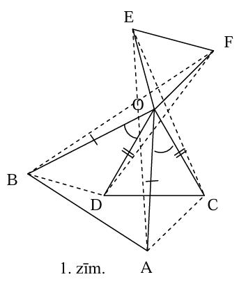
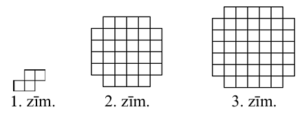
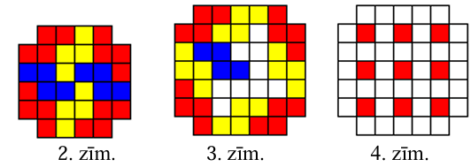
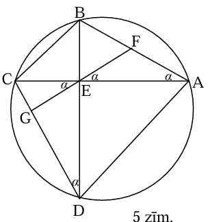
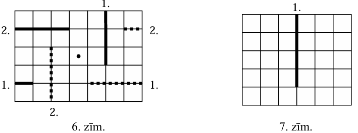
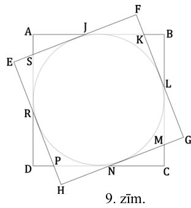
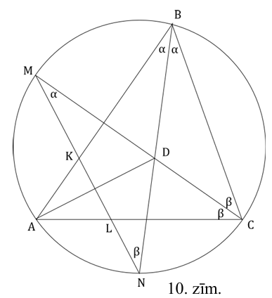

# <lo-sample/> LV.VOL.2013.9.1

Atrast tādas ciparu $a, b, c, d$ vērtības, lai izpildītos vienādība
$\overline{abcd}+\overline{abc}+\overline{ab}+a=2013$.

(Pieraksts $\overline{xyzt}$ nozīmē, ka četrciparu skaitlī ir $x$ tūkstoši,
$y$ simti, $z$ desmiti un $t$ vieni.)

<small>

* questionType:FindAll
* domain:NT

</small>

## Atrisinājums

Viegli pamanīt, ka $a=1$. Lai summas simtu cipars būtu $0$, tad $b=9$ vai $b=8$.
$b=9$ neder, jo tad summā veidotos pārnesums no desmitu pozīcijas un simtu
pozīcijā būtu cipars, kas lielāks nekā $0$. Tātad $b=8$.

$\overline{18cd}+\overline{18c}+18+1=2013$ jeb
$1800+10c+d+180+c+18+1=2013 \Rightarrow 1999+11c+d=2013$ $\Rightarrow 11c+d=14$,
tātad $c=1$ un $d=3$, jeb $\overline{abcd}=1813$.

# <lo-sample/> LV.VOL.2013.9.2

Doti trīs regulāri trijstūri $OAB, OCD$ un $OEF$ (virsotnes norādītas
pulksteņrādītāja secībā), kuru malu garumi var atšķirties. Punkti $A, C, E$
neatrodas uz vienas taisnes; punkti $B, D, F$ arī neatrodas uz vienas taisnes.
Pierādīt, ka $\triangle ACE=\triangle BDF$.

<small>

* questionType:Prove
* domain:Geom

</small>

## Atrisinājums

Ievērosim, ka
$\sphericalangle BOC=\sphericalangle BOD+60^{\circ}=60^{\circ}+\sphericalangle AOC$
(skat. 1.zīm.). Tāpēc $\sphericalangle BOD=\sphericalangle AOC$. Līdz ar to
$\triangle BOD=\triangle AOC \quad$ pēc pazīmes $m \ell m$: $BO=AO$,
$\sphericalangle BOD=\sphericalangle AOC$ un $DO=CO$. Bet tad $BD=AC$, jo
vienādos trijstūros pret vienādiem leņķiem atrodas vienādas malas. Līdzīgi
secinām, ka arī $DF=CE$ un $FB=EA$, tāpēc $\triangle ACE=\triangle BDF$ pēc
pazīmes $m m m$.

# <lo-sample/> LV.VOL.2013.9.3

Dota virkne $a_{1}, a_{2}, a_{3}, \ldots$, kur $a_{1}=a_{2}=1$ un visiem $n > 2$
izpildās

$$a_{n+1}=\left[\frac{2 a_{n}+a_{n-1}}{3}\right]+4$$

Aprēķināt $a_{2013}$.

( $[x]$ ir veselā daļa no $x$- lielākais veselais skaitlis, kas nepārsniedz $x$;
piemēram, $[3]=3,[4,6]=4,[0,2]=0$ u.tml.)

<small>

* questionType:FindExample
* domain:Alg

</small>

## Atrisinājums

Aplūkojam virknes pirmos locekļus:
$a_{1}=1$, $a_{2}=1$, $a_{3}=\left[\frac{2 \cdot 1+1}{3}\right]+4=5$,
$a_{4}=\left[\frac{2 \cdot 5+1}{3}\right]+4=7$,
$a_{5}=\left[\frac{2 \cdot 7+5}{3}\right]+4=10$,
$a_{6}=\left[\frac{2 \cdot 10+7}{3}\right]+4=13$,
$a_{7}=\left[\frac{2 \cdot 13+10}{3}\right]+4=16$.

Var ievērot, ka visiem $i \geq 4 \quad a_{i}=3i-5$. Pierādīsim to ar matemātisko
indukciju.

*Bāze.* $a_{4}=3 \cdot 4-5=7$ un $a_{5}=3 \cdot 5-5=10$.

*Induktīvais pieņēmums.* Pieņemsim, ka visiem $k < n$ ir spēkā $a_{k}=3k-5$.

*Induktīvā pāreja.* Pierādīsim, ka arī $a_{n}=3n-5$.

$a_{n}=\left[\frac{2 \cdot a_{n-1}+a_{n-2}}{3}\right]+4=\left[\frac{2 \cdot(3(n-1)-5)+3(n-2)-5}{3}\right]+4=\left[\frac{2 \cdot(3 n-8)+3 n-11}{3}\right]+4=$

$=\left[\frac{9 n-27}{3}\right]+4=3n-9+4=3n-5$

Apgalvojums pierādīts.

Tātad $a_{2013}=3 \cdot 2013-5=6034$.

# <lo-sample/> LV.VOL.2013.9.4

Divas komandas savā starpā izspēlējušas vairākas (vairāk nekā vienu) spēles.
Par zaudējumu komanda saņem $n$ punktus ($n$- naturāls skaitlis), bet par uzvaru
$n+3$ punktus. Neizšķirtu rezultātu nav. Pēc spēļu beigām izrādījās, ka vienai
komandai ir par vienu uzvaru vairāk nekā otrai. Zināms, ka viena no komandām
kopsummā ieguva $92$ punktus. Cik punktus ieguva otra komanda?

<small>

* questionType:FindAll
* domain:Comb

</small>

## Atrisinājums

Ja pieņemam, ka komanda-zaudētāja izcīnījusi $a$ uzvaras, tad komanda-uzvarētāja
izcīnījusi $a+1$ uzvaru. Kopējais punktu skaits komandai-zaudētājai ir
$a(n+3)+(a+1)n=2an+3a+n$, bet komandai-uzvarētājai $(a+1)(n+3)+an=2an+3a+n+3$.

Pierādīsim, ka komanda-uzvarētāja nevarēja izcīnīt $92$ punktus. Ja tā tomēr
būtu bijis, tad $2an+3a+n+3=92$ jeb eksistē tāds naturāls skaitlis $a$, ka
$n=\frac{89-3a}{2a+1}$ ir naturāls skaitlis. Tā kā $n \geq 1$, tad pieļaujamās
$a$ vērības ir $1 \leq a \leq 17$. Aplūkosim skaitītāja un saucēja vērtību
katrai no šīm vērtībām:

| $a$  | $89-3a$ | $2a+1$ |
| :--- | :------ | :----- |
| $1$  | $86$    | $3$    |
| $2$  | $83$    | $5$    |
| $3$  | $80$    | $7$    |
| $4$  | $77$    | $9$    |
| $5$  | $74$    | $11$   |
| $6$  | $71$    | $13$   |
| $7$  | $68$    | $15$   |
| $8$  | $65$    | $17$   |
| $9$  | $62$    | $19$   |
| $10$ | $59$    | $21$   |
| $11$ | $56$    | $23$   |
| $12$ | $53$    | $25$   |
| $13$ | $50$    | $27$   |
| $14$ | $47$    | $29$   |
| $15$ | $44$    | $31$   |
| $16$ | $41$    | $33$   |
| $17$ | $38$    | $35$   |

Kā redzams, nevienai no pieļaujamajām $a$ vērtībām daļas vērtība nav naturāls
skaitlis. Tātad komanda-uzvarētāja nevar būt ieguvusi $92$ punktus.

Pārbaudīsim, vai komanda-zaudētāja varēja iegūt $92$ punktus. Tad $2an+3a+n=92$
un $n=\frac{92-3a}{2a+1}$. Ja $a=5$, tad $n=7$, vai, ja $a=8$, tad $n=4$, tātad,
komanda-zaudētāja varēja iegūt $92$ punktus.

Tā kā komanda-uzvarētāja ieguva par $3$ punktiem vairāk nekā komandu-zaudētāja,
tad otra komanda (uzvarētāja) ieguva $95$ punktus.

# <lo-sample/> LV.VOL.2013.9.5

Kādu lielāko skaitu 1.zīm. attēloto figūru var izgriezt no rūtiņu kvadrāta
$n \times n$, kuram izṇemtas četras stūra rūtiņas: **(A)** ja $n=6$
(skat. 2.zīm.), **(B)** ja $n=7$ (skat. 3.zīm.). Griezuma līnijām jāiet pa rūtiņu
malām, 1.zīm. figūra var būt pagriezta vai apgriezta spoguļattēlā.

<small>

* questionType:FindOptimal
* domain:Geom

</small>

## Atrisinājums

**(A)** **Atbilde:** $8$ , skat., piemēram, 2.zīm.

**(B)** **Atbilde:** $9$, skat., piemēram, 3.zīm.

Pierādīsim, ka nav iespējams izvietot $10$ figūriņas. Izkrāsosim pārklājamo
figūru kā parādīts 4.zīm. Tad, lai arī kā tiktu ievietota figūriņa, tā pārklās
tieši vienu iekrāsoto rūtiņu. Tātad, ja varētu izgriezt $10$ figūriņas, tās
pārklātu $10$ iekrāsotās rūtiņas, bet ir tikai $9$- pretruna.

# <lo-sample/> LV.VOL.2013.10.1

Pierādīt, ka vienādojumam
$\frac{1}{a}+\frac{1}{b}+\frac{1}{a^{2}+b^{2}}=\frac{1}{2}$ nav atrisinājuma
naturālos skaitļos.

<small>

* questionType:Prove
* domain:NT
* topic:CountingUsingSymmetry
* topic:NumTheoryInequalityLargeIntervals

</small>

## Atrisinājums

Pārveidosim doto vienādojumu:

$$\frac{a+b}{ab}+\frac{1}{a^{2}+b^{2}}=\frac{1}{2} \Rightarrow \frac{1}{a^{2}+b^{2}}=\frac{ab-2(a+b)}{2ab} \Rightarrow\left(a^{2}+b^{2}\right)(ab-2(a+b))=2ab$$

Lai vienādojumam būtu atrisinājums naturālos skaitļos, nepieciešams, lai
$ab-2(a+b) \geq 1$. Tad $a^{2}+b^{2} \leq 2ab$ un $(a-b)^{2} \leq 0$. Tas
iespējams tikai tad, ja $a=b$. Tādā gadījumā
$\frac{2}{a}+\frac{1}{2a^{2}}=\frac{1}{2}$, tāpēc $a \geq 5$. Bet tādā gadījumā
$\frac{2}{a}+\frac{1}{2a^{2}} \leq \frac{2}{5}+\frac{1}{50}=\frac{21}{50} < \frac{1}{2}$,
tāpēc vienādojumam atrisinājuma naturālos skaitļos nav.

## Atrisinājums

Sākotnējie secinājumi par mainīgajiem

Pieņemam, ka $a \leq b$ (ja tā nav, tad $a$ un $b$ samainām vietām).

* Ja $a \geq 6$, tad $\frac{1}{a} + \frac{1}{b} + \frac{1}{a^2+b^2} < \frac{1}{2}$
* Ja $a \leq 2$, tad $\frac{1}{a} + \frac{1}{b} + \frac{1}{a^2+b^2} > \frac{1}{2}$
* Gadījums $a=3$:

    - Ja $b=6$, tad $\frac{1}{a} + \frac{1}{b} + \frac{1}{a^2+b^2} > \frac{1}{2}$
    - Pie $b=7$, tad $\frac{1}{a} + \frac{1}{b} + \frac{1}{a^2+b^2} < \frac{1}{2}$

* Gadījums $a=4$:

    - Ja $b=4$, tad $\frac{1}{a} + \frac{1}{b} + \frac{1}{a^2+b^2} > \frac{1}{2}$
    - Ja $b=5$, tad $\frac{1}{a} + \frac{1}{b} + \frac{1}{a^2+b^2} < \frac{1}{2}$

Citas $b$ vērtības var neaplūkot, jo dotajam $a$ ($a=3$ vai $a=4$) izteiksme 
$\frac{1}{a} + \frac{1}{b} + \frac{1}{a^2+b^2}$ arvien samazinās tad, ja $b$ pieaug.

# <lo-sample/> LV.VOL.2013.10.2

Četrstūris $ABCD$ ievilkts riņķa līnijā. Tā diagonāles $AC$ un $BD$ ir
perpendikulāras un krustojas punktā $E$. Malas $AB$ viduspunkts ir $F$.
Pierādīt, ka $EF \perp CD$.

<small>

* questionType:Prove
* domain:Geom

</small>

## Atrisinājums

Apzīmēsim $\sphericalangle BAE=\alpha$, tad arī $\sphericalangle BDC=\alpha$
(kā ievilkti leņķi, kas balstās uz vienu loku $BC$ ) (skat. 5.zīm.). Taisnleņķa
trijstūra $ABE$ hipotenūzas viduspunkts vienlaikus ir šim trijstūrim apvilktās
riņķa līnijas centrs. Tāpēc $\triangle AFE$ ir vienādsānu un
$\sphericalangle AEF=\alpha$. $\sphericalangle CEG=\sphericalangle AEF=\alpha$
kā krustleņķi. No taisnleņķa trīsstūra $DEC$ seko, ka
$\sphericalangle DCE=90^{\circ}-\alpha$. Savukārt trijstūrī $CGE$
$\sphericalangle CGE=180^{\circ}-\sphericalangle GCE-\alpha=180^{\circ}-\left(90^{\circ}-\alpha\right)-\alpha=90^{\circ}$,
k.b.j.

# <lo-sample/> LV.VOL.2013.10.3

Funkcija $f(x)=(x+10)x(x-1)(x-11)$ definēta visām reālām $x$ vērtībām. Atrast
mazāko iespējamo $f(x)$ vērtību.

<small>

* questionType:FindOptimal
* domain:Alg

</small>

## Atrisinājums

$f(x)=\left(x^{2}-x\right)\left(x^{2}-x-110\right)=\left(\left(x^{2}-x-55\right)+55\right)\left(\left(x^{2}-x-55\right)-55\right)=\left(x^{2}-x-55\right)^{2}-3025$.

Visām $x$ vērtīām $\left(x^{2}-x-55\right)^{2} \geq 0$, tātad
$f(x) \geq-3025$. Tā kā kvadrātvienādojuma $x^{2}-x-55=0$ diskriminats
$D=(-1)^{2}-4 \cdot 1 \cdot(-55)=221 > 0$, tad eksistē tāda reāla $x$ vērtība,
ka $\left(x^{2}-x-55\right)^{2}=x^{2}-x-55=0$, tātad mazākā iespējamā $f(x)$
vērtība ir $-3025$.

# <lo-sample/> LV.VOL.2013.10.4

Dota Fibonači skaitļu virkne $x_{1}=x_{2}=1, x_{i+2}=x_{i}+x_{i+1}$.

Pierādīt, ka šajā virknē ir bezgalīgi daudz skaitļu, kas nav naturāla skaitļa
kvadrāti.

<small>

* questionType:Prove
* domain:NT
* topic:FibonacciNumbers
* topic:PeriodicRemainders
* topic:ModularArithmetic
* concepts:fibonacci-sequence,full-square

</small>

## Atrisinājums

Apskatīsim Fibonači virknes locekļu atlikumus, dalot ar $3$. Tad iegūstam virkni
$\underline{1,1,2,0,2,2,1,0,}1,1,2, \ldots$

Atlikumu virkne ir periodiska (periods ir pasvītrots). Tātad virknē ir bezgalīgi
daudz skaitļu, kas ir dod atlikumu $2$, dalot ar $3$.

Taču naturāla skaitļa kvadrāts, dalot ar $3$, var dot atlikumu tikai $0$ vai $1$:

* ja $n=3k \Rightarrow n^{2}=9k^{2}=3 \cdot 3k^{2}+0$
* ja $n=3k+1 \Rightarrow n^{2}=9k^{2}+6k+1=3 \cdot\left(3k^{2}+2k\right)+1$
* ja $n=3k+2 \Rightarrow n^{2}=9k^{2}+12k+4=3 \cdot\left(3k^{2}+4k+1\right)+1$

Tātad Fibonači virknē ir bezgalīgi daudz skaitļu (tie, kas dod atlikumu $2$, dalot
ar $3$), kas nav naturāla skaitļa kvadrāts.

## Atrisinājums

Atrodam Fibonači virknes atlikumus, dalot ar 3:

| $n$           | 1    | 2    | 3    | 4    | 5    | 6    | 7    | 8    | 9    | 10   |
| ------------- | ---- | ---- | ---- | ---- | ---- | ---- | ---- | ---- | ---- | ---- | 
| $F_n$         | 1    | 1    | 2    | 3    | 5    | 8    | 13   | 21   | 34   | 55   |
| $F_n \pmod 3$ | 1    | 1    | 2    | 0    | 2    | 2    | 1    | 0    | 1    | 1    |

Kā redzams tabuliņā $F_1 \equiv F_9 \equiv 1$ un $F_2 \equiv F_{10} \equiv 1$ pēc
$3$ moduļa (tāpēc sākot ar devīto locekli atkal atkārtosies tas pats astoņu 
atlikumu periods: $1,1,2,0,2,2,1,0$). 

* Neviens pilns kvadrāts nevar dot atlikumu $2$, dalot ar $3$, jo $(3k+1)^2$ un 
  $(3k+2)^2$ dod atlikumu $1$. 
* Fibonači virknē atlikums $2$, dalot ar $3$ parādīsies bezgalīgi bieži - 
  $x_3$, $x_5$, $x_6$ (un arī $x_{2+8k}$, $x_{2+8k}$, $x_{2+8k}$ jebkuram $k$).
* Visi šie nebūs naturāla skaitļa kvadrāti. 

Protams, **faktiski** kvadrātu starp Fibonači virknes locekļiem ir vēl krietni mazāk
(no augšminētajiem tikai $1=1^2$ un $144=12^2$). Bet šajā uzdevumā jāpamato, ka
no kādas vietas virknes uzvedība nevar izmainīties tā, ka visi 
pietiekami lielie virknes locekļi ir kvadrāti.

**Apgalvojums:** (1) Dalot ar jebkuru fiksētu skaitli, Fibonači virknes locekļu atlikumi veido periodu.  
(2) Periodiskajai atlikumu virknei nav priekšperioda un tajā bezgalīgi bieži parādās atlikums $0$.  

**Pierādījums:**

1. Katru Fibonači virknes locekļa atlikumu nosaka divu iepriekšējo locekļu atlikumi. 
   Tiklīdz kā divu pēc kārtas sekojošu atlikumu pārītis sakrīt ar tādu, kas bijis agrāk, Fibonači virknes
   atlikumi sāk atkārtoties, izveidojas cikls.  
2. Atlikumu virknē nevar rasties priekšperiodi, 
   jo atlikumus var rēķināt arī pretējā secībā: no $F_{i+2}$ un $F_{i+1}$ atlikumiem 
   viennozīmīgi atrodot $F_i$ atlikumu. Tātad atlikumu virkne ir periodiska abos virzienos (nevis tikai 
   kļūst periodiska, sākot no kādas vietas). Tā kā $0$-tais Fibonači skaitlis $F_0 = 0$, tad arī atlikums
   $0$ parādīsies bezgalīgi bieži (vismaz vienreiz katrā periodā).

# <lo-sample/> LV.VOL.2013.10.5

Dota rūtiņu lapa ar izmēriem $n \times m$ ($n, m$- naturāli skaitļi) rūtiņas.
Divi spēlētāji spēlē šādu spēli, pēc kārtas izdarot pa vienam gājienam. Ar vienu
gājienu atļauts veikt taisnu griezienu, kas sākas kādā lapas malā un iet pa
rūtiņu malām, pie tam griezuma garumam jābūt naturālam skaitlim. Zaudē tas
spēlētājs, pēc kura gājiena lapa tiek sagriezta divos atsevišķos gabalos. Kādām
$n$ un $m$ vērtībām, pareizi spēlējot, vienmēr var uzvarēt pirmais spēlētājs, un
kad - otrais (spēli vienmēr sāk pirmais spēlētājs)?

<small>

* questionType:FindAll
* domain:Geom

</small>

## Atrisinājums

Šķirosim divus gadījumus:

1. Skaitļi $n$ un $m$ abi ir nepāra. Šajā gadījumā $2.$ spēlētājs vienmēr var
   veikt griezumu, kas ir simetrisks $1.$ spēlētāja pēdējam griezumam attiecībā
   pret lapas centru (skat., piem., 6.zīm.). Tāpēc šajā gadījumā uzvar $2.$
   spēlētājs.

   

2. Vismaz viens no skaitļiem $n$ un $m$ ir pāra. Tad $1.$ spēlētājs sākumā veic
   visgarāko iespējamo griezumu pa vidu malā ar pāra garumu (skat. 7.zīm.). Tālāk
   $1.$ spēlētājs var pielietot (1) punkta $2.$ spēlētāja simetrisko stratēģiju.
   Tāpēc šajā gadījumā uzvar $1.$ spēlētājs.

# <lo-sample/> LV.VOL.2013.11.1

Pierādīt, ka nav tādas naturālas $n$ vērtības, ka $n^{2}+4n+16$ dalās ar $36$.

<small>

* questionType:Prove
* domain:NT

</small>

## Atrisinājums

Pieņemsim pretējo, ka šāda $n$ vērtība tomēr eksistē. Tad $n^{2}+4n+16=36k$ jeb
$(n+2)^{2}+12=36k$. Tā kā vienādības labā puse dalās ar $12$ un $12$ dalās ar
$12$, tad arī $(n+2)^{2}$ jādalās ar $12$. Lai $(n+2)^{2}$ dalītos ar $12$,
skaitlim $(n+2)$ ir jādalās ar $6$. Savukārt, ja $(n+2)$ dalās ar $6$, tad
$(n+2)^{2}$ dalās ar $36$. Tātad iegūstam sakarību $36m+12=36k$, kur $k$ un $m$
ir naturāli skaitļi. Taču tādas $k$ un $m$ vērtības neeksistē, tātad nav tādu
$n$ vērtību, ka $n^{2}+4n+16$ dalās ar $36$.

# <lo-sample/> LV.VOL.2013.11.2

Dots vienādsānu trijstūris $ABC$, kuram $AB=AC$ un
$\sphericalangle BAC=100^{\circ}$. Leņķa $ABC$ bisektrise krusto malu $AC$
punktā $D$. Pierādīt, ka $AD+BD=BC$.

<small>

* questionType:Prove
* domain:Geom

</small>

## Atrisinājums

Tā kā $ABC$ ir vienādsānu trijstūris, tad
$\sphericalangle ACB=\sphericalangle ABC=40^{\circ}$ (skat. 8.zīm.). Tā kā $BD$
ir bisektrise, tad $\sphericalangle ABD=20^{\circ}$ un
$\sphericalangle ADB=60^{\circ}$.

Atliksim punktu $F$, kas simetrisks punktam $A$ pret taisni $BD$. Tad trijstūri
$ABD$ un $FBD$ ir vienādi (simetriski pret taisni $BD$ ), tāpēc to atbilstošie
elementi ir vienādi:

$AD=DF, \sphericalangle BDA=\sphericalangle BDF=60^{\circ}$,

$\sphericalangle BAD=\sphericalangle BFD=100^{\circ}$.

$\sphericalangle FDC=180^{\circ}-\sphericalangle ADB-\sphericalangle BDF=60^{\circ}$
un $\sphericalangle DFC=180^{\circ}-\sphericalangle BFD=80^{\circ}$.

Konstruēsim trijstūrim $DFC$ simetrisku trijstūri $DEC$ pret taisni $DC$. Šo
trijstūri atbilstošie elementi ir vienādi:
$\sphericalangle CDE=\sphericalangle CDF=60^{\circ}, \sphericalangle DEC=\sphericalangle DFC=80^{\circ}, \sphericalangle ECD=\sphericalangle FCD=40^{\circ}$,
$DE=DF$. Tā kā
$\sphericalangle BDE=\sphericalangle BDF+\sphericalangle FDC+\sphericalangle CDE=180^{\circ}$,
tad punkti $B, D$ un $E$ atrodas uz vienas taisnes. Tā kā
$\sphericalangle BEC=\sphericalangle BCE=80^{\circ}$, tad trijstūris $BEC$ ir
vienādsānu un $BE=BC$. Bet $BC=BE=BD+DE=BD+DF=BD+AD$, k.b.j.

# <lo-sample/> LV.VOL.2013.11.3

Vienādojuma $x^{3}-44x^{2}+623x-2860=0$ saknes ir taisnstūra paralēlskaldņa malu
garumi, kas izteikti centimetros.

Aprēķināt šī paralēlskaldņa pilnas virsmas laukumu un tilpumu.

<small>

* questionType:FindAll
* domain:Geom,Alg

</small>

## Atrisinājums

Apzīmēsim taisnstūra paralēlskaldņa šķautņu garumus ar $a$, $b$, un $c$ (tās ir
arī dotā vienādojuma saknes). Tad doto vienādojumu var pārrakstīt formā
$(x-a)(x-b)(x-c)=0$. Atverot iekavas, iegūstam
$(x-a)(x-b)(x-c)=x^{3}-x^{2}(a+b+c)+x(ab+ac+bc)-abc$.

Ievērosim, ka dotajā vienādojumā koeficients pie $x$ ir vienāds ar pusi no
taisnstūra paralēlskaldņa pilnas virsmas laukuma, tātad pilnas virsmas laukums
ir $2 \cdot 623=1246~ \mathrm{cm}^{2}$. Savukārt taisnstūra paralēlskaldņa
tilpums ir vienāds ar $abc$, kas ir vienādojuma brīvais loceklis ar pretējo
zīmi, tātad paralēlskaldṇa tilpums ir $2860~ \mathrm{cm}^{2}$.

# <lo-sample/> LV.VOL.2013.11.4

Diviem vienādiem kvadrātiem ar malas garumu $40~\mathrm{cm}$ ir kopīgs centrs.
Vai abu kvadrātu kopīgās daļas laukums noteikti ir lielāks nekā **(A)**
$1250~\mathrm{cm}^{2}$, **(B)** $1300~\mathrm{cm}^{2}$?

<small>

* questionType:ProveDisprove,ProveDisprove
* domain:Geom

</small>

## Atrisinājums

**(A)** **Atbilde:** jā, noteikti. Tā kā abiem kvadrātiem ir centrs sakrīt, tiem
abiem ir kopīgs tajos ievilktais riņķis, kura rādiusa garums ir $20~ \mathrm{cm}$
(skat. 9.zīm.). Riņķa laukums ir
$400 \pi \mathrm{cm}^{2} > 400 \cdot 3,14 \mathrm{~cm}^{2}==1256 \mathrm{~cm}^{2} > 1250 \mathrm{~cm}^{2}$.

**(B)** **Atbilde:** jā, noteikti. Ja kvadrāti nesakrīt, tad ārpus kopīgās daļas
veidojas astoņi vienādi taisnleņķa trijstūri
$AJS, JFK, BKL, LMG, CMN, PHN, DPR$ un $ERS$. Kvadrātu kopīgā daļa būs mazākā
iespējamā, ja šo trijstūru laukums būs lielākais iespējamais. Apzīmējot
$AJ=JF=x$ un $FK=KB=y$, iegūstam, ka

$$\begin{aligned}
& AB=40=x+y+\sqrt{x^{2}+y^{2}} \Rightarrow 40-(x+y)=\sqrt{x^{2}+y^{2}} \Rightarrow \\
& 1600-80(x+y)+x^{2}+2xy+y^{2}=x^{2}+y^{2} \Rightarrow y=40 \cdot \frac{20-x}{40-x}
\end{aligned}$$

Tātad, nepieciešams atrast tādu $x$ vērtību, lai
$xy=40x \cdot \frac{20-x}{40-x}$ vērtība būtu maksimāla. Ne $x$, ne $y$ vērtība
nevar pārsniegt pusi no kvadrāta malas garuma, t.i., $20~\mathrm{cm}$ .

$40x \frac{20-x}{40-x}=40\left(x+20+\frac{800}{x-40}\right)=40\left(60+x-40+\frac{800}{x-40}\right)=2400+40\left(x-40+\frac{800}{x-40}\right)$.

Apzīmējot $x-40=-p(p > 0)$, no sakarībām starp aritmētisko un ģeometrisko vidējo
iegūst $(-p)+\frac{a}{(-p)} \geq \sqrt{(-p) \frac{a}{(-p)}}=\sqrt{a}$.

Izmantojot šo sakarību, iegūstam, ka maksimālā $xy$ vērtība ir tad, ja
$40-x=\sqrt{800}$ jeb $x=40-20 \sqrt{2}$. Tātad mazākais iespējamais kvadrātu
kopīgās daļas laukums ir
$1600-2xy=1600-2(2400-80 \cdot 20 \sqrt{2})=3200 \sqrt{2}-3200=3200(\sqrt{2}-1) > 3200 \cdot(1,41-1)=$ $=3200 \cdot 0,41=1312 > 1300\left(\mathrm{~cm}^{2}\right)$.

# <lo-sample/> LV.VOL.2013.11.5

Valstī Alfa ir $n$ pilsētas, $n \geq 2$. Dažas no šīm pilsētām ir savienotas ar
dažām citām ar ceļiem. Ir zināms, ka katrs ceļš savieno tieši divas dažādas
pilsētas, katras divas pilsētas savieno ne vairāk kā viens ceļš, turklāt pa
izbūvētajiem ceļiem no jebkuras pilsētas ir iespējams aizbraukt uz jebkuru citu
vienā vienīgā veidā.

**(A)** Pierādīt, ka ir vismaz viena pilsēta, no kuras iziet tieši viens ceļš.

**(B)** Pierādīt, ka pilsētas var sanumurēt ar skaitļiem $1,2, \ldots, n$ tā, lai
jebkuru divu pilsētu, kuras ir savienotas ar ceļu, numuru reizinājums būtu pāra
skaitlis.

<small>

* questionType:Prove,Prove
* domain:Comb

</small>

## Atrisinājums

**(A)** Ar matemātisko indukciju pamatosim, ka ir vismaz divas pilsētas, no kurām
no katras iziet tieši viens ceļš.

Ja $n=2$, tad apgalvojums ir acīmredzami patiess (starp divām pilsētām var būt
uzbūvēts tikai viens ceļš, kas savieno šīs pilsētas).

Pieņemsim, ka vajadzīgais ir pamatots pie $n < k$ pilsētām un pamatosim to arī
$k$ pilsētu gadījumā, $k \geq 3$. Patvaļīgi izvēlēsimies vienu ceļu, pieņemsim,
ka tas savieno pilsētas $A$ un $B$. „Nodzēsīsim" (pieņemsim, ka tas vairs nav
izbraucams) ceļu $AB$, un visas pilsētas sadalīsim divās grupās grupā $V_{1}$
(pilsētas, uz kurām iespējams nokļūt no pilsētas $A$, ieskaitot pašu $A$), un
grupā $V_{2}$
(pilsētas, uz kurām iespējams nokļūt no $B$, ieskaitot pašu $B$). Ievērosim, ka
katra pilsēta ietilpst tieši vienā no grupām: ja būtu tāda pilsēta $C$, kurā
iespējams nokļūt gan no $A$, gan $B$, tad sākotnēji valstī Alfa no pilsētas $A$
uz $B$ varētu nokļūt vairāk nekā vienā veidā (uz $B$ no $A$ varētu nokļūt gan pa
ceļu $AB$, gan pa ceļiem, kas savieno $A$ ar $C$ un $C$ ar $B$ )- pretruna.
Vismaz vienā no grupām (pienemsim, ka tā ir $V_{1}$ ) ir vismaz divas pilsētas;
tas nozīmē, ka, saskaņā ar induktīvo hipotēzi, tajā ir vismaz divas pilsētas,
no kurām no katras iziet tieši viens ceļš. Ja neviena no šīm pilsētām nav $A$,
tad vajadzīgais ir pamatots (arī sākotnēji no katras šīm pilsētām iziet tikai
viens ceļš). Apskatām gadījumu, kad viena no šīm pilsētām ir $A$ (otru pilsētu
apzīmēsim ar $X$ ). Ir divas iespējas:

- Grupā $V_{2}$ ietilpst tikai pilsēta $B$. Tad sākotnēji no pilsētām $X$ un
  $B$ no katras izgāja tieši viens ceļš.
- Grupā $V_{2}$ ietilpst vismaz divas pilsētas. Tad, saskaņā ar induktīvo
  hipotēzi, grupā $V_{2}$ var atrast divas pilsētas, no kurām no katras iziet
  tieši viens ceļš. Viena no šīm pilsētām, apzīmēsim to ar $Y$, nav $B$. Tad
  sākotnēji no pilsētām $X$ un $Y$ no katras izgāja tieši viens ceļš.

Līdz ar to ir pamatota induktīvā pāreja un apgalvojums ir pierādīts.

**(B)** Ar matemātisko indukciju parādīsim, ka katrai no pilsētām var piešķirt
vērtību $-1$ vai $1$ tā, lai jebkuru divu pilsētu, kuras ir savienotas ar ceļu,
vērtības būtu pretējas. Ja $n=2$, tad apgalvojums acīmredzami ir patiess.
Pieņemsim, ka vajadzīgais ir pierādīts, ja $n=k$ un pamatosim, ka tas ir patiess
arī, ja $n=k+1$. Izvēlamies jebkuru pilsētu $A$, no kuras iziet tieši viens ceļš
(pieņemsim, ka šis ceļš iet uz pilsētu $B$ ). Aplūkosim visu pilsētu (neskaitot
$A$ ) un visu ceļu (neskaitot ceļu $AB$ ) veidoto sistēmu. Saskaņā ar induktīvo
hipotēzi, šīm $k$ pilsētām var piešķirt vērtības $1$ un $-1$ vajadzīgajā veidā.
Tad pilsētai $A$ piešķir vērtību $-v$, kur $v$ ir pilsētas $B$ vērtība.
Induktīvā pāreja izdarīta.

Ja pilsētām ir piešķirtas vērtības aprakstītajā veidā, tad apzīmēsim ar $m$ to
pilsētu skaitu, kurām vērtība ir $1$, bet ar $l$- to pilsētu skaitu, kurām
vērtība ir $-1$. Ja $m < l$, tad visām pilsētām, kurām vērtība ir $1$, piekārto
pāra numurus; ja $l \leq m$, tad pāra numurus piekārto pilsētām, kuru vērtība ir
$-1$ . Pārējām pilsētām atlikušos numurus piekārto patvaļīgi.

Tā kā katrām divām ar ceļu savienotām pilsētām ir pretējas vērtības, tad no
jebkurām divām ar ceļu savienotām pilsētām vismaz vienai ir piekārtots pāra
numurs. Taču tad šo pilsētu numuru reizinājums ir pāra skaitlis.

# <lo-sample/> LV.VOL.2013.12.1

Ap šaurlenķu trijstūri $ABC$ apvilkta riņķa līnija. Loka $AB$ (kuram nepieder
punkts $C$) viduspunkts ir $M$, bet loka $AC$ (kuram nepieder punkts $B$ )
viduspunkts ir $N$. Nogriežņi $BN$ un $CM$ krustojas punktā $D$. Pierādīt, ka
$AD \perp MN$.

<small>

* questionType:Prove
* domain:Geom

</small>

## Atrisinājums

Apzīmēsim $NM$ krustpunktus ar malām $AB$ un $AC$ attiecīgi ar $K$ un $L$
(skat. 10.zīm.).

Tā kā $N$ un $M$ ir attiecīgo loku viduspunkti, tad leņķi, kas balstās uz
vienādiem lokiem, ir vienādi:

$\sphericalangle ABN=\sphericalangle CBN=\sphericalangle CMN=\alpha$ un
$\sphericalangle ACM=\sphericalangle BCM=\sphericalangle BNM=\beta$.

Trijstūra $BKN$ virsotnes $K$ ārējais leņķis ir
$\sphericalangle AKL=\sphericalangle KBN+\sphericalangle KNB=\alpha+\beta$, bet
trijstūra $CLN$ virsotnes $L$ ārējais leņķis
$\sphericalangle ALK=\sphericalangle CML+\sphericalangle LCM=\alpha+\beta$.
Tātad trijstūrī $AKL$ divi leņķi ir vienādi, tāpēc trijstūris $AKL$ ir
vienādsānu. Pēc konstrukcijas $AD$ ir trijstūru $ABC$ un $AKL$ bisektrise ($D$
ir bisektrišu $CM$ un $BN$ krustpunkts). Bet vienādsānu trijstūra bisektrise,
kas vilkta pret pamatu, vienlaikus ir arī augstums. Tātad $AD \perp KL$ jeb
$AD \perp MN$, k.b.j.

# <lo-sample/> LV.VOL.2013.12.2

Atrisināt vienādojumu sistēmu
$\left\{\begin{array}{l}\sin x+\cos y=\frac{3}{2} \mbox{tg}\ z \\ \sin y+\cos x=\frac{3}{2} \mbox{ctg}\ z\end{array}\right.$

<small>

* questionType:FindAll
* domain:Alg

</small>

## Atrisinājums

Sareizinot abus vienādojumus, iegūstam
$\sin x \sin y+\sin x \cos x+\cos y \sin y+\cos y \cos x=\frac{9}{4}$.
Pārveidojot iegūtā vienādojuma kreiso pusi iegūstam
$\cos (x-y)+\frac{1}{2} \sin 2x+\frac{1}{2} \sin 2y=\frac{9}{4}$.

Acīmredzami, ka pēdējā vienādojuma kreisā puse nepārsniedz
$1+\frac{1}{2}+\frac{1}{2}=2$, tāpēc šim vienādojumam un līdz ar to arī
sākotnējai sistēmai atrisinājuma nav.

# <lo-sample/> LV.VOL.2013.12.3

Funkcija $f$ apmierina šādas prasības:

1. $f$ ir definēta visiem veseliem nenegatīviem skaitļiem un tās vērtības ir
   veseli skaitļi;
2. katram $n$ ($n$- vesels nenegatīvs skaitlis) izpildās sakarība

   $$f(n) \cdot(f(n+1)-2)=4n^{2}-1$$

Atrast visas šādas funkcijas $f$ un pierādīt, ka citu nav.

<small>

* questionType:FindAll
* domain:NT

</small>

## Atrisinājums

Ievērosim, ka nevienam veselam $n \geq 0$ nevar būt, ka
$f(n)=0$- pretējā gadījumā no vienādības $0=f(n) \cdot(f(n+1)-2)=4n^{2}-1$
sekotu, ka $4n^{2}=1$, taču veseliem $n$ šāda vienādība nevar izpildīties.

Tad doto sakarību drīkstam pārveidot formā

$$\begin{equation*}
f(n+1)=2+\frac{4 n^{2}-1}{f(n)} \tag{1}
\end{equation*}$$

Ievietojot $n=0$, iegūstam vienādību $f(1)=2-\frac{1}{f(0)}$. Tā kā gan $f(0)$,
gan $f(1)$ ir veseli skaitļi, tad $f(0)$ var būt vai nu $1$, vai $-1$, citu
iespēju nav.

Apskatīsim abus gadījumus.

**1.gadījums:** Ja $f(0)=-1$, tad iegūstam $f(1)=2-\frac{1}{-1}=3$. Izmantojot (1), varam
pakāpeniski aprēķināt

$$\begin{array}{ll}
f(2)=2+\frac{4 \cdot 1-1}{3}=2+1=3 ; & f(3)=2+\frac{4 \cdot 4-1}{3}=2+5=7 \\
f(4)=2+\frac{4 \cdot 9-1}{7}=2+5=7 ; & f(5)=2+\frac{4 \cdot 16-1}{7}=2+9=11 \\
f(6)=2+\frac{4 \cdot 25-1}{11}=2+9=11 ; & f(7)=2+\frac{4 \cdot 36-1}{11}=2+13=15
\end{array}$$

Rodas hipotēze, ka šajā gadījumā

$$f(n)=\left\{\begin{array}{c}
2n-1, n=2m \\
2n+1, n=2m+1
\end{array} \text { jeb } f(n)=2 n+(-1)^{n+1}\right.$$

Ar matemātisko indukciju pierādīsim, ka patiešām visiem naturāliem $n$
$f(n)=2n+(-1)^{n+1}$. Indukcijas bāze jau ir pamatota.

Pieņemsim, ka $f(k)=2k+(-1)^{k+1}$. Tādā gadījumā, atbilstoši vienādībai (1),

$$f(k+1)=2+\frac{4k^{2}-1}{f(k)}=2+\frac{\left(2k+(-1)^{k+1}\right)\left(2k-(-1)^{k+1}\right)}{2k+(-1)^{k+1}}=2+2k-(-1)^{k+1}=2(k+1)+(-1)^{(k+1)+1}$$

Induktīvā pāreja izdarīta.

**2.gadījums:** Ja $f(0)=1$, tad iegūstam $f(1)=2-\frac{1}{1}=1$. Izmantojot (1), varam
pakāpeniski aprēķināt

$$\begin{array}{ll}
f(2)=2+\frac{4 \cdot 1-1}{1}=2+3=5 ; & f(3)=2+\frac{4 \cdot 4-1}{5}=2+3=5 \\
f(4)=2+\frac{4 \cdot 9-1}{5}=2+7=9 ; & f(5)=2+\frac{4 \cdot 16-1}{9}=2+7=9 \\
f(6)=2+\frac{4 \cdot 25-1}{9}=2+11=13 ; & f(7)=2+\frac{4 \cdot 36-1}{13}=2+11=13
\end{array}$$

Rodas hipotēze, ka šajā gadījumā

$$f(n)=\left\{\begin{array}{c}
2n+1, n=2m \\
2n-1, n=2m+1
\end{array} \text { jeb } f(n)=2 n+(-1)^{n}\right.$$

Līdzīgi kā iepriekšējā gadījumā, ar matemātisko indukciju pierādīsim, ka
patiešām visiem naturāliem $n$ $f(n)=2n+(-1)^{n}$.

Indukcijas bāze jau ir pamatota.

Pieņemsim, ka $f(k)=2k+(-1)^{k}$. Tādā gadījumā, atbilstoši vienādībai (1),

$$f(k+1)=2+\frac{4k^{2}-1}{f(k)}=2+\frac{\left(2k+(-1)^{k}\right)\left(2k-(-1)^{k}\right)}{2k+(-1)^{k}}=2+2k-(-1)^{k}=2(k+1)+(-1)^{k+1}$$

Induktīvā pāreja izdarīta.

Tātad vienīgās funkcijas, kas apmierina uzdevuma nosacījumus, ir
$f(n)=2n+(-1)^{n+1}$ un $f(n)=2n+(-1)^{n}$.

# <lo-sample/> LV.VOL.2013.12.4

Ar $d_{i}, i=1,2, \ldots, k$, apzīmēsim visus naturālā skaitļa $n$ naturālos
dalītājus, pie tam $d_{1} < d_{2} < d_{3} < \ldots < d_{k}$.

Dots, ka $d_{3}^{2}d_{4}^{2}\left(d_{3}^{2}+d_{4}^{2}\right)=n^{2}$. Atrast
visas iespējamās $n$ vērtības.

<small>

* questionType:FindAll
* domain:NT

</small>

## Atrisinājums

Pārveidosim doto vienādību formā
$d_{3}^{2}+d_{4}^{2}=\left(\frac{n}{d_{3} d_{4}}\right)^{2}$. Tā kā
$\frac{n}{d_{3}d_{4}}$ ir naturāls skaitlis, tas arī ir skaitļa $n$ dalītājs.
Aplūkojot vienādojumu $x^{2}+y^{2}=z^{2}x^{2}+y^{2}=z^{2}$ pēc moduļa $3$,
iegūstam, ka viens no skaitļiem $x, y, z$ dalās ar $3$ (naturāla skaitļa
kvadrāts pēc moduļa $3$ var būt kongruents tikai ar $0$ vai $1$). Aplūkojot
vienādojumu $x^{2}+y^{2}=z^{2}$ pēc moduļa $8$, redzam, ka viens no skaitļiem
$x, y, z$ dalās ar $4$ (naturāla skaitļa kvadrāts pēc moduļa $8$ var būt
kongruents tikai ar $0,1$ vai $4$).

Tātad skaitlim $n$ mazākie dalītāji ir $1,2,3$ un $4$, t.i.,
$d_{1}=1, d_{2}=2, d_{3}=3, d_{4}=4$ un
$n^{2}=d_{3}^{2} d_{4}^{2}\left(d_{3}^{2}+d_{4}^{2}\right)=3^{2} \cdot 4^{2}\left(3^{2}+4^{2}\right)=3^{2} \cdot 4^{2} \cdot 5^{2}=(3 \cdot 4 \cdot 5)^{2}=60^{2} \Rightarrow n=60$.

# <lo-sample/> LV.VOL.2013.12.5

Uz tāfeles uzrakstīta burtu virkne, kas satur tikai burtus $a$, $b$ un $c$. Ar šo
virkni atļauts veikt šādus gājienus:

- patvaļīgi mainīt uzrakstīto burtu secību;
- ja virknes galā ir uzrakstīts fragments $ab$, to drīkst nodzēst;
- fragmentu $ba$ aizstāt ar fragmentu $aabbcc$;
- fragmentu $bbc$ aizstāt ar $a$
- izsvītrot jebkurus trīs vienādus pēc kārtas uzrakstītus burtus. 

Vai, atkārtojot vairākus šādus gājienus, iespējams iegūt virkni $aba$, ja sākotnēji
ir uzrakstīta virkne **(A)** $abba$; **(B)** $aabbcabaab$?

<small>

* questionType:ProveDisprove,ProveDisprove
* domain:Comb

</small>

## Atrisinājums

**(A)** **Atbilde:** nevar.

Aizstājam burtu $a$ ar ciparu $1$, burtu $b$- ar ciparu $2$, burtu $c$- ar
ciparu $3$. Tātad sākotnēji uz tāfeles uzrakstītā virkne atbilst skaitlim $1221$
un jāiegūst skaitli $121$. Ievērosim, ka atļautās darbības atbilst šādām
darbībām ar skaitļiem:

a. uz tāfeles uzrakstītajā skaitlī var patvaļīgi mainīt ciparu kārtību;
b. ja skaitļa pēdējie divi cipari ir $12$, tad tos var nodzēst;
c. ciparus $21$ var aizstāt ar $112233$;
d. ciparus $223$ var aizstāt ar $1$;
e. drīkst izsvītrot trīs vienādus pēc kārtas uzrakstītus ciparus.

Ievērosim, ka uz tāfeles uzrakstītā skaitļa ciparu summa, veicot šos gājienus,

a. nemainās;
b. samazinās par $3$;
c. palielinās par $9$;
d. samazinās par $6$;
e. samazinās par $3$ (ja nodzēsti trīs vieninieki), $6$ (ja nodzēsti trīs
   divnieki) vai $9$ (ja nodzēsti trīs trijnieki).

Sākotnēji uz tāfeles uzrakstīts skaitlis $1221$, kurš dalās ar $3$ un kura
ciparu summa dalās ar $3$. Veicot aprakstītos gājienus, iegūtā skaitļa ciparu
summa vienmēr dalīsies ar trīs, kas nozīmē, ka gājienu rezultātā var iegūt tikai
skaitļus, kuri dalās ar $3$. Taču skaitlis $121$ nedalās ar $3$, tātad ar
aprakstītajiem gājieniem to nevar iegūt no skaitļa $1221$. Tātad arī virkni $aba$
nevar iegūt no virknes $abba$ ar aprakstīto gājienu palīdzību.

**(B)** **Atbilde:** var, piemēram, $aabbcabaab \rightarrow aaaaabbbbc \rightarrow aabbbbc \rightarrow aabba \rightarrow abaab \rightarrow aba$.

