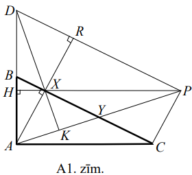
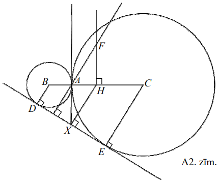
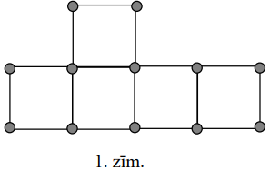
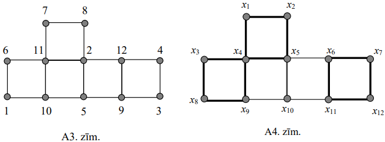
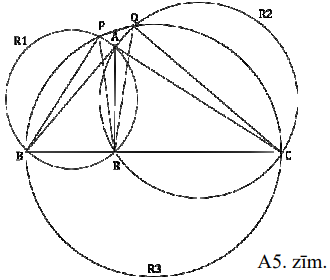
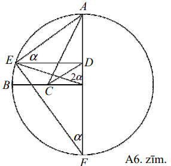

# <lo-sample/> LV.VOL.2014.9.1

Kādu mazāko vērtību var pieņemt izteiksme $x+\frac{2014}{x}$, ja $x>0$?

<small>

* questionType:
* domain:

</small>

## Atrisinājums

Pārveidojam doto izteiksmi, atdalot pilno kvadrātu:

$$x+\frac{2014}{x}=(\sqrt{x})^{2}-2 \sqrt{2014}+\left(\frac{\sqrt{2014}}{\sqrt{x}}\right)^{2}+2 \sqrt{2014}=\left(\sqrt{x}-\frac{\sqrt{2014}}{\sqrt{x}}\right)^{2}+2 \sqrt{2014}$$

Tā kā kvadrāts vienmēr ir nenegatīvs, tad izteiksmes mazākā iespējamā vērtība 
ir tad, kad

$\sqrt{x}-\frac{\sqrt{2014}}{\sqrt{x}}=0, \sqrt{x}=\frac{\sqrt{2014}}{\sqrt{x}}$ jeb $x=\sqrt{2014}$

Līdz ar to esam ieguvuši, ka izteiksmes $x+\frac{2014}{x}$ mazākā vērtība ir 
$2 \sqrt{2014}$ un tā tiek sasniegta pie $x=\sqrt{2014}$.

## Atrisinājums

No sakarības starp vidējo aritmētisko un vidējo ģeometrisko seko, ka

$$x+\frac{2014}{x} \geq 2 \sqrt{x \cdot \frac{2014}{x}}=2 \sqrt{2014}$$

Šo vērtību izteiksme sasniedz, ja $x=\frac{2014}{x}$ jeb $x^{2}=2014$ un 
$x=\sqrt{2014}$.

# <lo-sample/> LV.VOL.2014.9.2

Naturālu skaitļu virknes pirmie trīs locekļi ir vienādi ar $1$, bet katrs 
nākamais ir vienāds ar trīs iepriekšējo skaitļu summu. Cik starp virknes 
pirmajiem **(A)** $100$, **(B)** $2014$ locekļiem ir tādi, kas dalās ar $5$?

<small>

* questionType:
* domain:

</small>

## Atrisinājums

Katra virknes elementa, dalot to ar $5$, atlikums, ir atkarīgs tikai no triju 
iepriekšējo elementu atlikumiem, dalot ar $5$.

Aplūkojam atlikumu virkni, kas rodas virknes elementus, dalot ar $5$:

$$1,\ 1,\ 1,\ 3,\ 0,\ 4,\ 2,\ 1,\ 2,\ 0,\ 3,\ 0,\ 3,\ 1,\ 4,\ 3,\ 3,\ 0,\ 1,\ 4,\ 0,\ 0,\ 4,\ 4,\ 3,\ 1,\ 3,\ 2,\ 1,\ 1,\ 4,\ 1,\ 1,\ 1,\ \ldots$$

Tātad atlikumi ir periodiski ar periodu $31$. Tas nozīmē, ka katrā $31$ locekļu
grupā ir $6$ locekļi, kas dalās ar $5$.

**(A)** $100$ locekļi veido trīs pilnas grupas un vēl septiņus locekļus. Tātad 
tādu skaitļu skaits, kas dalās ar $5$ ir $6 \cdot 3+1=19$.  
**(B)** $2014$ locekļi veido $64$ pilnas grupas un vēl $30$ locekļus. Tātad 
tādu skaitļu skaits, kas dalās ar $5$, ir $6 \cdot 64+6=390$.

# <lo-sample/> LV.VOL.2014.9.3

Taisnleņķa trijstūra $ABC$ taisnais leņķis ir $A$. Punkts $X$ ir no $A$ pret 
$BC$ vilktā augstuma pamats. Nogriežņa $XC$ viduspunkts ir $Y$. Uz malas $AB$ 
pagarinājuma izvēlēts punkts $D$ tā, ka $AB=BD$. Pierādīt, ka $DX$ ir 
perpendikulārs $AY$.

<small>

* questionType:
* domain:

</small>

## Atrisinājums

Nogriezni $AY$ pagarina aiz punkta $Y$ un atliek punktu $P$ tā, ka $AY=YP$ 
(skat. A1.zīm.). Tas nozīmē, ka četrstūris $AXPC$ ir paralelograms, jo tā 
diagonāles $AP$ un $XC$ to krustpunktā $Y$ dalās uz pusēm. Nogriezni $XP$ 
pagarinot līdz krustpunktam ar $AD$, iegūst, ka $PH \perp AD$, jo $AC \perp AD$
un $PH \parallel AC$. Aplūkojam trijstūri $ADP$. No tā, ka $AB=BD$ un $AY=YP$ 
seko, ka $BY$ ir trijstūra $ADP$ viduslīnija. Tātad $BY \parallel DP$. No tā, 
ka $AX \perp BY$, seko, ka $AR \perp DP$. Tas nozīmē, ka trijstūrī $ADP$ ir 
novilkti divi augstumi $PH$ un $AR$, kas krustojas punktā $X$. Līdz ar to 
nogrieznis, kas vilkts no virsotnes $D$ caur punktu $X$, ir trešais šī 
trijstūra augstums, tātad $DK \perp AP$ un $DK \perp AY$, kas arī bija 
jāpierāda.

# <lo-sample/> LV.VOL.2014.9.4

Gatavojoties $13$ diplomātu apspriedei, krēsli tika izvietoti ap apaļu galdu 
vienādos attālumos un katrai no vietām tika sagatavota plāksnīte ar diplomāta 
vārdu. Diemžēl, ieņemot vietas pie galda, diplomāti šīs plāksnītes neņēma vērā 
un izrādījās, ka neviens no diplomātiem nav apsēdies pretī savai plāksnītei.

**(A)** Pierādīt: nepārsēdinot diplomātus, galdu ir iespējams pagriezt tā, ka 
vismaz divi diplomāti atradīsies pret savām plāksnītēm.

**(B)** Pierādīt: ja sākumā tieši viens diplomāts būtu sēdējis pret savu 
plāksnīti, tad ir iespējams, ka viņi apsēdušies tā, ka, pagriežot galdu, nav 
iespējams panākt, ka pret savu plāksnīti atradīsies vairāk par vienu diplomātu.

<small>

* questionType:
* domain:

</small>

## Atrisinājums

**(A)** Apaļajam galdam pavisam ir $13$ derīgas pozīcijas, kuras var iegūt 
galda pagriešanas par noteiktu vietu skaitu rezultātā. Katrs diplomāts pret 
savu plāksnīti atradīsies tikai vienā no šīm pozīcijām. Katrai galda pozīcijai 
$i(1 \leq i \leq 13)$ ar $p_{i}$ apzīmējot diplomātu skaitu, cik šajā pozīcijā 
atrodas pret savām plāksnītēm, iegūstam $p_{1}+p_{2}+\ldots+p_{13}=13$.

Zināms, ka viena no $p_{i}$ vērtībām ir $0$, jo sākuma neviens no diplomātiem 
neatrodas pretī savai plāksnītei. Pēc Dirihlē principa kādai no atlikušajām 
$p_{j}$ vērtībām jābūt vismaz $2$, t. i., ir vismaz divi diplomāti, kas kādā 
pozīcijā atrodas pretī savām plāksnītēm.

**(B)** Pieņemot, ka diplomāti numurēti ar naturāliem skaitļiem no $1$ līdz 
$13$ pēc kārtas un sēdināt tos ap galdu bija paredzēts pulkstenrādītāja 
virzienā (plāksnītes saliktas $1-2-3-\ldots-12-13$), tad diplomātiem pie galda 
apsēžoties, piemēram, šādi $1-13-12-11-10-9-8-7-6-5-4-3-2$, izpildās uzdevumā 
prasītais. Diplomātiem $i$ un $j$, ja $i$ sēž savā vietā, tad $j$-tā plāksnīte 
atrodas $j-i$ vietas pa labi, bet $j$-ais diplomāts atrodas $j-i$ vietas pa 
kreisi. Tā kā $13$ ir nepāra skaitlis, tad $j$ nevar sēdēt pie savas 
plāksnītes.

*Piezīme.* Pavisam iespējami $13723$ atšķirīgi diplomātu izvietojuma varianti 
ar iepriekšminēto īpašību.

# <lo-sample/> LV.VOL.2014.9.5

Atrast vienādojuma $\left(x^{2}+5x-7\right)^{2}-2\left(x^{2}+5x-6\right)-4=0$ 
sakņu kubu summu.

<small>

* questionType:
* domain:

</small>

## Atrisinājums

Apzīmējam $p=x^{2}+5x-8$.

Ievietojot dotajā vienādojumā, iegūstam $(p+1)^{2}-2(p+2)-4=0$ jeb $p^{2}=7$ un
$p= \pm \sqrt{7}$. Esam ieguvuši, ka šo vienādojumu var sadalīt reizinātājos 
$(p-\sqrt{7})(p+\sqrt{7})=0$. Tas nozīmē, ka sākotnējā vienādojuma saknes 
sakrīt ar vienādojumu $x^{2}+5x-(8+\sqrt{7})=0$ un $x^{2}+5x-(8-\sqrt{7})=0$ 
saknēm (šo vienādojumu diskriminanti ir attiecīgi $D_{v1}=57+4 \sqrt{7}>0$ un 
$D_{v2}=57-4 \sqrt{7}>0$, tāpēc katram no tiem ir divas saknes). Apzīmēsim šīs 
saknes pa pāriem ar $x_{1}, x_{2}$ un $x_{3}, x_{4}$. Pēc Vjeta teorēmas 
iegūstam sakarības:

$$x_{1}+x_{2}=x_{3}+x_{4}=-5$$

$$\begin{aligned}
& x_{1}x_{2}=-(8+\sqrt{7}) \\
& x_{3}x_{4}=-(8-\sqrt{7})
\end{aligned}$$

Ievērojam, ka 
$a^{3}+b^{3}=(a+b)\left(a^{2}-ab+b^{2}\right)=(a+b)\left((a+b)^{2}-3ab\right)$.

Tāpēc 
$x_{1}^{3}+x_{2}^{3}+x_{3}^{3}+x_{4}^{3}=-5 \cdot(25+3(8+\sqrt{7}))-5 \cdot(25+3(8-\sqrt{7}))=-490$.

# <lo-sample/> LV.VOL.2014.10.1

Atrisināt vienādojumu sistēmu

$$\left\{\begin{array}{l}
5(x+y+z)=xyz \\
x=y+z
\end{array}\right.$$

kur $x,\ y,\ z$ - veseli nenegatīvi skaitļi.

<small>

* questionType:
* domain:

</small>

## Atrisinājums

Ievērojam, ka sistēmas atrisinājums ir $(0,0,0)$.

Pirmajā vienādojumā aizstājot $y+z$ ar $x$, iegūstam

$5(x+x)=xyz$ jeb $10x=xyz$

Ja $x \neq 0$, tad no pirmā vienādojuma iegūstam, ka

$$10=yz \Rightarrow y=\frac{10}{z}$$

Apskatām visus veselos pozitīvos skaitļa $10$ dalītājus:

- $z=1$, tad $y=10$ un $x=10+1=11$;
- $z=2$, tad $y=5$ un $x=5+2=7$;
- $z=5$, tad $y=2$ un $x=2+5=7$;
- $z=10$, tad $y=1$ un $x=1+10=11$.

Tātad dotajai sistēmai ir pieci atrisinājumi:

$$(0,0,0),(11,10,1),(7,5,2),(7,2,5),(11,1,10)$$

# <lo-sample/> LV.VOL.2014.10.2

Atrast visas tādas vesela skaitļa $n$ vērtības, kurām gan 
$\frac{n^{3}+3}{n+3}$, gan $\frac{n^{4}+4}{n+4}$ ir veseli skaitļi.

<small>

* questionType:
* domain:

</small>

## Atrisinājums

Apzīmējam $k=n+3$. Tad $n=k-3$ un pārveidojam pirmo izteiksmi:

$$\frac{n^{3}+3}{n+3}=\frac{(k-3)^{3}+3}{k}=\frac{k^{3}-9 k^{2}+27k-27+3}{k}=k^{2}-9k+27-\frac{24}{k}$$

Līdzīgi, apzīmējot $m=n+4$, pārveidojam otro daļu:

$\frac{n^{4}+4}{n+4}=\frac{(m-4)^{4}+4}{m}=\frac{m^{4}-16m^{3}+96m^{2}-256m+256+4}{m}=m^{3}-16m^{2}+96m-256+\frac{260}{m}$.

Lai abu daļu vērtības būtu veseli skaitļi, tad skaitlim $k=n+3$ jābūt $24$ 
dalītājam un atbilstošajam skaitlim $m=n+4$ jābūt $260$ dalītājam.

Derīgās $n+3$ vērtības apkopotas tabulas otrajā rindā:

| $n$ | $n+3$ | $n+4$ |
| ---- | ---- | ---- |
| $-27$ | $-24$ | $-23$ |
| $-15$ | $-12$ | $-11$ |
| $-11$ | $-8$ | $-7$ |
| $\mathbf{-9}$ | $-6$ | $\colorbox{lightgray}{-5}$ |
| $-7$ | $-4$ | $-3$ |
| $\mathbf{-6}$ | $-3$ | $\colorbox{lightgray}{-2}$ |
| $\mathbf{-5}$ | $-2$ | $\colorbox{lightgray}{-1}$ |
| $-4$ | $-1$ | $0$ |
| $-2$ | $1$ | $\colorbox{lightgray}{2}$ |
| $-1$ | $2$ | $3$ |
| $\mathbf{0}$ | $3$ | $\colorbox{lightgray}{4}$ |
| $\mathbf{1}$ | $4$ | $\colorbox{lightgray}{5}$ |
| $3$ | $6$ | $7$ |
| $5$ | $8$ | $9$ |
| $\mathbf{9}$ | $12$ | $\colorbox{lightgray}{13}$ |
| $21$ | $24$ | $25$ |

No skaitļu $n+4$ vērtībām ietonētās ir skaitļa $260$ dalītāji.

Tātad meklētās $n$ vērtības ir $-9,\ -6,\ -5,\ -2,\ 0,\ 1,\ 9$.

# <lo-sample/> LV.VOL.2014.10.3

Ir pieejams neierobežots daudzums $7$ un $13$ centu pastmarku, kuras izmanto 
pasta sūtījumu apmaksāšanai. Diemžēl dažas summas nav iespējams apmaksāt tikai 
ar šīm pastmarkām (piemēram, ja sūtījums maksā $6,\ 8$ vai $25$ centus). Kāda 
ir lielākā summa, kuru nav iespējams apmaksāt izmantojot tikai šīs pastmarkas?

<small>

* questionType:
* domain:

</small>

## Atrisinājums

Parādīsim, ka $71$ centu nav iespējams precīzi apmaksāt ar $7$ un $13$ centu 
pastmarkām. Šajā summā ir ne vairāk kā piecas $13$ centu pastmarkas. Aplūkosim,
kāda summa atkarībā no izmantoto $13$ centu pastmarku skaita būtu jāapmaksā ar 
$7$ centu pastmarkām:

| $13$ centu   pastmarku skaits | Summa, kas apmaksāta ar   $13$ centu pastmarkām | Summa, kas jāapmaksā ar   $7$ centu pastmarkām |
| :---: | :---: | :---: |
| $0$ | $0$ | $71$ |
| $1$ | $13$ | $58$ |
| $2$ | $26$ | $45$ |
| $3$ | $39$ | $32$ |
| $4$ | $52$ | $19$ |
| $5$ | $65$ | $6$ |

Nevienā no variantiem atlikusī summa nav $7$ daudzkārtnis, tātad šo summu nav 
iespējams apmaksāt ar $7$ centu pastmarkām. Tātad $71$ centu nav iespējams 
precīzi apmaksāt ar $7$ un $13$ centu pastmarkām.

Pierādīsim, ka jebkuru lielāku summu ir iespējams samaksāt ar $7$ un $13$ centu
pastmarkām.

Ievērosim, ka ja $N$ centu apmaksāšanā ir izmantota vismaz viena $13$ centu 
pastmarka, tad aizvietojot to ar divām $7$ centu pastmarkām, varēs apmaksāt 
$N+1$ centu. Šādu aizvietošanu apzīmēsim ar " $A$ ".

Ja $N$ centu apmaksāšanā ir izmantotas vismaz vienpadsmit $7$ centu pastmarkas,
tad aizvietojot tās ar sešām $13$ centu pastmarkām, varēs apmaksāt $N+1$ centu.
Šādu aizvietošanu apzīmēsim ar " $B$ ".

Ievērojam, ka $72=1 \cdot 7+5 \cdot 13$ un

$$72 \stackrel{A}{\Rightarrow} 73 \stackrel{A}{\Rightarrow} 74 \stackrel{A}{\Rightarrow} 75 \stackrel{A}{\Rightarrow} 76 \stackrel{A}{\Rightarrow} 77 \stackrel{B}{\Rightarrow} 78.$$

Visas lielākās summas var iegūt izvēloties kādu no šīm summām un pievienojot 
nepieciešamo $7$ centu pastmarku skaitu.

# <lo-sample/> LV.VOL.2014.10.4

Divas dažāda rādiusa riņķa līnijas ar centriem punktos $B$ un $C$ ārēji 
saskaras punktā $A$. Abu riņķa līniju kopējā pieskare, kas neiet caur punktu 
$A$, pirmajai riņķa līnijai pieskaras punktā $D$, bet otrai - punktā $E$. 
Taisne, kas novilkta caur $A$ perpendikulāri $DE$, krusto nogriežņa $BC$ 
vidusperpendikulu punktā $F$. Pierādīt, ka $BC=2AF$.

<small>

* questionType:
* domain:

</small>

## Atrisinājums

Apzīmējam $AB=r$ un $AC=R$.

Tad $BC=AB+BC=r+R$ un jāpierāda, ka $AF=\frac{BC}{2}=\frac{r+R}{2}$.

No nogriežņa vidusperpendikula definīcijas seko, ka 
$BH=HC=\frac{BC}{2}=\frac{r+R}{2}$.

No punkta $H$ novelkam perpendikulu pret $DE$, perpendikula un $DE$ krustpunktu
apzīmējam ar $X$ (skat. A2.zīm.).

Nogrieznis $HX$ ir trapeces $DBCE$ ($BD \parallel EC$ kā rādiusi pret pieskari 
$DE$) viduslīnija, tātad $HX=\frac{BD+CE}{2}=\frac{r+R}{2}$ un $DX=EX$.

Nogrieznis $HX$ ir paralēls $AF$, jo $HX \perp DE$ un $AF \perp DE$.

Novelkam abu riņķu kopējo pieskari, kas iet caur $A$ - šī pieskare krusto $DE$ 
punktā $Y$. Tā kā $BC \perp AY$ un $BC \perp FH$, tad $AY \parallel FH$.

Izmantojot pieskaru, kas vilktas no viena punkta pret riņķa līniju, īpašǐbu, iegūstam $E Y=A Y$ un $D Y=A Y$. Tātad $D Y=E Y$ un $Y$ ir $D E$ viduspunkts. Sanāk, ka $X$ un $Y$ ir viens un tas pats punkts, jo abi atrodas $D E$ viduspunktā.

Apskatām četrstūri $AFHX$, tā pretējās malas ir pa pāriem paralēlas. Tātad 
$AFHX$ ir paralelograms.

Tātad $AF=HX=\frac{r+R}{2}$ kā paralelograma pretējās malas. Līdz ar to esam 
pierādījuši vajadzīgo.

# <lo-sample/> LV.VOL.2014.10.5

Gatavojoties vēlēšanām politiskās partijas saviem vēlētājiem kopumā ir devušas 
$s$ (naturāls skaitlis) dažādus solījumus. Zināms, ka jebkurām divām partijām 
var atrast vismaz vienu solījumu, ko devušas abas partijas. Tajā pat laikā nav 
iespējams atrast divas partijas, kuru dotie solījumi sakristu pilnībā - ir 
iespējams atrast vismaz vienu solījumu, ko viena partija ir devusi, bet otra - 
nē. Kāds ir lielākais iespējamais partiju skaits, kas gatavojas vēlēšanām?

<small>

* questionType:
* domain:

</small>

## Atrisinājums

Lielākais iespējamais dažādo solījumu komplektu skaits ir 
$\underbrace{2 \cdot 2 \cdot 2 \cdot \ldots \cdot 2}_{\mathrm{s}}=2^{s}$ 
(kopas, kuras apjoms ir $s$, visu apakškopu skaits).

Zināms, ka katrai kopas $A$ apakškopai $B$ eksistē tās papildinājums $C$ līdz 
kopai $A$, un kopu $B$ un $C$ šķēlums ir tukša kopa, t. i., kopām $B$ un $C$ 
nav kopīgu elementu. Šādus divus solījumu komplektus (apakškopu un tās 
papildinājumu) nevar piekārtot partijām, jo neizpildās uzdevuma nosacījums, ka 
jebkurām divām partijām var atrast vismaz vienu solījumu, ko devušas abas 
partijas. Līdz ar to no katra šādu solījumu komplektu pāra partijām var 
piekārtot ne vairāk kā vienu solījumu komplektu. Tātad iespējamais partiju 
skaits ir vismaz divas reizes mazāks nekā visu kopas apakškopu skaits, t. i., 
$2^{s}:2=2^{s-1}$.

Parādīsim, ka šāds partiju skaits ir iespējams.

Pieņemsim, ka eksistē viens solījums, kas kopīgs visām partijām. Tad no 
atlikušajiem $s-1$ solījumiem var izveidot $2^{s-1}$ dažādus solījumu 
komplektus (kopas, kuras apjoms ir $s-1$ dažādo apakškopu skaits). Līdz ar to 
esam izveidojuši $2^{s-1}$ atšķirīgus solījumu komplektus, kas apmierina 
uzdevuma nosacījumus.

Tātad lielākais iespējamais partiju skaits ir $2^{s-1}$.

# <lo-sample/> LV.VOL.2014.11.1

Vai eksistē tāds naturāls skaitlis $n$, ka, noapaļojot izteiksmju 
$\sqrt{10^{2n}-10^{n}}$ un $\sqrt{10^{2n}-10^{n}+1}$ vērtības līdz tuvākajam 
naturālajam skaitlim, iegūtie skaitļi ir vienādi? 

<small>

* questionType:
* domain:

</small>

## Atrisinājums

Ievērosim, ka

$$\begin{gathered}
10^{2n}-10^{n}<10^{2n}-10^{n}+\frac{1}{4}<10^{2n}-10^{n}+1 \\
10^{2n}-10^{n}<\left(10^{n}-\frac{1}{2}\right)^{2}<10^{2n}-10^{n}+1 \\
\sqrt{10^{2n}-10^{n}}<10^{n}-\frac{1}{2}<\sqrt{10^{2n}-10^{n}+1}
\end{gathered}$$

Tātad izteiksmes $\sqrt{10^{2n}-10^{n}}$ vērtība tiks noapaļota uz $10^{n}-1$, 
bet $\sqrt{10^{2n}-10^{n}+1}-$ uz $10^{n}$. Tas nozīmē, ka nevienai naturālai 
$n$ vērtībai šie skaitļi nevar būt vienādi.

# <lo-sample/> LV.VOL.2014.11.2

Noteikt, kāds ir lielākais skaits, cik no pieciem naturāliem skaitļiem 
$a,\ a+14,\ a+22,\ a+32,\ a+46$ var būt pirmskaitļi.

<small>

* questionType:
* domain:

</small>

## Atrisinājums

Ja $a$ ir pāra skaitlis, tad starp dotajiem pieciem skaitļiem ir ne vairāk kā 
viens pirmskaitlis, t. i., ja $a=2$, tad pirmskaitlis ir $2$, vai ja $a$ ir 
kāds cits pāra skaitlis, tad starp dotajiem pieciem skaitļiem nav neviena 
pirmskaitļa.

Ja $a=3$, tad ir divi pirmskaitļi $3$ un $17$, pārējie skaitļi ir $25,\ 35$ un 
$49$, kas nav pirmskaitļi. Ja $a>3$, tad tieši viens no skaitļiem 
$a,\ a+14,\ a+22$ dalās ar $3$:

- ja $a=3k$, tad $a$ dalās ar $3$;
- ja $a=3k+1$, tad $a+14=3k+1+14=3k+15$ dalās ar $3$;
- ja $a=3k+2$, tad $a+22=3k+2+22=3k+24$ dalās ar $3$.

Tā kā šajā gadījumā vismaz viens no skaitļiem dalās ar $3$, tad ne vairāk kā 
$4$ no šiem skaitļiem var būt pirmskaitļi.

Četrus pirmskaitļus var iegūt, ja izvēlas, piemēram, $a=15$. Tad 
$a+14=29,\ a+22=37$, $a+32=47$ un $a+46=61$ ir pirmskaitļi.

# <lo-sample/> LV.VOL.2014.11.3

1.zīmējumā redzamās figūras $12$ virsotnēs nepieciešams ierakstīt pirmos $12$ 
naturālos skaitļus (katrā virsotnē - vienu) tā, lai katras rūtiņas virsotnēs 
ierakstīto četru skaitļu summa būtu vienāda ar $M$. Vai to var izdarīt, ja 
**(A)** $M=28$; **(B)** $M=26$?

<small>

* questionType:
* domain:

</small>

## Atrisinājums

**(A)** Viens no atrisinājumiem ir parādīts A3.zīm.

**(B)** Pierādīsim, ka skaitļu izvietojums ar $M=26$ neeksistē.

Pieņemsim, ka šāds izvietojums eksistē. Aplūkosim trīs kvadrātus, kuru malas 
attēlotas ar treknām līnijām (skat. A4.zīm.). Sastādīsim trīs vienādības:

$$\begin{gathered}
x_{1}+x_{2}+x_{4}+x_{5}=M \\
x_{3}+x_{4}+x_{8}+x_{9}=M \\
x_{6}+x_{7}+x_{11}+x_{12}=M
\end{gathered}$$

Apzīmēsim ar $S$ visu skaitļu no $1$ līdz $12$ summu: 
$S=x_{1}+x_{2}+\ldots+x_{12}=78$. Tad, saskaitot šīs trīs vienādības, iegūstam,
ka

$$S+x_{4}-x_{10}=3M$$

Ja $M=26$, tad $S=78=3 \cdot 26=3 M$. Līdz ar to $x_{4}=x_{10}$. Iegūta 
pretruna ar to, ka virsotnēs jāieraksta dažādi skaitļi.

# <lo-sample/> LV.VOL.2014.11.4

Platleņķa trijstūra $ABC$ platais leņķis ir $BAC$. Novilktas trīs riņķa līnijas
tā, ka trijstūra $ABC$ malas ir attiecīgi šo riņķa līniju diametri. Bez 
trijstūra virsotnēm riņķa līnijas pa pāriem krustojas vēl trīs punktos - 
$P,\ Q$ un $R$. Pierādīt, ka $A$ ir trijstūra $PQR$ bisektrišu krustpunkts.

<small>

* questionType:
* domain:

</small>

## Atrisinājums

Apzīmēsim riņķa līniju, kuras diametrs ir $AB$ ar $R_{1}$, kuras diametrs ir 
$AC$ - ar $R_{2}$ un kuras diametrs ir $BC$ - ar $R_{3}$ (skat. A5.zīm.).

Šīs riņķa līnijas katra iet caur attiecīgās malas galapunktiem un caur to 
augstumu pamatiem, kas atrodas uz divām pārējām malām vai to pagarinājumiem:

- $R_{1}$ iet caur punktiem $A,\ R,\ B$ un $P$;
- $R_{2}$ - caur $A,\ R,\ C$ un $Q$;
- $R_{3}$ - caur $B,\ C,\ Q$ un $P$,

pie kam $\sphericalangle BPC=\sphericalangle BQC=\sphericalangle ARB=90^{\circ}$.
Punkts $A$ atrodas trijstūra $PQR$ iekšpusē ($CP$ un $BQ$ krustpunktā:

- gan $AP$, gan $CP$ ir perpendikulārs pret $BP\left(R_{1}\right.$ un $R_{3}$ 
  īpašības) - tātad $P,\ A$ un $C$ atrodas uz vienas taisnes;
- gan $AQ$, gan $BQ$ ir perpendikulārs pret $CQ$ ($R_{2}$ un $R_{3}$ 
  īpašības) - tātad $B,\ A$ un $Q$ atrodas uz vienas taisnes).

No $R_{1}$ ievilkto leņķu īpašībām: $\sphericalangle ABP=\sphericalangle ARP$, 
jo abi balstās uz viena un tā paša loka $AP$.

No $R_{2}: \sphericalangle ARQ=\sphericalangle ACQ$ (abi balstās uz loka $AQ$)

No $R_{3}: \sphericalangle PBQ=\sphericalangle PCQ$ (abi balstās uz loka $PQ$)

Ievērojot, ka $\sphericalangle ABP=\sphericalangle QBP$ un 
$\sphericalangle ACQ=\sphericalangle PCQ$, iegūstam, ka 
$\sphericalangle ARP=\sphericalangle ARQ$. Tātad $RA$ ir $\sphericalangle PRQ$ 
bisektrise.

No $R_{2}$ ievilkto leņķu īpašībām: $\sphericalangle AQR=\sphericalangle ACR$ 
(abi balstās uz $AR$)

No $R_{3}: \sphericalangle PQB=\sphericalangle PCB$ (abi balstās uz $BP$)

Ievērojot, ka $\sphericalangle ACR=\sphericalangle PCB$, iegūstam, ka 
$\sphericalangle PQB=\sphericalangle AQR$. Tātad $QA$ ir $\sphericalangle PQR$ 
bisektrise.

Tātad divas no trijstūra $PQR$ bisektrisēm krustojas punktā $A$ - tātad $A$ ir 
trijstūra $PQR$ bisektrišu krustpunkts, kas arī bija jāpierāda.

# <lo-sample/> LV.VOL.2014.11.5

Naturālus skaitļus $a,\ b$ un c saista sakarība $c^{2}=a^{2}+b^{2}$. Pierādīt, 
ka katru no skaitļiem $c^{2}+ab$ un $c^{2}-ab$ var izteikt kā divu naturālu 
skaitļu kvadrātu summu.

<small>

* questionType:
* domain:

</small>

## Atrisinājums

Aplūkojam skaitļus $x=\frac{a+b+c}{2},\ y=\frac{a+b-c}{2},\ p=\frac{c+a-b}{2}$ 
un $q=\frac{c-a+b}{2}$.

No sakarības $c^{2}=a^{2}+b^{2}$ viegli ievērot: ja kāds no skaitļiem 
$a,\ b,\ c$ ir nepāra skaitlis, tad no atlikušajiem viens ir nepāra, bet otrs -
pāra. Tātad vai nu visi skaitļi $a,\ b,\ c$ ir pāra, vai starp tiem ir tieši 
divi nepāra skaitļi. Tas nozīmē, ka visi skaitļi $x,\ y,\ p,\ q$ ir veseli 
skaitļi.

Skaitļi $a,\ b,\ c$ ir Pitagora trijstūra malas, tāpēc no trijstūra 
nevienādībām $a+b>c,\ a+c>b$, $b+c>a$ seko, ka visi skaitļi $x,\ y,\ p,\ q$ ir 
lielāki nekā nulle - tātad naturāli skaitļi.

Atliek ievērot, ka

- $x^{2}+y^{2}=\frac{(a+b)^{2}+2(a+b)c+c^{2}}{4}+\frac{(a+b)^{2}-2(a+b)c+c^{2}}{4}=\frac{(a+b)^{2}+c^{2}}{2}=$  
  $=\frac{a^{2}+2ab+b^{2}+c^{2}}{2}=\frac{2c^{2}+2ab}{2}=c^{2}+ab$

- $p^{2}+q^{2}=\frac{c^{2}+2c(a-b)+(a-b)^{2}}{4}+\frac{c^{2}-2c(a-b)+(a-b)^{2}}{4}=\frac{c^{2}+(a-b)^{2}}{2}=$  
  $=\frac{c^{2}+a^{2}-2ab+b^{2}}{2}=\frac{2c^{2}-2ab}{2}=c^{2}-ab$

# <lo-sample/> LV.VOL.2014.12.1

Izteiksmē $\pm 1 \pm 2 \pm 3 \pm \ldots \pm 100=2014$ katru zīmi " $\pm$ " 
aizvietoja vai nu ar "+", vai "-" tā, lai izteiksme būtu patiesa. Kāds 
lielākais "+" zīmju skaits var būt šajā izteiksmē?

<small>

* questionType:
* domain:

</small>

## Atrisinājums

Pierādīsim, ka "+" zīmju skaits nevar būt lielāks kā $83$.

Pieņemsim pretējo, ka var būt $84$ saskaitāmie ar "+" zīmi. Šajā gadījumā 
mazākā iespējamā izteiksmes vērtība būs tad, ja pie mazākajiem virknes 
locekļiem būs "+", bet pie lielākajiem "-". Tad mazākā izteiksmes vērtība ir

$$1+2+3+\ldots+84-85-\ldots-100=\frac{1+84}{2} \cdot 84-\frac{85+100}{2} \cdot 16=85 \cdot 42-185 \cdot 8=2090>2014$$

Tā kā tika izveidota mazākā iespējamā izteiksmes vērtība ar šo "+" skaitu, tad 
visas citas izteiksmes būs ar vēl lielāku vērtību.

Pareizu izteiksmi ar $83$ "+" zīmēm var iegūt, ja iepriekšējā izteiksmē nomaina
"+" pret "-" pie saskaitāmā $38$. Izteiksmes vērtība samazināsies par 
$38 \cdot 2=76$ un būs vienāda ar $2090-76=2014$.

Tātad lielākais "+" skaits izteiksmē ir $83$.

# <lo-sample/> LV.VOL.2014.12.2

Katram naturālam skaitlim $n$ ir definēta funkcija 
$f(n)=\frac{1}{1}+\frac{1}{2}+\ldots+\frac{1}{n}$. Pierādīt, ka visiem $n>1$ ir
spēkā sakarība $n+f(1)+f(2)+\ldots+f(n-1)=nf(n)$.

<small>

* questionType:
* domain:

</small>

## Atrisinājums

Izmantosim matemātiskās indukcijas metodi. Ievērojam, ka $f(1)=1$.

*Indukcijas bāze.* Ja $n=2$, tad $f(2)=1+\frac{1}{2}=\frac{3}{2}$ un dotā 
sakarība $2+f(1)=3=2f(2)$ ir patiesa. 

*Induktīvais pieņēmums.* Pieņemsim, ka sakarība ir spēkā, ja $n=k$:

$$\begin{equation*}
k+f(1)+f(2)+\ldots+f(k-1)=kf(k) \tag{*}
\end{equation*}$$

*Induktīvā pāreja.* Pierādīsim, ka sakarība ir spēkā, ja $n=k+1$.

Abām vienādības (*) pusēm pieskaitot $f(k)+1$:

$$1+1+\frac{1}{2}+\frac{1}{3}+\ldots+\frac{1}{k}=f(k)+1$$

iegūstam

$$\begin{aligned}
& k+f(1)+f(2)+\ldots+f(k-1)+1+1+\frac{1}{2}+\frac{1}{3}+\ldots+\frac{1}{k}=k f(k)+f(k)+1 \\
& (k+1)+1+\left(f(1)+\frac{1}{2}\right)+\left(f(2)+\frac{1}{3}\right)+\ldots+\left(f(k-1)+\frac{1}{k}\right)=(k+1)f(k)+1
\end{aligned}$$

Izmantojot, ka $1=f(1)$ un 
$f(k-1)+\frac{1}{k}=1+\frac{1}{2}+\ldots+\frac{1}{k-1}+\frac{1}{k}=f(k)$, 
iegūstam

$(k+1)+f(1)+f(2)+f(3)+\ldots+f(k)=(k+1)f(k)+\frac{k+1}{k+1}$.

Tātad 
$(k+1)+f(1)+f(2)+f(3)+\ldots+f(k)=(k+1)\left(f(k)+\frac{1}{k+1}\right)=(k+1)f(k+1)$.

Tā kā apgalvojums ir patiess, ja $n=2$, un no tā, ka apgalvojums ir spēkā, ja 
$n=k$, izriet, ka apgalvojums ir spēkā arī $n=k+1$, secinām, ka apgalvojums ir 
spēkā visām naturālām $n(n>1)$ vērtībām.

# <lo-sample/> LV.VOL.2014.12.3

Riņķa līnijā ar centru punktā $O$ novilkti divi savstarpēji perpendikulāri 
rādiusi $OA$ un $OB$. Nogrieznis $AC$ ir trijstūra $BAO$ mediāna, $CD$ ir 
trijstūra $ACO$ bisektrise, punkts $E$ izvēlēts uz mazākā loka $AB$ tā, ka $ED$
ir trijstūra $AEO$ augstums. Aprēķināt leņķa $AED$ lielumu grādos.

<small>

* questionType:
* domain:

</small>

## Atrisinājums

Pagarinām $OA$ tā, ka $AF$ ir diametrs un novelkam nogriezni $EF$ (skat. 
A6.zīm.). Tad trijstūris $AEF$ ir taisnleņķa, jo $\sphericalangle AEF$ balstās 
uz diametru $AF$.

$\triangle AEF \sim \triangle ADE$ (pēc pazīmes " $\ell \ell$ "), jo 
$\sphericalangle AEF=\sphericalangle ADE=90^{\circ}$ un $\sphericalangle EAD$
ir kopīgs. Apzīmējam $\sphericalangle AFE=\sphericalangle AED=\alpha$ (kā 
atbilstošie leņķi līdzīgos trijstūros). Tad 
$\sphericalangle EOD=2 \sphericalangle AFE=2 \alpha$ kā centra leņķis, kas 
balstās uz to pašu loku kā $\sphericalangle AFE$.

Pieņemsim, ka $OA=OB=OE=2x$. Tad $OC=x$ un no Pitagora teorēmas trijstūrī $AOC$
seko, ka $AC=\sqrt{OC^{2}+AO^{2}}=\sqrt{x^{2}+(2x)^{2}}=x \sqrt{5}$. Izmantojot
bisektrises īpašību (bisektrise $CD$ trijstūrī $AOC$), iegūstam

$$\frac{OD}{DA}=\frac{OC}{AC} \Rightarrow \frac{OD}{AO-OD}=\frac{1}{\sqrt{5}} \Rightarrow OD \sqrt{5}=2x-OD \Rightarrow OD=\frac{2x}{1+\sqrt{5}}$$

No trijstūra $ODE$ iegūstam, ka 
$\cos 2 \alpha=\frac{OD}{OE}=\frac{2x}{(1+\sqrt{5}) \cdot 2x}=\frac{1}{1+\sqrt{5}}=\frac{\sqrt{5}-1}{4}$.

Izmantojot trigonometrisko formulu 
$\cos 2 \beta=\cos ^{2} \beta-\sin ^{2} \beta=2 \cos ^{2} \beta-1$, iegūstam

- $\cos ^{2} \alpha=\frac{1+\cos 2 \alpha}{2}=\frac{1+\frac{\sqrt{5}-1}{4}}{2}=\frac{3+\sqrt{5}}{8}$.
- Tā kā $\alpha$ ir šaurs trijstūra leņkis, tad

$$\cos \alpha=\sqrt{\frac{3+\sqrt{5}}{8}}=\sqrt{\frac{6+2 \sqrt{5}}{16}}=\sqrt{\frac{(\sqrt{5})^{2}+2 \sqrt{5}+1}{16}}=\sqrt{\frac{(\sqrt{5}+1)^{2}}{16}}=\frac{\sqrt{5}+1}{4}$$

- $\cos 4 \alpha=2 \cos ^{2} 2 \alpha-1=2 \cdot\left(\frac{\sqrt{5}-1}{4}\right)^{2}-1=\frac{4-2 \sqrt{5}}{8}-1=\frac{-4-2 \sqrt{5}}{8}=-\frac{1+\sqrt{5}}{4}$.

Esam ieguvuši, ka $\cos 4 \alpha=-\cos \alpha$ jeb, izmantojot redukcijas 
formulas, $\cos 4 \alpha=\cos (\pi-\alpha)$. Ievērojot, ka $\alpha$ ir šaurs 
trijstūra leņķis, iegūstam

$4 \alpha=\pi-\alpha \Rightarrow 5 \alpha=\pi \Rightarrow \alpha=\frac{\pi}{5}$ jeb $\alpha=\frac{180^{\circ}}{5}=36^{\circ}$

# <lo-sample/> LV.VOL.2014.12.4

Šaha festivālā piedalījās $2014$ dalībnieki, daži savā starpā arī izspēlēja 
vienu šaha partiju. Zināms, ka starp jebkuriem trim festivāla dalībniekiem 
noteikti ir divi, kuri savā starpā ir izspēlējuši partiju. Kāds ir mazākais 
iespējamais kopējais šaha partiju skaits, kas ir izspēlētas šajā festivālā?

<small>

* questionType:
* domain:

</small>

## Atrisinājums

Apzīmēsim festivāla dalībniekus ar punktiem un, ja divi spēlētāji sava starpā 
ir izspēlējuši šaha partiju, tad atbilstošos punktus savienosim ar nogriezni. 
Tātad mums jānoskaidro, kāds ir mazākais novilkto nogriežņu skaits.

Ar $f(n)$ apzīmēsim mazāko nogriežņu skaitu kas novilkti starp $n$ punktiem un 
kam būtu spēkā uzdevumā dotā īpašība - starp katriem trim punktiem ir novilkts 
vismaz viens nogrieznis.

Apskatām $n+1$ punktu. Izmetot jebkuru vienu punktu, ir jābūt spēkā īpašībai 
$f(n+1)-d(i) \geq f(n)$, kur $d(i)-i$-tajā punktā ieejošo nogriežņu skaits. 
Saskaitot šīs nevienādības visiem $n+1$ punktiem, iegūstam, ka 
$(n+1)f(n+1)-\sum d(i) \geq(n+1)f(n)$. Tā kā katrs nogrieznis ieskaitīts tieši 
divas reizes, tad $\sum d(i)=2 f(n+1)$. Tātad

$$\begin{align*}
& (n+1) f(n+1)-2f(n+1) \geq(n+1)f(n) \\
& f(n+1) \geq \frac{(n+1)f(n)}{n-1} \tag{*}
\end{align*}$$

Zināms, ka $f(3)=1$.

Ievērojot, ka nogriežņu skaits ir naturāls skaitlis, pēc formulas (*) iegūstam,
ka $f(4) \geq 2$, $f(5) \geq 4, f(6) \geq 6, f(7) \geq 9, f(8) \geq 12 \ldots$.

Ar matemātiskās indukcijas metodi pierādīsim, ka visiem naturāliem $k \geq 3$ 
izpildās $f(2k) \geq k(k-1)$ un $f(2k-1) \geq(k-1)^{2}$.

*Indukcijas bāze.* $f(3)=1,\ f(4)=2$.

*Induktīvais pieņēmums.* Pieņemsim, ka katram $k(2 \leq k \leq i)$ izpildās 
nevienādības $f(2k) \geq k(k-1)$ un $f(2k-1) \geq(k-1)^{2}$.

*Induktīvā pāreja.* Pierādīsim, ka minētās sakarības ir spēkā arī pie $k=i+1$.

Pēc pieņēmuma $f(2i) \geq i(i-1), i>1$.

No (*) seko, ka

$$f(2i+1) \geq \frac{f(2i) \cdot(2i+1)}{2i-1} \geq \frac{i(i-1)(2i+1)}{2i-1}=\frac{2i^{3}-i^{2}-i}{2i-1}=\frac{i^{2}(2i-1)-i}{2i-1}=i^{2}-\frac{i}{2i-1}>i^{2}-1$$

Tātad $f(2i+1) \geq i^{2}$.

No (*) seko, ka

$$f(2(i+1))=f(2i+1+1) \geq \frac{2(i+1)f(2i+1)}{2i+1-1}=\frac{2(i+1)f(2i+1)}{2i} \geq \frac{(i+1)i^{2}}{i}=i(i+1)$$

Līdz ar to ir pierādīts, ka $f(2k) \geq k(k-1)$ un $f(2k-1) \geq(k-1)^{2}$ 
visiem naturāliem $k \geq 3$.

Tagad atliek aprakstīt, ka šāda situācija ir iespējama, t.i., starp $2014$ 
punktiem, ievērojot uzdevuma nosacījumus, novilkti $1013042$ nogriežņi.

Ievērojam, ka $f(2014)=f(2 \cdot 1007) \geq 1007 \cdot 1006=1013042$. Sadalām 
visus $2014$ punktus divās vienāda izmēra grupās (katrā grupā $1007$ punkti) un
starp visiem vienas grupas punktiem novelkam visus nogriežņus. Katrā grupā 
nogriežņu skaits ir $\frac{1007 \cdot 1006}{2}$, kopējais nogriežņu skaits ir 
$\frac{1007 \cdot 1006}{2} \cdot 2=1007 \cdot 1006$. Tādējādi ir iegūts tieši 
vajadzīgais nogriežņu skaits. Izvēloties jebkurus trīs punktus, no Dirihlē 
principa seko, ka divi no šiem punktiem pieder vienai no izveidotajām divām 
grupām, līdz ar to starp šiem diviem vienas grupas punktiem ir novilkts 
nogrieznis. Tātad starp jebkuriem trīs punktiem ir novilkts vismaz viens 
nogrieznis.

# <lo-sample/> LV.VOL.2014.12.5

Vai var atrast tādu naturālu $n$ vērtību, kam piemīt īpašība: visu skaitļa $n$ 
naturālo dalītāju, izņemot $1$ un $n$, kvadrātu summa vienāda ar $n^{2}$.

<small>

* questionType:
* domain:

</small>

## Atrisinājums

Pierādīsim, ka šādu naturālu skaitļu $n$ nav.

Apzīmējam apskatāmo dalītāju kvadrātu summu ar $S(n)$. Ievērosim, ka

$$S(n)<\left(\frac{n}{2}\right)^{2}+\left(\frac{n}{3}\right)^{2}+\left(\frac{n}{4}\right)^{2}+\ldots+\left(\frac{n}{n-1}\right)^{2}+\left(\frac{n}{n}\right)^{2}=\frac{n^{2}}{4}+\frac{n^{2}}{9}+\frac{n^{2}}{16}+\ldots+\frac{n^{2}}{(n-1)^{2}}+\frac{n^{2}}{n^{2}}$$

Pamatosim, ka

$$\frac{n^{2}}{4}+\frac{n^{2}}{9}+\frac{n^{2}}{16}+\ldots+\frac{n^{2}}{(n-1)^{2}}+\frac{n^{2}}{n^{2}}+\frac{n^{2}}{(n+1)^{2}}+\frac{n^{2}}{(n+2)^{2}}+\ldots<n^{2}$$

jeb, dalot ar $n^{2}$, iegūstam

$$\begin{equation*}
\frac{1}{4}+\frac{1}{9}+\frac{1}{16}+\ldots+\frac{1}{(n-1)^{2}}+\frac{1}{n^{2}}+\ldots<1 \tag{*}
\end{equation*}$$

Ja naturāls skaitlis $k$ atrodas starp divnieka pakāpēm, t. i., 
$2^{a} \leq k \leq 2^{a+1}$, kur $a$ - naturāls skaitlis, tad 
$\frac{1}{k} \geq \frac{1}{2^{a}}$ un $\frac{1}{k^{2}} \geq \frac{1}{2^{2a}}$.

Nevienādības $\left({ }^{*}\right)$ katru kreisās puses saskaitāmo 
$\frac{1}{k^{2}}$ aizstāsim ar $\frac{1}{2^{2a}}$, ja 
$2^{a} \leq k \leq 2^{a+1}$, tā tikai palielinot summas vērtību:

$$\frac{1}{4}+\frac{1}{9}+\frac{1}{16}+\frac{1}{25}+\frac{1}{36}+\frac{1}{49}+\frac{1}{64}+\ldots<\frac{1}{4}+\frac{1}{4}+\frac{1}{16}+\frac{1}{16}+\frac{1}{16}+\frac{1}{16}+\frac{1}{64}+\ldots$$

Ievērosim, ka ir tieši $2^{a}$ tādi naturāli skaitļi, kas apmierina 
nevienādības $2^{a} \leq k \leq 2^{a+1}$. Tātad iegūtajā summā būs tieši 
$2^{a}$ saskaitāmie ar saucēju $2^{2a}$. Līdz ar to iegūtā summa ir

$$\frac{1}{4}+\frac{1}{4}+\frac{1}{16}+\frac{1}{16}+\frac{1}{16}+\frac{1}{16}+\frac{1}{64}+\ldots=\frac{2}{2^{2}}+\frac{4}{4^{4}}+\frac{8}{8^{2}}+\ldots=\frac{1}{2}+\frac{1}{4}+\frac{1}{8}+\ldots=\frac{\frac{1}{2}}{1-\frac{1}{2}}=1$$

Tika izmantota bezgalīgi dilstošas ģeometriskās progresijas (ar kvocientu $0,5$
un pirmo locekli $0,5$) visu locekļu summas formula.

Esam pamatojuši, ka

$$\frac{S(n)}{n^{2}}<\frac{1}{4}+\frac{1}{9}+\frac{1}{16}+\frac{1}{25}+\ldots+\frac{1}{n^{2}}+\ldots<1$$

Tātad $S(n)<n^{2}$, līdz ar to nevienam $n$ nav iespējama vienādība 
$S(n)=n^{2}$.

*Piezīme.* Ir spēkā sakarība 
$\frac{1}{4}+\frac{1}{9}+\frac{1}{16}+\frac{1}{25}+\frac{1}{36}+\frac{1}{49}+\ldots=\frac{\pi^{2}}{6}-1 \approx 0,63 \ldots$.

