# <lo-sample/> LV.VOL.2015.9.1

Atrast visus tādus naturālus skaitļus $n$ un $m$, kuriem 
$\frac{2015}{n^{4}-m^{4}}$ arī ir naturāls skaitlis!

<small>

* questionType:
* domain:

</small>

## Atrisinājums

Ievērojam, ka $n^{4}-m^{4}=(n-m)(n+m)\left(n^{2}+m^{2}\right)$. Tā kā $n$ un 
$m$ ir naturāli skaitļi, tad $\frac{2015}{(n-m)(n+m)\left(n^{2}+m^{2}\right)}$ 
var būt naturāls skaitlis tikai tad, ja $n>m \geq 1$. Līdz ar to 
$1 \leq n-m < n+m < n^{2}+m^{2}$. Tas nozīmē, ka $n-m,\ n+m$ un $n^{2}+m^{2}$ ir 
trīs dažādi skaitļa $2015$ dalītāji. Sadalām skaitli $2015$ pirmreizinātājos: 
$2015=5 \cdot 13 \cdot 31$. Uzrakstām augošā secībā visus skaitļa $2015$ 
dalītājus: $1,\ 5,\ 13,\ 31,\ 65,\ 155,\ 403,\ 2015$.

Novērtējam saucēja izteiksmi:

$$n^{4}-m^{4} \geq n^{4}-(n-1)^{4}=4n^{3}-6n^{2}+4n-1=4n(n-1)^{2}+2n^{2}-1>4(n-1)^{3}-1$$

Tā kā $n^{4}-m^{4} \leq 2015$, tad arī $4(n-1)^{3}-1<2015$. No kurienes 
iegūstam, ka $(n-1)^{3}<504<512=8^{3}$, tātad $n-1<8$ jeb $n<9$. Līdz ar to 
esam ieguvuši, ka lielākā iespējamā $n$ vērtība ir $8$ un $n+m \leq 8+7=15$. 
Apskatām visus iespējamos gadījumus.

| $n-m$ | $n+m$ | $n$ | $m$ | $n^{2}+m^{2}$ |  |
| :---: | :---: | :---: | :---: | :---: | :--- |
| $1$ | $5$ | $\mathbf{3}$ | $\mathbf{2}$ | $13$ | Der, jo $2015$: $(1 \cdot 5 \cdot 13)=31$. |
| $1$ | $13$ | $7$ | $6$ | $85$ | Neder, jo nav $2015$ dalītājs. |
| $5$ | $13$ | $9$ | $4$ | $97$ | Neder, jo nav $2015$ dalītājs. |

Tātad vienīgās iespējamās vērtības ir $n=3$ un $m=2$.

*Piezīme.* Var iegūt arī vājāku summas $n+m$ novērtējumu. Ievērojam: ja 
$n^{2}+m^{2}=2015$, tad $n-m=n+m=1$, kas nav dažādi skaitļi. Tātad 
$n^{2}+m^{2} \leq 403<441=21^{2}$. Līdz ar to ne $n$, ne $m$ nevar pārsniegt 
$21$, tātad $n+m \leq 42$. Šajā gadījumā papildus jāpārbauda vēl arī tās 
vērtības, kurām $n+m=31$.

# <lo-sample/> LV.VOL.2015.9.2

Pierādīt, ka, izmantojot

**(A)** visas septiņas dotās figūras (skat 1.att.), katru tieši vienu reizi, 
nav iespējams salikt taisnstūri;

**(B)** sešas no dotajām figūrām, katru tieši vienu reizi, var salikt 
taisnstūri.

Visas figūras sastāv no vienādiem kvadrātiem. Figūras drīkst pagriezt, bet 
nedrīkst apmest otrādi. Taisnstūrī nedrīkst būt caurumi, un figūras nedrīkst 
pārklāties.

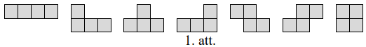

<small>

* questionType:
* domain:

</small>

## Atrisinājums

**(A)** Visas septiņas dotās figūras kopā satur $28$ rūtiņas, tātad taisnstūra 
laukumam arī jābūt $28$ rūtiņām. Vienīgie iespējamie taisnstūra izmēri ir 
$1 \times 28$ (neder), $2 \times 14,\ 4 \times 7$. Izkrāsojot taisnstūrus kā 
šaha galdiņu, katrā no tiem melno un balto rūtiņu skaits ir vienāds. Ja visas 
dotās figūras izkrāsotu kā šaha galdiņu, tad tās visas, izņemot trešo, saturēu 
tieši divas katras krāsas rūtiņas. Trešā figūra saturētu trīs vienas krāsas un 
vienu otras krāsas rūtiņu (skat. A1.att.). Tātad, saskaitot balto un melno 
rūtiņu skaitu pa visām septiņām figūrām, iegūtu, ka vienas krāsas rūtiņu ir par
divām vairāk nekā otras krāsas rūtiņu. Līdz ar to, izmantojot visas septiņas 
dotās figūras, taisnstūri izveidot nav iespējams.

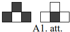

**(B)** Ja neizmanto trešo figūru, tad taisnstūri ir iespējams izveidot (skat.,
piemēram, A2.att.).

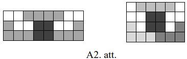

# <lo-sample/> LV.VOL.2015.9.3

Aija izvēlas naturālu skaitli $n \leq 100$ un veido skaitļu virkni, kur katru 
nākamo virknes locekli iegūst pēc šāda likuma:

- ja $2 n \leq 100$, tad virknes nākamais loceklis ir $2n$;
- ja $2 n>100$, tad virknes nākamais loceklis ir $2n-100$.

Ja virknē vēl kādreiz parādās skaitlis $n$, tad skaitli $n$ sauksim par 
*patīkamu*. Cik pavisam ir *patīkamu* skaitļu, kas nepārsniedz $100$?

Piemēram, skaitlis $40$ ir *patīkams*, jo $40;\ 80;\ 60;\ 20;\ 40;\ \ldots$, bet 
$25$ - nav, jo $25;\ 50;\ 100;\ 100;\ \ldots$ (tālāk virknē nav skaitļu, kas 
atšķirīgi no $100$).

<small>

* questionType:
* domain:

</small>

## Atrisinājums

Ir $25$ skaitļi, kas nepārsniedz $100$ un dalās ar $4$. Parādīsim, ka visi šie 
skaitļi ir *patīkami*. Katrs no tiem pieder vienam no trim cikliem:

$100 \rightarrow 100$;

$20 \rightarrow 40 \rightarrow 80 \rightarrow 60 \rightarrow 20$;

$4 \rightarrow 8 \rightarrow 16 \rightarrow 32 \rightarrow 64 \rightarrow 28 \rightarrow 56 \rightarrow 12 \rightarrow 24 \rightarrow 48 \rightarrow 96 \rightarrow 92 \rightarrow 84 \rightarrow 68 \rightarrow 36 \rightarrow 72 \rightarrow 44 \rightarrow 88 \rightarrow 76 \rightarrow 52 \rightarrow 4$

Pierādīsim, ka tie skaitļi, kas nedalās ar $4$, nevar būt *patīkami*. Šķirojam 
divus gadījums.

- Nepāra skaitļi nevar būt *patīkami*, jo visi nākamie virknes locekļi būs tikai 
  pāra skaitļi un, tātad, sākotnējā $n$ vērtība tajā atkārtoti parādīties nevar.
- Pāra skaitļi, kas nedalās ar $4$, var pierakstīt formā $n=4k+2$. Šajā 
  gadījumā otrais virknes loceklis būs vai nu $2 \cdot(4k+2)=4 \cdot(2k+1)$, 
  vai $2 \cdot(4k+2)-100=4 \cdot(2k-24)$. Abos gadījumos virknes otrais 
  loceklis dalās ar $4$ un tas ir uzrakstāms formā $4m$. Visi nākamie virknes 
  locekļi arī dalīsies ar $4$, jo vai nu $2 \cdot 4m=8m$, vai 
  $2 \cdot 4m-100=4 \cdot(2m-25)$. Līdz ar to virknē nevar atkārtoti parādīties
  skaitlis, kas nedalās ar $4$, un skaitlis $n=4k+2$ nav *patīkams*.

Tātad pavisam ir $25$ *patīkami* skaitļi.

## Atrisinājums

Ir $25$ skaitļi, kas nepārsniedz $100$ un dalās ar $4$. Parādīsim, ka visi šie 
skaitļi ir *patīkami*. Ja skaitlis $x$ dalās ar $4$, tad gan $2x$, gan $2x-100$ 
arī dalīsies ar $4$. Aplūkosim virkni, sākot ar patvaļīgu skaitli $x_{1}$, kas 
dalās ar $4$: $x_{1},\ x_{2},\ x_{3},\ \ldots$ Tā kā ir tikai $25$ skaitļi, kas
tajā var parādīties, tad skaidrs, ka kādā brīdī virknes locekļi sāks 
atkārtoties. Aplūkosim pirmo skaitli virknē, kas atkārtojas, tas ir, tādu 
$x_{j+1}$, ka visi iepriekšējie $x_{1},\ x_{2},\ \ldots,\ x_{j}$ ir dažādi, bet
$x_{j+1}$ ir vienāds ar kādu no tiem. Pierādīsim, ka $x_{j+1}=x_{1}$, ar to arī
būs pierādīts, ka skaitlis $x_{1}$ ir *patīkams*. Pieņemsim pretējo, ka 
$x_{j+1}=x_{k+1}$ un aplūkosim, kādi varēja būt iepriekšējie skaitļi $x_{j}$ un
$x_{k}$. Tā kā tiem jābūt dažādiem, tad skaidrs, ka $x_{j+1}$ un $x_{k+1}$ tika
iegūti ar dažādām darbībām, tas ir, $x_{j+1}=2x_{j}$ un $x_{k+1}=2x_{k}-100$ 
(vai otrādi), kas nozīmē, ka $2x_{j}=2x_{k}-100$ jeb $x_{k}-x_{j}=50$ un tā ir 
pretruna, jo gan $x_{j}$, gan $x_{k}$ dalās ar $4$, bet $50$ nedalās ar $4$.

Vēl jāpierāda, ka pārējie skaitļi nav *patīkami*. Skaidrs, ka nepāra skaitļi nav 
*patīkami*, jo, ja $x$ ir nepāra skaitlis, tad gan $2x$, gan $2x-100$ ir pāra 
skaitļi un tālāk virknē visi skaitļi būs pāra.

Ja skaitlis $x$ dalās ar $2$, bet nedalās ar $4$, tad $x$ nav *patīkams*, jo, gan
$2x$, gan $2x-100$ dalās ar $4$ un tālāk virknē visi skaitļi dalīsies ar $4$.

# <lo-sample/> LV.VOL.2015.9.4

Trijstūrī $ABC$ novilkta bisektrise $BL$ ($L$ atrodas uz malas $AC$), tā krusto
taisni, kas no $A$ vilkta paralēli $BC$, punktā $K$. Zināms, ka $LK=AB$. 
Pierādīt, ka $AB>BC$ !

<small>

* questionType:
* domain:

</small>

## Atrisinājums

Tā kā $\sphericalangle LBC=\sphericalangle LBA$ pēc bisektrises definīcijas un 
$\sphericalangle LBC=\sphericalangle AKB$ kā iekšējie šķērsleņķi pie paralēlām 
taisnēm $BC$ un $AK$, tad $\sphericalangle LBA=\sphericalangle AKB$ un 
trijstūris $AKB$ ir vienādsānu, pie kam $AB=AK$ (skat. A3.att.). Arī trijstūris
$AKL$ ir vienādsānu, jo pēc dotā un iepriekš iegūtā $LK=AB=AK$. Vienādsānu 
trijstūrim leņķi pie pamata ir vienādi, tāpēc 
$\sphericalangle ALK=\sphericalangle LAK$.

Tā kā $\sphericalangle ALK=\sphericalangle BLC$ kā krustleņķi un 
$\sphericalangle LAK=\sphericalangle ACB$ kā iekšējie šķērsleņķi pie paralēlām 
taisnēm $BC$ un $AK$, tad $\sphericalangle BLC=\sphericalangle BCL$ un 
trijstūris $LBC$ ir vienādsānu, pie kam $BL=BC$.

No trijstūra nevienādības $AB+AK>BK=BL+LK=BC+AK$ un no tā seko, ka $AB>BC$.

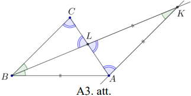

# <lo-sample/> LV.VOL.2015.9.5

Kāda ir izteiksmes $a^{20}+a^{4}+\frac{1}{a^{4}+1}$ mazākā iespējamā vērtība, 
ja $a$ ir reāls skaitlis?

<small>

* questionType:
* domain:

</small>

## Atrisinājums

Dotās izteiksmes mazākā iespējamā vērtība ir $1$, to iegūst, ja $a=0$. 
Pamatosim, ka mazāku vērtību nevar iegūt.

Ekvivalenti pārveidojam doto izteiksmi: 
$a^{20}+a^{4}+\frac{1}{a^{4}+1}=a^{20}+\frac{a^{8}+a^{4}+1}{a^{4}+1}=a^{20}+\frac{a^{8}}{a^{4}+1}+1$.

Pirmie divi saskaitāmie ir nenegatīvi, tātad šīs izteiksmes vērtība ir vismaz $1$.

## Atrisinājums

Dotās izteiksmes mazākā iespējamā vērtība ir $1$, to iegūst, ja $a=0$. 
Pamatosim, ka mazāku vētību nevar iegūt.

Ekvivalenti pārveidojam doto izteiksmi: 
$a^{20}+a^{4}+\frac{1}{a^{4}+1}=a^{20}-1+\left(a^{4}+1\right)+\frac{1}{a^{4}+1}$.

No sakarības starp vidējo aritmētisko un vidējo ģeometrisko izriet, ka

$$\left(a^{4}+1\right)+\frac{1}{a^{4}+1} \geq 2 \cdot \sqrt{\left(a^{4}+1\right) \cdot \frac{1}{a^{4}+1}}=2$$

Tā kā $a^{20} \geq 0$, tad iegūstam 
$a^{20}+a^{4}+\frac{1}{a^{4}+1} \geq 0-1+2=1$. Tātad dotās izteiksmes vērtība 
ir vismaz $1$.

# <lo-sample/> LV.VOL.2015.10.1

Kvadrātvienādojuma

$$(1+\sqrt{5}) x^{2}-\sqrt[4]{\frac{7}{3+\sqrt{5}}} \cdot(1+\sqrt{5})^{2} x+\sqrt[4]{\frac{7}{3+\sqrt{5}}}=0$$

saknes ir skaitļi $a$ un $b$. Pierādīt, ka izteiksmes 
$a^{4}b+ab^{4}+3a^{3}b^{2}+3a^{2}b^{3}$ vērtība ir vesels skaitlis!

<small>

* questionType:
* domain:

</small>

## Atrisinājums

No Vjeta teorēmas izriet, ka

$$\left\{\begin{array}{l}
a+b=\sqrt[4]{\frac{7}{3+\sqrt{5}}} \cdot(1+\sqrt{5}) \\
ab=\sqrt[4]{\frac{7}{3+\sqrt{5}}} \cdot \frac{1}{1+\sqrt{5}}
\end{array}\right.$$

Pārveidojam doto izteiksmi:

$a^{4}b+ab^{4}+3a^{3}b^{2}+3a^{2}b^{3}=ab\left(a^{3}+b^{3}+3a^{2}b+3ab^{2}\right)=ab(a+b)^{3}=$

$=\sqrt[4]{\frac{7}{3+\sqrt{5}}} \cdot \frac{1}{1+\sqrt{5}} \cdot \sqrt[4]{\left(\frac{7}{3+\sqrt{5}}\right)^{3}} \cdot(1+\sqrt{5})^{3}=\frac{7}{3+\sqrt{5}} \cdot(1+\sqrt{5})^{2}=$

$=\frac{7 \cdot(1+2 \sqrt{5}+5)}{3+\sqrt{5}}=\frac{7 \cdot 2 \cdot(3+\sqrt{5})}{3+\sqrt{5}}=14$.

Tā kā skaitlis $14$ ir vesels skaitlis, tad prasītais ir pierādīts.

# <lo-sample/> LV.VOL.2015.10.2

Pierādīt, ka katram naturālam $n$ izteiksme $3n^{5}+5n^{4}-8n$ dalās ar $10$.

<small>

* questionType:
* domain:

</small>

## Atrisinājums

Izmantosim matemātiskās indukcijas principu.

*Indukcijas bāze.* Ja $n=1$, tad $3+5-8=0$ dalās ar $10$.

*Induktīvais pieņēmums.* Pieņemsim, ja $n=k$, tad $3k^{5}+5k^{4}-8k$ dalās ar 
$10$.

*Induktīvā pāreja.* Pierādīsim, ja $n=k+1$, tad $3(k+1)^{5}+5(k+1)^{4}-8(k+1)$ 
dalās ar $10$.

Ekvivalenti pārveidojam izteiksmi $3(k+1)^{5}+5(k+1)^{4}-8(k+1)$ :

$$\begin{aligned}
& 3\left(k^{5}+5k^{4}+10k^{3}+10k^{2}+5k+1\right)+5\left(k^{4}+4k^{3}+6k^{2}+4k+1\right)-8(k+1)= \\
& =3k^{5}+20k^{4}+50k^{3}+60k^{2}+27k=3k^{5}+5k^{4}-8k+15k^{4}+50k^{3}+60k^{2}+35k= \\
& =3k^{5}+5k^{4}-8k+5k \cdot\left(3k^{3}+10k^{2}+12k+7\right)
\end{aligned}$$

Saskaitāmais $3k^{5}+5k^{4}-8k$ dalās ar $10$ pēc induktīvā pieņēmuma.

Saskaitāmais $5k \cdot\left(3k^{3}+10k^{2}+12k+7\right)$ dalās ar $5$, jo satur
reizinātāju $5$, un dalās ar $2$, jo

- ja $k$ ir pāra skaitlis, tad reizinātājs $k$ dalās ar $2$;
- ja $k$ ir nepāra skaitlis, tad reizinātājs $3k^{3}+10k^{2}+12k+7$ ir pāra 
  skaitlis un tas dalās ar $2$.

Tā kā izteiksme $3(k+1)^{5}+5(k+1)^{4}-8(k+1)$ dalās gan ar $2$, gan ar $5$, 
tad tā dalās arī ar $10$ un līdz ar to esam pierādījuši, ka 
$3(k+1)^{5}+5(k+1)^{4}-8(k+1)$ dalās ar $10$.

No matemātiskās indukcijas principa izriet, ka katram naturālam $n$ izteiksme 
$3n^{5}+5n^{4}-8n$ dalās ar $10$, kas arī bija jāpierāda.

## Atrisinājums

Pārveidojam doto izteiksmi:

$$\begin{aligned}
& 3n^{5}+5n^{4}-8n=n\left(3n^{4}-3n^{3}+8n^{3}-8\right)=n\left(3n^{3}(n-1)+8\left(n^{3}-1\right)\right)= \\
& =n\left(3n^{3}(n-1)+8(n-1)\left(n^{2}+n+1\right)\right)=n(n-1)\left(3n^{3}+8\left(n^{2}+n+1\right)\right)
\end{aligned}$$

Viens no reizinātājiem $n$ vai $n-1$ ir pāra skaitlis, tāpēc noteikti dotā 
izteiksme dalās ar $2$. Vēl jāpierāda, ka dotā izteiksme dalās ar $5$.

Skaitli $n$ dalot ar $5$, iespējamas piecas dažādas atlikumu vērtības: 
$0,\ 1,\ 2,\ 3,\ 4$. Apskatām visus gadījumus:

- $n=5k$, tad reizinātās $n$ dalās ar $5$;
- $n=5k+1$, tad reizinātājs $n-1$ dalās ar $5$;
- $n=5k+2$ jeb $n \equiv 2(\bmod 5)$, tad

$$3n^{3}+8 \cdot\left(n^{2}+n+1\right) \equiv 3 \cdot 8+8 \cdot(4+2+1) \equiv 4+1 \equiv 0(\bmod 5)$$

- $n=5k+3$ jeb $n \equiv 3(\bmod 5)$, tad

$$3n^{3}+8 \cdot\left(n^{2}+n+1\right) \equiv 3 \cdot 27+8 \cdot(9+3+1) \equiv 1+4 \equiv 0(\bmod 5)$$

- $n=5k+4$ jeb $n \equiv 4(\bmod 5)$, tad

$$3n^{3}+8 \cdot\left(n^{2}+n+1\right) \equiv 3 \cdot 64+8 \cdot(16+4+1) \equiv 2+3 \equiv 0(\bmod 5)$$

Esam ieguvuši, ka visos gadījumos dotā izteiksme dalās gan ar $2$, gan ar $5$, 
tātad tā dalās ar $10$.

# <lo-sample/> LV.VOL.2015.10.3

Pozitīviem skaitļiem $a,\ b,\ c,\ d,\ e,\ f$ ir spēkā sakarības 
$a^{2}+b^{2}=c^{2}$ un $d^{2}+e^{2}=f^{2}$. Pierādīt, ka 
$(a+d)^{2}+(b+e)^{2} \leq(c+f)^{2}$.

<small>

* questionType:
* domain:

</small>

## Atrisinājums

Tā kā visi dotie skaitļi ir pozitīvi, varam tos uztvert kā nogriežņu garumus.

Apskatām taisnleņķa trijstūri $KLM$ ar katešu garumiem $KL=a+d$ un $KM=e+b$ 
(skat. A4.att.). Novelkam nogriežņus $NO \parallel KM$ un $OP \parallel KL$ tā,
ka $KN=OP=a$ un $KP=NO=e$. No dotajām sakarībām un Pitagora teorēmas trijstūros
$OPM$ un $LNO$, iegūstam, ka $OM=c$ un $LO=f$.

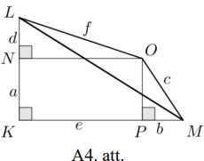

Aprēķinām trijstūra $KLM$ hipotenūzas garumu: $LM=\sqrt{(a+d)^{2}+(b+e)^{2}}$. 
No trijstūra nevienādības trijstūrī $LMO$ izriet, ka 
$\sqrt{(a+d)^{2}+(b+e)^{2}} \leq c+f$. Tā kā abas nevienādības puses ir 
pozitīvas, tad, kāpinot kvadrātā, iegūst $(a+d)^{2}+(b+e)^{2} \leq(c+f)^{2}$, 
kas arī bija jāpierāda.

## Atrisinājums

Aplūkojam vektorus $\vec{x}=(a; b)$ un $\vec{y}=(d; e)$, tad

$|\vec{x}|=\sqrt{a^{2}+b^{2}}=\sqrt{c^{2}}=c$ un $|\vec{y}|=\sqrt{d^{2}+e^{2}}=\sqrt{f^{2}}=f$  
$\vec{x}+\vec{y}=(a+d; b+e)$ un $|\vec{x}+\vec{y}|=\sqrt{(a+d)^{2}+(b+e)^{2}}$

Tad izteiksmi $(a+d)^{2}+(b+e)^{2} \leq(c+f)^{2}$ var pārrakstīt 
$|\vec{x}+\vec{y}|^{2} \leq(|\vec{x}|+|\vec{y}|)^{2}$, kas ir patiesa, jo 
jebkuriem diviem vektoriem $|\vec{x}+\vec{y}| \leq|\vec{x}|+|\vec{y}|$.

# <lo-sample/> LV.VOL.2015.10.4

Pierādīt, ka regulāram desmitstūrim $A_{1}A_{2} \ldots A_{10}$ ir spēkā 
sakarība $A_{1}A_{2}+R=A_{1}A_{4}$, kur $R$ ir tam apvilktās riņķa līnijas 
rādiuss!

<small>

* questionType:
* domain:

</small>

## Atrisinājums

Regulāram desmitstūrim $A_{1}A_{2} \ldots A_{10}$ apvilktās riņķa līnijas 
centru apzīmēsim ar $O$ (skat. A5.att.). Regulāra desmitstūra katra mala savelk
$360^{\circ}:10=36^{\circ}$ lielu loku. Tad 
$\sphericalangle A_{1}A_{2}A_{7}=\frac{1}{2} \cup A_{1}A_{9}A_{7}=72^{\circ}$ 
un $\sphericalangle A_{2}A_{1}A_{4}=\frac{1}{2} \cup A_{2}A_{3}A_{4}=36^{\circ}$
ka ievilktie leņķi un 
$\sphericalangle A_{2}OA_{4}=\cup A_{2}A_{3}A_{4}=72^{\circ}$ kā centra leņķis.
No $\triangle A_{1}A_{2}B$ iegūstam, ka 
$\sphericalangle A_{1}BA_{2}=180^{\circ}-36^{\circ}-72^{\circ}=72^{\circ}$.

Ievērojam, ka $\sphericalangle OBA_{4}=\sphericalangle A_{1}BA_{2}=72^{\circ}$ 
kā krustleņķi. Tātad $\triangle A_{1}A_{2}B$ un $\triangle OA_{4}B$ ir 
vienādsānu, jo leņķi pie pamata ir vienādi, līdz ar to $A_{1}A_{2}=A_{1}B$ un 
$BA_{4}=OA_{4}=R$. Tad $A_{1}A_{2}+R=A_{1}B+BA_{4}=A_{1}A_{4}$, kas arī bija 
jāpierāda.

## Atrisinājums

Regulāram desmitstūrim $A_{1}A_{2} \ldots A_{10}$ apvilktās riņķa līijas centru
apzīmēsim ar $O$ (skat. A6.att.). Regulāra desmitstūra visas malas savelk 
vienāda lieluma lokus. Diagonāles $A_{1}A_{2}$, $A_{3}A_{10}$ un $A_{4}A_{9}$ 
ir savā starpā paralēlas, jo starp paralēlām hordām ir vienādi loki. Līdzīgi 
paralēlas ir arī diagonāles $A_{2}A_{3},\ A_{1}A_{4}$ un $A_{5}A_{10}$, pie kam
$A_{3}A_{10}=A_{1}A_{4}$, jo vienādus lokus savelk vienādas hordas.

Nogriežņi $A_{4}A_{9}$ un $A_{5}A_{10}$ ir diametri. Nogriežņu $A_{1}A_{4}$ un 
$A_{3}A_{10}$ krustpunktu apzīmējam ar $X$. Četrstūri $A_{1}A_{2}A_{3}X$ un 
$A_{10}XA_{4}O$ ir paralelogrami, jo to pretējās malas ir pa pāriem paralēlas. 
Tātad $A_{1}A_{2}=XA_{3}$ un $OA_{4}=XA_{10}=R$. Tātad 
$A_{1}A_{2}+OA_{4}=A_{3}A_{10}$ jeb $A_{1}A_{2}+R=A_{1}A_{4}$, kas arī bija 
jāpierāda.

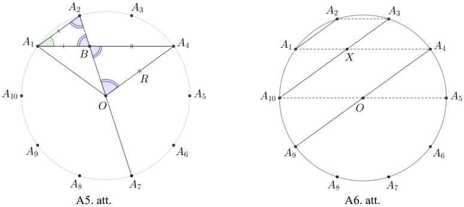

# <lo-sample/> LV.VOL.2015.10.5

**(A)** Pierādīt, ka, izmantojot visas piecas dotās figūras (skat. 2.att.), 
katru tieši vienu reizi, nav iespējams salikt taisnstūri!

**(B)** Vai, izmantojot četras no dotajām figūrām, katru tieši vienu reizi, var
salikt taisnstūri?

Visas figūras sastāv no vienādiem kvadrātiem. Figūras drīkst pagriezt vai 
apmest otrādi. Taisnstūrī nedrīkst būt caurumi, un figūras nedrīkst pārklāties.

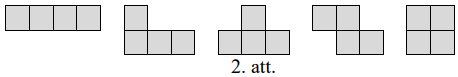

<small>

* questionType:
* domain:

</small>

## Atrisinājums

**(A)** Visas piecas dotās figūras kopā satur $20$ rūtiņas, tātad taisnstūra 
laukumam arī jābūt $20$ rūtiņām. Vienīgie iespējamie taisnstūra izmēri ir 
$1 \times 20$ (neder), $2 \times 10,\ 4 \times 5$. Izkrāsojot taisnstūrus kā 
šaha galdiņu, katrā no tiem melno un balto rūtiņu skaits ir vienāds. Ja visas 
dotās figūras izkrāsotu kā šaha galdiņu, tad tās visas, izņemot trešo, saturētu
tieši divas katras krāsas rūtiņas. Trešā figūra saturētu trīs vienas krāsas un 
vienu otras krāsas rūtiņu (skat. A7.att.). Tātad, saskaitot balto un melno 
rūtiņu skaitu pa visām piecām figūrām, iegūtu, ka vienas krāsas rūtiņu ir par 
divām vairāk kā otras krāsas rūtiņu. Līdz ar to, izmantojot visas piecas dotās 
figūras, taisnstūri izveidot nav iespējams.

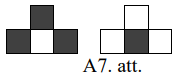

**(B)** Četras no dotajām figūrām kopā satur $16$ rūtiņas, tātad taisnstūra 
laukumam arī jābūt $16$ rūtiņām. Vienīgie iespējamie taisnstūra izmēri ir 
$1 \times 16$ (neder), $2 \times 8,\ 4 \times 4$. Spriežot līdzīgi kā (A) 
gadījumā, secinām, ka nevar izmantot A7.att. redzamo figūru. Apskatīsim 
atlikušās četras figūras.

Izkrāsosim taisnstūrus joslās (skat. A8.att.).

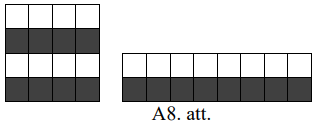

Ievērojam, ka katrā taisnstūrī melno un balto rūtiņu skaits ir vienāds. Ja arī 
figūras izkrāsotu joslās, tad tās visas, izņemot otro, saturētu tieši divas 
katras krāsas rūtiņas. Otrā figūra saturētu trīs vienas krāsas un vienu otras 
krāsas rūtiņu (skat. A9.att.). Tātad, saskaitot balto un melno rūtiņu skaitu pa
visām četrām figūrām, iegūtu, ka vienas krāsas rūtiņu ir par divām vairāk kā 
otras krāsas rūtiņu. Līdz ar to, izmantojot četras no dotajām figūrām, 
taisnstūri izveidot nav iespējams.

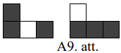

# <lo-sample/> LV.VOL.2015.11.1

Kvadrātvienādojuma

$$(1+\sqrt{5}) x^{2}-\sqrt[4]{7} \cdot(1+\sqrt{5})^{2} x+\sqrt[4]{7}=0$$

saknes ir skaitļi $a$ un $b$. Pierādīt, ka izteiksmes 
$a^{4}b+ab^{4}+3a^{3}b^{2}+3a^{2}b^{3}+16a^{4}b^{3}+16a^{3}b^{4}$ vērtība ir 
vesels skaitlis!

<small>

* questionType:
* domain:

</small>

## Atrisinājums

No Vjeta teorēmas izriet, ka

$$\left\{\begin{array}{l}
a+b=\sqrt[4]{7} \cdot(1+\sqrt{5}) \\
ab=\frac{\sqrt[4]{7}}{1+\sqrt{5}}
\end{array}\right.$$

Pārveidojam doto izteiksmi:

$a^{4}b+ab^{4}+3a^{3}b^{2}+3a^{2}b^{3}+16a^{4}b^{3}+16a^{3}b^{4}=ab\left(a^{3}+b^{3}+3a^{2}b+3ab^{2}+16a^{3}b^{2}+16a^{2}b^{3}\right)=$  
$=ab\left((a+b)^{3}+16a^{2}b^{2}(a+b)\right)=\frac{\sqrt[4]{7}}{1+\sqrt{5}} \cdot\left(\sqrt[4]{7^{3}} \cdot(1+\sqrt{5})^{3}+16 \cdot \frac{\sqrt[4]{7^{2}} \cdot \sqrt[4]{7} \cdot(1+\sqrt{5})}{(1+\sqrt{5})^{2}}\right)=$

$=7 \cdot(1+\sqrt{5})^{2}+\frac{16 \cdot 7}{(1+\sqrt{5})^{2}}=7 \cdot\left((6+2 \sqrt{5})+\frac{16}{6+2 \sqrt{5}}\right)=$

$=7 \cdot \frac{36+24 \sqrt{5}+20+16}{6+2 \sqrt{5}}=7 \cdot 12 \cdot \frac{6+2 \sqrt{5}}{6+2 \sqrt{5}}=84.$

Tā kā skaitlis $84$ ir vesels skaitlis, tad prasītais ir pierādīts.

# <lo-sample/> LV.VOL.2015.11.2

Vai uz rūtiņu lapas var uzzīmēt $1612$ - stūri, kura laukums ir $2015$ rūtiņas 
un kura malas iet pa rūtiņu līnijām?

<small>

* questionType:
* domain:

</small>

## Atrisinājums

Jā, šādu daudzstūri var uzzīmēt (skat., piemēram, A10.att.).

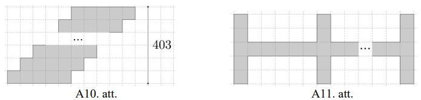

Figūras būvēšanai izmantoti $403$ taisnstūri ar izmēriem $1 \times 5$ rūtiņas. 
Tātad iegūtā daudzstūra laukums ir $5 \cdot 403=2015$ rūtiņas. Tā kā katrs 
taisnstūris satur tieši četras iegūtā daudzstūra malas, tad uzzīmēts ir 
$4 \cdot 403=1612$ - stūris.

*Piezīme.* Daudzstūri var uzzīmēt arī, piemēram, kā A11.att.

# <lo-sample/> LV.VOL.2015.11.3

Pirātam Džonam Silveram kajītē ir $38$ papagaiļi un $39$ papagaiļu krātiņi. 
Katram papagailim ir savs krātiņš un vēl viens krātiņš stāv tukšs. Kādu dienu 
vētras laikā tie visi izmuka, tika noķerti un uz ātru roku salikti atpakaļ 
krātiņos (katrā krātiņā ne vairāk kā viens), bet ne obligāti savos. Vienā 
gājienā Džons Silvers var paņemt vienu papagaili un pārlikt uz to krātiņu, kurš
dotajā brīdī ir tukšs. Kāds ir mazākais gājienu skaits, ar kuru viņam noteikti 
pietiek, lai panāktu, ka visi papagaiļi atrodas savos sākotnējos krātiņos?

<small>

* questionType:
* domain:

</small>

## Atrisinājums

Apzīmēsim papagaiļus ar numuriem no $1$ līdz $38$ un krātiņus ar numuriem no 
$1$ līdz $39$ tā, ka sākotnēji papagaiļa numurs sakrīt ar krātiņa numuru. 
Vienkāršības dēļ tukšajā vietā sākumā ieliksim iedomātu papagaili ar numuru 
$39$. N̦emsim patvaļīgu papagaili $a_{1}$, kas neatrodas savā krātiņā, 
pieņemsim, ka tas atrodas krātiņā $a_{2}$. Tad $a_{2}$ arī neatrodas savā vietā
un atrodas kādā vietā $a_{3}$, utt, līdz papagailis $a_{n}$ atrodas vietā 
$a_{1}(2 \leq n \leq 39)$. Tādā veidā visi papagaiļi sadalās ciklos. Ja ciklā 
ir $n$ papagaiļi, tad šī cikla sakārtošanai nepieciešams tieši

**(A)** $n-1$ gājiens, ja tajā ietilpst tukšais krātiņš. Tad tur ir $n-1$ 
papagailis un ar katru gājienu ne vairāk kā vienu var ielikt savā krātiņā, 
tātad mazāk gājienu nevar būt. Ar $n-1$ gājienu pietiek, jo vienmēr būs kāds 
papagailis, kuru ielikt savā vietā;  
**(B)** $n+1$ gājiens, ja tajā neietilpst tukšais krātiņš. Ar pirmo gājienu 
nevienu papagaili nevar ielikt savā vietā un ar katru nākamo gājienu ne vairāk 
kā vienu papagaili var ielikt savā vietā, tāpēc mazāk būt nevar. Pirmajā 
gājienā jebkuru papagaili pārceļ uz tukšo krātiņu, atlikušos $n-1$ sakārto kā 
(A) gadījumā ar $n-1$ gājienu un pēdējā gājienā ieceļ savā vietā to, kuru 
pārcēla pirmo.

Tātad kopējais nepieciešamais gājienu skaits ir

- papagaiļu skaits + ciklu skaits, ja nevienā ciklā neietilpst tukšais krātiņš
- papagaiļu skaits + ciklu skaits - $1$, ja kādā ciklā ietilpst tukšais 
  krātiņš.

Redzams, ka maksimālais gājienu skaits būs nepieciešams tad, kad ciklu skaits 
ir maksimālais un nevienā ciklā neietilpst tukšais krātiņš. Minimālais 
papagaiļu skaits ciklā ir $2$, tāpēc maksimālais ciklu skaits ir $38:2=19$, 
tātad maksimālais gājienu skaits, kāds var būt nepieciešams, ir $38+19=57$ 
gājieni. Redzam: ja papagaiļus samaina vietām pa pāriem, tad tieši tik daudz 
gājieni arī ir vajadzīgi.

# <lo-sample/> LV.VOL.2015.11.4

Naturāli skaitļi $a,\ b$ un $c$ ir savstarpēji pirmskaitļi un visi ir lielāki 
nekā $50$. Zināms, ka $a+b$ dalās ar $c$ un $b+c$ dalās ar $a$. Atrast mazāko 
iespējamo $b$ vērtību!

<small>

* questionType:
* domain:

</small>

## Atrisinājums

Mazākā iespējamā $b$ vērtība ir $2549$. Pierādīsim, ka mazāku $b$ vērtību nav 
iespējams atrast.

Skaitlis $a+b+c$ dalās gan ar $a$ gan ar $c$, tātad $a+b+c$ dalās ar $ac$ (jo 
tie ir savstarpēji pirmskaitļi). Tātad $a+b+c \geq ac$ jeb 
$b \geq ac-a-c=ac-a-c+1-1=(a-1)(c-1)-1$. Līdz ar to mazākā $b$ vērtība ir 
gadījumā, ja $a=51$ un $c=52$ (vai otrādi), t. i., $b=50 \cdot 51-1=2549$. 
Skaitļi, $51,\ 2549,\ 52$ apmierina dotos nosacījumus.

# <lo-sample/> LV.VOL.2015.11.5

Pierādīt, ka regulāram četrpadsmitstūrim $A_{1}A_{2} \ldots A_{14}$ ir spēkā 
sakarība $A_{1}A_{2}+A_{1}A_{6}=A_{1}A_{4}+R$, kur $R$ ir tam apvilktās riņķa 
līnijas rādiuss!

<small>

* questionType:
* domain:

</small>

## Atrisinājums

Regulāram četrpadsmitstūrim $A_{1}A_{2} \ldots A_{14}$ apvilktās riņķa līijas 
centru apzīmēsim ar $O$ (skat. A12.att.). Regulāra četrpadsmitstūra katras 
malas savilkto loku apzīmējam ar $\alpha=360^{\circ}:14$.

Tad $\sphericalangle A_{2}A_{1}A_{4}=\sphericalangle A_{4}A_{3}A_{6}=\sphericalangle A_{6}A_{1}A_{8}=\alpha$
un $\sphericalangle A_{1}A_{2}A_{9}=\sphericalangle A_{3}A_{4}A_{11}=3 \alpha$ 
kā ievilktie leņķi un $\sphericalangle A_{1}OA_{4}=3 \alpha$ kā centra leņķis.

Ievērojam, ka $180^{\circ}=7 \alpha$. No $\triangle A_{1}A_{2}B$ iegūstam, ka 
$\sphericalangle A_{1}BA_{2}=7 \alpha-\alpha-3 \alpha=3 \alpha$, līdzīgi no 
$\triangle A_{3}A_{4}C$ iegūst $\sphericalangle A_{3}CA_{4}=3 \alpha$ un no 
$\triangle A_{1}OD$ iegūst $\sphericalangle A_{1}DO=3 \alpha$. Ievērojam, ka 
$\sphericalangle A_{1}DO=\sphericalangle A_{6}DC=3 \alpha$ un 
$\sphericalangle A_{3}CA_{4}=\sphericalangle DCA_{6}=3 \alpha$ kā krustleņķi. 
Tātad $\triangle A_{1}A_{2}B, \triangle A_{3}A_{4}C$, $\triangle OA_{1}D$ un 
$\triangle A_{6}CD$ ir vienādsānu, jo leņķi pie pamata ir vienādi. Līdz ar to 
$A_{1}B=A_{1}A_{2}=A_{3}A_{4}=A_{3}C$ un $A_{1}O=A_{1}D=R$, un $A_{6}D=A_{6}C$.

Tad $A_{1}A_{2}+A_{1}A_{6}=A_{1}B+A_{1}D+DA_{6}=A_{3}C+R+CA_{6}=A_{3}A_{6}+R=A_{1}A_{4}+R$,
kas arī bija jāpierāda.

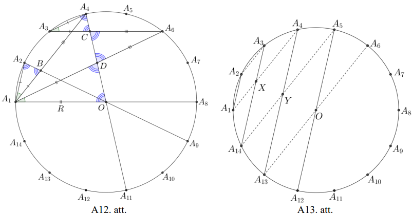

## Atrisinājums

Regulāram četrpadsmitstūrim $A_{1}A_{2} \ldots A_{14}$ apvilktās riņķa līnijas 
centru apzīmēsim ar $O$ (skat. A13.att.). Regulāra četrpadsmitstūra visas malas
savelk vienāda lieluma lokus. Diagonāles 
$A_{1}A_{2},\ A_{3}A_{14},\ A_{4}A_{13}$ un $A_{5}A_{12}$ ir savā starpā 
paralēlas, jo starp paralēlām hordām ir vienādi loki. Līdzīgi paralēlas ir arī 
diagonāles $A_{2}A_{3},\ A_{1}A_{4},\ A_{5}A_{14}$ un $A_{6}A_{13}$, pie kam 
$A_{3}A_{14}=A_{1}A_{4}$ un $A_{4}A_{13}=A_{5}A_{14}$, jo vienādus lokus savelk
vienādas hordas.

Nogriežņi $A_{5}A_{12}$ un $A_{6}A_{13}$ ir diametri. Nogriežņu $A_{1}A_{4}$ un
$A_{5}A_{14}$ krustpunktu apzīmēsim ar $Y$. Četrstūris $XA_{4}YA_{14}$ ir 
paralelograms, jo tā pretējās malas ir pa pāriem paralēlas. Tātad 
$A_{1}A_{2}=XA_{3}$ un $XA_{14}=A_{3}A_{14}-A_{1}A_{2}=A_{1}A_{4}-A_{1}A_{2}$.

Nogriežņu $A_{4}A_{13}$ un $A_{3}A_{14}$ krustpunktu apzīmēsim ar $X$. 
Četrstūris $A_{1}A_{2}A_{3}X$ ir paralelograms, jo tā pretējās malas ir pa 
pāriem paralēlas. Tātad $A_{4}Y=A_{14}X$ un 
$YA_{13}=A_{4}A_{13}-XA_{14}=A_{1}A_{6}-A_{1}A_{4}+A_{1}A_{2}$.

Četrstūris $A_{13}YA_{5}O$ arī ir paralelograms un $OA_{5}=YA_{13}=R$. Tātad 
$A_{1}A_{6}-A_{1}A_{4}+A_{1}A_{2}=R$ jeb $A_{1}A_{2}+A_{1}A_{6}=A_{1}A_{4}+R$, 
kas arī bija jāpierāda.

# <lo-sample/> LV.VOL.2015.12.1

Zināms, ka $\frac{\cos 3x}{\cos x}=\frac{1}{2015}$. Aprēķināt 
$\frac{\sin 3x}{\sin x}$ vērtību!

<small>

* questionType:
* domain:

</small>

## Atrisinājums

Aplūkosim starpību

$$\frac{\sin 3x}{\sin x}-\frac{\cos 3x}{\cos x}=\frac{\sin 3x \cos x-\cos 3x \sin x}{\sin x \cdot \cos x}=\frac{\sin (3x-x)}{\sin x \cdot \cos x}=\frac{\sin 2x}{\sin x \cdot \cos x}=\frac{2 \sin x \cdot \cos x}{\sin x \cdot \cos x}=2$$

Tātad $\frac{\sin 3x}{\sin x}=2+\frac{1}{2015}=\frac{4031}{2015}$.

## Atrisinājums

Pārveidojam doto sakarību:

$$\begin{aligned}
& \frac{\cos 3x}{\cos x}=\frac{\cos (2x+x)}{\cos x}=\frac{\cos 2x \cos x-\sin 2x \sin x}{\cos x}=\frac{\cos 2x \cos x-2 \sin ^{2} x \cos x}{\cos x}= \\
& =\cos 2x-2 \sin ^{2} x=1-2 \sin ^{2} x-2 \sin ^{2} x=1-4 \sin ^{2} x=\frac{1}{2015}
\end{aligned}$$

Izsakot, iegūstam $4 \sin ^{2} x=\frac{2014}{2015}$. Aprēķināsim 
$\frac{\sin 3x}{\sin x}$ vētību:

$\frac{\sin 3x}{\sin x}=\frac{\sin (2x+x)}{\sin x}=\frac{\sin 2x \cos x+\cos 2x \sin x}{\sin x}=\frac{2 \sin x \cos ^{2} x+\cos 2x \sin x}{\sin x}=$

$=2 \cos ^{2} x+\cos 2x=2\left(1-\sin ^{2} x\right)+\left(1-2 \sin ^{2} x\right)=3-4 \sin ^{2} x=3-\frac{2014}{2015}=\frac{4031}{2015}$.

# <lo-sample/> LV.VOL.2015.12.2

Paralelograma $ABCD$ iekšpusē atzīmēts punkts $P$ tā, ka 
$\sphericalangle PAB=\sphericalangle PCB$. Pierādīt, ka 
$\sphericalangle PBC=\sphericalangle PDC$!

<small>

* questionType:
* domain:

</small>

## Atrisinājums

Apzīmējam $\sphericalangle PAB=\sphericalangle PCB=\alpha$. No virsotnes $D$ 
velk nogriezni $DQ$, kas paralēls $AP$, bet no $C$ - nogriezni $CQ$, kas 
paralēls $BP$ (skat. A14.att.). Trijstūri $ABP$ un $DCQ$ ir vienādi pēc pazīmes
$\ell m \ell$ un to attiecīgie elementi ir vienādi, t. i., $PB=QC$ un 
$\sphericalangle PAB=\sphericalangle QDC=\alpha$. Tad $PBCQ$ ir paralelograms, 
jo $PB=QC$ un $PB \parallel QC$. Līdz ar to 
$\sphericalangle CPQ=\sphericalangle PCB=\alpha$ kā iekšējie šķērsleņķi pie 
paralēlām taisnēm $PQ$ un $BC$. Ap četrstūri $DPCQ$ var apvilkt riņķa līniju, 
jo vienādi leņķi $\sphericalangle CPQ$ un $\sphericalangle CDQ$ balstās uz 
$CQ$. Tātad $\sphericalangle PDC=\sphericalangle PQC$, jo abi ir ievilkti 
leņķi, kas balstās uz hordas $PC$. Paralelograma $PBCQ$ pretējie leņķi ir 
vienādi: $\sphericalangle PBC=\sphericalangle PQC$. Tātad 
$\sphericalangle PBC=\sphericalangle PDC$.

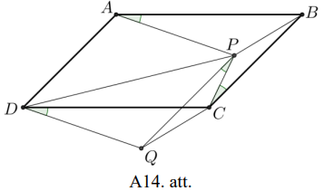

# <lo-sample/> LV.VOL.2015.12.3

Pierādīt, ka jebkuram naturālam nepāra skaitlim $n$ izteiksme 
$2269^{n}+2151^{n}+1389^{n}-1779^{n}$ dalās ar $2015$.

<small>

* questionType:
* domain:

</small>

## Atrisinājums

Ievērojam, ka $2015=5 \cdot 13 \cdot 31$. Tā kā visi pirmreizinātāji ir dažādi,
nepieciešams pierādīt, ka dotā izteiksme vienlaikus dalās gan ar $5$, gan ar 
$13$, gan $31$.

Izmantosim teorēmu: ja veseli skaitļi $A$ un $B$, dalot ar $n$, dod attiecīgi 
atlikumus $a$ un $b$, tad dalot ar $n$ skaitļus $A+B,\ A-B,\ A \cdot B$ rodas 
tādi paši atlikumi, kādus dod $a+b,\ a-b,\ a \cdot b$ dalot ar $n$.

Apskatām dotās izteiksmes dalāmību ar katru pirmreizinātāju.

- Atlikums, kāds rodas, izteiksmi $2269^{n}+2151^{n}+1389^{n}-1779^{n}$ dalot 
  ar $5$, ir $4^{n}+1^{n}+4^{n}-4^{n}$ jeb $4^{n}+1$. Tā kā $n$ ir nepāra 
  skaitlis, tad $4^{n}+1=4^{2k+1}+1=4 \cdot 16^{k}+1$. No tā, ka $16$, dalot ar
  $5$ dod atlikumu $1$, iegūst, ka $4 \cdot 16^{k}+1$ dalot ar $5$, dod 
  atlikumu $4 \cdot 1^{k}+1=5$ jeb dalās ar $5$. Tātad arī izteiksme 
  $2269^{n}+2151^{n}+1389^{n}-1779^{n}$ dalās ar $5$.
- Atlikums, kāds rodas, izteiksmi $2269^{n}+2151^{n}+1389^{n}-1779^{n}$ dalot 
  ar $13$, ir $7^{n}+6^{n}+11^{n}-11^{n}$ jeb 
  $7^{n}+6^{n}=7^{2k+1}+6^{2k+1}=7 \cdot 49^{k}+6 \cdot 36^{k}$. No tā, ka $49$
  un $36$, dalot ar $13$, abi dod atlikumu $10$, iegūst, ka 
  $7 \cdot 49^{k}+6 \cdot 36^{k}$, dalot ar $13$, dod atlikumu 
  $7 \cdot 10^{k}+6 \cdot 10^{k}=13 \cdot 10^{k}$ jeb dalās ar $13$. Tātad arī 
  izteiksme $2269^{n}+2151^{n}+1389^{n}-1779^{n}$ dalās ar $13$.
- Atlikums, kāds rodas, izteiksmi $2269^{n}+2151^{n}+1389^{n}-1779^{n}$ dalot 
  ar $31$, ir $6^{n}+12^{n}+25^{n}-12^{n}$ jeb 
  $6^{n}+25^{n}=6^{2k+1}+25^{2k+1}=6 \cdot 36^{k}+25 \cdot 625^{k}$. No tā, ka 
  $36$ un $625$, dalot ar $31$, abi dod atlikumu $5$, iegūst, ka 
  $6 \cdot 36^{k}+25 \cdot 625^{k}$, dalot ar $31$, dod atlikumu 
  $6 \cdot 5^{k}+25 \cdot 5^{k}=31 \cdot 5^{k}$ jeb dalās ar $31$. Tātad arī 
  izteiksme $2269^{n}+2151^{n}+1389^{n}-1779^{n}$ dalās ar $31$.

Līdz ar to esam pierādījuši, ka dotā izteiksme vienlaikus dalās ar $5,\ 13$ un 
$31$, tātad tā dalās ar $2015$.

## Atrisinājums

Ievērojam, ka $2015=5 \cdot 13 \cdot 31$. Tā kā visi pirmreizinātāji ir dažādi,
nepieciešams pierādīt, ka dotā izteiksme vienlaikus dalās gan ar $5$, gan ar 
$13$, gan $31$.

Apskatām dotās izteiksmes dalāmību ar katru pirmreizinātāju:

- $2269^{n}+2151^{n}+1389^{n}-1779^{n} \equiv 4^{n}+1^{n}+4^{n}-4^{n} \equiv 4^{n}+1^{n} \equiv(-1)^{2k+1}+1 \equiv-1+1 \equiv 0(\bmod 5);$
- $2269^{n}+2151^{n}+1389^{n}-1779^{n} \equiv 7^{n}+6^{n}+11^{n}-11^{n} \equiv 7^{n}+6^{n} \equiv(-6)^{2k+1}+6^{2 k+1} \equiv 0(\bmod 13);$
- $2269^{n}+2151^{n}+1389^{n}-1779^{n} \equiv 6^{n}+12^{n}+25^{n}-12^{n} \equiv 6^{n}+25^{n} \equiv 6^{2k+1}+(-6)^{2 k+1} \equiv 0(\bmod 31)$

Līdz ar to esam pierādījuši, ka dotā izteiksme vienlaikus dalās ar $5,\ 13$ un 
$31$, tātad tā dalās ar $2015$.

# <lo-sample/> LV.VOL.2015.12.4

Katrs no skaitļu ass punktiem ar veselu koordinātu ir nokrāsots vai nu baltā, 
vai melnā krāsā. Nekādi divi balti punkti neatrodas viens no otra attālumā $1$ 
un nekādi divi melni punkti neatrodas viens no otra attālumā $d$. Noteikt, 
kādām naturālām $d$ vērtībām šāds krāsojums ir iespējams!

<small>

* questionType:
* domain:

</small>

## Atrisinājums

Šāds krāsojums iespējams tikai tad, ja $d$ - nepāra skaitlis. Tad der 
krāsojums, kur punkti nokrāsoti pamīšus baltā un melnā krāsā (skat. A15.att.).

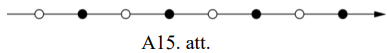

Skaidrs, ka divi baltie punkti nevar atrasties blakus. Ja divi melnie punkti 
atrodas blakus (piemēram, pozīcijās $1$ un $2$), tad $d$ vienības tālāk 
(pozīcijās $d+1$ un $d+2$) atrodas divi baltie punkti, kas nav iespējams pēc 
uzdevuma nosacījumiem. Tātad punktiem jābūt izkrāsotiem pamīšus. Redzams, ka 
pamīšus izvietojot punktus, uzdevuma nosacījumi tiek apmierināti, ja $d$ ir 
nepāra skaitlis, bet, ja $d$ ir pāra skaitlis, tad ne.

# <lo-sample/> LV.VOL.2015.12.5

Votivapu valodā visi vārdi sastāv tikai no diviem burtiem $a$ un $b$. Jebkuru 
vārdu var iegūt no vārda " $a$ ", atkārtoti lietojot šādus trīs likumus:

1) pierakstot vārdam galā burtu $b$;
2) pierakstot vārdam galā sevi pašu;
3) aizstājot vārdā trīs pēc kārtas esošus burtus $a$ ar vienu burtu $b$.

Vai votivapu valodā ir vārdi **(A)** $abbababab$; **(B)** $baabaabaa$?

<small>

* questionType:
* domain:

</small>

## Atrisinājums

**(A)** Vārdu " $abbababab$ " var iegūt šādi:

$$\begin{aligned}
& a \xrightarrow{\text {2)}} aa \stackrel{\text {2)}}{\rightarrow} aaaa \xrightarrow{2)} aaaaaaaa \xrightarrow{2)} aaaaaaaaaaaaaaaa \xrightarrow{\text {3)}} abaaaaaaaaaaaa \xrightarrow{\text {3)}} \\
&   \stackrel{\text {3)}}\rightarrow abbaaaaaaaaa \stackrel{\text {3)}}\rightarrow abbabaaaaa \stackrel{\text {3)}}\rightarrow abbababa \stackrel{\text {1)}}\rightarrow abbababab \\
&
\end{aligned}$$

**(B)** Vārdu " $baabaabaa$ " nevar iegūt. Burtu $a$ aizstājam ar ciparu $1$, 
bet burtu $b$ - ar ciparu $3$. Tad visi vārdi votivapu valodā tiek aizstāti 
ar naturāliem skaitļiem, kuru pierakstā izmantoti tikai cipari $1$ un $3$.

Ievērojam, ka sākotnējais vārds " $a$ " jeb skaitlis $1$ nedalās ar $3$.

Pierādīsim, ja kāds skaitlis nedalās ar $3$, tad skaitlis, kas no tā tiek 
iegūts ar uzdevumā dotajām darbībām, arī nedalās ar $3$:

1) ja skaitlis nedalās ar $3$, tad, pierakstot tam galā $3$, arī iegūtais 
   skaitlis nedalās ar $3$, jo ciparu summas atlikums, dalot ar $3$, nemainās;
2) ja skaitļa ciparu summa, dalot ar $3$, dod atlikumu $1$, tad iegūtā skaitļa 
   ciparu summa, dalot ar $3$, dod atlikumu $2$; ja skaitļa ciparu summa, dalot
   ar $3$, dod atlikumu $2$, tad iegūtā skaitļa ciparu summa, dalot ar $3$, dod
   atlikumu $1$; abos gadījumos iegūtais skaitlis nedalās ar $3$;
3) skaitļa ciparu summa nemainās, aizstājot $111$ ar $3$, tātad iegūtais 
   skaitlis nedalās ar $3$.

Aizstājot vārda " $baabaabaa$ " burtus ar cipariem, iegūst skaitli $311311311$,
kas dalās ar $3$, jo tā ciparu summa ir $15$. Tātad, vairākkārt izmantojot 
dotos likumus, šo vārdu nav iespējams iegūt.

