# <lo-sample/> LV.VOL.2016.9.1

Zināms, ka $x$ un $y$ ir tādi naturāli skaitļi, ka $xy^{2}$ ir naturāla skaitļa
kubs. Pierādīt, ka arī $x^{2}y$ ir naturāla skaitļa kubs!

<small>

* questionType:
* domain:

</small>

## Atrisinājums

Apzīmējam $xy^{2}=z^{3}$, kur $z$ - naturāls skaitlis. Kāpinot abas puses 
kvadrātā, iegūstam $x^{2}y^{4}=z^{6}$. Izsakām

$$x^{2} y=\frac{z^{6}}{y^{3}}=\left(\frac{z^{2}}{y}\right)^{3}$$

Skaitlis $x^{2}y$ ir naturāls skaitlis, tāpēc arī 
$\left(\frac{z^{2}}{y}\right)^{3}$ ir naturāls. Ja $z^{2}$ nedalītos ar $y$, 
tad $\frac{z^{2}}{y}$ varētu izteikt kā nesaīsināmu daļu $\frac{m}{n}$. Bet tad
arī $\frac{m^{3}}{n^{3}}$ būtu nesaīsināma daļa, taču tam jābūt naturālam 
skaitlim - pretruna. Tāpēc $z^{2}$ dalās ar $y$ un tātad $x^{2} y$ ir naturāla 
skaitļa kubs.

# <lo-sample/> LV.VOL.2016.9.2

Trijstūrī $ABC$ novilkta mediāna $AF$, punkts $D$ ir tās viduspunkts. Taisne 
$CD$ krusto malu $AB$ punktā $E$. Pierādīt: ja $BD=BF$, tad $AE=DE$ !

<small>

* questionType:
* domain:

</small>

## Atrisinājums

Trijstūris $DBF$ ir vienādsānu ($BD=BF$ pēc dotā), tāpēc 
$\sphericalangle BDF=\sphericalangle BFD$ kā leņķi pie pamata malas (skat. 
1.att.). Tā kā $AD=DF$ (jo $D$ ir $AF$ viduspunkts), 
$\sphericalangle ADB=\sphericalangle DFC$ (kā vienādu leņķu blakusleņķi) un 
$BD=FC$, tad $\triangle ADB=\triangle DFC$ pēc pazīmes $m \ell m$. Tātad 
$\sphericalangle BAD=\sphericalangle CDF$ kā atbilstošie leņķi vienādos 
trijstūros. Tā kā $\sphericalangle EDA=\sphericalangle CDF$ kā krustleņķi, tad 
$\sphericalangle EAD=\sphericalangle EDA$ un $\triangle AED$ ir vienādsānu 
trijstūris. Līdz ar to $AE=DE$ kā sānu malas vienādsānu trijstūrī.

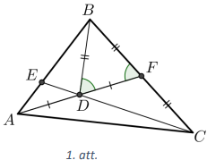

# <lo-sample/> LV.VOL.2016.9.3

Vai tabulā, kuras izmēri ir $4 \times 4$ rūtiņas, var ierakstīt naturālus 
skaitļus no $1$ līdz $16$ (katrā rūtiņā citu) tā, lai katrās divās rūtiņās, 
kurām ir kopīga mala, ierakstīto skaitļu starpība būtu vismaz **(A)** $6$; 
**(B)** $7$?

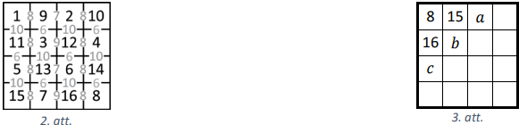

<small>

* questionType:
* domain:

</small>

## Atrisinājums

**(A)** Jā, skaitļus tabulā var ierakstīt, piemēram, skat. 2.att., kur pelēkā 
krāsā norādītas skaitļu starpības.

**(B)** Pamatosim, ka skaitļus tabulā nevar ierakstīt tā, lai izpildās uzdevuma
nosacījumi. Skaitlim $8$ blakus var atrasties tikai skaitļi $1,\ 15$ un $16$. 
Pieņemsim, ka $1$ neatrodas blakus $8$. Tad skaitlim $8$ ir tikai divi kaimiņi,
tātad tas atrodas stūrī (skat. 3.att.).

Skaitlim $7$ var atrasties blakus tikai skaitļi $14,\ 15,\ 16$, tātad tas 
noteikti ir blakus skaitlim $15$ vai $16$ (skat. 3.att.), līdz ar to tas 
atrodas kādā no vietām $a,\ b,\ c$. Tas nevar būt $b$ vietā, jo tur tam būtu 
četri kaimiņi. Tas nevar atrasties $a$ vietā, jo tur tam ir trīs kaimiņi, bet 
viens no skaitļiem, kas tam varētu būt blakus (skaitlis $16$) tam blakus 
neatrodas. Līdzīgi skaitlis $7$ nevar atrasties arī $c$ vietā.

Līdz ar to esam ieguvuši, ka skaitļiem $1$ un $8$ jābūt blakus. Nezaudējot 
vispārīgumu, varam pieņemt, ka skaitļi izkārtoti tā, kā parādīts 4.att. 
Skaitlis $x$ nevar būt $15$, jo tad $y$ vietā būtu jāieraksta skaitlis $8$, bet
tas jau ir ierakstīts tabulā. Tātad $x$ vietā jābūt skaitlim $16$, un tad 
vienīgā iespējamā $y$ vērtība ir $9$. Līdz ar to esam ieguvuši 5.att. parādīto 
skaitļu izkārtojumu.

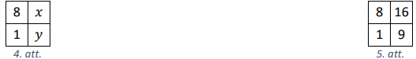

Ievērojam, ka skaitlim $9$ blakus rūtiņās var būt ierakstīti tikai skaitļi 
$1,\ 2,\ 16$. Tātad skaitlis $8$ nav stūrī, jo tad skaitlim $9$ būtu četri 
kaimiņi. Tieši tāpat stūrī nav arī skaitlis $9$, jo tad skaitlim $8$ būtu četri
kaimiņi. Tātad tiem ir vēl pa vienam kaimiņam. Skaidrs, ka skaitlim $8$ vēl ir 
kaimiņš $15$, bet skaitlim $9$ vēl ir kaimiņš $2$. Iespējami divi gadījumi, kur
attiecībā pret skaitli $8$ var būt ierakstīts skaitlis $15$ (skat. 6.att. un 
7.att.). Neviens no šiem gadījumiem nav iespējams, jo $z$ vietā būtu jāieraksta 
skaitlis $9$, bet $t$ vietā - skaitlis $8$.

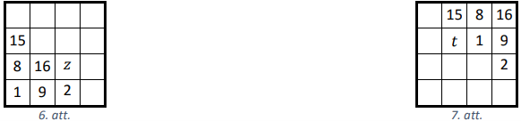

# <lo-sample/> LV.VOL.2016.9.4

Atrast skaitļa $\frac{2016^{2016}-3}{3}$ mazāko pirmreizinātāju!

<small>

* questionType:
* domain:

</small>

## Atrisinājums

Apzīmēsim $N=2016^{2016}-3$, tad dotais skaitlis ir $\frac{N}{3}$.

Tā kā $2016^{2016}$ ir pāra skaitlis, tad $N$ ir nepāra un arī dotais skaitlis 
ir nepāra, tātad tas nedalās ar $2$.

Ievērojam, ka $2016$ dalās ar $9$, tātad 
$N \equiv 0^{2016}-3 \equiv 0-3 \equiv-3 \equiv 6(\bmod 9)$. Tā kā skaitlis $N$
dalās ar $3$, bet nedalās ar $9$, tad dotajam skaitlim nav pirmreizinātājs $3$.

No kongruences $2016 \equiv 1(\bmod 5)$ izriet, ka 
$N \equiv 1^{2016}-3 \equiv 1+2 \equiv 3(\bmod 5)$, tātad dotais skaitlis 
nedalās ar $5$.

No kongruences $2016 \equiv 0(\bmod 7)$ izriet, ka 
$N \equiv 0-3 \equiv-3 \equiv 4(\bmod 7)$, tātad dotais skaitlis nedalās ar 
$7$. Ievērosim, ka $2016 \equiv 3(\bmod 11)$; tātad 
$N \equiv 3^{2016}-3(\bmod 11)$. Virkne $3^{n}, n=0,1,2, \ldots$, ir periodiska
pēc moduļa $11$; apskatīsim šīs virknes pirmos locekļus:

| $n$ | $0$ | $1$ | $2$ | $3$ | $4$ | $5$ | $\ldots$ |
| :---: | :--- | :--- | :--- | :--- | :--- | :--- | :--- |
| $3^{n}(\bmod 11)$ | $\mathbf{1}$ | $3$ | $9$ | $5$ | $4$ | $\mathbf{1}$ | $\ldots$ |

Tā kā $3^{5} \equiv 3^{0} \equiv 1(\bmod 11)$, tad secinām, ka 
$3^{2016} \equiv 3^{403 \cdot 5+1} \equiv\left(3^{5}\right)^{403} \cdot 3^{1} \equiv 1^{403} \cdot 3 \equiv 3(\bmod 11)$.

Līdz ar to $N \equiv 3^{2016}-3 \equiv 0(\bmod 11)$, tātad gan $N$, gan 
$\frac{N}{3}$ dalās ar $11$. Tātad dotā skaitļa mazākais pirmreizinātājs ir 
$11$.

# <lo-sample/> LV.VOL.2016.9.5

Naturālu skaitļu virkni $\left(s_{i}\right)$ pēc parauga " $2016$ " veido šādi: 
virknes pirmais loceklis $s_{1}$ ir $2$; virknes otrais loceklis $s_{2}$ - 
mazākais naturālais skaitlis, kas lielāks nekā $s_{1}$ un tā pierakstā ir 
cipars $0$; virknes trešais loceklis $s_{3}$ - mazākais naturālais skaitlis, 
kas lielāks nekā $s_{2}$ un tā pierakstā ir cipars $1$; virknes ceturtais 
loceklis $s_{4}$ - mazākais naturālais skaitlis, kas lielāks nekā $s_{3}$ un tā
pierakstā ir cipars $6$. Pēc tam meklētie cipari cikliski atkārtojas: 
$2-0-1-6-2-0-\ldots$. Virknes pirmie locekļi ir 
$2;\ 10;\ 11;\ 16;\ 20;\ 30;\ 31;\ 36;\ 42;\ 50$.

Kādi ir četri nākamie skaitļi, kas virknē seko aiz skaitļa $2016$?

<small>

* questionType:
* domain:

</small>

## Atrisinājums

Pavisam ir četru veidu *gājieni*: " $2 \rightarrow 0$ " (skaitlis satur $2$ un 
meklējam nākamo skaitli, kas satur $0$), " $0 \rightarrow 1$ ", 
" $1 \rightarrow 6$ " un " $6 \rightarrow 2$ ". Turklāt šie *gājieni* cikliski 
atkārtojas tieši šādā secībā.

Lai noskaidrotu, kuri nākamie skaitļi seko virknē pēc skaitļa $2016$, 
nepieciešams uzzināt, pēc kāda *gājiena* tika sasniegts skaitlis $2016$.

Aplūkosim iespējamos gadījumus.

**(A)** Skaitli $2016$ nevar iegūt pēc *gājiena* " $6 \rightarrow 2$ ", jo 
iepriekšējais virknes loceklis būtu $2006$, bet nākamais skaitlis, kas ir 
lielāks nekā $2006$ un satur ciparu $2$, ir $2007$.

**(B)** Skaitli $2016$ nevar iegūt pēc *gājiena* " $2 \rightarrow 0$ ", jo 
iepriekšējam virknes loceklim tad būtu jābūt $2015$, bet pirms tā izdarītajam 
*gājienam* jābūt " $6 \rightarrow 2$ ", kas noved pie tās pašas pretrunas kā 
(A) gadījumā.

**(C)** Skaitli $2016$ nevar iegūt pēc *gājiena* " $0 \rightarrow 1$ ", jo 
iepriekšējam virknes loceklim būtu jābūt $2015$, bet pirms tā izdarītajam 
*gājienam* jābūt " $2 \rightarrow 0$ " un skaitlim $2014$. Savukārt, pirms 
skaitļa $2014$ izdarītajam *gājienam* jābūt " $6 \rightarrow 2$ " un iegūstam 
līdzīgu pretrunu kā (A) gadījumā.

**(D)** Tātad skaitli $2016$ iegūst pēc *gājiena* " $1 \rightarrow 6$ ", un 
nākamie skaitļi virknē pēc *gājieniem* " $6 \rightarrow 2$ ", 
" $2 \rightarrow 0$ ", " $0 \rightarrow 1$ " un " $1 \rightarrow 6$ " ir 
skaitļi $2017,\ 2018,\ 2019$ un $2026$.

# <lo-sample/> LV.VOL.2016.10.1

Zināms, ka $x$ un $y$ ir tādi naturāli skaitļi, ka $x y^{10}$ ir naturāla 
skaitļa $33.$ pakāpe. Pierādīt, ka arī $x^{10} y$ ir naturāla skaitļa $33.$ 
pakāpe!

<small>

* questionType:
* domain:

</small>

## Atrisinājums

Apzīmējam $xy^{10}=z^{33}$, kur $z$ - naturāls skaitlis. Kāpinot abas puses 
$10.$ pakāpē, iegūstam $x^{10}y^{100}=z^{330}$. Izsakām

$$x^{10} y=\frac{z^{330}}{y^{99}}=\left(\frac{z^{10}}{y^{3}}\right)^{33}$$

Skaitlis $x^{10}y$ ir naturāls skaitlis, tāpēc arī 
$\left(\frac{z^{10}}{y^{3}}\right)^{33}$ ir naturāls. Ja $z^{10}$ nedalītos ar 
$y^{3}$, tad $\frac{z^{10}}{y^{3}}$ varētu izteikt kā nesaīsināmu daļu 
$\frac{m}{n}$. Bet tad arī $\frac{m^{33}}{n^{33}}$ būtu nesaīsināma daļa, taču 
tam jābūt naturālam skaitlim - pretruna. Tāpēc $z^{10}$ dalās ar $y^{3}$ un 
tātad arī $x^{10}y$ ir naturāla skaitļa $33.$ pakāpe.

# <lo-sample/> LV.VOL.2016.10.2

Trijstūra $ABC$ leņķu $\sphericalangle CAB$ un $\sphericalangle BCA$ 
bisektrises krusto tam apvilkto riņķa līniju attiecīgi punktos $P$ un $Q$, bet 
pašas krustojas punktā $I$. Pierādīt, ka $PQ \perp BI$!

<small>

* questionType:
* domain:

</small>

## Atrisinājums

Apzīmējam $\sphericalangle BAP=\sphericalangle PAC=\alpha$ un 
$\sphericalangle BCQ=\sphericalangle QCA=\beta$ (skat. 8.att.). Ievilktie 
leņķi, kas balstās uz viena un tā paša loka, ir vienādi, tāpēc

- $\sphericalangle BQP=\sphericalangle BAP=\alpha$ (balstās uz loka $BP$);

- $\sphericalangle PQC=\sphericalangle PAC=\alpha$ (balstās uz loka $PC$);

- $\sphericalangle BPQ=\sphericalangle BCQ=\beta$ (balstās uz loka $BQ$);

- $\sphericalangle QPA=\sphericalangle QCA=\beta$ (balstās uz loka $QA$).

Līdz ar to $\triangle QIP=\triangle QBP$ pēc pazīmes $\ell m \ell$, jo 
$\sphericalangle IQP=\sphericalangle BQP=\alpha, PQ$ ir kopīga mala un 
$\sphericalangle IPQ=\sphericalangle BPQ=\beta$. Tāpēc $PI=PB$ kā atbilstošās 
malas vienādos trijstūros un $\triangle BPI$ ir vienādsānu trijstūris ar pamatu
$BI$. Tā kā $PQ$ ir bisektrise, kas vilkta no virsotnes leņķa, tad $PQ$ ir arī 
augstums pret $BI$ un līdz ar to $PQ \perp BI$.

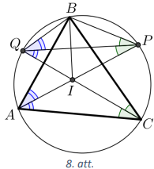

# <lo-sample/> LV.VOL.2016.10.3

Doti tādi reāli skaitļi $x,\ y$ un $z$, ka $x+y+z=3$. Pierādīt, ka 
$xy+xz+yz \leq 3$.

<small>

* questionType:
* domain:

</small>

## Atrisinājums

Dotās vienādības abas puses kāpinot kvadrātā un pēc tam reizinot ar $2$, 
iegūstam:

$$\begin{gathered}
x^{2}+y^{2}+z^{2}+2xy+2xz+2yz=9 \\
2x^{2}+2y^{2}+2z^{2}+4xy+4xz+4yz=18
\end{gathered}$$

Pieskaitot un atņemot vienādības kreisai pusei vienu un to pašu izteiksmi un 
pēc tam izmantojot starpības kvadrāta formulu, iegūstam:

$$\begin{gathered}
x^{2}-2xy+y^{2}+x^{2}-2xz+z^{2}+y^{2}-2yz+z^{2}+6xy+6xz+6yz=18 \\
(x-y)^{2}+(x-z)^{2}+(y-z)^{2}+6xy+6xz+6yz=18
\end{gathered}$$

Tā kā $(x-y)^{2}+(x-z)^{2}+(y-z)^{2} \geq 0$, tad $6xy+6xz+6yz \leq 18$ jeb 
$xy+xz+yz \leq 3$.

# <lo-sample/> LV.VOL.2016.10.4

Pitagora trijstūrī visu malu garumi ir lielāki nekā $5$. Vai var gadīties, ka 
tā **(A)** trīs malu, **(B)** divu malu garumi ir pirmskaitļi?

*Piezīme.* Pitagora trijstūris ir taisnleņķa trijstūris, kam visi malu garumi 
ir naturāli skaitļi.

<small>

* questionType:
* domain:

</small>

## Atrisinājums

**(A)** Nē, trīs malu garumi nevar būt pirmskaitļi. Taisnleņķa trijstūrī malu 
garumus $a,\ b$ un $c$ saista Pitagora teorēma $a^{2}+b^{2}=c^{2}$. Tā kā visu 
malu garumiem jābūt pirmskaitļiem, kas lielāki nekā $5$, tad visu malu garumi 
ir nepāra skaitļi, tātad arī $a^{2}$ un $b^{2}$ ir nepāra skaitļi, bet divu 
nepāra skaitļu summa ir pāra skaitlis - pretruna ar to, ka $c^{2}$ ir nepāra 
skaitlis.

**(B)** Jā, divu malu garumi var būt pirmskaitļi. Piemēram, der malu garumi 
$11,\ 60,\ 61$, jo divi no tiem ir pirmskaitļi un tiem izpildās Pitagora 
teorēmas nosacījums, tas ir, $11^{2}+60^{2}=61^{2}$ jeb $121+3600=3721$.

*Piezīmes*

1) Vērtības (B) gadījumā var atrast, ja zina sakarību, ka katram Pitagora 
   skaitļu trijniekam $a,\ b$ un $c$ eksistē tādas naturālas $n$ un $m$ 
   vērtības $(n>m)$, ka $a=n^{2}-m^{2},\ b=2nm,\ c=n^{2}+m^{2}$. Skaitlis $b$ 
   nav pirmskaitlis, jo ir pāra skaitlis, kas ir lielāks nekā $5$ (pēc dotā). 
   Tātad vienlaikus pirmskaitļi ir $n^{2}-m^{2}$ un $n^{2}+m^{2}$. Lai skaitlis
   $n^{2}-m^{2}=(n-m)(n+m)$ būtu pirmskaitlis, reizinātājam $n-m$ jābūt 
   vienādam ar $1$ jeb $n=m+1$ un pirmskaitļiem jābūt formā $2m+1$ un 
   $2m^{2}+2m+1$. Pārbaudot nelielas $m$ ($m>2$ pēc dotā) vērtības, pie $m=5$ 
   atrod minēto skaitļu trijnieku $11,\ 60,\ 61$.
2) To, ka (A) gadījumā viens no skaitļiem ir pāra, var secināt no skaitļa $b$ 
   izteiksmes.

# <lo-sample/> LV.VOL.2016.10.5

Regulāra $2016$ - stūra visas virsotnes sākotnēji ir baltas. Kādu mazāko skaitu
no tām var nokrāsot melnā krāsā tā, lai nepaliktu neviens **(A)** taisnleņķa, 
**(B)** šaurleņķu trijstūris, kuram visas virsotnes atrodas $2016$ - stūra 
baltajās virsotnēs?

<small>

* questionType:
* domain:

</small>

## Atrisinājums

**(A)** Visas regulāra $2016$ - stūra virsotnes atrodas uz vienas riņķa 
līnijas. Ievilkts leņķis ir taisns tikai tādā gadījumā, ja tas balstās uz 
diametra. Tātad, ja kāda diametra abi galapunkti būtu balti, tad visi pārējie 
punkti būtu jānokrāso melni, jo diametra galapunkti ar jebkuru trešo punktu 
veido taisnleņķa trijstūri. Līdz ar to katra diametra vismaz viens galapunkts 
ir jānokrāso melns. Tātad melnas jānokrāso vismaz $\frac{2016}{2}=1008$ 
regulārā $2016$ - stūra virsotnes. Ja katra diametra vienu galapunktu nokrāso 
melnu, tad nepaliek neviens taisnleņķa trijstūris, kuram visas virsotnes ir 
baltas. Tātad mazākais punktu skaits, kas jānokrāso melni, ir $1008$.

**(B)** Ja melnas nokrāso $1007$ pēc kārtas esošas virsotnes, tad no 
atlikušajām $1009$ virsotnēm var izveidot tikai taisnleņķa vai platleņķa 
trijstūrus, jo katra trijstūra viens leņķis balstās uz loka, kura lielums ir 
vismaz $90^{\circ}$ (skat. 9.att.).

Pierādīsim, ka mazāk virsotnes nevar nokrāsot, lai izpildītos uzdevuma 
nosacījumi.

Pieņemsim, ka melnas nokrāsotas ne vairāk kā $1006$ virsotnes, tad baltas ir 
palikušas vismaz $1010$ virsotnes. Tā kā ir tieši $1008$ diametri, kuriem abi 
galapunkti atrodas regulārā $2016$ - stūra virsotnēs, tad būs vismaz divi 
diametri kuriem abi galapunkti ir balti (Dirihlē princips). Šos diametrus 
apzīmējam ar $AB$ un $CD$ (skat. 10.att.). Izvēlamies kādu punktu $E$, kurš ir 
balts (nezaudējot vispārīgumu, varam pieņemt, ka tas atrodas uz loka $AC$), bet
tad trijstūris $BDE$ ir šaurleņķu, jo visi trīs loki $EB,\ BD,\ DE$ ir mazāki 
nekā $180^{\circ}$, tātad trijstūra leņķi ir mazāki nekā $90^{\circ}$, jo tie 
ir ievilktie leņķi, kas balstās uz šiem lokiem.

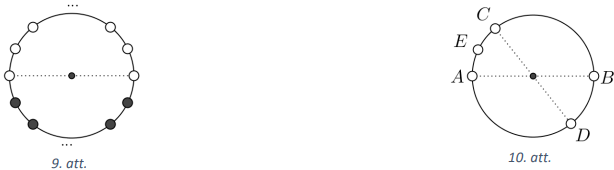

# <lo-sample/> LV.VOL.2016.11.1

Zināms, ka $x$ un $y$ ir tādi naturāli skaitļi, ka $xy^{433}$ ir naturāla 
skaitļa $2016.$ pakāpe. Pierādīt, ka arī $x^{433}y$ ir naturāla skaitļa $2016.$
pakāpe!

<small>

* questionType:
* domain:

</small>

## Atrisinājums

Apzīmējam $xy^{433}=z^{2016}$, kur $z$ - naturāls skaitlis. Kāpinot abas puses 
$433.$ pakāpē, iegūstam $x^{433}y^{433 \cdot 433}=z^{2016 \cdot 433}$. Izsakām

$$x^{433} y=\frac{z^{2016 \cdot 433}}{y^{433 \cdot 433-1}}=\left(\frac{z^{433}}{y^{93}}\right)^{2016}$$

Skaitlis $x^{433}y$ ir naturāls skaitlis, tāpēc arī 
$\left(\frac{z^{433}}{y^{93}}\right)^{2016}$ ir naturāls. Ja $z^{433}$ 
nedalītos ar $y^{93}$, tad $\frac{z^{433}}{y^{93}}$ varētu izteikt kā 
nesaīsināmu daļu $\frac{m}{n}$. Bet tad arī $\frac{m^{2016}}{n^{2016}}$ būtu 
nesaīsināma daļa, taču tam jābūt naturālam skaitlim - pretruna. Tāpēc $z^{433}$
dalās ar $y^{93}$ un tātad arī $x^{433}y$ ir naturāla skaitļa $2016.$ pakāpe.

# <lo-sample/> LV.VOL.2016.11.2

Šaurleņķu trijstūrim $ABC(AB>AC)$ apvilktās riņķa līnijas centrs ir $O$ un 
punkts $D$ ir malas $BC$ viduspunkts. Riņķa līnija ar diametru $AD$ krusto 
malas $AB$ un $AC$ attiecīgi punktos $E$ un $F$. Uz nogriežņa $EF$ atlikts 
punkts $M$ tā, ka $DM \parallel AO$. Pierādīt, ka trijstūri $ABD$ un $FDM$ ir 
līdzīgi!

<small>

* questionType:
* domain:

</small>

## Atrisinājums

Apzīmējam $\sphericalangle BAC=\alpha, \sphericalangle ABC=\beta$ un 
$\sphericalangle BCA=\gamma$.

Ievērojam, ka $\sphericalangle EAD=\sphericalangle EFD$ kā ievilktie leņķi, kas
balstās uz viena un tā paša loka (skat. 11.att.).

Tā kā $\sphericalangle BOA=2 \sphericalangle BCA$ un $\triangle BOA$ ir 
vienādsānu $(AO=OB)$, tad iegūstam 
$\sphericalangle OAB=\frac{1}{2}\left(180^{\circ}-\sphericalangle BOA\right)=90^{\circ}-\sphericalangle BCA=90^{\circ}-\gamma$.
Tā kā $AD$ ir riņķa līnijas diametrs, tad $\sphericalangle AFD=90^{\circ}$. No 
trijstūra $DFC$ iegūstam, ka $\sphericalangle FDC=90^{\circ}-\gamma$. Tā kā 
$\sphericalangle ADC$ ir trijstūra $ABD$ ārējais leņķis, tad 
$\sphericalangle ADC=\sphericalangle DAB+\sphericalangle DBA.$ Ievērojam, ka 
$\sphericalangle ADC=\sphericalangle ADM+\sphericalangle MDF+\sphericalangle FDC$ un
$\sphericalangle DAB+\sphericalangle DBA=\sphericalangle DAO+\sphericalangle OAB+\beta$.
Tā kā $\sphericalangle ADM=\sphericalangle DAO$ (kā iekšējie škērsleņķi pie 
paralēlām taisnēm $DM$ un $AO$) un 
$\sphericalangle FDC=\sphericalangle OAB=90^{\circ}-\gamma$, tad 
$\sphericalangle MDF=\beta$. Tātad $\sphericalangle ABD=\sphericalangle MDF$.

Līdz ar to $\triangle ABD \sim \triangle FDM$ pēc pazīmes $\ell \ell$.

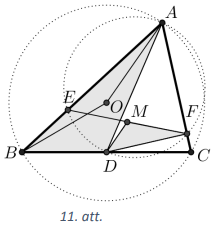

# <lo-sample/> LV.VOL.2016.11.3

Pierādīt, ka katram naturālam skaitlim $n(n>1)$ var atrast tādus naturālus 
skaitļus $x$ un $y(x \leq y)$, ka

$$\frac{1}{n}=\frac{1}{x(x+1)}+\frac{1}{(x+1)(x+2)}+\cdots+\frac{1}{y(y+1)}$$

<small>

* questionType:
* domain:

</small>

## Atrisinājums

Izmantojot vienādību $\frac{1}{k(k+1)}=\frac{1}{k}-\frac{1}{k+1}$, pārrakstām 
dotās vienādības labās puses izteiksmi

$$\frac{1}{x(x+1)}+\frac{1}{(x+1)(x+2)}+\cdots+\frac{1}{y(y+1)}=\frac{1}{x}-\frac{1}{x+1}+\frac{1}{x+1}-\frac{1}{x+2}+\cdots+\frac{1}{y}-\frac{1}{y+1}=\frac{1}{x}-\frac{1}{y+1}$$

Tātad katrai $n$ vērtībai nepieciešams atrast atbilstošo $x$ un $y+1$ vērtību. 
No vienādības $\frac{1}{n}=\frac{1}{x}-\frac{1}{y+1}$ izsakot $x$, iegūstam 
$x=n \frac{y+1}{y+1+n}$. Izvēloties $y+1=(n-1)n$, iegūstam, ka $x=n-1$. Līdz ar
to

$$\frac{1}{x}-\frac{1}{y+1}=\frac{1}{n-1}-\frac{1}{(n-1)n}=\frac{n-1}{(n-1)n}=\frac{1}{n}$$

Tā kā $n>1$, tad $y+1>x$ jeb $y \geq x$, un prasītais ir pierādīts visām 
naturālām $n$ vērtībām.

*Piezīme.* Ja $n$ ir pāra skaitlis, tad var izmantot $y+1=n$ un 
$x=\frac{n}{2}$.

# <lo-sample/> LV.VOL.2016.11.4

Naturālu skaitļu virkni $\left(s_{i}\right)$ pēc parauga, " $2016$ " veido 
šādi: $s_{1}=2;\ s_{2}$ - mazākais naturālais skaitlis, kas lielāks nekā 
$s_{1}$ un tā pierakstā ir cipars $0;\ s_{3}$ - mazākais naturālais skaitlis, 
kas lielāks nekā $s_{2}$ un tā pierakstā ir cipars $1;\ s_{4}$ - mazākais 
naturālais skaitlis, kas lielāks nekā $s_{3}$ un tā pierakstā ir cipars $6$. 
Pēc tam meklētie cipari cikliski atkārtojas: $2-0-1-6-2-0-\ldots$. Virknes 
pirmie locekļi ir $2;\ 10;\ 11;\ 16;\ 20;\ 30;\ 31;\ 36;\ 42;\ 50$.

Vai šajā virknē ir skaitlis **(A)** $2001$, **(B)** $2006$?

<small>

* questionType:
* domain:

</small>

## Atrisinājums

Pavisam ir četru veidu *gājieni*: " $2 \rightarrow 0$ " (skaitlis satur $2$ un 
meklējam nākamo skaitli, kas satur $0$), " $0 \rightarrow 0$ ", 
" $1 \rightarrow 6$ " un " $6 \rightarrow 2$ ". Ievērojam, ka neviens gājiens 
neļauj pārlēkt no skaitļa $N$ uz skaitli, kas ir lielāks nekā $N+10$.

Virknē pēc izdarīta gājiena " $1 \rightarrow 6$ " būs kāds no skaitļiem 
$1906,\ 1916,\ 1926$ vai $1936$.

Aplūkosim, kāda ir tālākā skaitļu virkne katrā no gadījumiem:

- $\mathbf{1906} \xrightarrow{6 \rightarrow 2} 1912 \xrightarrow{2 \rightarrow 0} 1920 \xrightarrow{0 \rightarrow 1} 1921 \xrightarrow{1 \rightarrow 6} \mathbf{1926} \xrightarrow{6 \rightarrow 2} 1927 \xrightarrow{2 \rightarrow 0} 1930 \xrightarrow{0 \rightarrow 1} 1931 \xrightarrow{1 \rightarrow 6} \mathbf{1936}$  
- $\mathbf{1916} \xrightarrow{6 \rightarrow 2} 1920 \xrightarrow{2 \rightarrow 0} 1930 \xrightarrow{0 \rightarrow 1} 1931 \xrightarrow{1 \rightarrow 6} \mathbf{1936.}$

Kā redzams, visos gadījumos virknē pēc gājiena " $1 \rightarrow 6$ " ir 
skaitlis $1936$.

Tātad, turpinot virkni, iegūsim

$$\begin{aligned}
& 1936 \xrightarrow{6 \rightarrow 2} 1942 \xrightarrow{2 \rightarrow 0} 1950 \xrightarrow{0 \rightarrow 1} 1951 \xrightarrow{1 \rightarrow 6} 1956 \xrightarrow{6 \rightarrow 2} 1962 \stackrel{2 \rightarrow 0}{\longrightarrow} 1970 \xrightarrow{0 \rightarrow 1} 1971 \xrightarrow{1 \rightarrow 6} 1976 \xrightarrow{6 \rightarrow 2} 1982 \xrightarrow{2 \rightarrow 0} \\
& \rightarrow 1990 \xrightarrow{0 \rightarrow 1} 1991 \xrightarrow{1 \rightarrow 6} 1996 \xrightarrow{6 \rightarrow 2} 2000 \xrightarrow{2 \rightarrow 0} \mathbf{2001} \stackrel{0 \rightarrow 1}{l} 2010.
\end{aligned}$$

Līdz ar to esam pierādījuši, ka skaitlis $2001$ pieder virknei, bet skaitlis 
$2006$ - nepieder.

# <lo-sample/> LV.VOL.2016.11.5

Pierādīt, ka jebkuru trijstūri **(A)** ar trim, **(B)** ar diviem nogriežņiem 
var sadalīt trīs daļās tā, ka katrai no daļām ir simetrijas ass!

<small>

* questionType:
* domain:

</small>

## Atrisinājums

**(A)** Novelkot ievilktās riņķa līnijas rādiusus pret visām trim trijstūra 
malām, tas tiek sadalīts trīs četrstūros (skat. 12.att.). Katram no tiem 
simetrijas ass ir dotā trijstūra bisektrise (12.att. atzīmēta ar pārtrauktu 
līniju).

**(B)** Trijstūra $ABC$ garāko malu apzīmēsim ar $BC$, malu $AB$ un $AC$ 
viduspunktus - attiecīgi $D$ un $E$ (skat. 13.att.). Attēlojot virsotni $A$ 
simetriski pret viduslīniju $DE$, tās projekcija $A^{\prime}$ atrodas uz malas 
$BC$. Simetrijas dēļ trijstūri $BDA^{\prime}$ un $CEA^{\prime}$ ir vienādsānu -
tātad simetrijas ass tajos ir augstums pret pamatu. Četrstūris $ADA^{\prime}E$ 
pēc konstrukcijas ir simetrisks pret $DE$. Tātad divi meklētie nogriežņi ir 
$DA^{\prime}$ un $EA^{\prime}$.

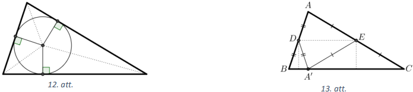

*Piezīmes*

1) (A) gadījumā šaurleņķu trijstūriem der arī apvilktās riņķa līnijas centrs. 
   Šajā gadījumā par trīs nogriežņiem izvēlas rādiusus, kas vilkti uz trijstūra
   virsotnēm, bet malu vidusperpendikuli ir simetrijas asis - svarīgi, ka 
   vidusperpendikulu krustpunkts (apvilktās riņķa līnijas centrs) atrodas 
   trijstūra iekšpusē.
2) (B) gadījuma atrisinājums der arī kā (A) gadījuma atrisinājums, ja vienu no 
   nogriežņiem sadala divās daļās (piemēram, izvēlas punktu $X \in DA^{\prime}$
   un uzskata nogriezni $DA^{\prime}$ par diviem nogriežņiem $DX$ un 
   $XA^{\prime}$).

# <lo-sample/> LV.VOL.2016.12.1

Zināms, ka $x,\ y$ un $z$ ir tādi naturāli skaitļi, ka $x^{3}y^{5}z^{6}$ ir 
naturāla skaitļa septītā pakāpe. Pierādīt, ka arī $x^{5}y^{6}z^{3}$ ir naturāla
skaitļa septītā pakāpe!

<small>

* questionType:
* domain:

</small>

## Atrisinājums

Apzīmējam $x^{3}y^{5}z^{6}=a^{7}$, kur $a$ - naturāls skaitlis. Kāpinot abas 
puses ceturtajā pakāpē, iegūstam $x^{12}y^{20}z^{24}=a^{28}$. Izsakām

$$x^{5}y^{6}z^{3}=\frac{a^{28}}{x^{7}y^{14}z^{21}}=\left(\frac{a^{4}}{xy^{2}z^{3}}\right)^{7}$$

Skaitlis $x^{5}y^{6}z^{3}$ ir naturāls skaitlis, tāpēc arī 
$\left(\frac{a^{4}}{xy^{2}z^{3}}\right)^{7}$ ir naturāls. Ja $a^{4}$ nedalītos 
ar $xy^{2}z^{3}$, tad $\frac{a^{4}}{xy^{2}z^{3}}$ varētu izteikt kā nesaīsināmu
daļu $\frac{m}{n}$. Bet tad arī $\frac{m^{7}}{n^{7}}$ būtu nesaīsināma daļa, 
taču tam jābūt naturālam skaitlim - pretruna. Tāpēc $a^{4}$ dalās ar 
$xy^{2}z^{3}$ un tātad arī $x^{5}y^{6}z^{3}$ ir naturāla skaitļa $7.$ pakāpe.

# <lo-sample/> LV.VOL.2016.12.2

Trijstūrī $ABC$ ievilktās riņķa līnijas $\omega$ centrs ir $I$. Uz malām $AB$ 
un $BC$ izvēlēti attiecīgi punkti $P$ un $Q$ tā, ka $PI=QI$ un $PB>QB$. 
Nogrieznis $QI$ krusto $\omega$ punktā $T$. Taisne, kas pieskaras $\omega$ 
punktā $T$, krusto malas $AB$ un $BC$ attiecīgi punktos $U$ un $V$. Pierādīt, 
ka $PU=UV+VQ$ !

<small>

* questionType:
* domain:

</small>

## Atrisinājums

Apzīmējam $\omega$ pieskaršanās punktus malām $AB$ un $BC$ attiecīgi ar $E$ un 
$F$ (skat.att.). Tā kā $PI=QI$ un $EI=IF$, tad $\triangle PEI=\triangle QFI$ 
pēc pazīmes $kh$. Tātad

$$\begin{equation*}
PE=QF \tag{1}
\end{equation*}$$

kā vienādu trijstūru atbilstošās malas.

Tā kā pieskares, kas vilktas no viena punkta pret riņķa līniju, ir vienāda 
garuma, tad

$$\begin{equation*}
UE=UT \tag{2}
\end{equation*}$$

Saskaitot $(1)$ un $(2)$ iegūstam, ka $PE+UE=UT+QF$.

Savukārt, $QF=QV+VF$, tāpēc $PE+UE=UT+QV+VF$. Tā kā $VF=VT$ (pieskares no viena
punkta), tad $PE+UE=UT+QV+VT$.

No tā, ka $PU=PE+UE$ un $UV=UT+VT$, izriet $PU=UV+VQ$.

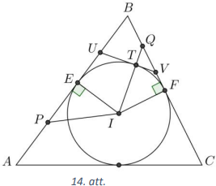

# <lo-sample/> LV.VOL.2016.12.3

Pierādīt, ka vismaz viens no $18$ pēc kārtas sekojošiem trīsciparu skaitļiem 
dalās ar savu ciparu summu!

<small>

* questionType:
* domain:

</small>

## Atrisinājums

No $18$ pēc kārtas sekojošiem skaitļiem viens noteikti dalās ar $18$. 
Pierādīsim, ka šis skaitlis ir meklētais.

Tā kā tas ir trīsciparu skaitlis, tad tā ciparu summa var būt $9,\ 18$ vai $27$
(jo tai jādalās ar $9$). Tā nevar būt $27$, jo vienīgais skaitlis, kam ciparu 
summa ir $27$, ir $999$, bet tas nedalās ar $18$. Tātad tā ciparu summa ir $9$ 
vai $18$ un tā kā skaitlis dalās ar $18$, tad tas dalās ar savu ciparu summu.

# <lo-sample/> LV.VOL.2016.12.4

Divas funkcijas tiek definētas šādi: $f(a)=a^{2}+3a+2$ un 
$g(b; c)=b^{2}-b+3c^{2}+3c$. Pierādīt, ka jebkurai naturālai $a$ vērtībai 
iespējams atrast tādas naturālas $b$ un $c$ vērtības, ka $f(a)=g(b; c)$.

<small>

* questionType:
* domain:

</small>

## Atrisinājums

Ievērojam, ka $f(a)=a^{2}+3a+2=(a+1)(a+2)$.

Ja $a$ ir nepāra, tad der vērtības $b=c=\frac{a+1}{2}$, jo tad

$$g(b; c)=g(b; b)=4b^{2}+2b=2b(2b+1)=2 \cdot \frac{a+1}{2} \cdot\left(2 \cdot \frac{a+1}{2}+1\right)=(a+1)(a+2)=f(a)$$

Ja $a$ ir pāra, tad der vērtības $b=\frac{a}{2}+2$ un $c=\frac{a}{2}$, jo tad

$$g(c+2; c)=4c^{2}+6c+2=(2c+1)(2c+2)=\left(2 \cdot \frac{a}{2}+1\right)\left(2 \cdot \frac{a}{2}+2\right)=(a+1)(a+2)=f(a)$$

*Piezīme.* Uzdevumu vieglāk atrisināt, ja sākumā aplūko funkcijas $f$ vērtības 
dažām $a$ vērtībām un atrod tām atbilstošo $b$ un $c$ vērtību: 
$f(1)=g(1; 1)=6,\ f(2)=g(3; 1)=12,\ f(3)=g(2; 2)=20,\ f(4)=g(4; 2)=30$. Pēc tam
var pamanīt, ka nepāra $a$ vērtībai $b=c$ un apskatīt funkciju

$$g(b; b)=b^{2}-b+3b^{2}+3b=4b^{2}+2b=2b(2b+1)$$

Pāra $a$ vērtībām izpildās $b=c+2$, tāpēc var apskatīt funkciju

$$g(c+2; c)=(c+2)^{2}-(c+2)+3c^{2}+3c=4c^{2}+6c+2=(2c+1)(2c+2)$$

# <lo-sample/> LV.VOL.2016.12.5

Aplūko visus tos funkciju $y=x^{2}+px+q$ grafikus, kuriem ir trīs dažādi 
krustpunkti ar koordinātu asīm. Katram no tiem caur šiem trim krustpunktiem 
novelk riņķa līniju. Pierādīt, ka visām šīm riņķa līnijām ir kopīgs punkts!

<small>

* questionType:
* domain:

</small>

## Atrisinājums

Visām riņķa līnijām ir kopīgs punkts $(0; 1)$. Pierādīsim to.

Kvadrātvienādojuma $x^{2}+px+q=0$ saknes apzīmējam ar $x_{1}$ un $x_{2}$. Ar 
$A$ un $B$ apzīmējam parabolas krustpunktus ar $x$ asi, ar $C$ - parabolas 
krustpunktu ar $y$ asi: $A\left(x_{1}; 0\right), B\left(x_{2}; 0\right)$ un 
$C(0 ; q)$. Apskatīsim divus iespējamos gadījumus.

1. Ja riņķa līnijai ar $y$ asi ir tikai viens krustpunkts, tas ir, tā pieskaras
   $y$ asij (skat. 15.att.), tad $\triangle COA \sim \triangle BOC$ pēc pazīmes 
   $\ell \ell$, jo $\sphericalangle COB$ - kopīgs un 
   $\sphericalangle OCA=\sphericalangle OBC=\frac{1}{2} \overline{AC}$. Tad

   $$\frac{OA}{OC}=\frac{OC}{OB} \Rightarrow \frac{x_{1}}{q}=\frac{q}{x_{2}} \Rightarrow x_{1}x_{2}=q^{2}$$

   Pēc Vjeta teorēmas $x_{1}x_{2}=q$, tāpēc $q=q^{2}$. Tā kā $C$ nesakrīt ar $O$ 
   (jo tad parabolai ar asīm būtu tikai divi krustpunkti), tad vienīgā iespēja, ka
   $q=1$. Tātad šīs riņķa līnijas iet caur punktu $(0; 1)$.

   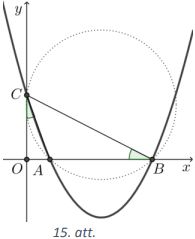

2. Ja riņķa līnijai ar $y$ asi ir divi krustpunkti, tad otru krustpunktu ar $y$
   asi apzīmējam ar $D$.

   - Ja $q \in(-\infty; 0) \cup(0; 1)$, tad $\triangle AOD \sim \triangle COB$ 
     pēc pazīmes $\ell \ell$, jo 
     $\sphericalangle DOA=\sphericalangle BOC=90^{\circ}$ un 
     $\sphericalangle ADC=\sphericalangle ABC$ kā ievilktie leņķi, kas balstās 
     uz viena un tā paša loka (skat. 16.att.). Tāpēc

     $$\frac{AO}{OC}=\frac{OD}{OB} \Rightarrow \frac{x_{1}}{q}=\frac{OD}{x_{2}} \Rightarrow OD=\frac{x_{1}x_{2}}{q}=\frac{q}{q}=1$$

   - Ja $q>1$, tad $\triangle AOD \sim \triangle COB$ pēc pazīmes $\ell \ell$, 
     jo $\sphericalangle DOA=\sphericalangle BOC=90^{\circ}$ un 
     $\sphericalangle ADO=180^{\circ}-\sphericalangle CDA=\sphericalangle CBA$ 
     pēc blakusleņķu īpašības un īpašības, ka ievilkta četrstūra pretējo leņķu 
     summa ir $180^{\circ}$ (skat. 17.att.). Tāpēc

     $$\frac{AO}{OC}=\frac{OD}{OB} \Rightarrow \frac{x_{1}}{q}=\frac{OD}{x_{2}} \Rightarrow OD=\frac{x_{1}x_{2}}{q}=\frac{q}{q}=1$$

   Tā kā punkts $D$ nevar būt $(0;-1)$, jo tad iegūst ieliektu četrstūri, kuram
   nevar apvilkt riņķa līniju, tad šīs riņķa līnijas iet caur punktu $(0; 1)$

   Līdz ar to visām šādām riņķa līnijām ir kopīgs punkts $(0; 1)$.
   
   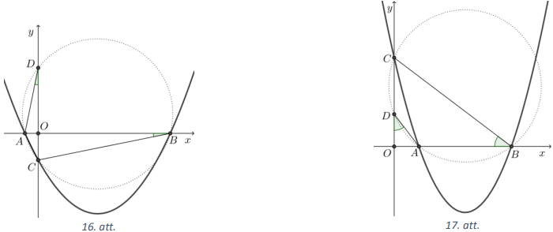

## Atrisinājums

Šo trīs krustpunktu koordinātas ir

$$(0; q), \quad\left(-\frac{p}{2}+\sqrt{\frac{p^{2}}{4}-q}; 0\right), \quad\left(-\frac{p}{2}-\sqrt{\frac{p^{2}}{4}-q}; 0\right)$$

Noteiksim, kur atrodas riņķa līnijas, kas iet caur šiem trim punktiem, centrs. 
Abscisas vērtība ir $x=-\frac{p}{2}$. Atliek noskaidrot ordinātas vērtību. 
Izmantojot riņķa līnijas ar centru punktā $(a; b)$ un rādiusu $r$ vienādojumu 
$(x-a)^{2}+(y-b)^{2}=r^{2}$, iegūstam

$$\begin{aligned}
& r^{2}=\left(0+\frac{p}{2}\right)^{2}+\left(q-y_{\text {centrs }}\right)^{2}=\left(-\frac{p}{2}+\sqrt{\frac{p^{2}}{4}-q}+\frac{p}{2}\right)^{2}+\left(0-y_{\text {centrs }}\right)^{2} \\
& \frac{p^{2}}{4}+q^{2}-2qy_{\text {centrs }}+y_{\text {centrs }}^{2}=\frac{p^{2}}{4}-q+y_{\text {centrs }}^{2} \\
& y_{\text {centrs }}=\frac{q+1}{2}
\end{aligned}$$

Tātad $r^{2}=\frac{p^{2}}{4}+\frac{(q-1)^{2}}{4}$ jeb 
$r=\frac{\sqrt{p^{2}+(q-1)^{2}}}{2}$ un riņķa līnijas centra koordinātas ir 
$\left(-\frac{p}{2}; \frac{q+1}{2}\right)$.

Aplūkojam, kāds ir attālums no punkta $(0; 1)$ līdz riņķa līnijas centram:

$$d^{2}=\left(0+\frac{p}{2}\right)^{2}+\left(1-\frac{q+1}{2}\right)^{2}=\frac{p^{2}}{4}+\frac{(1-q)^{2}}{4}=r^{2}$$

Tātad caur punktu $(0; 1)$ iet visas minētā veida riņķa līnijas.

