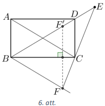

# <lo-sample/> LV.VOL.2017.9.1

Doti $63$ dažādi naturāli skaitļi, kuru summa ir $2017$. Atrodiet šos skaitļus 
un pamatojiet, ka citu nav! 

<small>

* questionType:
* domain:

</small>

## Atrisinājums

Der skaitļi $1,\ 2,\ 3,\ \ldots,\ 61,\ 62,\ 64$. Pierādīsim, ka citu nav. 
Aplūkosim $63$ mazākos naturālos skaitļus. To summa ir 
$1+2+\cdots+63=\frac{(1+63) \cdot 63}{2}=2016$. Meklēto skaitļu summa ir tikai 
par $1$ lielāka - vienīgais veids, kā to iegūt, ir skaitli $63$ aizstāt ar 
$64$.

# <lo-sample/> LV.VOL.2017.9.2

Uz taisnes atlikti punkti $P,\ Q,\ R$ un $S$ tā, ka $PQ=RS$ (skat. 1.att.). 
Nogriežņi $PQ,\ RS,\ PS,\ QR$ ir riņķu diametri. Nogrieznis $MN$ ir iekrāsotās 
figūras simetrijas ass. Pierādīt, ka iekrāsotās figūras laukums ir vienāds ar 
laukumu riņķim, kura diametrs ir $MN$.

<small>

* questionType:
* domain:

</small>

## Atrisinājums

Nogriežņu $MN$ un $QR$ krustpunktu apzīmējam ar $O,\ OQ=ON=OR=x$ (kā rādiusi) 
un $PQ=RS=y$. Simetrijas dēļ $OP=OS=OM=x+y$. Aprēķinām laukumus:

$S_{MN}=\left(\frac{MN}{2}\right)^{2} \pi=\frac{(2x+y)^{2}}{4} \pi=\frac{\pi}{4}\left(4x^{2}+4xy+y^{2}\right)=\pi\left(x^{2}+xy+\frac{1}{4} y^{2}\right);$

$S_{\text {iekrāsotais }}=\frac{1}{2} S_{QR}+\frac{1}{2} S_{PS}-S_{PQ}=\frac{1}{2} OR^{2} \pi+\frac{1}{2} OS^{2} \pi-\left(\frac{PQ}{2}\right)^{2} \pi=\pi\left(\frac{1}{2} x^{2}+\frac{1}{2}(x+y)^{2}-\left(\frac{y}{2}\right)^{2}\right)=$  

$=\pi\left(\frac{1}{2} x^{2}+\frac{1}{2} x^{2}+xy+\frac{1}{2} y^{2}-\frac{1}{4} y^{2}\right)=\pi\left(x^{2}+xy+\frac{1}{4} y^{2}\right)$.

Tātad esam pierādījuši, ka iekrāsotās figūras laukums ir vienāds ar laukumu 
riņķim, kura diametrs ir $MN$.

# <lo-sample/> LV.VOL.2017.9.3

Naturālā piecciparu skaitlī vienādus ciparus aizstāja ar vienādiem burtiem, bet
dažādus ciparus - ar dažādiem burtiem, un ieguva pierakstu $GANGA$. Zināms, ka 
$GANGA$, dalot ar $7$, dod atlikumu $A,\ GANGA$, dalot ar $11$, dod atlikumu 
$N$, bet $GANGA$, dalot ar $13$, dod atlikumu $G$, turklāt $G>A>N$. Kāds varēja
būt sākotnējais skaitlis?

<small>

* questionType:
* domain:

</small>

## Atrisinājums

No tā, ka $GANGA$, dalot ar $7$, dod atlikumu $A,\ GANGA$, dalot ar $11$, dod 
atlikumu $N$, bet $GANGA$, dalot ar $13$, dod atlikumu $G$, izriet, ka 
$(\overline{GANGA}-A)$ dalās ar $7,\ (\overline{GANGA}-N)$ dalās ar $11$ un 
$(\overline{GANGA}-G)$ dalās ar $13$.

Pārveidojam doto skaitli

$$\overline{GANGA}=\overline{GA} \cdot 1000+N \cdot 100+\overline{GA}=1001 \cdot \overline{GA}+100 N=13 \cdot 11 \cdot 7 \cdot \overline{GA}+100N$$

Pirmais saskaitāmais dalās gan ar $13$, gan ar $11$, gan ar $7$.

Lai $(\overline{GANGA}-G)$ dalītos ar $13,\ (100N-G)$ ir jādalās ar $13$. 
Ievērojot, ka

$$100N-G=91N+9N-G=13 \cdot 7N+9N-G$$

iegūstam, ka $(9N-G)$ jādalās ar $13$.

Līdzīgi, ar $7$ ir jādalās $(100N-A)$. Pārveidojot

$$100N-A=98N+2N-A=7 \cdot 14N+2N-A$$

iegūstam, ka $(2N-A)$ jādalās ar $7$.

Visbeidzot ar $11$ ir jādalās $100N-N=99 N$, kas vienmēr izpildās.

Tā kā $A$ ir atlikums, kas rodas, skaitli dalot ar $7$, tad $A \leq 6$, un tā 
kā $A>N$, tad lielākā iespējamā $N$ vērtība ir $5$. Apskatīsim visus gadījumus.

| $\boldsymbol{N}$ | $\mathbf{9N}-\boldsymbol{G}$ | $\boldsymbol{G}$, **lai** $(\mathbf{9N}-\boldsymbol{G}) \vdots \mathbf{13}$ | $\mathbf{2N}-\boldsymbol{A}$ | $\boldsymbol{A}$, **lai** $(\mathbf{2N}-\boldsymbol{A}) \vdots \mathbf{7}$ | $\overline{\mathbf{GANGA}}$ |
| :--- | :--- | :--- | :--- | :--- | :--- |
| $\mathbf{0}$ | $-G$ | $0$ (neder, jo $N=0$ ) |  |  |  |
| $\mathbf{1}$ | $9-G$ | $9$ | $2-A$ | $2$   $9$ (neder, jo $G=9)$ | $92192$ |
| $\mathbf{2}$ | $18-G$ | $5$ | $4-A$ | $4$ | $54254$ |
| $\mathbf{3}$ | $27-G$ | $1$ (neder, jo $G < N)$ |  |  |  |
| $\mathbf{4}$ | $36-G$ | nav |  |  |  |
| $\mathbf{5}$ | $45-G$ | $6$ | $10-A$ | $3$ (neder, jo $A < N$ ) |  |

Tātad sākotnējais skaitlis varēja būt $54254$ vai $92192$.

# <lo-sample/> LV.VOL.2017.9.4

Pierādīt, ka $x^{4}-x^{2}-3x+4>0$ visiem reāliem $x$.

<small>

* questionType:
* domain:

</small>

## Atrisinājums

Veicam ekvivalentus pārveidojumus:

$$\begin{gathered}
\left(x^{2}\right)^{2}-2x^{2}+1+x^{2}-2 \cdot x \cdot \frac{3}{2}+\frac{9}{4}+\frac{3}{4}>0 \\
\left(x^{2}-1\right)^{2}+\left(x-\frac{3}{2}\right)^{2}+\frac{3}{4}>0
\end{gathered}$$

Tā kā skaitļa kvadrāts ir nenegatīvs un $\frac{3}{4}$ ir pozitīvs skaitlis, tad
pēdējā nevienādība ir patiesa. Tā kā tika veikti ekvivalenti pārveidojumi, tad 
arī dotā nevienādība ir patiesa visiem reāliem skaitļiem $x$.

# <lo-sample/> LV.VOL.2017.9.5

Katra no bumbiņām, kas atrodas kastē, nokrāsota vienā no $N$ krāsām, un uz 
katras uzrakstīts naturāls skaitlis, kas nepārsniedz $N$. Zināms, ka katra no 
$N$ krāsām izmantota vismaz vienu reizi, tāpat arī katrs skaitlis, kas 
nepārsniedz $N$, izmantots vismaz vienu reizi. Kādām $N$ vērtībām kastē 
noteikti varēs atrast $N$ dažādu krāsu bumbiņas, uz kurām būs rakstīti $N$ 
dažādi skaitļi?

<small>

* questionType:
* domain:

</small>

## Atrisinājums

Ja $N=1$, tad kastē ir vismaz viena bumbiņa, kas nokrāsota vienīgajā 
iespējamajā krāsā un uz tās uzrakstīts skaitlis $1$. Tātad vērtība $N=1$ der.

Parādīsim, ja $N=2$, tad vienmēr var atrast divas bumbiņas, kam izpildās 
prasītās īpašības. Izvēlamies patvaļīgu bumbiņu. Tās krāsu apzīmējam ar 
$k_{1}$, bet skaitli, kas uz tās uzrakstīts - ar $s_{1}$. Ja kastē atrodas 
bumbiņa, kuras krāsa ir $k_{2}$ un uz kuras uzrakstīts skaitlis $s_{2}$, tad 
esam atraduši nepieciešamo bumbiņu pāri. Apskatīsim gadījumu, kad kastē nav 
bumbiņa, kuras krāsa ir $k_{2}$ un uz kuras uzrakstīts skaitlis $s_{2}$. Tā kā 
kastē ir divu dažādu krāsu bumbiņas, tad kastē ir jābūt bumbiņai, kuras krāsa 
ir $k_{2}$ un uz kuras uzrakstīts skaitlis $s_{1}$. Tā kā kastē ir bumbiņa, uz 
kuras uzrakstīts skaitlis $s_{2}$, tad kastē ir jābūt bumbiņai, kuras krāsa ir 
$k_{1}$ un uz kuras uzrakstīts skaitlis $s_{2}$. Tātad, kastē ir divas 
bumbiņas, kuru krāsas ir $k_{2}$ un $k_{1}$ un uz tām uzrakstītie skaitļi ir 
attiecīgi $s_{1}$ un $s_{2}$, kas veido nepieciešamo bumbiņu pāri.

Pamatosim, ka $N$ nevar būt lielāks kā $2$. Tabulā parādīts piemērs, kurā visas
uzdevumā minētās īpašības izpildās, bet nevar atrast $N$ dažādu krāsu bumbiņas,
uz kurām uzrakstīti visi skaitļi no $1$ līdz $N$.

# <lo-sample/> LV.VOL.2017.10.1

Dots, ka $b$ un $c$ ir naturāli skaitļi un kvadrātvienādojuma $x^{2}-bx+c=0$ 
reālās saknes ir $x_{1}$ un $x_{2}$. Pierādīt, ka **(A)** 
$x_{1}^{2}+x_{2}^{2}+2017$; **(B)** $x_{1}^{3}+x_{2}^{3}$ ir naturāls skaitlis!

<small>

* questionType:
* domain:

</small>

## Atrisinājums

No Vjeta teorēmas izriet, ka $x_{1}+x_{2}=b$ un $x_{1}x_{2}=c$. Tātad gan sakņu
summa, gan sakņu reizinājums ir naturāls skaitlis un abas saknes ir pozitīvas.

**(A)** Pārveidojam doto izteiksmi:

$$\begin{gathered}
x_{1}^{2}+x_{2}^{2}+2017=x_{1}^{2}+2x_{1}x_{2}+x_{2}^{2}-2x_{1}x_{2}+2017=\left(x_{1}+x_{2}\right)^{2}-2x_{1}x_{2}+2017= \\
=b^{2}-2c+2017
\end{gathered}$$

Tā kā naturāla skaitļa kvadrāts ir naturāls skaitlis un naturālu skaitļu summa 
vai starpība ir vesels skaitlis, tad $b^{2}-2c+2017$ ir vesels skaitlis, līdz 
ar to $x_{1}^{2}+x_{2}^{2}+2017$ arī ir vesels skaitlis. Ņemot vērā, ka 
$x_{1}^{2}+x_{2}^{2}+2017>0$, secinām, ka $x_{1}^{2}+x_{2}^{2}+2017$ ir 
naturāls skaitlis.

**(B)** Pārveidojam doto izteiksmi:

$$\begin{gathered}
x_{1}^{3}+x_{2}^{3}=\left(x_{1}+x_{2}\right)\left(x_{1}^{2}+x_{2}^{2}\right)-x_{1}x_{2}^{2}-x_{1}^{2}x_{2}=b\left(b^{2}-2c\right)-x_{1}x_{2}\left(x_{2}+x_{1}\right)= \\
=b\left(b^{2}-2c\right)-cb=b^{3}-3bc
\end{gathered}$$

Tā kā naturāla skaitļa kubs ir naturāls skaitlis un naturālu skaitļu starpība 
ir vesels skaitlis, tad $b^{3}-3bc$ ir vesels skaitlis. Tā kā 
$x_{1}^{3}+x_{2}^{3}>0$, tad $x_{1}^{3}+x_{2}^{3}$ ir naturāls skaitlis.

*Piezīme.* (B) gadīumā var izmantot formulu 
$a^{3}+b^{3}=(a+b)\left(a^{2}-ab+b^{2}\right)$.

# <lo-sample/> LV.VOL.2017.10.2

Dots pirmskaitlis, kas satur vismaz $4$ dažādus ciparus. Pierādīt, ka tā 
ciparus var pārkārtot citā secībā tā, lai jauniegūtais skaitlis nebūtu 
pirmskaitlis!

<small>

* questionType:
* domain:

</small>

## Atrisinājums

Ja pirmskaitlis satur kādu no cipariem $0,\ 2,\ 4,\ 5,\ 6$ vai $8$, tad, 
izveidojot skaitli, kur šis cipars ir pēdējais, būsim ieguvuši skaitli, kas 
dalās ar $2$ vai $5$, tātad nav pirmskaitlis. Atliek aplūkot gadījumu, kad 
pirmskaitlis satur tikai ciparus $1,\ 3,\ 7$ un $9$.

Aplūkojam septiņus skaitļus 
$x \cdot 10^{4}+1379,\ x \cdot 10^{4}+1397,\ x \cdot 10^{4}+1739,\ x \cdot 10^{4}+1793,\ x \cdot 10^{4}+1937,\ x \cdot 10^{4}+1973,\ x \cdot 10^{4}+3719$,
kur $x$ ir skaitlis, kura pieraksts veidots no atlikušajiem dotā pirmskaitļa 
cipariem, kas paliek, ja pa vienai reizei izmanto ciparus $1,\ 3,\ 7$ un $9$ 
($x=0$, ja dotais bija četrciparu skaitlis).

Aplūkojam atlikumus, kas rodas dalot šos skaitļus ar $7$, turklāt uzskatīsim, 
ka, skaitli $x \cdot 10^{4}$ dalot ar $7$, atlikumā iegūst $y$, kur 
$y \in\{0; 1; 2; 3; 4; 5; 6\}$.

| **Skaitlis** | **Atlikums, dalot ar $7$** |
| :---: | :---: |
| $x \cdot 10^{4}+1379$ | $y$ |
| $x \cdot 10^{4}+1397$ | $y+4$ |
| $x \cdot 10^{4}+1739$ | $y+3$ |
| $x \cdot 10^{4}+1793$ | $y+1$ |
| $x \cdot 10^{4}+1937$ | $y+5$ |
| $x \cdot 10^{4}+1973$ | $y+6$ |
| $x \cdot 10^{4}+3719$ | $y+2$ |

Ievērojam, ka, neatkarīgi no $y$ vērtības, kāds no skaitļiem dalīsies ar $7$, 
tātad nebūs pirmskaitlis.

Līdz ar to esam pierādījuši vajadzīgo.

# <lo-sample/> LV.VOL.2017.10.3

Četrstūris $ABCD$ ir ievilkts riņķa līnijā $\omega_{1}$, bet $ABCD$ malu 
viduspunkti atrodas uz riņķa līnijas $\omega_{2}$. Pierādīt, ka 
$\sphericalangle ABD+\sphericalangle BDC=90^{\circ}$.

<small>

* questionType:
* domain:

</small>

## Atrisinājums

Apzīmēsim malu $AB,\ BC,\ CD$ un $DA$ malu viduspunktus attiecīgi ar 
$E,\ F,\ G$ un $H$ (skat. 2.att.). Nogrieznis $EF$ ir trijstūra $ABC$ 
viduslīnija, tāpēc $EF \parallel AC$ un $EF=\frac{1}{2} AC$. Līdzīgi, $HG$ ir 
$\triangle ACD$ viduslīnija, tāpēc $HG \parallel AC$ un $HG=\frac{1}{2} AC$.

No $\triangle ABD$ un $\triangle BCD$ līdzīgi iegūst, ka $EH=FG=\frac{1}{2} BD$
un $EH \parallel FG$.

Tātad četrstūris $EFGH$ ir paralelograms, jo tā pretējās malas ir vienādas. Tā 
kā visas četrstūra $EFGH$ virsotnes atrodas uz riņķa līnijas $\omega_{2}$, tad 
$EFGH$ ir taisnstūris, no kurienes izriet, ka $BD \perp AC$. Tātad 
$\triangle DOC$ (punkts $O$ ir $AC$ un $BD$ krustpunkts) ir taisnleņķa un 
$\sphericalangle ODC+\sphericalangle OCD=90^{\circ}$ jeb 
$\sphericalangle BDC+\sphericalangle ACD=90^{\circ}$. Tā kā 
$\sphericalangle ABD=\sphericalangle ACD$ kā ievilktie leņķi, kas balstās uz 
viena un tā paša loka $AD$, tad 
$\sphericalangle BDC+\sphericalangle ABD=90^{\circ}$.

# <lo-sample/> LV.VOL.2017.10.4

Dotas $40$ kartītes, uz divām no tām uzrakstīts skaitlis $1$, uz divām - 
skaitlis $2,\ \ldots$, uz divām - skaitlis $20$. Kāds ir lielākais iespējamais
komplektu skaits, ko vienlaicīgi var izveidot no šīm $40$ kartītēm tā, lai 
katrā komplektā būtu trīs kartītes, uz kurām uzrakstīto skaitļu summa ir $21$?

<small>

* questionType:
* domain:

</small>

## Atrisinājums

Lielākais komplektu skaits ir astoņi, piemēram, 
$(6,\ 7,\ 8);\ (5,\ 7,\ 9);\ (4,\ 5,\ 12);\ (3,\ 4,\ 14);\ (3,\ 6,\ 12);\ (2,\ 8,\ 11);\ (2,\ 9,\ 10);\ (1,\ 1,\ 19)$.

Pierādīsim, ka vairāk kā astoņus komplektus izveidot nevar. Ja varētu izveidot 
deviņus komplektus, tad būtu izmantotas $27$ kartītes un uz tām uzrakstīto 
skaitļu summa būtu $9 \cdot 21=189$, bet pati mazākā skaitļu summa, ko var 
iegūt no $27$ kartītēm, ir

$$2 \cdot 1+2 \cdot 2+2 \cdot 3+\cdots+2 \cdot 13+14=2 \cdot(1+2+\cdots+13)+14=2 \cdot \frac{(1+13) \cdot 13}{2}+14=196$$

kas jau ir lielāka nekā $189$. Tātad deviņus komplektus izveidot nevar.

# <lo-sample/> LV.VOL.2017.10.5

Seši tūristi bija devušies vairākos ceļojumos uz sešām valstīm, katrā ceļojumā 
viens tūrists apceļoja tieši vienu valsti. Ja izvēlamies jebkuras trīs valstis 
un jebkurus trīs tūristus, tad vismaz viens no viņiem ir bijis ceļojumā uz kādu
no šīm valstīm. Kāds ir mazākais iespējamais kopējais ceļojumu skaits?

<small>

* questionType:
* domain:

</small>

## Atrisinājums

Mazākais iespējamais kopējais ceļojumu skaits ir $10$. Rakstīsim ceļojumus 
$6 \times 6$ tabulā, rindiņas atbildīs tūristiem, kolonnas - valstīm, ja 
tūrists ir bijis ceļojumā uz kādu valsti, tad šajā rūtiņā liksim krustiņu. 
Pamatosim, ka der tabulā parādītais piemērs. Viegli redzēt, ka jebkuri $3$ 
tūristi ir kopumā apmeklējuši vismaz $4$ valstis, tātad, izvēloties jebkuras 
$3$ valstis, vismaz vienu no tām kāds no šiem tūristiem būs apmeklējis.

Pierādīsim, ka ar deviņiem ceļojumiem nepietiek. Aplūkosim $3$ tūristus, kuri 
ir devušies vismazāk ceļojumos. Vispirms pamatosim, ka tie kopā ir devušies ne 
vairāk kā $3$ ceļojumos. Ja tie būtu devušies četros ceļojumos, tad vismaz kāds
no tiem būtu devies divos ceļojumos, tātad arī atlikušie $3$ tūristi katrs būtu
devušies vismaz divos ceļojumos (jo mēs aplūkojam tūristus, kas ir ceļojuši 
vismazāk). Tātad kopējais ceļojumu skaits ir vismaz $4+2 \cdot 3=10$ un iegūta 
pretruna. Līdz ar to ir $3$ tūristi, kas kopā ir devušies ne vairāk kā $3$ 
ceļojumos, tātad tie kopā apmeklējuši ne vairāk kā $3$ valstis. Tāpēc ir vismaz
$3$ valstis, ko neviens no šiem trim tūristiem nav apmeklējis, kas ir pretrunā 
ar uzdevuma nosacījumiem.

# <lo-sample/> LV.VOL.2017.11.1

Cik ir tādu piecciparu skaitļu, kam katrs nākamais cipars ir lielāks par 
iepriekšējo?

<small>

* questionType:
* domain:

</small>

## Atrisinājums

Katru šādu piecciparu skaitli var iegūt izsvītrojot $4$ ciparus no skaitļa 
$123456789$. Tā kā četrus ciparus var izvēlēties 
$C_{9}^{4}=\frac{9 \cdot 8 \cdot 7 \cdot 6}{4 \cdot 3 \cdot 2 \cdot 1}=126$ 
veidos, tad ir tieši $126$ šādi piecciparu skaitļi.

# <lo-sample/> LV.VOL.2017.11.2

Kurš no skaitļiem $(\sqrt{7})^{\sqrt{5}}$ un $(\sqrt{5})^{\sqrt{7}}$ ir 
lielāks?

<small>

* questionType:
* domain:

</small>

## Atrisinājums

Lielāks ir skaitlis $(\sqrt{7})^{\sqrt{5}}$. Kāpināsim abus skaitļus pakāpē 
$2 \sqrt{5}$ un pierādīsim, ka 
$(\sqrt{5})^{\sqrt{7} \cdot 2 \sqrt{5}}<(\sqrt{7})^{\sqrt{5} \cdot 2 \sqrt{5}}$.
Tas savukārt izriet no tā, ka 
$(\sqrt{7})^{\sqrt{5} \cdot 2 \sqrt{5}}=7^{5}=16087$, bet 
$(\sqrt{5})^{\sqrt{7} \cdot 2 \sqrt{5}}=5^{\sqrt{35}}<5^{6}=15625$.

# <lo-sample/> LV.VOL.2017.11.3

Trīs riņķa līnijas $\omega_{1},\ \omega_{2}$ un $\omega_{3}$ krustojas punktā 
$O$. Riņķa līnijas pa pāriem krustojas arī punktos $P\left(\omega_{1}\right.$ 
un $\left.\omega_{2}\right), R\left(\omega_{2}\right.$ un 
$\left.\omega_{3}\right)$ un $S\left(\omega_{1}\right.$ un 
$\left.\omega_{3}\right)$. Uz $\omega_{1}$ loka $P S$, kas nesatur $O$, 
izvēlēts punkts $A$, taisne $AP$ vēlreiz krusto $\omega_{2}$ punktā $B$, un 
taisne $AS$ vēlreiz krusto $\omega_{3}$ punktā $C$. Pierādīt, ka punkti $B,\ R$
un $C$ atrodas uz vienas taisnes!

<small>

* questionType:
* domain:

</small>

## Atrisinājums

Savienojam punktu $R$ ar $B$ un $C$ (skat. 3.att.), pietiek pierādīt, ka 
$\sphericalangle BRC=180^{\circ}$. Tā kā ievilkta četrstūra pretējo leņķu summa
ir $180^{\circ}$ un blakusleņķu summa ir $180^{\circ}$, tad 
$\sphericalangle BRO=180^{\circ}-\sphericalangle BPO=\sphericalangle APO$. 
Līdzīgi iegūst 
$\sphericalangle CRO=180^{\circ}-\sphericalangle CSO=\sphericalangle ASO$. Tātad
$\sphericalangle BRC=\sphericalangle BRO+\sphericalangle CRO=\sphericalangle APO+\sphericalangle ASO=180^{\circ}$
kā ievilktā četrstūra pretējo leņķu summa.

# <lo-sample/> LV.VOL.2017.11.4

Pierādīt, ka no jebkuriem $17$ naturāliem skaitļiem var izvēlēties $9$ skaitļus
tā, lai to summa dalītos ar $9$.

<small>

* questionType:
* domain:

</small>

## Atrisinājums

Pierādīsim, ka no jebkuriem pieciem naturāliem skaitļiem var izvēlēties trīs 
skaitļus tā, ka to summa dalās ar $3$. Skaitli, dalot ar $3$, var iegūt 
atlikumu $0;\ 1$ vai $2$.

- Ja starp pieciem dotajiem skaitļiem ir trīs skaitļi, kas dod vienādu 
  atlikumu, dalot ar $3$, tad to summa dalās ar $3$, jo 
  $0+0+0 \equiv 0(\bmod 3);\ 1+1+1 \equiv 0(\bmod 3);\ 2+2+2 \equiv 0(\bmod 3)$.
- Ja nav trīs skaitļu, kas dod vienādu atlikumu, dalot ar $3$, tad ir vismaz 
  viens skaitlis no katra atlikuma veida. Šo trīs skaitļu summa dalās ar $3$, 
  jo $0+1+2 \equiv 0(\bmod 3)$.

Izmantojot iepriekš pierādīto, no sākotnējiem $17$ skaitļiem varam izveidot 
piecas grupas pa trīs skaitļiem tā, lai tajās esošo skaitļu summa dalās ar $3$.
Apzīmējam

$\{a_{1}, a_{2}, a_{3} \}$; $\{b_{1}, b_{2}, b_{3}\}$; $\{c_{1}, c_{2}, c_{3}\}$; $\{d_{1}, d_{2}, d_{3}\}$; $\{e_{1}, e_{2}, e_{3}\}.$

Skaitļus, kurus iegūst katras grupas skaitļu summu dalot ar $3$, apzīmējam 
attiecīgi ar $A,\ B,\ C,\ D$ un $E$. No iepriekš pierādītā izriet, ka no šiem 
pieciem iegūtajiem skaitļiem var izvēlēties trīs tā, ka to summa dalās ar $3$. 
Nezaudējot vispārīgumu, pieņemsim, ka $A+B+C$ dalās ar $3$ jeb

$$A+B+C=3n,$$

kur $n$ - naturāls skaitlis. Tā kā 
$A=\frac{a_{1}+a_{2}+a_{3}}{3};\ B=\frac{b_{1}+b_{2}+b_{3}}{3};\ C=\frac{c_{1}+c_{2}+c_{3}}{3}$,
tad iegūstam

$$\frac{a_{1}+a_{2}+a_{3}}{3}+\frac{b_{1}+b_{2}+b_{3}}{3}+\frac{c_{1}+c_{2}+c_{3}}{3}=3n$$

Reizinot abas vienādības puses ar $3$, iegūstam

$$a_{1}+a_{2}+a_{3}+b_{1}+b_{2}+b_{3}+c_{1}+c_{2}+c_{3}=9n.$$

Tātad esam ieguvuši, ka $a_{1}+a_{2}+a_{3}+b_{1}+b_{2}+b_{3}+c_{1}+c_{2}+c_{3}$
dalās ar $9$ un prasītais ir pierādīts.

# <lo-sample/> LV.VOL.2017.11.5

Uz riņķa līnijas atzīmēti $N$ punkti tā, ka šie punkti ir regulāra $N$ - stūra 
virsotnes. Spēlētāji $A$ un $B$ spēlē šādu spēli: Viņi pārmaiņus novelk pa 
vienai hordai, kas savieno divus atzīmētos punktus uz riņķa līnijas tā, lai 
novilktā horda nekrustotos ar agrāk novilktajām hordām. Uzvar tas spēlētājs, 
pēc kura gājiena no novilktajām hordām izveidojas trijstūris. Kurš spēlētājs 
noteikti var uzvarēt, ja $A$ izdara pirmo gājienu un **(A)** $N=14$; **(B)** 
$N=15$?

<small>

* questionType:
* domain:

</small>

## Atrisinājums

**(A)** Ja $N=14$, tad noteikti var uzvarēt spēlētājs $A$. Pirmajā gājienā 
spēlētājam $A$ jānovelk diametrs. Pēc katra spēlētāja $B$ gājiena spēlētājs $A$
pārbauda, vai ir iespējams novilkt hordu tā, lai veidotos trijstūris. Ja tādu 
hordu var novilkt, tad spēlētājs $A$ to novelk un līdz ar to uzvar. Ja tādu 
hordu nav iespējams novilkt, tad spēlētājs $A$ velk hordu, kas ir simetriska 
spēlētāja $B$ tikko novilktajai hordai attiecībā pret pirmajā gājienā novilkto 
diametru (piemēram, skat. 4.att.). Kamēr spēlētājs $B$ var novilkt hordu, arī 
spēlētājs $A$ simetriski attiecībā pret novilkto diametru var novilkt hordu. Tā
kā iespējas novilkt hordu ar katru gājienu samazinās, tad pienāks brīdis, kad 
$B$ novilks hordu tā, ka spēlētājs $A$ savā nākamajā gājienā varēs izveidot 
trijstūri un būs uzvarējis.

**(B)** Ja $N=15$, tad noteikti var uzvarēt spēlētājs $B$. Tā kā pēdējā gājienā
tiek novilkta trijstūra trešā mala (to izdara uzvarētājs) un pirmspēdējā 
gājienā tiek novilkta trijstūra otrā mala (to izdara zaudētājs), tad, lai 
uzvarētu, spēlētāji visā spēles gaitā izvairās vilkt tās hordas, kurām kāda 
virsotne sakrīt ar jau novilktu hordu. Tāpēc varam analizēt šādu spēli: 
spēlētāji velk hordas tā, lai tās nekrustotos un lai neizmantotu ar novilktajām
hordām kopīgus galapunktus, tādā gadījumā uzvarētājs ir tas, kurš novelk pēdējo
šādu hordu. Neizmantotos punktus jau novilktās hordas sadala vairākās grupās - 
vienā grupā nonāk tie punkti, kurus joprojām var savienot ar hordu. Katrā 
gājienā spēlētājs var izvēlēties vienu no esošajām grupām un tajās esošos 
punktus ar hordu sadalīt divās grupās. Tās grupas, kurās ir $0$ vai $1$ punkts,
atmetam, jo tās neiespaido turpmāko spēles gaitu.

Piemēram, pirms tiek novilkta horda $CE$ (skat. 5.att.), brīvie punkti sadalās 
grupās: $\{A, B, H, I\};\{C, E, F, G\}$ (tā kā punkts $D$ ir viens pats, tad to
vienojāmies atmest). Šo pozīciju, kad ir divas grupas katrā pa $4$ 
neizmantotiem punktiem, apzīmēsim $(4, 4)$. Tad, kad tiek novilkta horda $CE$, 
iegūstam grupas : $\{A, B, H, I\}$ un $\{F, G\}$. Tātad tiek izdarīts gājiens 
no pozīcijas $(4, 4)$ uz pozīciju $(4, 2)$, apzīmēsim 
$(4, 4) \rightarrow(4, 2)$.

Lai pierādītu, ka spēlētājs $B$ noteikti var uzvarēt, aplūkosim visus 
iespējamos spēlētāja $A$ gājienus no sākuma pozīcijas $(15)$ un katram no šiem 
gājieniem atradīsim atbilstošu spēlētāja $B$ gājienu, kas viņam nodrošinās 
uzvaru. Starp $15$ punktiem spēlētājs $A$ var novilkt hordu septiņos dažādos 
veidos, katrā no šiem gadījumiem spēlētājs $B$ var turpināt šādi:

$$15 \rightarrow\left\{\begin{aligned}
(13) & \rightarrow(\mathbf{8}, \mathbf{3}) \\
(12) & \rightarrow(\mathbf{5}, \mathbf{5}) \\
(11,2) & \rightarrow(\mathbf{8}, \mathbf{2}) \\
(10,3) & \rightarrow(\mathbf{8}, \mathbf{3}) \\
(9,4) & \rightarrow(\mathbf{9}) \\
(8,5) & \rightarrow(\mathbf{5}, \mathbf{5}) \\
(7,6) & \rightarrow(\mathbf{7}, \mathbf{3})
\end{aligned}\right.$$

Pamatosim, ka treknrakstā izceltās pozīcijas ir "uzvarošās", tas ir, ja šādā 
pozīcijā spēlētājs nonāk, tad viņš sev var nodrošināt uzvaru.

Ievērosim, ja pēc spēlētāja $B$ gājiena ir pozīcija 
$(\boldsymbol{m}, \boldsymbol{m})$, tad spēlētājs $B$ var uzvarēt, turpmāk 
izdarot pretinieka gājieniem simetriskus gājienus otrā punktu grupā.

Spēlētājs $A$ no pozīcijas $(\mathbf{8}, \mathbf{3})$ un no pozīcijas 
$(\mathbf{8}, \mathbf{2})$ hordu var novilkt piecos dažādos veidos, katrā no 
šiem gadījumiem spēlētājs $B$ var turpināt šādi:

$$(\mathbf{8}, \mathbf{3}) \rightarrow\left\{\begin{array} {c} 
{(8) \rightarrow ( \mathbf {3, 3})} \\
{(6, 3) \rightarrow ( \mathbf {3, 3})} \\
{(5, 3) \rightarrow ( \mathbf {3, 3})} \\
{(4, 2, 3) \rightarrow ( \mathbf {2, 3}} \\
{(3, 3, 3) \rightarrow ( \mathbf {3, 3}}
\end{array} \right. \quad ( \mathbf {8} , \mathbf {2}) \rightarrow \left\{\begin{array}{c}
(8) \rightarrow(\mathbf{3,3}) \\
(6,2) \rightarrow(\mathbf{2,3}) \\
(5,2) \rightarrow(\mathbf{2,3}) \\
(4,2,2) \rightarrow(\mathbf{2, 2}) \\
(3,3,2) \rightarrow(\mathbf{3,3})
\end{array}\right.$$

Pozīcija $(2,3)$ ir uzvarošā spēlētājam $B$, jo no tās var izdarīt tieši divus 
gājienus.

Spēlēājs $A$ no pozīcijas $(9)$ un no pozīcijas $(7,3)$ hordu var novilkt 
četros dažādos veidos, katrā no šiem gadījumiem spēlētājs $B$ var turpināt 
šādi:

$$(\mathbf{9}) \rightarrow\left\{\begin{array} {c} 
{(7) \rightarrow (\mathbf{2, 3})} \\
{(6) \rightarrow (\mathbf{2, 2})} \\
{(5, 2) \rightarrow (\mathbf{2, 2})} \\
{(4, 3) \rightarrow (\mathbf{2, 3})}
\end{array} \right. \quad (\mathbf{7, 3}) \rightarrow \left\{\begin{array}{c}
(7) \rightarrow(\mathbf{2,3}) \\
(6) \rightarrow(\mathbf{2,2}) \\
(5,2) \rightarrow(\mathbf{2,2}) \\
(4,3) \rightarrow(\mathbf{2,3})
\end{array}\right.$$

Līdz ar to esam ieguvuši uzvarošu stratēģiju spēlētājam $B$: katrā savā gājienā
viņš novelk hordu tā, lai nonāktu "uzvarošajā" pozīcijā, kas izcelta 
treknrakstā. Visos gadījumos spēlētājs $B$ nonāks pozīcijā $(2,3)$ vai 
$(\boldsymbol{m}, \boldsymbol{m})$ un vēl pēc pāra skaita gājieniem būs tas, 
kurš novelk pēdējo hordu, kurai ar jau novilktajām hordām nav kopīgu 
galapunktu.

# <lo-sample/> LV.VOL.2017.12.1

Doti tādi skaitļi $a,\ b$ un $c$, ka $a+c=\frac{b}{3^{3}}$, turklāt neviens no 
skaitļiem $a,\ b,\ c$ nav $0$. Pierādit, ka $f(x)=ax^{2}+bx+c$ grafiks noteikti
krusto $x$ asi kādā intervāla $[-1 ; 1]$ punktā!

<small>

* questionType:
* domain:

</small>

## Atrisinājums

Ievērojam, ka funkcijas vērtībām $f(-1)$ un $f(1)$ ir dažādas zīmes:

$f(-1)=a-b+c=\frac{b}{3}-b=-\frac{2b}{3}$;

$f(1)=a+b+c=\frac{b}{3}+b=\frac{4b}{3}$.

Tādā gadījumā skaidrs, ka šajā intervālā $[-1,1]$ funkcijas grafikam ir 
jākrusto $x$ ass.

# <lo-sample/> LV.VOL.2017.12.2

Pierādī, ka $\sqrt{x^{2}+y^{2}}+(2-\sqrt{2}) \sqrt{xy} \geq x+y$, ja $x$ un $y$
ir reāli pozitīvi skaitļi!

<small>

* questionType:
* domain:

</small>

## Atrisinājums

Tā kā abas nevienādības puses ir pozitīvas, tad, kāpinot kvadrātā, iegūstam

$$\begin{gathered}
x^{2}+y^{2}+2 \cdot \sqrt{x^{2}+y^{2}} \cdot(2-\sqrt{2}) \sqrt{xy}+(4-4 \sqrt{2}+2) xy \geq x^{2}+2xy+y^{2} \\
2 \cdot \sqrt{x^{2}+y^{2}} \cdot(2-\sqrt{2}) \sqrt{xy} \geq 4(\sqrt{2}-1) xy
\end{gathered}$$

Izdalot abas nevienādības puses ar $2 \sqrt{xy}>0$ un pēc tam kāpinot abas 
nevienādības puses kvadrātā (abas puses ir pozitīvas), pakāpeniski iegūstam

$$\begin{aligned}
& \sqrt{x^{2}+y^{2}} \cdot(2-\sqrt{2}) \geq 2(\sqrt{2}-1) \sqrt{xy} \\
& \left(x^{2}+y^{2}\right) \cdot(6-4 \sqrt{2}) \geq 4(3-2 \sqrt{2}) xy
\end{aligned}$$

Izdalot abas nevienādības puses ar $(6-4 \sqrt{2})>0$, iegūstam 
$x^{2}+y^{2} \geq 2xy$ jeb $(x-y)^{2} \geq 0$.

Tā kā skaitļa kvadrāts ir nenegatīvs, tad pēdējā nevienādība ir patiesa. Tā kā 
tika veikti ekvivalenti pārveidojumi, tad arī dotā nevienādība ir patiesa 
visiem reāliem skaitļiem $x$.

# <lo-sample/> LV.VOL.2017.12.3

Dots taisnstūris $ABCD$. Uz taisnes $BD$ atlikts punkts $E$, tā ka $D$ atrodas 
starp $B$ un $E$. Uz taisnes $EC$ atlikts punkts $F$ tā, ka $BF$ ir paralēls 
$AC$. Pierādīt, ka trijstūra $BEF$ laukums ir lielāks nekā taisnstūra $ABCD$ 
laukums!

<small>

* questionType:
* domain:

</small>

## Atrisinājums

No punkta $F$ velkam perpendikulu pret taisni $BC$, šī perpendikula krustpunktu
ar $BD$ apzīmējam ar $F^{\prime}$ (skat. 6.att.). Ievērojam, ka 
$\sphericalangle CAD=\sphericalangle FBC$ kā leņķi, kuru malas atrodas uz 
paralēlām taisnēm, un $\sphericalangle CAD=\sphericalangle CBF^{\prime}$ 
(taisnstūra īpašība), tātad $\sphericalangle FBC=CBF^{\prime}$ un trijstūris 
$FBF^{\prime}$ ir vienādsānu, no kā izriet, ka punkti $F$ un $F^{\prime}$ ir 
simetriski attiecībā pret taisni $BC$.

Simetrijas dēļ $S(BFC)=S\left(BF^{\prime}C\right)$ un 
$S(ABCD)=2 \cdot S(BFC)+2 \cdot S\left(CDF^{\prime}\right)$, līdz ar to pietiek
pierādīt, ka $S(CDE)>S\left(CDF^{\prime}\right)$.

Apzīmējam $\sphericalangle F^{\prime}CD=\alpha$, tad simetrijas dēļ 
$\sphericalangle FCB=\sphericalangle BCF^{\prime}=90^{\circ}-\alpha$ un 
$\sphericalangle ECD=180^{\circ}-\sphericalangle FCB-\sphericalangle BCF^{\prime}-\sphericalangle F^{\prime}CD=180^{\circ}-2 \cdot\left(90^{\circ}-\alpha\right)-\alpha=\alpha .$
Līdz ar to $S(CDE)=\frac{1}{2} CE \cdot CD \cdot \sin \alpha$ un 
$S\left(CDF^{\prime}\right)=\frac{1}{2} CF^{\prime} \cdot CD \cdot \sin \alpha$,
tātad atliek pamatot, ka $CE>CF^{\prime}$ jeb $CE>CF$. Tā kā $BE>BF^{\prime}=BF$
un nogrieznis $BC$ ir trijstūra $EBF$ bisektrise, tad no bisektrises īpašības 
izriet, ka $CE>CF$.

## Atrisinājums

Apzīmējam $AB=CD=a,\ DE=p,\ OA=OB=OC=OD=y$ (kur punkts $O$ ir diagonālu 
krustpunkts), $BF=x$ un 
$\sphericalangle DBC=\sphericalangle DAC=\sphericalangle CBF=\alpha$ (skat. 
7.att.). Trijstūra $BEC$ augstums pret $BC$ ir $h_{1}$, bet trijstūra $BFC$ 
augstums pret $BC$ ir $h_{2}$.

Tad $S(ABCD)=BC \cdot a$ un 
$S(BEF)=S(BEC)+S(BCF)=\frac{1}{2} BC \cdot h_{1}+\frac{1}{2} BC \cdot h_{2}=BC \cdot \frac{h_{1}+h_{2}}{2}$.

Tātad nepieciešams pierādīt, ka $h_{1}+h_{2}>2a$.

Tā kā $\triangle OEC \sim \triangle BEF$, jo leņķi $BEF$ krusto divas paralēlas
taisnes $OC$ un $BF$, tad $\frac{OE}{BE}=\frac{OC}{BF}$ jeb 
$\frac{p+y}{p+2y}=\frac{y}{x}$. Izsakām $x=y \cdot \frac{p+2y}{p+y}$.

No $\triangle BCD$ iegūstam, ka $\sin \alpha=\frac{CD}{BD}=\frac{a}{2y}$.

Apskatām summu $h_{1}+h_{2}$ :

$$h_{1}+h_{2}=(2y+p) \sin \alpha+x \sin \alpha=(2y+p+x) \sin \alpha=\left(2y+p+y \frac{p+2y}{p+y}\right) \frac{a}{2y}=a \frac{p^{2}+4py+4y^{2}}{2py+2y^{2}}$$

Tā kā $p>0$, tad $p^{2}>0$ un 
$a \frac{p^{2}+4py+4y^{2}}{2py+2y^{2}}>a \frac{p^{2}+4py+4y^{2}}{\frac{p^{2}}{2}+2p y+2y^{2}}=2a$,
kas arī bija jāpierāda.

# <lo-sample/> LV.VOL.2017.12.4

Naturālu skaitli sauksim par *skaistu*, ja tā visu naturālo dalītāju summa 
(ieskaitot $1$ un pašu skaitli) ir nepāra skaitlis. Atrast mazāko naturālo 
skaiti $k$ ar īpašību: starp jebkuriem patvaļīgi izvēlētiem $k$ *skaistiem* 
skaitļiem var izvēlēties divus dažādus skaitļus tā, lai to reizinājums būtu 
naturāla skaitļa kvadrāts!

<small>

* questionType:
* domain:

</small>

## Atrisinājums

Mazākā $k$ vērtība ir $3$.

Ievērojam, ka $k=2$ neder, jo, piemēram, izvēloties *skaistus* skaitļus $2$ un 
$9$ (dalītāju summa ir attiecīgi $1+2=3$ un $1+3+9=13$), to reizinājums 
$2 \cdot 9=18$ nav naturāla skaitļa kvadrāts.

Pierādīsim, ka ar $k=3$ pietiek. Jebkuru naturālu skaitli $n$ var izteikt formā
$n=2^{u} \cdot v$, kur $v$ ir nepāra skaitlis. Skaidrs, ja $n$ ir *skaists*, tad 
arī $v$ ir *skaists*, jo visi $n$ nepāra dalītāji ir visi $v$ dalītāji, bet pāra 
dalītāji nemaina dalītāju summas paritāti. Visi $v$ dalītāji ir nepāra skaitļi,
sadalām tos pāros tā, ka vienā pārī ietilpst $v$ dalītāji, kuru reizinājums ir 
$v$. Iespējami divi gadījumi.

- Ja $v$ nav naturāla skaitļa kvadrāts, tad visus dalītājus šādi var sadalīt 
  pāros, tātad to summa ir pāra skaitlis, tātad $v$ šādā gadījumā nav *skaists*.
- Ja $v$ ir naturāla skaitļa kvadrāts, tas ir, $v=k^{2}$, tad visi dalītāji, 
  izņemot $k$, sadalās pāros. Tātad šādā gadījumā dalītāju skaits ir nepāra 
  skaitlis un to summa arī ir nepāra, tātad $v$ ir *skaists*.

No tā secinām, ka $n$ ir *skaists*, ja $v$ ir kvadrāts.

Ja doti trīs *skaisti* skaitļi 
$n_{1}=2^{u_{1}} \cdot v_{1},\ n_{2}=2^{u_{2}} \cdot v_{2}$ un 
$n_{3}=2^{u_{3}} \cdot v_{3}$, tad divi no skaitļiem $u_{1}, u_{2}$, $u_{3}$ 
būs ar vienādu paritāti, ja sareizina attiecīgos *skaistos* skaitļus 
(pieņemsim, ka tie ir $n_{1}$ un $n_{2}$), tad redzams, ka reizinājums 
$n_{1} \cdot n_{2}=2^{u1+u2} v_{1}v_{2}$ ir naturāla skaitļa kvadrāts.

# <lo-sample/> LV.VOL.2017.12.5

Kādā valstī no parlamenta deputātiem ir izveidotas $100$ komisijas. Katram 
deputātam ir pienākums strādāt vismaz vienā komisijā, taču deputāti drīkst 
strādāt arī vairākās komisijās. Deputāti par darbu komisijās katru mēnesi saņem
atalgojumu pēc šāda principa:

- par darbu pirmajā komisijā netiek maksāts atalgojums;
- par darbu katrā nākamajā komisijā tiek maksāts par $10$ eiro vairāk nekā par 
  darbu iepriekšējā komisijā (tas ir, par darbu otrajā komisijā tiek maksāti 
  $10$ eiro, par darbu trešajā komisijā tiek maksāti $20$ eiro utt.).

Zināms, ka jebkurām divām dažādām komisijām ir tieši viens kopīgs deputāts, kas
darbojas tajās abās. Cik liels ir visu deputātu kopējais mēneša atalgojums par 
darbu komisijās?

<small>

* questionType:
* domain:

</small>

## Atrisinājums

Sanumurējam deputātus ar numuriem $1, 2, 3, \ldots, n$. Ar $k(d)$ apzīmējam 
visu komisiju skaitu, kurās strādā deputāts $d$. No dotā izriet, ka deputāts 
$d$ par darbu komisijās mēnesī saņem 
$10 \cdot(0+1+2+\cdots+k(d)-1)=10 \cdot \frac{k(d)(k(d)-1)}{2}=10 \cdot C_{k(d)}^{2}$
eiro. Līdz ar to visi deputāti kopā par darbu komisijās mēnesī saņem 
$10 \cdot\left(C_{k(1)}^{2}+C_{k(2)}^{2}+\cdots+C_{k(n)}^{2}\right)$ eiro.

Saskaitīsim, cik ir tādu pāru $\{A; B\}$, ka $A$ un $B$ ir dažādas komisijas:

- Tā kā pavisam ir $100$ komisijas, tad dažādo komisiju pāru skaits ir 
  $C_{100}^{2}=\frac{100 \cdot 99}{2}=4950$.
- Katram šādam pārim atbilst tieši viens deputāts $d$, kas strādā gan $A$, gan 
  $B$, tātad visus komisiju pārus var sadalīt $n$ grupās tā, ka katram komisiju
  pārim $\{A; B\}$ no $d$ - tās grupas, $d=1,2, \ldots, n$, ir kopīgs deputāts.
  Tādā gadījumā $d$ - tajā grupā ir tieši $C_{k(d)}^{2}$ komisiju pāri (jo no 
  deputāta $d$ apmeklētajām komisijām var izveidot $C_{k(d)}^{2}$ komisiju 
  pārus). Tā kā katrs komisiju pāris $\{A; B\}$ pieder tieši vienai no šīm $n$ 
  grupām, tad no summas likuma izriet, ka pāru $\{A; B\}$ skaits ir 
  $C_{k(1)}^{2}+C_{k(2)}^{2}+\cdots+C_{k(n)}^{2}$

Vienu un to pašu lielumu esam saskaitījuši divos dažādos veidos, tātad abos 
gadījumos iegūtie skaitļi ir vienādi:

$$C_{k(1)}^{2}+C_{k(2)}^{2}+\cdots+C_{k(n)}^{2}=4950$$

Līdz ar to esam ieguvuši, ka visi parlamenta deputāti kopā par darbu komisijās 
mēnesī saņem

$10 \cdot\left(C_{k(1)}^{2}+C_{k(2)}^{2}+\cdots+C_{k(n)}^{2}\right)=49500$ eiro.

