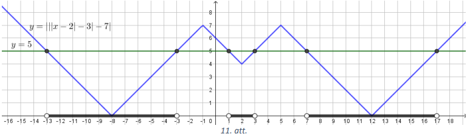

# <lo-sample/> LV.VOL.2018.9.1

Zināms, ka $a$ un $b$ ir pozitīvi skaitļi, un kvadrātfunkciju 
$y=ax^{2}+2018x+b$ un $y=bx^{2}+2018x+a$ minimālo vērtību summa ir nulle. 
Pierādīt, ka katrai no šīm kvadrātfunkcijām minimālā vērtība ir nulle!

<small>

* questionType:
* domain:

</small>

## Atrisinājums

Abām dotajām kvadrātfunkcijām ir vienāds sakņu skaits, jo tām ir vienāds 
diskrimintants $D=2018^{2}-4ab$. Ja tām abām būtu divas saknes, tad to 
minimālās vērtības būtu negatīvas un to summa arī būtu negatīva. Ja tām abām 
nebūtu sakņu, tad to minimālās vērtības būtu pozitīvas un summa arī pozitīva. 
Tātad tām abām ir tieši viena sakne, kas nozīmē, ka to minimālā vērtība ir 
nulle.

## Atrisinājums

Tā kā $a$ un $b$ ir pozitīvi skaitļi, tad abu parabolu zari ir vērsti uz augšu 
un kvadrātfunkciju minimālā vērtība sakrīt ar parabolas virsotnes $y$ 
koordinātu. Parabolas $y=ax^{2}+2018x+b$ virsotnes koordinātas ir

$x_{v_{1}}=-\frac{2018}{2a}=-\frac{1009}{a}$ un 
$y_{v_{1}}=a \cdot\left(-\frac{1009}{a}\right)^{2}+2018 \cdot\left(-\frac{1009}{a}\right)+b=-\frac{1009^{2}}{a}+b$

bet parabolas $y=bx^{2}+2018x+a$ virsotnes koordinātas ir

$x_{v_{2}}=-\frac{1009}{b}$ un 
$y_{v_{2}}=b \cdot\left(-\frac{1009}{b}\right)^{2}+2018 \cdot\left(-\frac{1009}{b}\right)+a=-\frac{1009^{2}}{b}+a$

Tā kā abu kvadrātfunkciju minimālo vērtību summa ir nulle, tad

$$\begin{gathered}
-\frac{1009^{2}}{a}+b-\frac{1009^{2}}{b}+a=0 \\
a+b-\frac{1009^{2}}{ab}(a+b)=0 \\
(a+b)\left(1-\frac{1009^{2}}{ab}\right)=0
\end{gathered}$$

Tā kā $a+b>0$, tad $\left(1-\frac{1009^{2}}{ab}\right)=0$ jeb $ab=1009^{2}$. 
Tātad $b=\frac{1009^{2}}{a}$ un 
$y_{v_{1}}=-\frac{1009^{2}}{a}+\frac{1009^{2}}{a}=0$. Līdzīgi iegūst, ka 
$y_{v_{2}}=0$.

$\textit {Piezīme.}$ Kvadrātfunkcijas minimālo vērtību var atrast arī atdalot 
pilno kvadrātu:

$$y=ax^{2}+2018 x+b=a\left(x^{2}+2 \cdot 1009 \cdot x \cdot \frac{1}{a}+\frac{1009^{2}}{a^{2}}\right)+b-\frac{1009^{2}}{a^{2}}=a\left(x+\frac{1009}{a}\right)^{2}+b-\frac{1009^{2}}{a^{2}}$$

Tā kā $a\left(x+\frac{1009}{a}\right)^{2} \geq 0$, tad kvadrātfunkcijas 
minimālā vērtība $y_{v_{1}}=b-\frac{1009^{2}}{a^{2}}$.

# <lo-sample/> LV.VOL.2018.9.2

Izvēlēti trīs dažādi naturāli skaitļi un aprēķināti to reizinājumi pa pāriem, 
iegūstot trīs reizinājumus. Pierādīt, ka šos reizinājumus, dalot ar $4$, 
vismaz divi dod vienādus atlikumus!

<small>

* questionType:
* domain:

</small>

## Atrisinājums

Katru naturālu skaitli $n$ var izteikt formā $n=4b+a$, kur $b \in \mathbb{Z}$ 
un $a$ ir skaitļa $n$ atlikums, dalot ar $4$. Iespējamās atlikuma $a$ vērtības 
ir $0,\ 1,\ 2$ vai $3$. Apskatām visus iespējamos gadījumus, kādus atlikumus 
var dot trīs izvēlētie skaitļi.

**1)** Ja kāds no skaitļiem dalās ar $4$ (jeb dod atlikumu $0$), tad šī skaitļa
reizinājums ar pārējiem diviem skaitļiem arī dalās ar $4$ jeb šie divi 
reizinājumi dod atlikumu $0$.
**2)** Ja neviens no skaitļiem nedalās ar $4$, tad iespējami divi gadījumi.

   **(A)** Ja vismaz diviem skaitļiem atlikums, dalot ar $4$, ir vienāds, tas 
   ir, skaitļus varam izteikt formā $4k+q;\ 4m+q$ un $4n+p$, tad reizinājumiem 
   $(4k+q)(4n+p)=4(4kn+kp+nq)+qp$ un $(4m+q)(4n+p)=4(4mn+mp+nq)+qp$ atlikums ir
   vienāds ar $qp$ atlikumu, dalot ar $4$.

   **(B)** Ja visi atlikumi ir dažādi, tad viena skaitļa atlikums, dalot ar 
   $4$, ir $1$, otra - $2$, trešā - $3$, tas ir, skaitļus varam izteikt formā 
   $4k+1;\ 4m+2$ un $4n+3$. Tad reizinājuma $(4k+1)(4m+2)=4(4km+2k+m)+2$ 
   atlikums ir vienāds ar reizinājuma $(4m+2)(4n+3)=4(4mn+3m+2n+4)+2$ atlikumu,
   tas ir, ir vienāds ar $2$.

Esam aplūkojuši visus gadījumus un prasītais pierādīts.

# <lo-sample/> LV.VOL.2018.9.3

Rūtiņu tabulas ar izmēriem $8 \times 14$ katrā rūtiņā sēž tieši viena muša. 
Visas mušas pārlido uz citu tabulu ar izmēriem $7 \times 16$ rūtiņas tā, ka 
katrā rūtiņā atkal ir tieši viena muša. Vai iespējams, ka visas mušas, kas bija
kaimiņi sākotnējā izvietojumā (tas ir, atradās blakus rūtiņās ar kopīgu malu), 
būs kaimiņi arī jaunajā izvietojumā?

<small>

* questionType:
* domain:

</small>

## Atrisinājums

Pamatosim, ka prasītais nav iespējams. Pieņemsim, ka mušas ir pārlidojušas tā, 
ka visas, kas bija kaimiņos pirms pārlidošanas, ir kaimiņos arī pēc tās. 
levērojam, ka stūra rūtiņā (skat. 1.att. melnās rūtiņas) sēdošai mušai ir tieši
$2$ kaimiņi, malējā rūtiņā (pelēkās rūtiņas) - tieši $3$ kaimiņi un vidējā 
rūtiņā (baltās rūtiņas) - tieši $4$ kaimiņi. Skaidrs, ka katrai mušai kaimiņu 
skaits nemainās vai palielinās (ja tas samazinātos, tad kādu no kaimiņiem tā 
būtu pazaudējusi). Tātad stūra rūtiņās, kurās mušām ir tikai divi kaimiņi, var 
ielidot tikai mušas, kas arī pirms tam bijušas stūros. Tabulā ar izmēriem 
$8 \times 14$ rūtiņas ir $36$ malējās rūtiņas, bet tabulai ar izmēriem 
$7 \times 16$ ir $38$ malējās rūtiņas. Tā kā abās tabulās ir vienāds rūtiņu 
skaits, tad divas malējās rūtiņas būs jāaizņem mušām, kuras atradās sākotnējās 
tabulas vidējās rūtiņās, bet tad tās būtu pazaudējušas vismaz vienu kaimiņu, 
kas ir pretrunā ar pieņēmumu.

## Atrisinājums

Pamatosim, ka prasītais nav iespējams. Saskaitīsim, cik mušu pāri bija kaimiņi 
pirms un pēc pārlidošanas. Kaimiņu katrā tabulā ir tieši tik, cik ir iekšējo 
līniju, katra iekšējā līnija atdala divas kaimiņu mušas. Tātad pirms 
pārlidošanas kaimiņu skaits bija $7 \cdot 14+8 \cdot 13=202$, bet pēc 
pārlidošanas tas ir $6 \cdot 16+7 \cdot 15=201$, tātad ir vismaz viens mušu 
pāris, kas bija kaimiņi pirms pārlidošanas, bet nav kaimiņi pēc.

# <lo-sample/> LV.VOL.2018.9.4

Dots vienādsānu trijstūris $ABC$, kuram $AC=6$ un $AB=BC=5$. Uz malas $AB$ 
atlikts tāds punkts $D$, ka $BD=2$, un uz malas $AC$ atlikts tāds punkts $E$, 
ka $AE=2$. Nogriežņi $BE$ un $CD$ krustojas punktā $M$. Aprēķināt trijstūra 
$BMC$ laukumu!

<small>

* questionType:
* domain:

</small>

## Atrisinājums

Novelkam trijstūrī $ABC$ augstumu $BH$ (skat. 2.att.). Tā kā $BH$ ir arī 
mediāna, tad $HC=\frac{1}{2} AC=3$, un pēc Pitagora teorēmas $\triangle BHC$ 
aprēķinām $BH=\sqrt{BC^{2}-HC^{2}}=4$. Tad $S_{ABC}=\frac{1}{2} BH \cdot AC=12$.
Tā kā trijstūriem $BCD$ un $DCA$ ir kopīgs augstums no virsotnes $C$, tad 
$S_{BDC}=\frac{2}{5} S_{ABC}=\frac{24}{5}$ un 
$S_{ADC}=\frac{3}{5} S_{ABC}=\frac{36}{5}$. legūstam, ka 
$h_{AC}=\frac{2S_{ADC}}{AC}=\frac{12}{5}$, kur $h_{AC}$ ir no virsotnes $D$ 
vilktais augstums. Aprēķinām $S_{DEC}=\frac{1}{2} EC \cdot h_{AC}=\frac{24}{5}$.
Tātad $S_{DEC}=S_{BDC}$. Tas nozīmē, ka augstums no $B$ pret $CD$ ir vienāds ar
augstumu no $E$ pret $CD$, no kā izriet, ka trijstūru $BMC$ un $EMC$ laukumi ir
vienādi. Tātad 
$S_{BMC}=\frac{1}{2} S_{BEC}=\frac{1}{2} \cdot 4 \cdot \frac{4}{2}=4$.

## Atrisinājums

Novelkam trijstūrī $ABC$ augstumu $BH$ (skat. 3.att.). Tā kā $BH$ ir arī 
mediāna, tad $HC=\frac{1}{2} AC=3$, un pēc Pitagora teorēmas $\triangle BHC$ 
aprēķinām $BH=\sqrt{BC^{2}-HC^{2}}=4$. Tad $S_{BEC}=\frac{1}{2} EC$. 
$BH=\frac{1}{2} \cdot 4 \cdot 4=8$. Novelkam $EK \parallel AB$, kur punkts $K$ 
atrodas uz $CD$ (skat. 4.att.). Tad $\triangle ACD \sim \triangle ECK$, jo 
$EK \parallel AD$. Tad $\frac{EK}{AD}=\frac{EC}{AC}$ jeb 
$\frac{EK}{3}=\frac{4}{6}$ no kā izriet, ka $EK=2$. Tā kā 
$\sphericalangle DBM=\sphericalangle KEM$ un 
$\sphericalangle BDM=\sphericalangle EKM$ kā iekšējie šķērsleņķi pie paralēlām 
taisnēm un $BD=EK=2$, tad $\triangle DMB=\Delta KME$ pēc pazīmes $\ell m \ell$.
Tā kā $BM=ME$ kā atbilstošās malas vienādos trijstūros un trijstūriem $BMC$ un 
$MEC$ sakrīt augstums, tad 
$S_{BMC}=S_{MEC}=\frac{1}{2} S_{BEC}=\frac{1}{2} \cdot 8=4$.

# <lo-sample/> LV.VOL.2018.9.5

Rindā izvietotas $2018$ monētas. Vienā gājienā drīkst paņemt vienu monētu, 
pārcelt to pāri tieši divām monētām un uzlikt to uz nākamās monētas. Vai $1009$
gājienos visas monētas iespējams savākt kaudzītēs pa divām monētām katrā 
kaudzītē?

<small>

* questionType:
* domain:

</small>

## Atrisinājums

Pamatosim, ka prasītais ir iespējams. Ja ir $10$ monētas vai $8$ monētas, tad 
attiecīgi ar $5$ vai $4$ gājieniem tās var savākt kaudzītēs pa divām monētām 
katrā kaudzītē, skat., piemēram, 6.att. un 7.att. Tā kā $2018=201 \cdot 10+8$, 
tad ar $201 \cdot 5+4=1009$ gājieniem monētas iespējams savākt kaudzītēs pa 
divām monētām katrā kaudzītē.

# <lo-sample/> LV.VOL.2018.10.1

Atrast visus tādus veselu skaitļu pārus $(x; y)$, kas apmierina nevienādību 
sistēmu

$$\left\{ \begin{array}{ll}
2x^{2}+2y^{2}+24x-28y+167<0 \\
x+2y<\frac{15}{2}
\end{array} \right.$$

<small>

* questionType:
* domain:

</small>

## Atrisinājums

Pārveidojam sistēmas pirmo nevienādību

$$\begin{gathered}
2\left(x^{2}+12 x+36\right)+2\left(y^{2}-14y+49\right)-3<0 \\
(x+6)^{2}+(y-7)^{2}<\frac{3}{2}
\end{gathered}$$

Skaitļa kvadrāts ir nenegatīvs. Ja divu nenegatīvu veselu skaitļu summa ir 
mazāka nekā $\frac{3}{2}$, tad šie skaitļi var būt tikai $(0; 0),\ (1; 0)$ vai 
$(0; 1)$.

| $(\boldsymbol{x}+\mathbf{6})^{2}$ | $(\boldsymbol{y}-7)^{2}$ | $\boldsymbol{x}$ | $\boldsymbol{y}$ | $\boldsymbol{x}+\mathbf{2y}$ |  |
| :---: | :---: | :---: | :---: | :---: | :---: |
| $0$ | $0$ | $-6$ | $7$ | $-6+14=8>\frac{15}{2}$ | neder |
| $0$ | $1$ | $-6$ | $8$ | $-6+16=10>\frac{15}{2}$ | neder |
| $0$ | $1$ | $-6$ | $6$ | $-6+12=6<\frac{15}{2}$ |  |
| $1$ | $0$ | $-5$ | $7$ | $-5+14=9>\frac{15}{2}$ | neder |
| $1$ | $0$ | $-7$ | $7$ | $-7+14=7<\frac{15}{2}$ |  |

Līdz ar to dotajai sistēmai ir divi atrisinājumi $(-6; 6)$ un $(-7; 7)$.

# <lo-sample/> LV.VOL.2018.10.2

Paralelograma $ABCD$ malu $BC$ un $CD$ viduspunkti attiecīgi ir $K$ un $M$. 
Aprēķināt $AD$ garumu, ja $AK=6,\ AM=3$ un $\sphericalangle KAM=60^{\circ}$.

<small>

* questionType:
* domain:

</small>

## Atrisinājums

Novelkam $KM,\ BD$ un ar $E$ apzīmējam $BD$ un $AM$ krustpunktu (skat. 8.att.).
Uz stara $AM$ atliekam tādu punktu $A^{\prime}$, ka $A^{\prime}M=AM=3$, tad 
$A^{\prime}AK$ ir vienādmalu trijstūris, jo tas ir vienādsānu trijstūris, kura 
virsotnes leņķis ir $60^{\circ}$, tātad abi pamata pieleņķi arī ir 
$60^{\circ}$. Tāpēc tā mediāna $KM$ ir arī augstums, tātad 
$\sphericalangle KMA=90^{\circ}$. Pēc Pitagora teorēmas iegūstam, ka 
$KM=3 \sqrt{3}$.

Nogrieznis $KM$ ir trijstūra $BCD$ viduslīnijia, tāpēc $BD=2KM=6 \sqrt{3}$ un 
$\sphericalangle MEB=90^{\circ}$.

Tā kā $\sphericalangle MED=\sphericalangle AEB$ kā krustleņķi un 
$\sphericalangle EMD=\sphericalangle EAB$ kā iekšējie škērsleņķi pie paralēlām 
taisnēm, tad $\triangle MED \sim \triangle AEB$ pēc pazīmes $\ell \ell$ un 
$\frac{ME}{AE}=\frac{ED}{EB}=\frac{MD}{AB}=\frac{1}{2}$, no kā iegūstam 
$ED=\frac{1}{3} BD=2 \sqrt{3}$ un $AE=\frac{2}{3} AM=2$. Pēc Pitagora teorēmas 
$\triangle AED$, iegūstam $AD=\sqrt{AE^{2}+ED^{2}}=\sqrt{4+12}=4$.

$\textit {Piezīme.} Malas $KM$ garumu var aprēķināt arī izmantojot kosinusu 
teorēmu trijstūrī $KAM$ :

$$KM^{2}=AK^{2}+AM^{2}-2 \cdot AK \cdot AM \cdot \cos \sphericalangle KAM \quad \Rightarrow \quad KM=3 \sqrt{3}$$

Pamatot, ka $\sphericalangle KMA=90^{\circ}$, var arī izmantojot Pitagora 
teorēmas apgriezto teorēmu, tas ir, tā kā $AK^{2}+KM^{2}=AM^{2}$, tad 
trijstūris $KAM$ ir taisnleņķa.

# <lo-sample/> LV.VOL.2018.10.3

Skaitļus $a,\ b,\ c$ sauksim par $\textit {skaistu trijnieku}$, ja tiem piemīt 
šādas īpašības:

- tie ir trīs pēc kārtas esoši naturāli skaitļi;
- katrs no tiem dalās ar savu ciparu summu.

Piemēram, $\textit {skaists trijnieks}$ ir $8,\ 9,\ 10$.

**(A)** Atrast tādu $\textit {skaistu trijnieku}$, kurā mazākais skaitlis ir 
lielāks nekā $10$.

**(B)** Pierādīt, ka eksistē bezgalīgi daudz $\textit {skaistu trijnieku}$!

<small>

* questionType:
* domain:

</small>

## Atrisinājums

**(A)** $\textit {Skaists trijnieks}$ ir, piemēram, $110$ (dalās ar $2$), $111$
(dalās ar $3$), $112$ (dalās ar $4$).

**(B)** Aplūkosim skaitļus, ko iegūst no skaitļiem $110,\ 111$ un $112$, aiz 
pirmā cipara ievietojot $n$ nuļļu grupu:

$$1 \underbrace{0 \ldots 0}_{n} 10; 1 \underbrace{0 \ldots 0}_{n} 11; 1 \underbrace{0 \ldots 0}_{n} 12$$

legūtie skaitļi joprojām ir secīgi. Pirmā skaitļa ciparu summa ir $2$, un tas 
dalās ar $2$. Otrā skaitļa ciparu summa ir $3$, tātad tas dalās ar $3$. Trešā 
skaitļa ciparu summa ir $4$, un tas dalās ar $4$, jo tā pēdējo divu ciparu 
veidotais skaitlis dalās ar $4$. Tā kā $n$ var būt jebkurš naturāls skaitlis, 
tad $\textit {skaistu trijnieku}$ ir bezgalīgi daudz.

# <lo-sample/> LV.VOL.2018.10.4

Desmit šahisti katrs ar katru izspēlēja vienu šaha partiju, dažas no tām 
beidzās neizšķirti. Ir zināms, ka bija tieši viens šahists, kas neizšķirti 
nospēlēja tieši vienu partiju, divi šahisti - kas nospēlēja divas, trīs 
šahisti - kas nospēlēja trīs, un četri šahisti, kas neizšķirti nospēlēja tieši 
četras partijas. Šos pēdējos četrus šahistus (kas katrs četras partijas 
nospēlēja neizšķirti) sauksim par $\textit {neizšķirtu karaļiem}$, bet par 
$\textit {karalisku neizšķirtu}$ sauksim partiju, kurā neizšķirtu izcīnija divi
$\textit {neizšķirtu karaļi}$. Vai var apgalvot, ka tika izspēlēts **(A)** 
vismaz viens $\textit {karaliskais neizšķirts}$, **(B)** vismaz divi 
$\textit {karaliskie neizšķirti}$?

<small>

* questionType:
* domain:

</small>

## Atrisinājums

Šahistus apzīmējam ar punktiem. Ja divi šahisti spēlējuši neizšķirti viens ar 
otru, tad atbilstošos punktus savienojam ar līniju. Tad, atbilstoši uzdevuma 
nosacījumiem, no katra punkta iziet tik līiiju, cik parādīts 9.att.

**(A)** No punktiem $A,\ B,\ C$ un $D$ (skat. 9.att.) kopā iziet $16$ līniju 
gali, bet no sešiem atlikušajiem punktiem kopā iziet $14$ līniju gali. Tātad 
nevar būt tā, ka punkti $A,\ B,\ C$ un $D$ ir savienoti tikai ar atlikušajiem 
sešiem punktiem un nav savienoti savā starpā. Tātad esam ieguvuši, ka no tiem 
šahistiem, kas neizšķirti spēlējuši tieši četras reizes, noteikti ir tādi divi,
kas spēlējuši viens ar otru, tas ir, noteikti tika izspēlēts vismaz viens 
$\textit {karaliskais neizškirts}$.

**(B)** Nē, skat., piemēram, 10.att.

# <lo-sample/> LV.VOL.2018.10.5

Izvēlēti $12$ dažādi naturāli skaitļi, neviens no tiem nepārsniedz $35$. 
Pierādīt, ka no šiem skaitļiem iespējams izvēlēties trīs atšķirīgus skaitļu 
pārus tā, ka visiem trīs pāriem lielākā un mazākā skaitļa starpība ir vienāda! 
Viens skaitlis var ietilpt arī divos pāros (vienreiz kā lielākais, otrreiz - kā
mazākais).

<small>

* questionType:
* domain:

</small>

## Atrisinājums

Pieņemsim pretējo, ka eksistē tāds $12$ skaitļu komplekts, kur visas starpības 
starp skaitļiem atkārtojas ne vairāk kā divas reizes.

levērojam, ka $12$ skaitļi kopā veido $12 \cdot 11:2=66$ starpības, tām 
iespējamas $34$ dažādas vērtības: no $1$ līdz $34$. Ja kādu no vērtībām 
starpības vispār nepieņem, tad katrai no pārējām starpībām jāparādās tieši 
divas reizes. Tāpat redzams, ja kādas divas vērtības tiek pieņemtas tikai vienu
reizi, tad visas pārējās jāpieņem tieši divas reizes. Nav iespējams, ka trīs 
vērtības tiek pieņemtas tikai vienu reizi, tāpat nav iespējams, ka kāda vērtība
netiek pieņemta un kāda cita tiek pieņemta tikai vienu reizi.

levērosim, ja mēs katru no tiem (apzīmēsim ar $x$ ) aizstājam ar $36-x$, tad 
arī šis jauniegūtais skaitļu komplekts atbilst visām prasībām: visi skaitļi ir 
intervālā $[1; 35]$ un to starpības ir tieši tās pašas. Šo simetrijas īpašību 
izmantosim, lai samazinātu aplūkojamo gadījumu skaitu.

levērojam, ka starpību

- $34$ var iegūt tikai vienā veidā $34=35-1$;
- $33$ var iegūt tikai $2$ veidos $33=35-2=34-1$;
- $32$ var iegūt tikai $3$ veidos $32=35-3=34-2=33-1$;
- $31$ var iegūt tikai $4$ veidos $31=35-4=34-3=33-2=32-1$.

Pieņemsim, ka šādi $12$ skaitlli ir atrasti.

Starpību $34$ var iegūt tikai no skaitļiem $1$ un $35$, starpību $33$ tikai no 
skaitļu pāriem $(2; 35)$ un $(1; 34)$. Tas nozīmē, ja nav izvēlēts $1$ vai 
$35$, tad mums nav neviena starpība $34$ un ir lielākais viena starpība $33$, 
kas nav iespējams. Tātad noteikti ir izvēlēti abi skaitļi $1$ un $35$. Ja nav 
izvēlēts ne $2$, ne $34$, tad mums ir viena starpība $34$ un neviena starpība 
$33$, kas nav iespējams. Tātad viens no skaitļiem $2$ vai $34$ noteikti ir 
izvēlēts, augstākminētās simetrijas pēc pieņemsim, ka tas ir $2$. Tālāk 
aplūkojam iespējamos gadījumus.

1. Skaitlis $3$ ir izvēlēts (kopā ar $35; 1$ un $2$). Tad $34$ noteikti nav 
   izvēlēts, citādi mums būtu trīs starpības $1\ (35-34=3-2=2-1=1)$. Tad $33$ 
   noteikti ir izvēlēts, citādi mums būtu tikai viena starpība $34$, viena $33$
   un viena $32$ (ko var iegūt tikai $3$ veidos $35-3=34-2=33-1=32$).

   Ja mums ir izvēlēti skaitļi $1,\ 2,\ 3,\ 33,\ 35$, tad noteikti nav izvēlēti
   $4$ un $32$, jo citādi mums būtu vairāk nekā divas starpības $1$. Tas 
   nozīmē, ka mums ir tikai viena starpība $31$ (jo nav ne $2$, ne $4$, ne 
   $32$), kas kopā ar to, ka mums ir tikai viena starpība $33$ un viena 
   starpība $34$ dod pretrunu.

2. Skaitlis $3$ nav izvēlēts. Tad $34$ ir izvēlēts, jo pretējā gadījumā mums 
   būtu tikai viena starpība $32$ (ja ne $3$, ne $34$ nav) viena $33$ un viena 
   $34$. Tātad mums ir izvēlēti skaitļi $1,\ 2,\ 34,\ 35$, kas nozīmē, ka nav 
   ne $3$, ne $33$, lai nebūtu vairāk kā divas starpības $1$. Tas nozīmē, ka 
   mums jau ir tikai viena starpība $34$ un tikai viena starpība $32$, kas 
   nozīmē, ka visām pārējām starpībām jābūt pieņemtām tieši divreiz. Tātad $4$ 
   un $32$ noteikti ir izvēlēti, lai varētu iegūt divas starpības $31$. No tā, 
   ka mums ir izvēlēti $1,\ 2,\ 4,\ 32,\ 34,\ 35$ (un nav $3$ un $33$) seko, ka
   mums noteikti nav izvēlēti $5,\ 6,\ 30$ un $31$, lai nebūtu par daudz 
   starpību $1$ vai $2$. Bet tas savukārt nozīmē, ka mums nav nevienas 
   starpības $29$ (ko var iegūt tikai $6$ veidos: kā 
   $35-6=34-5=33-4=32-3=31-2=30-1=29$), kas kopā ar to, ka mums ir tikai viena 
   starpība $34$ dod pretrunu.

# <lo-sample/> LV.VOL.2018.11.1

Atrisināt nevienādību $|||x-2|-3|-7|<5$.

<small>

* questionType:
* domain:

</small>

## Atrisinājums

Tā kā moduļa vērtība ir mazāka nekā $5$, tad

$-5<||x-2|-3|-7<5$ jeb $2<|| x-2|-3|<12$

Iespējami divi gadījumi:

1) $2<|x-2|-3<12$ jeb $5<|x-2|<15$ un atkal iespējami divi gadījumi
   a. $5<x-2<15$ jeb $7<x<17$;
   b. $-15<x-2<-5$ jeb $-13<x<-3$;
2) $-12<|x-2|-3<-2$ jeb $-9<|x-2|<1$ un tā kā modulis ir nenegatīvs, tad 
   $-1<x-2<1$ jeb $1<x<3$.

## Atrisinājums

Doto nevienādību var atrisināt, pakāpeniski veidojot funkciju 
$y=|x-2|,\ y=|x-2|-3$, $y=|| x-2|-3|,\ y=|| x-2|-3|-7,\ y=|||x-2|-3|-7|$ 
grafikus, ievērojot, ka funkcijas

- $y=f(x)-a$, kur $a>0$, grafiku iegūst, funkcijas $y=f(x)$ grafiku pārbīdot 
  paralēli $Oy$ asij par $a$ vienībām uz leju;
- $y=|f(x)|$ grafiku iegūst, nemainot to grafika $y=f(x)$ daļu, kur 
  $f(x) \geq 0$, un to grafika daļu, kur $f(x)<0$, attēlojot simetriski 
  attiecībā pret $Ox$ asi.

Rezultātā iegūst 11.att. doto grafiku. Atbildi nolasa no grafika, atrodot 
krustpunktus ar taisni $y=5$ un izvēloties tos intervālus, kur grafiks atrodas 
zem taisnes $y=5$. Līdz ar to $x \in(-13; -3) \cup(1; 3) \cup(7; 17)$.

# <lo-sample/> LV.VOL.2018.11.2

Vienādsānu trijstūrī $ABC$ no pamata $BC$ viduspunkta $H$ novilkts perpendikuls
$HE$ pret sānu malu $AC$, punkts $O$ ir nogriežņa $HE$ viduspunkts. Pierādīt, 
ka $AO \perp BE$ !

<small>

* questionType:
* domain:

</small>

## Atrisinājums

Vienādsānu trijstūrī mediāna, kas vilkta no virsotnes, ir arī augstums un 
bisektrise. Tāpēc $AH \perp BC$ un $\sphericalangle BAH=\sphericalangle HAC$, 
no kā izriet, ka $\triangle BHA \sim \triangle HEA$ pēc pazīmes $\ell \ell$ 
(skat. 12.att.). Trijstūrī $BAH$ novelkam mediānu $AF$. No sakarībām līdzīgos 
trijstūros ($AF$ un $AO$ ir atbilstošās mediānas) secinām, ka 
$\sphericalangle FAH=\sphericalangle OAE$ un $\frac{AF}{AH}=\frac{AO}{AE}$. Tā 
kā $\sphericalangle FAO=\sphericalangle FAH+\sphericalangle HAO=\sphericalangle OAE+\sphericalangle HAO=\sphericalangle HAE$,
tad $\triangle FOA \sim \triangle HEA$ pēc pazīmes $m \ell m$. Tātad 
$\sphericalangle FOA=90^{\circ}$. Bet $BE \parallel OF$, jo $FO$ ir 
$\triangle BHE$ viduslīnija. Tāpēc $BE \perp AO$.

# <lo-sample/> LV.VOL.2018.11.3

Skaitļus $a, b, c, d, e$ sauksim par $\textit {skaistu piecinieku}$, ja tiem 
piemīt šādas īpašības:

- tie ir pieci pēc kārtas esoši naturāli skaitļi;
- katrs no tiem dalās ar savu ciparu summu.

Piemēram, $\textit {skaists piecinieks}$ ir $6,\ 7,\ 8,\ 9,\ 10$.

**(A)** Atrast tādu $\textit {skaistu piecinieku}$, kurā mazākais skaitlis ir 
lielāks nekā $10$.

**(B)** Pierādīt, ka eksistē bezgalīgi daudz $\textit {skaistu piecinieku}$!

<small>

* questionType:
* domain:

</small>

## Atrisinājums

**(A)** $\textit {Skaists piecinieks}$ ir, piemēram,

- $27027024$ - ciparu summa ir $24$; tā kā šis skaitlis dalās ar $3$ (jo ciparu
  summa dalās ar $3$) un $8$ (jo pēdējo trīs ciparu veidotais skaitlis dalās ar
  $8$), tad tas dalās ar $24$;
- $27027025$ - ciparu summa ir $25$; tā kā pēdējo divu ciparu veidotais 
  skaitlis dalās ar $25$, tad arī pats skaitlis dalās ar $25$;
- $27027026$ - ciparu summa ir $26$ un $27027026=26 \cdot 10392501$;
- $27027027$ - ciparu summa ir $27$ un $27027027=27 \cdot 1001001$;
- $27027028$ - ciparu summa ir $28$ un $27027028=28 \cdot 965251$.

**(B)** Aplūkosim skaitļus, ko iegūst no skaitļiem 
$27027024,\ 27027025,\ 27027026,\ 27027027$ un $27027028$, pirms pēdējiem 
diviem cipariem ievietojot $n$ nuļļu grupu:

$$27027 \underbrace{0 \ldots 0}_{n} 24; 27027 \underbrace{0 \ldots 0}_{n} 25; 27027 \underbrace{0 \ldots 0}_{n} 26; 27027 \underbrace{0 \ldots 0}_{n} 27; 27027 \underbrace{0 \ldots 0}_{n} 28$$

Iegūtie skaitļi joprojām ir secīgi un tā kā tika pievienotas tikai nulles, tad 
ciparu summa nemainās, tas ir, ciparu summas attiecīgi ir $24,\ 25,\ 26,\ 27$ 
un $28$. Katru no šiem skaitļiem var uzrakstīt formā $27027 \cdot 10^{n+2}+x$, 
kur $x=24,25,26,27,28$. Pamatosim, ka šie skaitļi dalās ar savu ciparu summu. 
Ievērojam, ka 
$27027 \cdot 10^{n+2}+x=27 \cdot 1001 \cdot 10^{3} \cdot 10^{n-1}+x=2^{3} \cdot 3^{3} \cdot 5^{3} \cdot 7 \cdot 11 \cdot 13 \cdot 10^{n-1}+x$
un ka pirmais saskaitāmais dalās ar visām iespējamām $x$ vērtībām, tas ir, ar 
$24,\ 25,\ 26,\ 27$ un $28$. Tā kā abi saskaitāmie dalās ar $x$, tad arī pats 
skaitlis dalās ar $x$.

Tā kā $n$ var būt jebkurš naturāls skaitlis, tad $\textit {skaistu piecinieku}$
ir bezgalīgi daudz.

# <lo-sample/> LV.VOL.2018.11.4

Atrisināt vienādojumu sistēmu reālos skaitļos

$$\left\{\begin{array}{l}
x^{3}+4x=5y \\
y^{3}+4y=5z \\
z^{3}+4z=5x
\end{array}\right.$$

<small>

* questionType:
* domain:

</small>

## Atrisinājums

Dotās sistēmas atrisinājumi ir $(0; 0; 0); (1; 1; 1)$ un $(-1; -1; -1)$. 
Pierādīsim, ka citu atrisinājumu nav. Tā kā vienādojums ir simetrisks attiecībā
pret mainīgo rotāciju, tad nezaudējot vispārīgumu, varam pieņemt, ka $x \geq y$
un $x \geq z$. Funkcija $f(a)=a^{3}+4a$ ir stingri augoša visā savā definīcijas
apgabalā, kā divu augošu funkciju summa ($a^{3}$ un $4a$), tātad, ja 
$x \geq y$, tad no sistēmas pirmā un otrā vienādojuma iegūst, ka 
$x^{3}+4x \geq y^{3}+4y$ jeb $5y \geq 5z$, no kā izriet, ka $y \geq z$. 
Savukārt no $y \geq z$ tieši tādā pašā veidā, izmantojot sistēmas otro un trešo
vienādojumu, iegūst, ka $z \geq x$. Tātad $x \geq y \geq z \geq x$, no kā seko,
ka $x=y=z$. levietojot šo sistēmas pirmajā vienādojumā, iegūst $x^{3}+4x=5x$ 
jeb $x^{3}-x=0$, tātad $x_{1}=-1,\ x_{2}=0,\ x_{3}=1$. Pārbaude apstiprina, ka 
$x=y=z=-1,\ x=y=z=0$ un $x=y=z=1$ patiešām der kā šīs vienādojumu sistēmas 
atrisinājumi.

# <lo-sample/> LV.VOL.2018.11.5

Trīs $500$ litru mucās atrodas attiecīgi $100,\ 107$ un $113$ litri ūdens. 
Vienā gājienā atļauts jebkurā mucā $M$ pieliet klāt no jebkuras citas mucas 
(kurā ir vismaz tikpat daudz ūdens kā mucā $M$) tik daudz ūdens, cik mucā $M$ 
jau atrodas. Vai, veicot šādus gājienus, iespējams iztukšot **(A)** vienu mucu,
**(B)** divas mucas?

<small>

* questionType:
* domain:

</small>

## Atrisinājums

**(A)** Vienu mucu ir iespējams iztukšot, skat., piemēram, tālāk dotajā tabulā

| $100$ | $107$ | $113$ |
| :---: | :---: | :---: |
| $100$ | $107+107=214$ | $113-107=6$ |
| $100+100=200$ | $214-100=114$ | $6$ |
| $200$ | $114-6=108$ | $6+6=12$ |
| $200$ | $108-12=96$ | $12+12=24$ |
| $200-24=176$ | $96$ | $24+24=48$ |
| $176-48=128$ | $96$ | $48+48=96$ |
| $128$ | $0$ | $192$ |

**(B)** Pamatosim, ka divas mucas nav iespējams iztukšot. levērojam, ka 
kopējais ūdens daudzums ir $320$ litru, tātad pēdējā gājiena rezultātam (ar 
precizitāti līdz mucu sakārtojumam), jābūt $(320; 0; 0)$, tātad beigās katrā 
mucā esošajam ūdens daudzums būtu jādalās ar $5$.

Aplūkosim patvaļīgu soli, pēc kura ūdens daudzums visās mucās dalās ar $5$, 
simetrijas pēc pieņemsim, ka šajā solī no pirmās mucas ūdens tika pārliets 
otrajā, tātad tas bija $(x; y; z) \rightarrow(x-y; 2y; z)$ un visi trīs skaitļi
$x-y,\ 2y$ un $z$ dalās ar $5$. No tā, ka $2y$ dalās ar $5$, izriet, ka $y$ 
dalās ar $5$ (jo $2$ un $5$ ir savstarpēji pirmskaitļi) un no tā, ka $x-y$ 
dalās ar $5$ un $y$ dalās ar $5$, izriet, ka $(x-y)+y=x$ dalās ar $5$. Tātad 
gan $x$, gan $y$, gan $z$ dalās ar $5$, tātad, ja pēc kāda soļa visās mucās 
ūdens daudzums dalās ar $5$, tad arī pirms šī soļa tas ir dalījies ar $5$. Tā 
kā sākotnējais ūdens daudzums ne visās mucās dalās ar $5$, tad skaidrs, ka no 
tā nav iespējams iegūt situāciju, kad visās mucās ūdens daudzums dalās ar $5$.

# <lo-sample/> LV.VOL.2018.12.1

Apzīmēsim $a=2018^{\lg (\lg 2018)},\ b=(\lg 2018)^{\lg 2018}$ un 
$c=(\lg (\lg 2018))^{2018}$. Aprēķināt izteiksmes 
$\frac{a-b}{c}+\frac{b-c}{a}+\frac{c-a}{b}$ vērtību!

<small>

* questionType:
* domain:

</small>

## Atrisinājums

Izmantojot logaritmu īpašību $m^{\log m}=t$, iegūstam, ka 
$x^{\lg y}=10^{\lg \left(y^{\lg x}\right)}=10^{\lg x \lg y}=y^{\lg x}$, tāpēc 
$a=2018^{\lg (\lg 2018)}=\lg 2018^{\lg 2018}=b$ (šeit $x=2018$ un 
$y=\lg 2018$). Līdz ar to

$$\frac{a-b}{c}+\frac{b-c}{a}+\frac{c-a}{b}=0+\frac{a-c}{a}+\frac{c-a}{a}=0$$

# <lo-sample/> LV.VOL.2018.12.2

Uz trijstūra $ABC$ malas $AB$ atlikti punkti $D$ un $E$ tā, ka $AD=DE=EB$, uz 
malas $BC$ - punkti $F$ un $G$ tā, ka $BF=FG=GC$, uz malas $AC$ - punkts $H$ 
tā, ka $2AH=CH$. Nogrieznis $DF$ krusto nogriežņus $EH$ un $EG$ attiecīgi 
punktos $P$ un $R$. Pierādīt, ka $DP=PR=RF$.

<small>

* questionType:
* domain:

</small>

## Atrisinājums

Nogriežņi $DF$ un $GE$ ir trijstūra $BDG$ mediānas (skat. 13.att.). Mediānas 
krustojoties tiek sadalītas attiecībā $2:1$, skaitot no virsotnes, tāpēc 
$DR=2RF$.

Novelkam $BR$, tas krusto $DG$ punktā $M$ un $AC$ punktā $J$. levērojam, ka 
$BM$ ir trijstūra $DBG$ mediāna (jo iet caur mediānu krustpunktu). Tā kā 
trijstūri $BDG$ un $BAC$ ir līdzīgi pēc pazīmes $m \ell m$, tad 
$\frac{BA}{BD}=\frac{AC}{DG}$ un $\sphericalangle BDG=\sphericalangle BAC$, 
tātad $DG \parallel AC$. Tā kā trijstūri $BDM$ un $BAJ$ ir līdzīgi pēc pazīmes 
$\ell \ell$, tātad $\frac{AJ}{DM}=\frac{BA}{BD}=\frac{AC}{GD}$, no kā varam 
secināt, ka $\frac{AJ}{AC}=\frac{DM}{GD}=\frac{1}{2^{\prime}}$ tātad $BJ$ ir 
trijstūra $BAC$ mediāna. Tā kā trijstūri $AEH$ un $ABJ$ ir līdzīgi pēc pazīmes 
$m \ell m$, tad $\sphericalangle AEH=\sphericalangle ABJ$ un tātad 
$EH \parallel BJ$. Pēc Talesa teorēmas secinām, ka $DP=PR$.
Tā kā $DR=2RF$ un $DP=PR$, tad $DP=PR=RF$.

# <lo-sample/> LV.VOL.2018.12.3

Atrisināt veselos skaitļos vienādojumu $x^{6}+3x^{3}+1=y^{4}$.

<small>

* questionType:
* domain:

</small>

## Atrisinājums

Der skaitļu pāri $(0; 1)$ un $(0; -1)$. Pierādīsim, ka citu atrisinājumu nav.

Apzīmējam $x^{3}=a$, tad $y^{4}=a^{2}+3a+1$.

Ja $a \geq 1$, tad $a^{2}+2a+1<a^{2}+3a+1<a^{2}+4a+4$, tātad arī 
$(a+1)^{2}<y^{4}<(a+2)^{2}$, redzams, ka $y^{4}$ (kas ir naturāla skaitļa 
kvadrāts) atrodas starp divu pēc kārtas esošu naturālu skaitļu kvadrātiem - 
pretruna. Ja $a \leq-4$, tad $a^{2}+4a+4<a^{2}+3a+1<a^{2}+2a+1$, tātad arī 
$(a+2)^{2}<y^{4}<(a+1)^{2}$ un, tieši tāpat kā iepriekš, iegūstam pretrunu, ka 
$y^{4}$ atrodas starp diviem pēc kārtas esošu skaitļu kvadrātiem.

Tātad $-3 \leq a \leq 0$. Tā kā $a=x^{3}$, tad $a=0$ vai $a=-1$.

Ja $a=0$, tad $x=0$, no kā izriet, ka $y= \pm 1$. Ja $a=-1$, tad $x=-1$, un 
iegūstam, ka $y^{4}=-1$, kam atrisinājuma nav. Tātad dotajam vienādojumam ir 
tikai divi atrisinājumi $(0; 1)$ un $(0; -1)$.

# <lo-sample/> LV.VOL.2018.12.4

Taisnstūris, kura izmēri ir $n \times m$ rūtiņas, griežot par rūtiņu līnijām, 
sagriezts $1 \times 6$ rūtiņas lielos taisnstūros. Pierādīt, ka $n$ vai $m$ 
dalās ar $6$.

<small>

* questionType:
* domain:

</small>

## Atrisinājums

Sākotnējo rūtiņu laukumu šaha veidā izkrāsosim $3 \times 3$ rūtiņas lielos 
melnos un baltos kvadrātos (skat. 14.att.).

Katrs $1 \times 6$ rūtiņu taisnstūris, neatkarīgi no novietojuma laukumā, satur
tieši trīs melnas un trīs baltas rūtiņas. Tātad visi šādi taisnstūri kopā satur
vienādu skaitu melno un balto rūtiņu.

Pamatosim, ja ne $n$, ne $m$ nedalās ar $6$, tad taisnstūrī $n \times m$ melno 
un balto rūtiņu skaits nav vienāds, tas ir, šādu taisnstūri nevar sagriezt 
taisnstūros $1 \times 6$ rūtiņas. Sadalām taisnstūri slejās, kuru platums ir 
$6$ rūtiņas (skat. 15.att.), tajās melno un balto rūtiņu skaits ir vienāds. 
Labajā pusē noteikti atliek sleja, kuras platums ir mazāks nekā $6$ rūtiņas. Šo
sleju sadalām joslās, kuru augstums ir $6$ rūtiņas, tajās melno un balto rūtiņu
skaits ir vienāds. Labā apakšējā stūrī paliek taisnstūris, kura augstums ir 
mazāks nekā $6$ rūtiņas. Līdz ar to nesadalīts paliek taisnstūris $a \times b$,
kura malu garumi var būt no $1$ līdz $5$ rūtiņām. Tā kā taisnstūris ir 
sagriezts taisnstūros $1 \times 6$, tad $a \cdot b$ dalās ar $6$ un iespējami 
divi gadījumi $2 \times 3$ vai $4 \times 3$. Nevienā no šiem abiem taisnstūriem
melno un balto rūtiņu skaits nav vienāds (skat. 16.att.). Tātad sākotnējā 
taisnstūrī melno un balto rūtiņu skaits nav vienāds un to nevar sadalīt 
taisnstūros $1 \times 6$ rūtiņas.

# <lo-sample/> LV.VOL.2018.12.5

Trīs mucās attiecīgi ir $a,\ b$ un $c$ litri ūdens, kur $a,\ b,\ c$ ir naturāli
skaitļi. Katras mucas tilpums ir lielāks nekā $a+b+c$ litri. Vienā gājienā 
atļauts jebkurā mucā $M$ pieliet klāt no jebkuras citas mucas (kurā ir vismaz 
tikpat daudz ūdens kā mucā $M$) tik daudz ūdens, cik mucā $M$ jau atrodas. 
Pierādīt, ka, veicot šādus gājienus, vienmēr iespējams iztukšot vienu no mucām!

<small>

* questionType:
* domain:

</small>

## Atrisinājums

Apskatām mucu, kurā ir vismazāk ūdens. Parādīsim, kā kādā no pārējām mucām 
iegūt mazāk ūdens nekā šajā mucā. Tad skaidrs, ka, atkārtojot šo procesu, agrāk
vai vēlāk kāda no mucām būs tukša.

Apzīmējam mucas ar $A$ (sākumā tajā ir $a$ litri), $B$ ($b$ litri) un $C$ ($c$ 
litri) un, nezaudējot vispārīgumu, pieņemam, ka $0<a \leq b \leq c$. Aplūkojam 
mucas $A$ un $B$.

Izsakām $b=a \cdot x+y$, kur $0 \leq y<a$, bet $x$ izsakām binārā formā:

$$x=x_{0}+2 x_{1}+2^{2}x_{2}+2^{3}x_{3}+\cdots+2^{k}x_{k}$$

kur $x_{i}$ ir vai nu $0$, vai $1$ visiem $i=0,1, \ldots, k$.

Veiksim pārliešanas uz mucu $A$, izdarot $k+1$ gājienu (gājienus numurēsim no 
$0$ līdz $k$):

- ja $x_{i}=1$, tad $i$-tajā gājienā pārlejam ūdeni no mucas $B$ mucā $A$;
- ja $x_{i}=0$, tad $i$-tajā gājienā pārlejam ūdeni no mucas $C$ mucā $A$.

Katrā gājienā ūdens daudzums mucā $A$ dubultojas un $i$-tajā gājienā mucā tiek 
ielieti $2^{i}a$ litri ūdens. Tā kā katram naturālam $m$ izpildās nevienādība 
$1+2+2^{2}+2^{3}+\cdots+2^{m-1}=\frac{1 \cdot\left(2^{m}-1\right)}{2-1}<2^{m}$,
tad mucā $B$ pietiks ūdens, lai veiktu kārtējo gājienu neatkarīgi no tā, cik 
reizes veikta liešana no $C$ uz $A$.

Pat, ja no $B$ uz $A$ būs jāveic tikai viena - pēdējā liešana, no $C$ 
pārlietais ūdens daudzums nepārsniedz 
$a\left(1+2+2^{2}+2^{3}+\cdots+2^{k-1}\right)<a2^{k} \leq b \leq c$, tātad mucā
$C$ pietiks ūdens, lai veiktu nepieciešamos gājienus.

Ar aprakstītajiem gājieniem tiks panākts, ka mucā $B$ paliek $y$ litri ūdens, 
bet, tā kā $y<a$, tad tagad mucā $B$ ir mazāk ūdens nekā sākotnēji bija mucā 
$A$ (tas ir, tagad mucā $B$ ir vismazākais ūdens daudzums). Atkārtojot līdzīgas
gājienu virknes, panāksim, ka kādā no mucām ūdens vairs nebūs.

