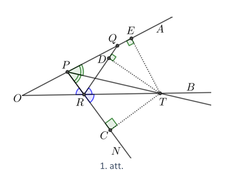
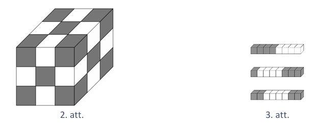
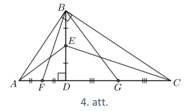
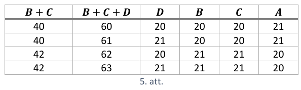
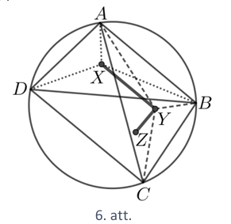
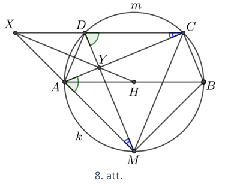
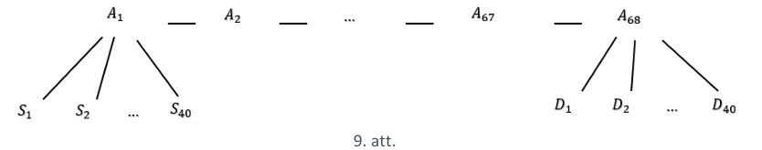
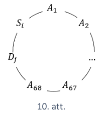

# <lo-sample/> LV.VOL.2020.9.1

Kādām naturālām $n$ vērtībām izteiksmes $\frac{(3n-1)(n+4)}{n+2}$ vērtība ir
vesels skaitlis?

<small>

* questionType:
* domain:

</small>

## Atrisinājums

Ekvivalenti pārveidojam doto izteiksmi:

$$\frac{(3n-1)(n+4)}{n+2}=\frac{3n^{2}+11n-4}{n+2}=\frac{3n(n+2)+5n-4}{n+2}=\frac{3n(n+2)}{n+2}+\frac{5(n+2)-14}{n+2}=3n+5-\frac{14}{n+2}$$

Tā kā $3n+5$ ir naturāls skaitlis, tad dotās izteiksmes vērtība būs vesels
skaitlis tikai tad, ja $\frac{-14}{n+2}$ ir vesels skaitlis, bet tas iespējams,
ja $(n+2)$ ir skaitļa $14$ dalītājs. Ievērojot, ka $n$ ir naturāls, iegūstam,
ka $n+2=7$ vai $n+2=14$, no kā iegūstam, ka $n=5$ vai $n=12$.

# <lo-sample/> LV.VOL.2020.9.2

Atrast visus naturālos skaitļus $B$ intervālā $1 < B < 99$, kuriem izpildās šāda
īpašība: jebkuram naturālam skaitlim $C$, kuram $B < C < 100$ ir spēkā
$B \leq V \leq C$, kur $V=\frac{1+B+C+100}{4}$ ir skaitļu $1, B, C, 100$
vidējais aritmētiskais.

<small>

* questionType:
* domain:

</small>

## Atrisinājums

Pēc dotā $1 < B < C < 100$. Tā kā $B < C$, tad var pieņemt, ka $C=B+x$, kur
$1 \leq x \leq 99-B$. Līdz ar to iegūstam, ka četru doto skaitļu vidējais
aritmētiskais ir

$$V=\frac{1+B+B+x+100}{4}=\frac{2B+x+101}{4}$$

Ņemot vērā, ka jāizpildās nevienādībām $B \leq V \leq C$, iegūstam

$$\begin{gathered}
B \leq \frac{2B+x+101}{4} \leq B+x \\
4B \leq 2B+x+101 \leq 4B+4x
\end{gathered}$$

Pārrakstot iegūto divkāršo nevienādību kā nevienādību sistēmu, iegūstam

$$\left\{\begin{array} { l } 
{ 4B \leq 2B+x+101 } \\
{ 2B+x+101 \leq 4B+4x }
\end{array} \quad \text { jeb } \quad \left\{\begin{array}{l}
2B \leq 101+x \\
2B \geq 101-3x
\end{array}\right.\right.$$

Ievērojam, ja nevienādība izpildās pie $x=1$, tad tā izpildās arī pie lielākiem
$x$. Tāpēc tas, ka šī nevienādība izpildās visiem $x \geq 1$ ir ekvivalents
apgalvojumam, ka tā izpildās pie $x=1$. Tātad

$$\left\{\begin{array} { l } 
{ 2B \leq 102 } \\
{ 2B \geq 98 }
\end{array} \text { jeb } \quad \left\{\begin{array}{l}
B \leq 51 \\
B \geq 49
\end{array}\right.\right.$$

Līdz ar to esam ieguvuši, ka jebkurai derīgai $C$ vērtībai ir spēkā sakarība
$B \leq V \leq C$, ja $B$ ir $49$, $50$ vai $51$.

# <lo-sample/> LV.VOL.2020.9.3

Punkts $R$ atrodas uz stara $OB$ un punkti $P$ un $Q$ atrodas uz stara $OA$ tā,
ka $OP < OQ$ un $\sphericalangle ORP=\sphericalangle BRQ$. leņķa $RPA$ bisektrise krusto
staru $OB$ punktā $T$. Pierādīt, ka $QT$ ir $\sphericalangle RQA$ bisektrise!

<small>

* questionType:
* domain:

</small>

## Atrisinājums

Pagarinām nogriezni $PR$, tad $\sphericalangle ORP=\sphericalangle NRB$ kā
krustleņķi (skat. 1.att.) un līdz ar to arī $BRQ=\sphericalangle NRB$.
Izmantojot bisektrises īpašību, iegūstam, ka punkts $T$ atrodas vienādā
attālumā no

- leņķa $NRQ$ malām $NR$ un $RQ$, tas ir, $TC=TD$;
- leņķa $QPR$ malām $PR$ un $PQ$, tas ir, $TC=TE$.

Tātad $TD=TE$ un esam ieguvuši, ka punkts $T$ atrodas vienādā attālumā no leņķa
$RQA$ malām. Līdz ar to pēc bisektrises pazīmes esam ieguvuši, ka punkts $T$
atrodas uz $\sphericalangle RQA$ bisektrises jeb $QT$ ir
$\sphericalangle RQA$ bisektrise.

# <lo-sample/> LV.VOL.2020.9.4

Vai eksistē tādi četri dažādi **a)** naturāli skaitļi, **b)** pirmskaitļi
$a, b, c, d$, ka vienlaicīgi izpildās šādi nosacījumi:

- $b+c+d$ dalās ar $a$,
- $c+d+a$ dalās ar $b$,
- $d+a+b$ dalās ar $c$,
- $a+b+c$ dalās ar $d$ ?

<small>

* questionType:
* domain:

</small>

## Atrisinājums

**a)** Jā, eksistē. Skaitļiem $1, 2, 3, 6$ izpildās visi uzdevuma nosacījumi:

- $2+3+6$ dalās ar $1$ ,
- $1+3+6$ dalās ar $2$ ,
- $1+2+6$ dalās ar $3$ ,
- $1+2+3$ dalās ar $6$ .

**b)** Nē, neeksistē. Ievērojam, ka

- $a+(b+c+d)$ dalās ar $a$ (jo abi saskaitāmie dalās ar $a$ ),
- $b+(c+d+a)$ dalās ar $b$,
- $c+(d+a+b)$ dalās ar $c$,
- $d+(a+b+c)$ dalās ar $d$.

Tā kā $a, b, c, d$ ir pirmskaitļi, tad $a+b+c+d$ dalās ar $abcd$, no kā izriet,
ka $a+b+c+d \geq abcd$. Nezaudējot vispārīgumu varam pieņemt, ka
$a \leq b \leq c \leq d$. Tādā gadījumā $a+b+c+d \leq 4d < abcd$, jo pat trīs
mazāko atšķirīgo pirmskaitļu reizinājums $2 \cdot 3 \cdot 5 > 4$. Esam ieguvuši
pretrunu, tātad neeksistē tādi četri dažādi pirmskaitļi, kuriem izpildās visi
uzdevuma nosacījumi.

# <lo-sample/> LV.VOL.2020.9.5

Vai kubu ar izmēriem $12 \times 12 \times 12$ iespējams salikt no ķieģeļiem,
kuru izmēri ir $1 \times 1 \times 8$ ?

<small>

* questionType:
* domain:

</small>

## Atrisinājums

Pamatosim, ka prasīto nevar izdarīt. Sadalām kubu $9$ mazākos kubos, kuru
izmēri ir $4 \times 4 \times 4$, un iekrāsojam tos kā šaha galdiņu
(skat. 2.att.). Pavisam ir $64 \cdot 14=896$ melni un $64 \cdot 13=832$ balti
kubiņi ar izmēriem $1 \times 1 \times 1$. Tā kā katrs kieģelis pārklāj $4$
melnus un $4$ baltus kubiņus ar izmēriem $1 \times 1 \times 1$ (skat. 3.att.),
tad, ja no šiem kieģeļiem būtu salikts kubs, tas saturētu vienāda skaita melnos
un baltos kubiņus ar izmēriem $1 \times 1 \times 1$, bet $896 \neq 832$.

# <lo-sample/> LV.VOL.2020.10.1

Pierādīt, ka skaitlim $2019^{3}+2020^{3}+2021^{3}$ ir vismaz $20$ dažādi
pozitīvi dalītāji!

<small>

* questionType:
* domain:

</small>

## Atrisinājums

Apzīmējam $n=2020$ un pārveidojam doto skaitli:

$$\begin{aligned}
(n-1)^{3} & +n^{3}+(n+1)^{3}=n^{3}-3 \cdot n^{2}+3 \cdot n-1+n^{3}+n^{3}+3 \cdot n^{2}+3 \cdot n+1= \\
& =n \cdot\left(3 n^{2}+6\right)=n \cdot 3 \cdot\left(n^{2}+2\right)=2^{2} \cdot 5 \cdot 101 \cdot 3 \cdot\left(2020^{2}+2\right)
\end{aligned}$$

Tā kā naturālam skaitlim
$x=p_{1}^{k_{1}} \cdot p_{2}^{k_{2}} \cdot \ldots \cdot p_{m}^{k_{m}}$,
kur $p_{i}$ ir dažādi pirmskaitļi, pavisam ir
$\left(k_{1}+1\right)\left(k_{2}+1\right) \ldots\left(k_{m}+1\right)$ dažādi
naturālie dalītāji, tad dotajam skaitlim ir vismaz
$(2+1)(1+1)(1+1)(1+1)=24$ dažādi dalītāji, pat neņemot vērā reizinātāju 
$2020^{2}+2$. Patiesībā dotajam skaitlim ir $640$ dažādi dalītāji.

# <lo-sample/> LV.VOL.2020.10.2

Zināms, ka $x^{2}+y^{2}+xy=3$. Kāda var būt $x+y$ vērtība?

<small>

* questionType:
* domain:

</small>

## Atrisinājums

Pamatosim, ka $x^{2}+y^{2}+xy \geq \frac{3}{4}(x+y)^{2}$. Veicam ekvivalentus
pārveidojumus:

$$\begin{gathered}
x^{2}+y^{2}+xy \geq \frac{3}{4}x^{2}+\frac{3}{2}xy+\frac{3}{4}y^{2} \\
\frac{1}{4}x^{2}+\frac{1}{4}y^{2}-\frac{1}{2}xy \geq 0 \\
x^{2}+y^{2}-2 x y \geq 0 \\
(x-y)^{2} \geq 0 .
\end{gathered}$$

Tā kā iegūta patiesa nevienādība, tad arī dotā nevienādība ir patiesa. Līdz ar
to esam ieguvuši, ka $3 \geq \frac{3}{4}(x+y)^{2}$ jeb $4 \geq(x+y)^{2}$,
tātad $-2 \leq x+y \leq 2$.

Vēl jāparāda, ka visām vērtībām šajā intervālā ir atbilstošas $x$ un $y$
vērtības. Apzīmējam $x+y=t(-2 \leq t \leq 2)$. No dotās vienādības iegūstam

$$x^{2}+2xy+y^{2}-xy=3 \quad \Rightarrow \quad xy=(x+y)^{2}-3 \quad \Rightarrow \quad xy=t^{2}-3$$

Sastādām kvadrātvienādojumu $a^{2}-ta+t^{2}-3=0$, kura sakņu summa ir
$a_{1}+a_{2}=t$ un sakņu reizinājums ir $a_{1} a_{2}=t^{2}-3$. Ja šim
vienādojumam ir atrisinājums dotai $t$ vērtībai, tad tā saknes ir meklētās
$x$ un $y$ vērtības. Aprēķinām diskriminantu
$D=(-t)^{2}-4 \cdot 1 \cdot\left(t^{2}-3\right)=12-3t^{2}$, tā kā
$-2 \leq t \leq 2$, tad $t^{2} \leq 4$, tātad visām pieļaujamajām $t$ vērtībām
$D \geq 0$. Tātad $-2 \leq x+y \leq 2$.

<small>

* questionType:
* domain:

</small>

## Atrisinājums

Apzīmējam $x=u+v$ un $y=u-v$. levietojot apzīmējumus dotajā vienādībā,
jegūstam

$$\begin{gathered}
(u+v)^{2}+(u-v)^{2}+(u+v)(u-v)=3 \\
u^{2}+2uv+v^{2}+u^{2}-2uv+v^{2}+u^{2}-v^{2}=3 \\
3u^{2}+v^{2}=3
\end{gathered}$$

Lai pēdējā vienādība būtu patiesa, tad
$-1 \leq u \leq 1$. Tā kā $x+y=(u+v)+(u-v)=2u$, tad $-2 \leq x+y \leq 2$.

# <lo-sample/> LV.VOL.2020.10.3

Taisnleņķa trijstūrī $ABC$, kurā $\sphericalangle ABC=90^{\circ}$,
novilkts augstums $BD$, nogriežņa $BD$ viduspunkts ir $E$. Punkti $F$ un $G$
ir attiecīgi nogriežņu $AD$ un $CD$ viduspunkti. Pierādīt, ka
$\sphericalangle AEC+\sphericalangle FBG=180^{\circ}$.

<small>

* questionType:
* domain:

</small>

## Atrisinājums

Ievērojam, ka $\triangle ABD \sim \triangle BDC$ pēc pazīmes
$\ell \ell$, jo $\sphericalangle ADB=\sphericalangle BDC=90^{\circ}$ un 
$\sphericalangle BAD=90^{\circ}-\sphericalangle ABD=\sphericalangle DBC$
(skat. 4.att.). Tātad trijstūru malas ir proporcionālas, tas ir,
$\frac{BD}{CD}=\frac{AD}{BD}$. Tā kā $AD=2FD$ un $BD=2ED$, tad
$\frac{BD}{CD}=\frac{FD}{ED}$. Līdz ar to $\triangle BDF \sim \triangle CDE$
pēc pazīmes $m \ell m$. Tātad
$\sphericalangle FBD=\sphericalangle DCE=90^{\circ}-\sphericalangle DEC$ jeb $\sphericalangle FBD+\sphericalangle DEC=90^{\circ}$.

Līdzīgi pierāda, ka $\sphericalangle GBD+\sphericalangle AED=90^{\circ}$.

Tātad
$\sphericalangle AEC+\sphericalangle FBG=(\sphericalangle AED+\sphericalangle DEC)+(\sphericalangle FBD+\sphericalangle GBD)=90^{\circ}+90^{\circ}=180^{\circ}$.

# <lo-sample/> LV.VOL.2020.10.4

Aplūkojam skaitļu virkni $7 ; 737 ; 73737 ; 7373737 ; \ldots$, kuras pirmais
loceklis ir $7$ un katru nākamo iegūst, iepriekšējam pierakstot galā $37$.
Pierādīt, ka neviens šīs virknes loceklis nedalās ar $17$.

<small>

* questionType:
* domain:

</small>

## Atrisinājums

Apzīmējam virknes locekļus ar $s_{0}=7, s_{1}=737, s_{2}=73737, \ldots$

Redzams, ka virknē ir spēkā sakarība $s_{k+1}=100s_{k}+37$. Patiešām, skaitļi
pareizinot ar $100$ tam tiek galā pierakstītas divas nulles, bet pieskaitot
$37$ šīs nulles pārvēršas par $37$, tātad šī operācija pieraksta skaitļa galā
$37$. Apzīmēsim ar $a_{k}$ atlikumu virkni, kas rodas $s_{k}$ dalot ar $17$,
$a_{k}=s_{k}$ $\bmod 17$. Mums jāpierāda, ka virknē ( $a_{k}$ ) nav nevienas
nulles.

Arī virknes $a_{k}$ katrs loceklis (tāpat kā virknei $s_{k}$ ) ir atkarīgs
tikai no iepriekšējā

$$a_{k+1}=s_{k+1} \bmod 17=100s_{k}+37 \bmod 17=15a_{k}+3 \bmod 17$$

Izmantojot šo formulu un to, ka $a_{0}=7 \bmod 17=7$, aprēķināsim virknes
$a_{k}$ pirmos locekļus.

| $k$  | $a_{k}(\bmod 17)$ |  
| ---- | ----------------- |  
| $0$  | $7$               |  
| $1$  | $6$               |  
| $2$  | $8$               |  
| $3$  | $4$               |  
| $4$  | $12$              |  
| $5$  | $13$              |  
| $6$  | $11$              |  
| $7$  | $15$              |  
| $8$  | $7$               |

Esam ieguvuši, ka $a_{0}=a_{8}=7$. Tā kā šajā virknē katrs loceklis ir
atkarīgs tikai no iepriekšējā, tad šī virkne būs periodiska ar periodu $8$ :
no tā, ka $a_{0}=a_{8}$, secinām, ka $a_{1}=a_{9}$, tad $a_{2}=a_{10}$ utt.

Tā kā starp pirmajiem $8$ locekļiem šajā virknē nav nevienas nulles, tad, tā kā
tā ir periodiska, tad arī tālāk tajā nebūs nevienas nulles.

# <lo-sample/> LV.VOL.2020.10.5

Dotas četras pēc ārējā izskata vienādas monētas, katras monētas masa ir
$20~\mathrm{g}$ vai $21~\mathrm{g}$ . Kā noteikt katras monētas masu ar trīs
svēršanām uz elektroniskajiem svariem, kas rāda uz svariem uzlikto monētu
kopējo masu?

<small>

* questionType:
* domain:

</small>

## Atrisinājums

Apzīmējam monētas ar $A, B, C, D$. Pirmajā svēršanā uz svariem liekam $A$ un
$B$.

- Ja $A+B=40$ vai $A+B=42$, tad $A$ un $B$ masas jau zināmas, tās attiecīgi ir
  $20~\mathrm{g}$ un $20~\mathrm{g}$ vai $21~\mathrm{g}$ un $21~\mathrm{g}$ .
  Pēc tam ar divām svēršanām atrodam $C$ un $D$ masu.
- Ja $A+B=41$, tad otrajā svēršanā uz svariem liekam $A$ un $C$.
- Ja $A+C=40$ un $A+C=42$, tad zinām $A$ un $C$ masu, tātad arī $B$ masu.
  Trešajā svēršanā uz svariem liekam $D$ un nosakām tās masu.
- Ja $A+C=41$, tad no tā, ka $A+B=A+C$, secinām, ka $B=C$. Trešajā reizē uz
  svariem liekam $B , C$ un $D$. Ievērojam, ka $B+C$ ir pāra skaitlis ($40$
  vai $42$). Apskatot visus iespējamos svēršanas iznākumus, iegūstam katras
  monētas masu, skat. 5.att.

# <lo-sample/> LV.VOL.2020.11.1

Dota funkcija $f(x)=mx^{2}+(m-1)x+\frac{2020}{m-2019}$. Ar kādām parametra
$m$ vērtībām funkcija ir augoša intervālā $(1; 2)$ ?

<small>

* questionType:
* domain:

</small>

## Atrisinājums

Ievērojam, ka $m \neq 2019$ . Lai funkcija būtu augoša, jāizpildās
nevienādībai $f(1) < f(2)$. Atrisinām šo nevienādību:

$$\begin{aligned}
m+(m-1)+\frac{2020}{m-2019} & < 4m+(m-1) \cdot 2+\frac{2020}{m-2019} \\
2m-1 & < 6m-2 \\
m & >\frac{1}{4}
\end{aligned}$$

Vēl jāgarantē, ka parabolas virsotne neatrodas intervālā $(1 ; 2)$. Tā kā $m$
vērtības ir pozitīvas, tad parabolas zari ir vērsti uz augšu un, lai dotajā
intervālā funkcija būtu augoša, jāizpildās nevienādībai
$x_{v} \leq 1$ jeb $\frac{1-m}{2m} \leq 1$. Reizinot nevienādību ar $2m > 0$,
iegūstam $1-m \leq 2m$ jeb $m \geq \frac{1}{3}$. Līdz ar to funkcija ir augoša
intervālā $(1; 2)$, ja
$m \in\left[\frac{1}{3} ; 2019\right) \cup$ $\cup(2019 ;+\infty)$ .

<small>

* questionType:
* domain:

</small>

## Atrisinājums

Ievērojam, ka $m \neq 2019$. Ja $m<0$, tad parabolas virsotnes abscisa
$\frac{1-m}{2m}<0$, kas nozīmē, ka funkcija nav augoša dotajā intervālā.
Ja $m=0$, tad iegūstam $f(x)=-x-\frac{2020}{2019}$ un tā ir dilstoša funkcija.
Ja $m>0$, tad parabolas zari ir vērsti uz augšu un, lai dotajā intervālā
funkcija būtu augoša, jāizpildās nevienādībai $\frac{1-m}{2m} \leq 1$.
Reizinot nevienādību ar $2m>0$, iegūstam
$1-m \leq 2 m$ jeb $m \geq \frac{1}{3}$. Līdz ar to funkcija ir augoša
intervālā $(1; 2)$, ja
$m \in\left[\frac{1}{3} ; 2019\right) \cup(2019 ;+\infty)$.

# <lo-sample/> LV.VOL.2020.11.2

Aplūkojam virkni
$1 ; 2 ; 2 ; 3 ; 3 ; 3 ; 4 ; 4 ; 4 ; 4 ; 5 ; 5 ; 5 ; 5 ; 5 ; 6 ; 6 ; 6 ; 6 ; 6 ; 6 ; \ldots$,
kurā katrs naturālais skaitlis $k$ tiek atkārtots $k$ reizes. Pierādīt, ka šīs
virknes $n$-to locekli var aprēķināt pēc formulas
$\left[\sqrt{2n}+\frac{1}{2}\right]$.

Ar $[x]$ apzīmējam skaitļa veselo daļu, tas ir, lielāko veselo skaitli, kas
nepārsniedz $x$. Piemēram, $[3,1]=3,[17]=17$, $[6,99]=6$.

<small>

* questionType:
* domain:

</small>

## Atrisinājums

Katrs naturāls skaitlis $k$ dotajā virknē atkārtojas $k$ reizes, noskaidrosim,
ar kādiem indeksiem (kurās pozīcijās) tas tajā parādās.

Pirms pirmā skaitļa $k$ ir viens vieninieks, divi divnieki, trīs trijnieki,
..., $(k-1)$ skaitlis $(k-1)$, tātad kopā

$$1+2+\ldots+(k-1)=\frac{k^{2}-k}{2}$$

skaitļi. Tātad skaitlim $k$ indeksi šajā virknē būs

$$\frac{k^{2}-k}{2}+1 ; \frac{k^{2}-k}{2}+2 ; \ldots ; \frac{k^{2}-k}{2}+k$$

jeb, citiem vārdiem sakot, jebkurš skaitlis $k$ šajā virknē parādās ar indeksu
$\frac{k^{2}-k}{2}+i$, kur $1 \leq i \leq k$. Lai pierādītu formulu, jāpierāda,
ka visiem naturāliem $k$ un visiem naturāliem $1 \leq i \leq k$ izpildās

$\left[\sqrt{2\left(\frac{k^{2}-k}{2}+i\right)}+\frac{1}{2}\right]=k \quad$
jeb $\quad\left[\sqrt{k^{2}-k+2 i}+\frac{1}{2}\right]=k$

Vienādība $[x]=y$, kur $y$ ir naturāls skaitlis izpildās tad un tikai tad, ja
$y \leq x < y+1$, tāpēc vienādība pārvēršas par divkāršo nevienādību

$$k \leq \sqrt{k^{2}-k+2 i}+\frac{1}{2} < k+1$$

Atņemot $\frac{1}{2}$ un kāpinot kvadrātā, iegūstam

$$\begin{gathered}
\left(k-\frac{1}{2}\right)^{2} \leq k^{2}-k+2i < \left(k+\frac{1}{2}\right)^{2} \\
\frac{1}{4} \leq 2i < 2k+\frac{1}{4}
\end{gathered}$$

Redzams, ka pēdējā nevienādība ir patiesa visiem
$1 \leq i \leq k$. Tā kā visi pārveidojumi bija ekvivalenti (kvadrātā tika
kāpinātas pozitīvas izteiksmes), tad sākotnējā izteiksme arī ir spēkā.

# <lo-sample/> LV.VOL.2020.11.3

Četrstūris $ABCD$ ievilkts riņka līnijā. Pierādīt, ka trijstūros
$ABC, BCD, CDA, DAB$ ievilkto riņķa līniju centri ir taisnstūra virsotnes!

<small>

* questionType:
* domain:

</small>

## Atrisinājums

Ja $X$ un $Y$ ir attiecīgi $\triangle ABD$ un $\triangle ABC$ ievilkto riņķa
līniju centri (skat. 6.att.), tad $AY$ un $BY$ ir attiecīgi
$\sphericalangle BAC$ un $\sphericalangle ABC$ bisektrises. Tātad

$$\begin{gathered}
\sphericalangle AYB=180^{\circ}-(\sphericalangle BAY+\sphericalangle ABY)=180^{\circ}-\frac{1}{2}(\sphericalangle BAC+\sphericalangle ABC)= \\
=\sphericalangle BAC+\sphericalangle ABC+\sphericalangle ACB-\frac{1}{2}(\sphericalangle BAC+\sphericalangle ABC)= \\
=\frac{1}{2}(\sphericalangle BAC+\sphericalangle ABC+\sphericalangle ACB)+\frac{1}{2} \sphericalangle ACB=90^{\circ}+\frac{1}{2} \sphericalangle ACB .
\end{gathered}$$

Līdzīgi $\sphericalangle AXB=90^{\circ}+\frac{1}{2} \sphericalangle ADB$.

Tā kā $\sphericalangle ACB=\sphericalangle ADB$ kā ievilktie leņķi, kas balstās
uz vienu un to pašu loku, tad $\sphericalangle AYB=\sphericalangle AXB$. Tātad
punkti $A, X, Y, B$ atrodas uz vienas riņķa līnijas. Līdz ar to
$\sphericalangle XYB=180^{\circ}-\sphericalangle XAB=180^{\circ}-\frac{1}{2} \sphericalangle DAB$.

Ja $Z$ ir $\triangle BCD$ ievilktās riņķa līnijas centrs, tad līdzīgi iegūstam,
ka $\sphericalangle ZYB=180^{\circ}-\frac{1}{2} \sphericalangle DCB$.

Izmantojot šīs divas vienādības, iegūstam

$$\begin{gathered}
\sphericalangle XYZ=360^{\circ}-\sphericalangle XYB-\sphericalangle ZYB=360^{\circ}-\left(180^{\circ}-\frac{1}{2} \sphericalangle DAB\right)-\left(180^{\circ}-\frac{1}{2} \sphericalangle DCB\right)= \\
=\frac{1}{2}(\sphericalangle DAB+\sphericalangle DCB)=\frac{1}{2} \cdot 180^{\circ}=90^{\circ} .
\end{gathered}$$

Līdzīgi pierāda, ka arī pārējie četrstūra leņķi ir taisni, tātad tas ir
taisnstūris.

# <lo-sample/> LV.VOL.2020.11.4

Zināms, ka trīsciparu skaitlis $\overline{abc}$ ir pirmskaitlis un ka
vienādojumam $ax^{2}+bx+c=0$ ir divas reālas saknes. Vai var gadīties, ka šīs
saknes ir **a)** veseli skaitļi, **b)** racionāli skaitļi?

<small>

* questionType:
* domain:

</small>

## Atrisinājums

**a)** Nē, saknes nevar būt veseli skaitļi. Ievērojam, ka
$c \neq 0$, jo pretējā gadījumā $\overline{abc}$ nav pirmskaitlis. Tas nozīmē,
ka $0$ nav vienādojuma sakne. Ja $x \geq 0$, tad $a x^{2}+b x+c \geq c>0$.
Tātad vienādojumam var būt tikai negatīvas saknes. Apzīmējot saknes ar
$-x_{1},-x_{2}$ un sadalot kreisās puses izteiksmi reizinātājos, iegūstam

$$ax^{2}+bx+c=a\left(x+x_{1}\right)\left(x+x_{2}\right)$$

Pieņemsim, ka šīs saknes ir veseli skaitļi. Ja $x=10$, tad iegūstam

$$a\left(10+x_{1}\right)\left(10+x_{2}\right)=100a+10b+c=\overline{abc}$$

Tātad esam ieguvuši, ka $\overline{abc}$ ir salikts skaitlis, kas ir pretrunā
ar doto. Līdz ar to vienādojumam nav veselu sakņu.

**b)** Nē, saknes nevar būt racionāli skaitļi. Pieņemsim pretējo, ka saknes
vienādojumam ir racionālas, tas ir,
$-\frac{p_{1}}{q_{1}}$ un $-\frac{p_{2}}{q_{2}}$, kur
$p_{1}, q_{1}$ ir savstarpēji pirmskaitļi un arī $p_{2}, q_{2}$ ir savstarpēji
pirmskaitļi. Sadalām vienādojuma kreiso pusi reizinātājos:

$$ax^{2}+bx+c=a\left(x+\frac{p_{1}}{q_{1}}\right)\left(x+\frac{p_{2}}{q_{2}}\right)=\frac{a}{q_{1} q_{2}}\left(q_{1}x+p_{1}\right)\left(q_{2}x+p_{2}\right)$$

Ievietojot $x=10$, iegūstam

$$\begin{gathered}
\frac{a}{q_{1}q_{2}}\left(10q_{1}+p_{1}\right)\left(10q_{2}+p_{2}\right)=100a+10\left(\frac{p_{1}}{q_{1}}+\frac{p_{2}}{q_{2}}\right)+\frac{p_{1}p_{2}}{q_{1}q_{2}}=100a+10b+c=\overline{abc} \\
a\left(10q_{1}+p_{1}\right)\left(10q_{2}+p_{2}\right)=\overline{abc} \cdot q_{1}q_{2}
\end{gathered}$$

Pamatosim, ja kvadrātvienādojuma $ax^{2}+bx+c=0$ sakne ir $\frac{p}{q}$
(nesaīsināma daļa), tad $a$ dalās ar $q$. levietojam vienādojumā
$ax^{2}+bx+c=0$ tā sakni $x=\frac{p}{q}$ un pārveidojam iegūto identitāti:

$$\begin{gathered}
a\left(\frac{p}{q}\right)^{2}+b\left(\frac{p}{q}\right)+c=0 \\
ap^{2}+bpq+cq^{2}=0 \\
q(cq+bp)=-ap^{2}
\end{gathered}$$

Tā kā pēdējās vienādības kreisā puse dalās ar $q$, tad arī labās puses
izteiksmei jādalās ar $q$. Ņemot vērā, ka pēc pieņēmuma $p$ un $q$ ir
savstarpēji pirmskaitļi, secinām, ka $a$ ir jādalās ar $q$.

Līdz ar to secinām, ka $q_{i}$ ir viencipara skaitlis, jo $a$ ir cipars.

Analogi iegūst, ka $c$ dalās ar $p_{i}$. Tas nozīmē, ka $10 q_{i}+p_{i}$ ir
divciparu skaitlis.

Tātad vienādība
$q_{1} q_{2} \cdot \overline{abc}=a\left(10q_{1}+p_{1}\right)\left(10q_{2}+p_{2}\right)$ 
nevar pastāvēt, jo kreisajā pusē ir reizinātājs $\overline{abc}$ (trīsciparu
pirmskaitlis), bet labajā pusē $a$ ir viencipara skaitlis un pārējie
reizinātāji - divciparu. Līdz ar to dotā vienādojuma saknes nav racionāli
skaitļi.

# <lo-sample/> LV.VOL.2020.11.5

Atrast lielāko naturālo skaitli $N$, kuram ir spēkā īpašība: lai kuras $N$
rūtiņas būtu aizkrāsotas $4 \times 4$ rūtiņu tabulā, vienmēr varēs izvēlēties
divas rindas un divas kolonnas tā, ka katra aizkrāsotā rūtiņa atrodas vai nu
izvēlētajā rindā, vai izvēlētajā kolonnā (vai abās).

<small>

* questionType:
* domain:

</small>

## Atrisinājums

Lielākā $N$ vērtība ir $6$ . Pamatosim, ja iekrāsotas $6$ rūtiņas, tad
jebkuram krāsojumam izpildās uzdevuma nosacījumi. Ja kādā rindā ir vairāk
nekā divas iekrāsotas rūtiņas, tad izvēlamies šo rindu un vēl kādu rindu,
kurā ir kāda iekrāsota rūtiņa. Tātad izvēlētajās divās rindās jau ir vismaz
četras iekrāsotas rūtiņas. Tā kā ir palikušas divas iekrāsotas rūtiņas, tad
pietiek izvēlēties divas kolonnas, lai iekrāsotās rūtiņas atrastos šajās
kolonnās.

Ja nevienā rindā nav vairāk kā divas iekrāsotas rūtiņas, tad pēc Dirihlē
principa divas iekrāsotas rūtiņas ir vismaz divās rindās. Izvēlamies šīs divas
(vai divas no trim, ja trīs rindās ir pa divām iekrāsotām rūtiņām) rindas. Tad
izvēlētajās divās rindās jau ir tieši četras iekrāsotas rūtiņas. Tā kā ir
palikušas divas iekrāsotas rūtiņas, tad pietiek izvēlēties divas kolonnas, lai
iekrāsotās rūtiņas atrastos šajās kolonnās.

Pamatosim, ka lielākām $N$ vērtībām īpašība nav spēkā visām tabulām. Ja $N=7$,
tad īpašība nav spēkā, piemēram, 7.att. dotajam rūtiņu izvietojumam. Ievērojam,
ka, izvēloties jebkuras divas rindas, paliek trīs kolonnas, kurās atrodas
iekrāsotās rūtiņas.

# <lo-sample/> LV.VOL.2020.12.1

G̣eometriskās progresijas pirmais, desmitais un $2020~\mathrm{-ais}$ loceklis ir
naturāls skaitlis. Vai noteikti arī tās $2019~\mathrm{-ais}$ loceklis ir
naturāls skaitlis?

<small>

* questionType:
* domain:

</small>

## Atrisinājums

Nē, $2019~\mathrm{-ais}$ loceklis var nebūt naturāls skaitlis, piemēram,
ja $b_{1}=1 \in \mathbb{N}$ un $q=\sqrt[3]{2}$, tad

- $b_{10}=b_{1} \cdot q^{9}=(\sqrt[3]{2})^{9}=2^{3}=8 \in \mathbb{N}$,
- $b_{2020}=b_{1} \cdot q^{2019}=(\sqrt[3]{2})^{2019}=2^{673} \in \mathbb{N}$,
- $b_{2019}=b_{1} \cdot q^{2018}=(\sqrt[3]{2})^{2016} \cdot(\sqrt[3]{2})^{2}=2^{672} \cdot \sqrt[3]{4}$,
  kas nav naturāls skaitlis.

# <lo-sample/> LV.VOL.2020.12.2

Noteikt izteiksmes $(x+y+z)\left(\frac{1}{x}+\frac{1}{y}+\frac{1}{z}\right)$
vislielāko un vismazāko vērtību, ja $1 \leq x, y, z \leq 2020$.

<small>

* questionType:
* domain:

</small>

## Atrisinājums

Pārveidojam doto izteiksmi un lietojam nevienādību
$\frac{a}{b}+\frac{b}{a} \geq 2$ :

$$(x+y+z)\left(\frac{1}{x}+\frac{1}{y}+\frac{1}{z}\right)=3+\frac{x}{y}+\frac{y}{x}+\frac{x}{z}+\frac{z}{x}+\frac{y}{z}+\frac{z}{y} \geq 3+2+2+2=9$$

Tātad dotās izteiksmes mazākā vērtība ir $9$ un to var iegūt, ja $x=y=z$.

Lai atrastu izteiksmes $F$ maksimālo vērtību, vispirms pierādīsim lemmu.

Lemma. Funkcija $f(x)=x+\frac{k}{x}, k > 0$, dilst pa kreisi no tās minimuma
punkta $x=\sqrt{k}$ un aug pa labi no tā, tas ir,

$0 < u < v \leq \sqrt{k} \Rightarrow f(u) > f(v)$ un
$\sqrt{k} \leq u < v \Rightarrow f(u) < f(v)$

*Pierādīums.* Apskatām abus gadījumus.

$$\begin{aligned}
& f(u) > f(v) \quad \Leftrightarrow \quad \frac{k}{u}-\frac{k}{v} > v-u \Leftrightarrow \frac{k}{uv} > 1 \quad \Leftrightarrow \quad k > uv \\
& f(u) < f(v) \Leftrightarrow \frac{k}{u}-\frac{k}{v} < v-u \Leftrightarrow \frac{k}{uv} < 1 \quad \Leftrightarrow \quad k < uv
\end{aligned}$$

Saskaņā ar Lemmu fiksētiem $y, z \in[1 ; 2020]$, funkcija

$$F(x)=x\left(\frac{1}{y}+\frac{1}{z}\right)+\frac{1}{x}(y+z)+\frac{y}{z}+\frac{z}{y}+3$$

maksimālo vērtību sasniedz intervāla galapunktā, tas ir, kad $x=1$ vai $x=2020$.
Simetrijas dēļ tas pats attiecas uz gadījumiem, kad fiksējam $x, y$ un $x, z$.
Tātad izteiksme $F$ maksimālo vērtību sasniedz tad, kad $x, y, z \in\{1 ; 2020\}$.
Apskatām izteiksmes $F$ vērtību, ja $x, y, z \in\{1 ; 2020\}$.

- $x=y=z=1$ vai $x=y=z=2020$, tad $F(x ;x ;x)=9$
- $x=y=1$ un $z=2020$, tad $F(1 ;1 ;2020)=2022 \cdot 2 \frac{1}{2020}=\frac{2022 \cdot 4041}{2020}$
- $x=y=2020$ un $z=1$, tad $F(2020 ;2020 ;1)=4041 \cdot 1 \frac{2}{2020}=\frac{4041 \cdot 2022}{2020}$

Līdz ar to dotās izteiksmes vislielākā vērtība ir
$\frac{4041 \cdot 2022}{2020}$.

# <lo-sample/> LV.VOL.2020.12.3

Riņka līnijā $\omega$ ievilkta vienādsānu trapece $ABCD$, punkts $H$ ir garākā
pamata $AB$ viduspunkts. Punkts $M$ ir viduspunkts tam lokam $AB$, kas nesatur
punktus $C$ un $D$. Taisnes $CD$ un $AM$ krustojas punktā $X$. Zināms, ka
nogriežņi $HX, DM$ un $AC$ krustojas vienā punktā $Y$ un $DM=AC$. Pierādīt, ka
$AB^{2}=2CD^{2}$.

<small>

* questionType:
* domain:

</small>

## Atrisinājums

Pierādīsim, ka $H$ ir riņķa līnijas $\omega$ centrs. Tā kā $AC=DM$, tad
$\overline{CDA}=\overline{DAM}$ un $\overline{AkM}=\overline{DAM}-\overline{DA}=$ $=\overline{CDA}-\overline{DA}=\overline{CmD}$
(skat. 8.att.). Tā kā uz vienādiem lokiem balstās vienādas hordas, tad
$AM=CD$. Ievērojam, ka $\sphericalangle MAC=\sphericalangle CDM$ un
$\sphericalangle AMD=\sphericalangle DCA$ kā ievilktie leņķi, kas balstās
attiecīgi uz viena un tā paša loka. Tad $\triangle AYM=\triangle DYC$ pēc
pazīmes $\ell m \ell$ un $MY=YC$ kā atbilstošās malas. Esam ieguvuši, ka
punkts $Y$ atrodas vienādā attālumā no nogriežņa $MC$ galapunktiem. Trijstūris
$MXC$ ir vienādsānu, jo $\sphericalangle DCM=\sphericalangle AMC$ kā leņķi,
kas balstās uz vienādiem lokiem $DAM$ un $ADC$, tātad punkts $X$ atrodas
vienādā attālumā no nogriežņa $MC$ galapunktiem. Līdz ar to $XY$ (jeb $XH$ )
ir nogriežņa $MC$ vidusperpendikuls. Ievērojam, ka simetrijas dēļ $MH$ ir malu
$AB$ un $CD$ vidusperpendikuls. Tā kā četrstūris $DAMC$ ir ievilkts četrstūris,
tad tam apvilktās riņķa līnijas centrs atrodas malu vidusperpendikulu
krustpunktā, līdz ar to punkts $H$ ir riņķa līnijas $\omega$ centrs.

Tā kā punkts $M$ ir mazākā loka $AB$ viduspunkts, tad $AM=MB$. Trijstūris
$AMB$ ir vienādsānu taisnleņķa trijstūris, jo balstās uz diametra $AB$, tad pēc
Pitagora teorēmas $AB^{2}=AM^{2}+MB^{2}=CD^{2}+CD^{2}=2CD^{2}$.

# <lo-sample/> LV.VOL.2020.12.4

Zināms, ka četrciparu skaitlis $\overline{abcd}$ ir pirmskaitlis un ka
vienādojumam $ax^{3}+bx^{2}+cx+d=0$ ir trīs reālas saknes. Vai var gadīties,
ka visas šīs saknes ir **a)** veseli skaitļi, **b)** racionāli skaitļi?

<small>

* questionType:
* domain:

</small>

## Atrisinājums

**a)** Nē, saknes nevar būt veseli skaitļi. Ievērojam, ka $d \neq 0$, jo
pretējā gadījumā $\overline{abcd}$ nav pirmskaitlis. Tas nozīmē, ka $0$ nav
vienādojuma sakne. Ja $x \geq 0$, tad $ax^{3}+bx^{2}+cx+d \geq d > 0$. Tātad
vienādojumam var būt tikai negatīvas saknes. Apzīmējot saknes ar
$-x_{1},-x_{2},-x_{3}$ un sadalot kreisās puses izteiksmi reizinātājos,
iegūstam

$$ax^{3}+bx^{2}+cx+d=a\left(x+x_{1}\right)\left(x+x_{2}\right)\left(x+x_{3}\right)$$

Pieņemsim, ka vienādojuma saknes ir veseli skaitļi. Ja $x=10$, tad iegūstam

$$a\left(10+x_{1}\right)\left(10+x_{2}\right)\left(10+x_{3}\right)=1000a+100 b+10c+d=\overline{abcd}$$

Tātad esam ieguvuši, ka $\overline{abc} d$ ir salikts skaitlis, kas ir
pretrunā ar doto. Līdz ar to vienādojumam nav veselu sakņu.

**b)** Nē, saknes nevar būt racionāli skaitļi. Pieņemsim, ka saknes
vienādojumam ir racionālas, tas ir,
$-\frac{p_{1}}{q_{1}},-\frac{p_{2}}{q_{2}}$ un $-\frac{p_{3}}{q_{3}}$, pie kam
daļas ir nesaīsināmas jeb $p_{i}$ un $q_{i}$ ir savstarpēji pirmskaitļi.
Pārveidojam vienādojuma kreisās puses izteiksmi:

$$ax^{3}+bx^{2}+cx+d=a\left(x+\frac{p_{1}}{q_{1}}\right)\left(x+\frac{p_{2}}{q_{2}}\right)\left(x+\frac{p_{3}}{q_{3}}\right)=\frac{a}{q_{1} q_{2} q_{3}}\left(q_{1} x+p_{1}\right)\left(q_{2} x+p_{2}\right)\left(q_{3} x+p_{3}\right)$$

levietojot $x=10$, iegūstam

$$\begin{gathered}
\frac{a}{q_{1} q_{2} q_{3}}\left(10 q_{1}+p_{1}\right)\left(10 q_{2}+p_{2}\right)\left(10 q_{3}+p_{3}\right)= \\
=1000 a+100\left(\frac{p_{1}}{q_{1}}+\frac{p_{2}}{q_{2}}+\frac{p_{3}}{q_{3}}\right)+10\left(\frac{p_{1}}{q_{1}} \cdot \frac{p_{2}}{q_{2}}+\frac{p_{1}}{q_{1}} \cdot \frac{p_{3}}{q_{3}}+\frac{p_{2}}{q_{2}} \cdot \frac{p_{3}}{q_{3}}\right)+\frac{p_{1}}{q_{1}} \cdot \frac{p_{2}}{q_{2}} \cdot \frac{p_{3}}{q_{3}}= \\
=1000 a+100 b+10 c+d=\overline{a b c d} .
\end{gathered}$$

Reizinot abas puses ar $q_{1} q_{2} q_{3} \neq 0$, iegūstam

$$q_{1} q_{2} q_{3} \cdot \overline{abcd}=a\left(10 q_{1}+p_{1}\right)\left(10 q_{2}+p_{2}\right)\left(10 q_{3}+p_{3}\right)$$

Pamatosim, ja vienādojuma $ax^{3}+bx^{2}+cx+d=0$ sakne ir $\frac{p}{q}$
(nesaīsināma daļa), tad $a$ dalās ar $q$. levietojam vienādojumā
$ax^{3}+bx^{2}+cx+d=0$ tā sakni $x=\frac{p}{q}$ un pārveidojam iegūto
identitāti:

$$\begin{gathered}
a\left(\frac{p}{p}\right)^{3}+b\left(\frac{p}{q}\right)^{2}+c\left(\frac{p}{q}\right)+d=0 \\
ap^{3}+bp^{2}q+cq^{2}p+d q^{3}=0 \\
q\left(bp^{2}+cqp+dq^{2}\right)=-ap^{3}
\end{gathered}$$

Tā kā pēdējās vienādības kreisā puse dalās ar $q$, tad arī labās puses
izteiksmei jādalās ar $q$. Ņemot vērā, ka pēc pieņēmuma $p$ un $q$ ir
savstarpēji pirmskaitļi, secinām, ka $a$ ir jādalās ar $q$.

Līdz ar to secinām, ka $q_{i}$ ir viencipara skaitlis, jo $a$ ir cipars.

Analogi iegūst, ka $c$ dalās ar $p_{i}$. Tas nozīmē, ka $10 q_{i}+p_{i}$ ir
divciparu skaitlis.

Tātad vienādība
$q_{1} q_{2} q_{3} \cdot \overline{abcd}=a\left(10 q_{1}+p_{1}\right)\left(10 q_{2}+p_{2}\right)\left(10 q_{3}+p_{3}\right)$
nevar pastāvēt, jo kreisajā pusē ir reizinātājs $\overline{abcd}$
(četrciparu pirmskaitlis), bet labajā pusē $a$ ir viencipara skaitlis un
pārējie reizinātāji - divciparu. Līdz ar to dotā vienādojuma saknes nav
racionāli skaitļi.

# <lo-sample/> LV.VOL.2020.12.5

Kādā valstī ir $2020$ pilsētas, katra ar katru ir savienota ar ceļu, ceļi ārpus
pilsētām nekrustojas (izmantoti viadukti). Biznesmenis ar ceļu pārvaldi spēlē
šādu spēli: katru dienu biznesmenis privatizē vienu ceļu, bet ceļu pārvalde
nojauc desmit neprivatizētus ceļus. Pierādīt, ka biznesmenis var panākt, ka
pēc kāda laika viņam pieder ciklisks ceļu maršruts kas iet caur tieši $70$
pilsētām, katrā iegriežoties tieši vienu reizi!

<small>

* questionType:
* domain:

</small>

## Atrisinājums

Vispirms biznesmenis sev var izveidot ceļu virkni no $67$ ceļiem caur kādām
pilsētām $A_{1}-A_{2}-A_{3}-\ldots-A_{67}-A_{68}$. To noteikti var izdarīt, jo
pat pēc pēdējā gājiena ceļu pārvalde ir nojaukusi tikai $67 \cdot 10=670$ ceļus,
bet no katras pilsētas iziet $2019$ ceļi. Nosauksim pilsētas
$A_{1}, A_{2}, \ldots, A_{68}$ par zaļām.

Nākamajā etapā biznesmenis var sev privatizēt $40$ ceļus, kas iziet no pilsētas
$A_{1}$ un iet uz pilsētām $S_{1}, S_{2}, \ldots, S_{40}$ (skat. 9.att.), kas
nav zaļas. To noteikti var izdarīt, jo no pilsētas $A_{1}$ iziet $2019-68=1951$
ceļš uz pilsētām, kas nav zaļas, bet ceļu pārvalde pat pēdējā gājienā kopā ir
nojaukusi tikai $(67+40) \cdot 10=1070$ ceļus. Nosauksim pilsētas
$S_{1}, \ldots, S_{40}$ par sarkanām.

Nākamajā etapā biznesmenis var sev privatizēt $40$ ceļus, kas iziet no pilsētas
$A_{68}$ un iet uz pilsētām $D_{1}, D_{2}, \ldots, D_{40}$, kas nav ne zaļas,
ne sarkanas. To noteikti var izdarīt, jo no pilsētas $A_{68}$ iziet
$2019-68-40=1911$ ceļi uz pilsētām, kas nav ne zaļas, ne sarkanas, bet ceļu
pārvalde pat pēdējā gājienā kopā ir nojaukusi tikai
$(67+40+40) \cdot 10=1470$ ceļus.

Uz doto brīdi ceļu pārvalde ir nojaukusi $1470$ ceļus, bet $40$ sarkanās ar $40$
zaļajām pilsētām kopā savieno $40 \cdot 40=1600$ ceļi, tātad vismaz $130$ no
tiem vēl nav nojaukti. Pieņemsim, ka nav nojaukts ceļš, starp pilsētām
$S_{i}$ un $D_{j}$. Tad pēdējā gājienā biznesmenis var privatizēt šo ceļu un
viņš būs ieguvis ciklisku maršrutu caur $70$ pilsētām (skat. 10.att.).

