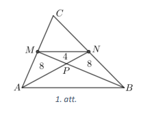
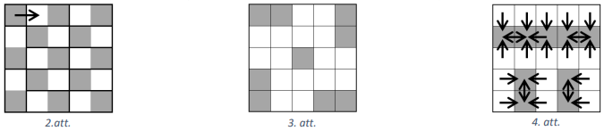
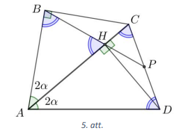
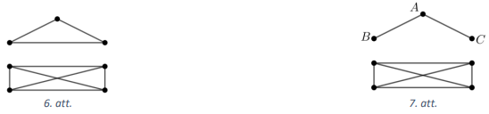
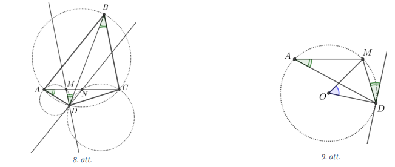
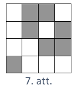
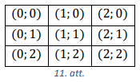
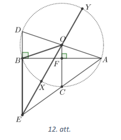
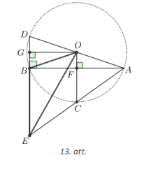
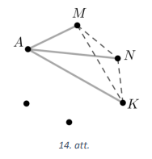

# <lo-sample/> LV.VOL.2020.9.1.

Reālus skaitļus $a$ un $b$ saista sakarība $\frac{4a^{2}-7b^{2}}{ab}=12$. Kāda
var būt $\frac{4a^{2}+7b^{2}}{ab}$ vērtība?

<small>

* questionType:
* domain:

</small>

## Atrisinājums

Pārveidojot doto izteiksmi, iegūstam

$$\begin{gathered}
4a^{2}-7b^{2}=12ab \\
4a^{2}-12ab+9b^{2}=16b^{2} \\
(2a-3b)^{2}=(4b)^{2} \\
2a-3b= \pm 4b
\end{gathered}$$

Apskatām katru gadījumu.

1. Ja $2a-3b=4b$ jeb $2a=7b$ un $a=\frac{7}{2} b$, tad

$$\frac{4a^{2}+7b^{2}}{ab}=\frac{(7b)^{2}+7 \cdot b^{2}}{\frac{7}{2} b \cdot b}=\frac{49b^{2}+7b^{2}}{\frac{7}{2} b^{2}}=56 \cdot \frac{2}{7}=8 \cdot 2=16$$

2. Ja $2a-3b=-4b$ jeb $b=-2a$, tad

$$\frac{4a^{2}+7b^{2}}{ab}=\frac{4a^{2}+7(-2a)^{2}}{-2a^{2}}=\frac{4a^{2}+28a^{2}}{-2a^{2}}=\frac{32}{-2}=-16$$

Tātad izteiksmes $\frac{4a^{2}+7b^{2}}{ab}$ vērtība ir vai nu $16$ (ja 
$a=\frac{7b}{2}$), vai $-16$ (ja $b=-2a$).

$\textit {Piezīme.}$ Sakarību starp $a$ un $b$ var iegūt arī, dotās vienādības kreisās 
puses izteiksmes skaitītāja katru saskaitāmo izdalot ar $ab$, apzīmējot 
$\frac{a}{b}=x$ un atrisinot iegūto vienādojumu 
$4 \frac{a}{b}-7 \frac{b}{a}=12$ jeb $4 x-\frac{7}{x}=12$.

# <lo-sample/> LV.VOL.2020.9.2.

Uz trijstūra $ABC$ malām $AC$ un $BC$ attiecīgi atlikti punkti $M$ un $N$. 
Nogriežņi $AN$ un $BM$ krustojas punktā $P$. Aprēķināt trijstūra $ABC$ laukumu,
ja $S(AMP)=S(BNP)=8$ un $S(NMP)=4$.

<small>

* questionType:
* domain:

</small>

## Atrisinājums

Ievērojam, ka $S(MAN)=S(NBM)=8+4=12$ (skat. 1.att.) un šiem trijstūriem ir 
kopīga mala $MN$, tāpēc augstumi, kas no virsotnēm $A$ un $B$ novilkti pret šo 
malu $MN$, ir vienādi jeb punkti $A$ un $B$ atrodas vienādā attālumā no 
nogriežņa $MN$. Tātad $MN \parallel AB$. Apskatām attiecību

$$\frac{S(MNP)}{S(PNB)}=\frac{\frac{1}{2} MP \cdot h_{MP}}{\frac{1}{2} BP \cdot h_{BP}}$$

Ievērojot, ka $h_{MP}=h_{BP}$, iegūstam 
$\frac{MN}{AB}=\frac{MP}{BP}=\frac{4}{8}=\frac{1}{2}$.

Trijstūri $MPN$ un $BPA$ ir līdzīgi pēc pazīmes $\ell \ell$, jo 
$\sphericalangle MPN=\sphericalangle BPA$ kā krustleņķi 
$\sphericalangle MNA=\sphericalangle NAB$ kā iekšējie šķērsleņķi pie paralēlām 
taisnēm $MN$ un $AB$. Tad 
$\frac{S(MPN)}{S(BPA)}=\left(\frac{MP}{BP}\right)^{2}=\frac{1}{4}$, no kā 
izriet, ka $S(BPA)=4 \cdot 4=16$. Esam ieguvuši, ka $S(AMNB)=4+8 \cdot 2+16=36$

Tā kā $MN \parallel AB$, tad $\triangle MCN \sim \triangle ACB$ un 
$\frac{S(MCN)}{S(ACB)}=\left(\frac{MN}{AB}\right)^{2}=\left(\frac{1}{2}\right)^{2}$
jeb

$\frac{S(ACB)-36}{S(ACB)}=\frac{1}{4}$. Izsakām trijstūra $ACB$ laukumu:

$$\begin{gathered}
4 \cdot S(ACB)-4 \cdot 36=S(ACB) \\
3 \cdot S(ACB)=4 \cdot 36 \\
S(ACB)=48
\end{gathered}$$

# <lo-sample/> LV.VOL.2020.9.3.

Vai naturāla skaitļa kvadrāta ciparu summa var būt **a)** $19$, **b)** $2019$?

<small>

* questionType:
* domain:

</small>

## Atrisinājums

**a)** Jā, var, piemēram, $17^{2}=289$ un $2+8+9=19$.

$\textit {Piezīme.}$ Tā kā $19 \equiv 1(\bmod 9)$, tad jāmeklē skaitļi, kuru kvadrāts ir 
kongruents ar $1(\bmod 9)$, tātad paši skaitļi ir $\pm 1$ $(\bmod 9)$. Der arī 
skaitļi $26, 28, 37, 44, 53, 62, 64, 73, 82, 89, 91$, utt.

**b)** Nē, nevar. Naturālā skaitļa $n$ kvadrāta ciparu summa $2019$ dalās ar 
$3$, tātad arī $n^{2}$ dalās ar $3$. Tā kā naturāla skaitļa kvadrāts dalās ar 
$3$, tad arī pats skaitlis $n$ dalās ar $3$, bet tādā gadījumā $n^{2}$ ir 
jādalās ar $9$. Bet skaitļa $n^{2}$ ciparu summa ir $2019$, kas nedalās ar $9$ 
nedalās, tātad $2019$ nevar būt naturāla skaitļa kvadrāta ciparu summa.

# <lo-sample/> LV.VOL.2020.9.4.

Sākotnēji katrā kvadrāta $5 \times 5$ rūtiņā atradās tieši viena skudra. Tad 
katra skudra pārvietojās uz kādu blakus rūtiņu (tas ir, uz rūtiņu, kam ar esošo
ir kopīga mala). Kāds tagad ir **a)** mazākais; **b)** lielākais iespējamais 
tukšo rūtiņu skaits?

<small>

* questionType:
* domain:

</small>

## Atrisinājums

**a)** Mazākais iespējamais tukšo rūtiņu skaits ir $1$. lekrāsojam doto 
kvadrātu kā šaha galdiņu (skat. 2.att.). Tad ir $13$ melnas un $12$ baltas 
rūtiņas. Tās $13$ skudras, kas atrodas $13$ melnajās rūtiņās, ir pārvietojušās
uz baltajām rūtiņām. Tā kā balto rūtiņu skaits ir $12$, tad vismaz vienā rūtiņā
nonāks vairāk nekā viena skudra. Tātad vismaz viena rūtiņa paliks tukša. Skat.,
piemēram, 2.att., kur skudra no augšējās kreisās rūtiņas pārvietojas bultiņas 
norādītajā virzienā, bet pārējās skudras ar biezāku līniju izceltajos divu 
rūtiņu laukumos samainās vietām.

**b)** Lielākais iespējamais tukšo rūtiņu skaits ir $16$. Viens no šādiem 
pārvietojumiem parādīts 4.att.

Pamatosim, ka $16$ ir lielākais iespējamais tukšo rūtiņu skaits. Skudras, kas 
atrodas 3.att. iekrāsotajās rūtiņās pēc pārvietošanās uz blakus rūtiņām atkal 
kopā aizņems $9$ rūtiņas, jo nekādas divas no šīm skudrām nevar nonākt vienā un
tajā pašā rūtiņā. Tātad var palikt ne vairāk kā $25-9=16$ tukšas rūtiņas.

# <lo-sample/> LV.VOL.2020.9.5.

Hokeja turnīrā piedalijās $16$ komandas. Katra komanda ar katru citu spēlēja 
tieši vienu reizi; neizšķirtu nav. Apzīmēsim katras komandas uzvaru un 
zaudējumu skaitu attiecīgi ar $x_{i}$ un $y_{i}, i=1; 2; \ldots ; 16$. 
Pierādīt, ka 
$x_{1}^{2}+x_{2}^{2}+\ldots+x_{16}^{2}=y_{1}^{2}+y_{2}^{2}+\ldots+y_{16}^{2}$

<small>

* questionType:
* domain:

</small>

## Atrisinājums

Tā kā turnīrā piedalījās $16$ komandas un katra komanda spēlēja ar katru citu, 
tad katra komanda ir piedalījusies tieši $15$ spēlēs.

Tā kā komanda jebkurā spēlē vai nu uzvarēja, vai zaudēja (neizšķirtu nav), tad 
skaidrs, ka $i$-tās komandas uzvaru skaitu var izteikt ar zaudējumu skaitu, tas
ir, $x_{i}=15-y_{i}$. Tad

$$\begin{aligned}
x_{1}^{2}+x_{2}^{2}+\cdots+x_{16}^{2} & =\left(15-y_{1}\right)^{2}+\left(15-y_{2}\right)^{2}+\cdots+\left(15-y_{16}\right)^{2}= \\
& =\left(225-30 y_{1}+y_{1}^{2}\right)+\cdots+\left(225-30 y_{16}+y_{16}^{2}\right)= \\
& =16 \cdot 225-30 \cdot\left(y_{1}+y_{2}+\cdots+y_{16}\right)+\left(y_{1}^{2}+y_{2}^{2}+\ldots+y_{16}^{2}\right)
\end{aligned}$$

Pavisam kopā tika izspēlētas $\frac{16 \cdot 15}{2}=120$ spēles, tāpēc 
zaudējumu kopskaits $y_{1}+y_{2}+\cdots+y_{16}=120$. Līdz ar to 
$16 \cdot 225-30 \cdot\left(y_{1}+y_{2}+\cdots+y_{16}\right)=16 \cdot 225-30 \cdot 120=0$,
no kā izriet prasītais, tas ir, 
$x_{1}^{2}+x_{2}^{2}+\ldots+x_{16}^{2}=y_{1}^{2}+y_{2}^{2}+\ldots+y_{16}^{2}$.

# <lo-sample/> LV.VOL.2020.10.1.

Pierādīt, ka visus naturālos skaitļus, kas lielāki nekā $100$, var izteikt kā 
pirmskaitļa un salikta skaitļa summu! 

<small>

* questionType:
* domain:

</small>

## Atrisinājums

Visus pāra skaitļus, kas lielāki nekā $100$, var izteikt kā summu $(2+p)$, kur 
$p$ ir pāra skaitlis, kas lielāks nekā $100$, tātad $p$ ir salikts skaitlis. 
Visus nepāra skaitļus, kas lielāki nekā $100$, var izteikt kā summu $(3+p)$, 
kur $p$ ir pāra skaitlis, kas lielāks nekā $98$, tātad $p$ ir salikts skaitlis.
Saskaitāmie $2$ un attiecīgi $3$ ir pirmskaitļi.

$\textit {Piezīme.}$ Minētā īpašība ir spēkā visiem naturāliem skaitļiem, kas 
lielāki nekā $5$.

# <lo-sample/> LV.VOL.2020.10.2.

Izliekta četrstūra $ABCD$ diagonāle $AC$ ir leņķa $A$ bisektrise, $AC=AD$ un 
$\sphericalangle B=90^{\circ}$. Trijstūrī $ADC$ novilkts augstums $DH$. 
Pierādīt, ka taisne $BH$ sadala nogriezni $CD$ uz pusēm!

<small>

* questionType:
* domain:

</small>

## Atrisinājums

Taisnes $BH$ krustpunktu ar $CD$ apzīmējam ar $P$ (skat. 5.att.). Tātad 
jāpierāda, ka $CP=PD$. Apzīmējam 
$\sphericalangle BAC=\sphericalangle CAD=2 \alpha$ (jo $A C$ ir leṇka $A$ bisektrise). Tā kā trijstūris $AHD$ ir taisnleṇka, tad

$$\sphericalangle ADH=90^{\circ}-2 \alpha$$

Tā kā pēc dotā $AC=AD$, tad trijstūris $CAD$ ir vienādsānu un

$$\sphericalangle ACD=\sphericalangle ADC=\frac{180^{\circ}-2 \alpha}{2}=90^{\circ}-\alpha$$

Aprēķinām

$$
\sphericalangle HDP=\sphericalangle ADC-\sphericalangle ADH=90^{\circ}-\alpha-\left(90^{\circ}-2 \alpha\right)=\alpha
$$

Taisnleņķa trijstūri $ABC$ un $AHD$ ir vienādi pēc pazīmes $h \ell$, jo $AC=AD$
un $\sphericalangle BAC=\sphericalangle HAD$. Tātad $AB=AH$ kā atbilstošās 
malas vienādos trijstūros. Līdz ar to trijstūris $BAH$ ir vienādsānu un

$$\sphericalangle ABH=\sphericalangle BHA=\frac{180^{\circ}-2 \alpha}{2}=90^{\circ}-\alpha$$

Ievērojam, ka $\sphericalangle CHP=\sphericalangle BHA=90^{\circ}-\alpha$ 
(krustleņķi) un 
$\sphericalangle PHD=90^{\circ}-\sphericalangle CHP=90^{\circ}-\left(90^{\circ}-\alpha\right)=\alpha$.

Tā kā $\sphericalangle HDP=\sphericalangle PHD=\alpha$, tad trijstūris $HPD$ ir
vienādsānu un $HP=PD$. Tā kā 
$\sphericalangle ACD=\sphericalangle BHA=90^{\circ}-\alpha$, tad trijstūris 
$HPC$ ir vienādsānu un $HP=CP$. Līdz ar to $CP=PD$.

# <lo-sample/> LV.VOL.2020.10.3.

Pierādīt, ka nevienai naturālai $n$ vērtībai izteiksmes $13^{n}+7^{n}+2019$ 
vērtība nav naturāla skaitļa kvadrāts!

<small>

* questionType:
* domain:

</small>

## Atrisinājums

Ievērojam, ka naturālu skaitli $n$, dalot ar $3$, var iegūt atlikumu $0, 1$ vai
$2$, un atrodam, kādu atlikumu var iegūt, ja $n^{2}$ dala ar $3$:

- ja $n \equiv 0(\bmod 3)$, tad $n^{2} \equiv 0^{2} \equiv 0(\bmod 3)$;
- ja $n \equiv 1(\bmod 3)$, tad $n^{2} \equiv 1^{2} \equiv 1(\bmod 3)$;
- ja $n \equiv 2(\bmod 3)$, tad $n^{2} \equiv 2^{2} \equiv 4 \equiv 1(\bmod 3)$.

Tātad naturāla skaitļa kvadrātu, dalot ar $3$, var iegūt atlikumu $0$ vai $1$.

Apskatot doto izteiksmi pēc moduļa $3$, iegūstam 
$13^{n}+7^{n}+2019 \equiv 1^{n}+1^{n}+0=1+1=2(\bmod 3)$. Tātad dotā izteiksme, 
dalot ar $3$, dod atlikumu $2$, tātad tā nevar būt naturāla skaitļa kvadrāts.

$\textit {Piezīme.}$ Uzdevumu var atrisināt arī aplūkojot izteiksmi pēc jebkura
skaitļa $3$ daudzkārtņa moduļa, tas ir, $6, 9, 12$ utt.

# <lo-sample/> LV.VOL.2020.10.4.

Komisijā ir $7$ cilvēki. lerodoties uz sēdi, daži no viņiem sarokojas. Kāds ir 
mazākais iespējamais sarokošanos skaits, lai no katriem trim komisijas 
locekļiem varētu atrast divus, kas savā starpā sarokojušies?

<small>

* questionType:
* domain:

</small>

## Atrisinājums

Mazākais iespējamais sarokošanos skaits ir $9$, skat., piemēram, 6.att. kur 
komisijas locekļi ir attēloti ar punktiem, bet sarokošanās - ar līniju starp 
atbilstošajiem punktiem. Tiešām, no jebkuriem $3$ punktiem divi atrodas vienā 
daļā, un tie ir savā starpā savienoti.

Pierādīsim, ka mazāk sarokošanos (jeb līniju) nevar būt. Pieņemsim, ka ir 
novilktas $8$ līnijas. Tad ir $16$ līniju gali. Tā kā $7 \cdot 3=21>16$, tad ir
tāds punkts $A$, no kura iziet ne vairāk kā $2$ līnijas. Apskatām iespējamos 
gadījumus.

1) No punkta $A$ neiziet neviena līnija. Tad, lai no katriem trim punktiem 
   vismaz divi būtu savienoti, visiem citiem punktiem jābūt pa pāriem 
   savienotiem, bet tādā gadījumā līniju skaits ir $6 \cdot 5:2=15$ (pretruna).
2) Punkts $A$ ir savienots ar tieši vienu citu punktu $B$. Tad, lai no katriem 
   trim punktiem vismaz divi būtu savienoti, pārējiem pieciem punktiem jābūt pa
   pāriem savienotiem - citādi, izvēloties, piemēram, punktu $A$ un divus citus
   nesavienotos punktus, iegūsim trīs punktus, no kuriem nekādi divi nav 
   savienoti. Taču tādā gadījumā līniju skaits ir $1+5 \cdot 4:2=11$ 
   (pretruna).
3) Punkts $A$ ir savienots ar tieši diviem citiem punktiem $B$ un $C$, tas, ir 
   no $A$ iziet divas līnijas (skat. 7.att.). Bet tad $A$ nav savienots ar $4$ 
   atlikušajiem punktiem. Visiem šiem punktiem jābūt pa pāriem savienotiem - 
   citādi, izvēloties punktu $A$ un divus citus nesavienotos punktus, iegūsim 
   trīs punktus, no kuriem nekādi divi nav savienoti. Taču tad jau kopā ir 
   novilktas $2+4 \cdot 3:2=8$ līnijas, tātad citu līniju vairs nav. Šajā 
   gadījumā var atrast trīs tādus punktus, ka nekādi divi no tiem nav 
   savienoti, piemēram, izvēloties punktus $B, C$ un vēl kādu citu punktu (ne 
   $A$).

# <lo-sample/> LV.VOL.2020.10.5.

Dots, ka $0 \leq a_{1} \leq a_{2} \leq \cdots \leq a_{1000}$ un 
$a_{1}+a_{2}+\cdots+a_{1000}=1$. Pierādīt, ja $n$ ir naturāls skaitlis un 
$1 \leq n \leq 1000$, tad 
$\frac{a_{1}+a_{2}+\cdots+a_{n}}{n} \leq \frac{1}{1000}$

<small>

* questionType:
* domain:

</small>

## Atrisinājums

Pierādīsim, ka pie $n=1; 2; \ldots ; 999$ ir spēkā nevienādība

$$\frac{a_{1}+a_{2}+\cdots+a_{n}}{n} \leq \frac{a_{1}+a_{2}+\cdots+a_{n}+a_{n+1}}{n+1}$$

Reizinot abas nevienādības puses ar $n(n+1)>0$ un veicot ekvivalentus 
pārveidojumus, iegūstam

$$\begin{gathered}
(n+1)\left(a_{1}+a_{2}+\cdots+a_{n}\right) \leq n\left(\left(a_{1}+a_{2}+\cdots+a_{n}\right)+a_{n+1}\right) \\
n\left(a_{1}+a_{2}+\cdots+a_{n}\right)+\left(a_{1}+a_{2}+\cdots+a_{n}\right) \leq n\left(a_{1}+a_{2}+\cdots+a_{n}\right)+n \cdot a_{n+1} \\
a_{1}+a_{2}+\cdots+a_{n} \leq n \cdot a_{n+1}
\end{gathered}$$

Pēdējā nevienādība ir patiesa, jo 
$0 \leq a_{1} \leq a_{2} \leq \cdots \leq a_{1000}$.

Tā kā $\frac{a_{1}+a_{2}+\cdots+a_{1000}}{1000}=\frac{1}{1000}$, tad iegūstam, 
ka

$$\frac{a_{1}+a_{2}+\cdots+a_{n}}{n} \leq \frac{a_{1}+a_{2}+\cdots+a_{n}+a_{n+1}}{n+1} \leq \frac{1}{1000}$$

# <lo-sample/> LV.VOL.2020.11.1.

Kādā valstī ir $100$ pilsētas. Starp dažām no tām organizēti avioreisi. Starp 
katrām divām pilsētām ir augstākais viens reiss. Katrs reiss savieno tikai $2$ 
pilsētas, pa ceļam nenolaižoties citās. Katrs reiss „darbojas" abos virzienos. 
Reisus organizē $90$ aviokompānijas, katra aviokompānija organizē tieši $30$ 
reisus. Ja kompānija organizē reisu starp kādām divām pilsētām (apzīmēsim tās 
ar $A$ un $B$), tad tai ir biroji gan pilsētā $A$, gan pilsētā $B$. Pierādīt, 
ka ir tāda pilsēta, kurā ir vismaz $9$ biroji!

<small>

* questionType:
* domain:

</small>

## Atrisinājums

Pamatosim, ka katrai aviokompānijai ir vismaz $9$ biroji. Ja kādai kompānijai 
būtu ne vairāk kā $8$ biroji, tad tā varētu noorganizēt ne vairāk kā $28$ 
reisus, jo no $8$ elementiem var izveidot ne vairāk kā $8 \cdot 7:2=28$ pārus. 
Tātad katrai kompānijai ir vismaz $9$ biroji, un biroju kopskaits ir vismaz 
$9 \cdot 90=810$. Ja katrā no $100$ pilsētām būtu ne vairāk kā $8$ biroji, tad 
kopā būtu ne vairāk kā $8 \cdot 100=800$ biroji, bet biroju kopskaits ir vismaz
$810$. Tātad ir tāda pilsēta, kurā ir vismaz $9$ biroji.

$\textit {Piezīme.}$ Risinājumā izmantots Dirihlē princips. 

# <lo-sample/> LV.VOL.2020.11.2.

Ap četrstūri $ABCD$ apvilkta riņķa līnija. Taisne, kas ir paralēla $BC$ un iet 
caur $D$, krusto nogriezni $AC$ punktā $M$. Taisne, kas ir paralēla $AB$ un iet
caur punktu $D$, krusto nogriezni $AC$ punktā $N$. Pierādīt, ka riņķa līnijas, 
kas apvilktas ap trijstūriem $AMD$ un $DNC$, pieskaras viena otrai!

<small>

* questionType:
* domain:

</small>

## Atrisinājums

Novelkam nogriezni $BD$ (skat. 8.att.). Ievērojam, ka 
$\sphericalangle DAC=\sphericalangle DBC$ kā ievilktie leņķi, kas balstās uz 
viena un tā paša loka. Tā kā $DE \parallel BC$, tad 
$\sphericalangle DBC=\sphericalangle BDM$ kā iekšējie škērsleņķi pie paralēlām 
taisnēm. Līdz ar to $\sphericalangle DAC=\sphericalangle BDM$.

Pamatosim, ka ap $AMD$ apvilktā riņķa līnija pieskaras taisnei $BD$. Ar $O$ 
apzīmējam trijstūrim $AMD$ apvilktās riņķa līnijas centru (skat. 9.att.). Ja 
$\sphericalangle DAC=\sphericalangle BDM=\alpha$, tad 
$\sphericalangle MOD=2 \alpha$ kā atbilstošais centra leņķis. Tā kā trijstūris 
$MOD$ ir vienādsānu, tad 
$\sphericalangle ODM=\frac{180^{\circ}-2 \alpha}{2}=90^{\circ}-\alpha$. Līdz ar
to $\sphericalangle ODB=90^{\circ}-\alpha+\alpha=90^{\circ}$. Tā kā rādiuss 
$OD$ ir perpendikulārs taisnei $BD$, tad $BD$ ir pieskare.

Līdzīgi iegūstam, ka ap trijstūri $DNC$ apvilktā riņķa līnija pieskaras taisnei
$BD$. Tātad esam pierādījuši, ka abas riņķa līnijas pieskaras viena otrai 
punktā $D$.

# <lo-sample/> LV.VOL.2020.11.3.

Pierādīt, ka nevienai naturālai $n$ vērtībai izteiksmes 
$13^{n}+10^{n}+7^{n}+3^{n}$ vērtība nav naturāla skaitļa kvadrāts!

<small>

* questionType:
* domain:

</small>

## Atrisinājums

Ievērojam, ka naturālu skaitli $n$, dalot ar $4$, var iegūt atlikumu $0, 1, 2$ 
vai $3$, un atrodam, kādu atlikumu var iegūt, ja $n^{2}$ dala ar $4$:

- ja $n \equiv 0(\bmod 4)$, tad $n^{2} \equiv 0^{2} \equiv 0(\bmod 4)$;
- ja $n \equiv 1(\bmod 4)$, tad $n^{2} \equiv 1^{2} \equiv 1(\bmod 4)$;
- ja $n \equiv 2(\bmod 4)$, tad $n^{2} \equiv 2^{2} \equiv 4 \equiv 0(\bmod 4)$;
- ja $n \equiv 3(\bmod 4)$, tad $n^{2} \equiv 3^{2} \equiv 9 \equiv 1(\bmod 4)$.

Tātad naturāla skaitļa kvadrātu, dalot ar $4$, var iegūt atlikumu $0$ vai $1$.

Apskatot doto izteiksmi pēc moduļa $4$, iegūstam 
$13^{n}+10^{n}+7^{n}+3^{n} \equiv 1^{n}+2^{n}+(-1)^{n}+(-1)^{n}(\bmod 4)$. Ja 
$n=1$, tad $13+10+7+3=33$, kas nav naturāla skaitļa kvadrāts. Ja $n$ ir lielāks
nekā $1$, tad $2^{n} \equiv 0(\bmod 4)$, un šķirojam divus gadījumus:

- ja ir pāra skaitlis, tad 
  $1^{n}+2^{n}+(-1)^{n}+(-1)^{n} \equiv 1+0+1+1=3(\bmod 4)$;
- ja $n$ ir nepāra skaitlis, tad 
  $1^{n}+2^{n}+(-1)^{n}+(-1)^{n} \equiv 1+0-1-1=-1 \equiv 3(\bmod 4)$.

Tātad dotā izteiksme, dalot ar $4$, dod atlikumu $3$, tātad tā nevar būt 
naturāla skaitļa kvadrāts.

$\textit {Piezīme.}$ legūt pretrunu var arī apskatot doto izteiksmi pēc moduļa 
$9$. Ja $n=1$, tad atlikums, dalot ar $9$, ir $6$, ja $n$ ir lielāks nekā $1$, 
tad atlikums, dalot ar $9$, ir $3$, bet naturālu skaitļu kvadrātu vērtības pēc 
moduļa $9$ var būt tikai $0, 1, 4$ vai $7$.

# <lo-sample/> LV.VOL.2020.11.4.

Naturālu skaitļu virknes pirmie divi locekļi ir $a_{1}$ un $a_{2}$, turklāt 
$a_{2}>a_{1}$. Katru nākamo virknes locekli, sākot ar trešo, aprēķina pēc 
formulas $a_{i}=a_{i-1}+a_{i-2}$. Kādai lielākajai indeksa $i$ vērtībai $a_{i}$
var būt vienāds ar $100a_{1}$? 

<small>

* questionType:
* domain:

</small>

## Atrisinājums

Pamatosim, ka lielākā iespējamā indeksa $i$ vērtība ir $11$.

Apzīmējam $a_{2}=a_{1}+p$, kur $p>0$. Vispārīgā veidā izteiksim dažus nākamos 
virknes locekļus:

$$\begin{gathered}
a_{3}=a_{2}+a_{1}=2a_{1}+p \\
a_{4}=a_{3}+a_{2}=2a_{1}+p+a_{1}+p=3a_{1}+2p \\
a_{5}=5a_{1}+3p \\
a_{6}=8a_{1}+5p \\
a_{7}=13a_{1}+8p \\
a_{8}=21a_{1}+13p \\
a_{9}=34a_{1}+21p \\
a_{10}=55a_{1}+34p \\
a_{11}=89a_{1}+55p \\
a_{12}=144a_{1}+89p
\end{gathered}$$

Ievērojam, ka $a_{12}>100a_{1}$. Tātad $i \leq 11$. Ja $a_{1}=5$ un $a_{2}=6$, 
tad

$$a_{11}=89a_{1}+55p=89 \cdot 5+55=445+55=500=100a_{1}$$

$\textit {Piezīme.}$ Lai atrastu $a_{1}$ un $a_{2}$ vērtības, jāatrisina 
vienādojums $89a_{1}+55p=100a_{1}$.

# <lo-sample/> LV.VOL.2020.11.5.

Koordinātu plaknē doti **a)** $8$; **b)** $9$ punkti, katram no tiem 
koordinātas ir veseli skaitļi. Zināms, ka nekādi trīs punkti neatrodas uz 
vienas taisnes. Vai noteikti var atrast tādus trīs punktus, ka trijstūrim ar 
virsotnēm šajos punktos mediānu krustpunkta koordinātas arī ir veseli skaitļi?

<small>

* questionType:
* domain:

</small>

## Atrisinājums

Pamatosim, ka trijstūra ar virsotnēm 
$A\left(x_{A}, y_{A}\right), B\left(x_{B}, y_{B}\right)$ un 
$C\left(x_{C}, y_{C}\right)$ mediānu krustpunkta $M$ koordinātas ir 
$\left(\frac{x_{A}+x_{B}+x_{C}}{3}; \frac{y_{A}+y_{B}+y_{C}}{3}\right)$.

Izmantojot punkta $B$ un $C$ koordinātas, aprēķinām malas $BC$ viduspunkta $D$ 
(skat. 10.att.) koordinātas, iegūstam 
$D\left(\frac{x_{B}+x_{C}}{2}; \frac{y_{B}+y_{C}}{2}\right)$. Tad 
$\overrightarrow{AD}=\left(\frac{x_{B}+x_{C}}{2}-x_{A}; \frac{y_{B}+y_{C}}{2}-y_{A}\right)$.
Tā kā $\frac{AM}{MD}=\frac{2}{1}$, tad

$$\overrightarrow{AM}=\frac{2}{3} \overrightarrow{AD}=\left(\frac{x_{B}+x_{C}-2 x_{A}}{3}; \frac{y_{B}+y_{C}-2 y_{A}}{3}\right)$$

Izmantojot vektora $\overrightarrow{AM}$ koordinātas un punkta $A$ koordinātas,
nosakām punkta $M$ koordinātas: 
$M\left(\frac{x_{B}+x_{C}-2x_{A}}{3}+x_{A}; \frac{y_{B}+y_{C}-2y_{A}}{3}+y_{A}\right)$
jeb $M\left(\frac{x_{A}+x_{B}+x_{C}}{3}, \frac{y_{A}+y_{B}+y_{C}}{3}\right)$.

Tātad trijstūrim, kura koordinātas ir veseli skaitļi 
$\left(x_{A}; y_{A}\right),\left(x_{B}; y_{B}\right)$ un 
$\left(x_{C}; y_{C}\right)$ mediānu krustpunkta koordinātas ir veseli skaitļi 
tad un tikai tad, ja $\left(x_{A}+x_{B}+x_{C}\right)$ un 
$\left(y_{A}+y_{B}+y_{C}\right)$ dalās ar $3$.

a) Nē, ne noteikti. Piemēram nekādiem trīs no šiem astoņiem punktiem 
$(3; 0), (0; 3), (6; 1), (0; 4), (1; 0), (4; 3), (4; 1)$ un $(1; 7)$ nav spēkā,
ka $\left(x_{A}+x_{B}+x_{C}\right)$ un $\left(y_{A}+y_{B}+y_{C}\right)$ dalās 
ar $3$, jo šo punktu koordinātas pēc moduļa $3$ ir $(0; 0), (0; 1), (1; 0)$ un 
$(1; 1)$ (katra vērtība divas reizes), redzams, ka, summējot $3$ no šiem, nevar
iegūt ne summu $(0; 0)$, ne $(0; 3)$, ne $(3; 0)$, ne $(3; 3)$.
b) Jā, noteikti. Apskatot patvaļīga punkta koordinātas pēc moduļa $3$, var 
iegūt $9$ dažādus gadījumus (skat. 11.att.).

Katru no dotajiem $9$ punktiem "ievietosim" atbilstošajā rūtiņā. Ja kādā rūtiņā
ir ievietoti trīs punkti, tad tos varam ņemt par trijstūra virsotnēm. Ja nav 
tādas rūtiņas, kurā ir ievietoti vismaz $3$ punkti, tad katrā rūtiņā ir 
ievietoti ne vairāk kā $2$ punkti. Tā kā kopā ir $9$ punkti, tad ir aizpildītas
vismaz $5$ rūtiņas. Pietiek apskatīt situāciju, kad ir aizpildītas $5$ rūtiņas.
Apskatīsim iespējamos gadījumus:

- ja ir tāda rinda, kolonna vai diagonāle, kurā visas rūtiņas ir aizpildītas, 
  tad izvēlamies pa vienam punktam no katras šīs rindas (kolonnas vai 
  diagonāles) rūtiņas - tie ir meklētā trijstūra virsotnes;
- ja nav ne tāda rinda, ne kolonna, kurā visas rūtiņas ir aizpildītas, tad ir 
  tieši divas tādas rindas, kurās ir pa divām aizpildītām rūtiņām un tieši 
  viena rinda, kurā ir aizpildīta viena rūtiņa, tas pats attiecas arī uz 
  kolonnām.
* Apskatām gadījumu, kad ir tāda aizpildīta rūtiņa, kas ir vienīgā aizpildītā 
  rūtiņa gan rindā, gan kolonnā. Apzīmējam tajā ievietotā punkta koordinātas 
  pēc moduļa $3$ ar $\left(a_{1}; b_{1}\right)$. Pārējo četru punktu 
  koordinātas ir 
  $\left(a_{2}; b_{2}\right),\left(a_{2}; b_{3}\right),\left(a_{3}; b_{2}\right),\left(a_{3}; b_{3}\right)$,
  kur $a_{i}, b_{i} \in\{0, 1, 2\}$, turklāt visi $a_{i}$ ir atšķirīgi un visi 
  $b_{i}$ ir atšķirīgi. Tad par trijstūra virsotnēm izvēlamies tādus trīs 
  punktus, lai $a_{1}+a_{2}+a_{3} \equiv 0+1+2 \equiv 0(\bmod 3)$ un arī 
  $b_{1}+b_{2}+b_{3} \equiv 0+1+2 \equiv 0(\bmod 3)$. Piemēram, var izvēlēties 
  punktus, kuru koordinātas pēc moduļa $3$ ir 
  $\left(a_{1}; b_{1}\right),\left(a_{2}; b_{2}\right),\left(a_{3}; b_{3}\right)$.
* Apskatām gadījumu, kad ir tāda rūtiņa, kas ir vienīgā aizpildītā rūtiņa 
  rindā, bet ne kolonnā. Šajā rūtiņā ievietotā punkta koordinātas pēc moduļa 
  $3$ apzīmējam ar $\left(a_{1}; b_{1}\right)$. Tātad noteikti ir cita tāda 
  rūtiņa, kas ir vienīgā aizpildītā rūtiņa kolonnā. Šajā rūtiņā ievietotā 
  punkta koordinātas pēc moduļa $3$ apzīmējam ar $\left(a_{2}; b_{2}\right)$. 
  Tā kā abās pārējās kolonnās ir pa divām aizpildītām rūtiņām un nevar būt 
  aizpildīta rūtiņa, kurā ievietotā punkta koordinātas pēc moduļa $3$ ir 
  $\left(a_{1}; b_{3}\right)$, tad noteikti ir aizpildītas rūtiņas, kurās 
  ievietoto punktu koordinātas pēc moduļa $3$ ir $\left(a_{2}; b_{3}\right)$ un
  $\left(a_{3}; b_{3}\right)$. Tad par trijstūra virsotnēm izvēlamies tādus 
  trīs punktus, lai $a_{1}+a_{2}+a_{3} \equiv 0+1+2 \equiv 0(\bmod 3)$ un arī 
  $b_{1}+b_{2}+b_{3} \equiv 0+1+2 \equiv 0(\bmod 3)$. Piemēram, var izvēlēties 
  punktus, kuru koordinātas pēc moduļa $3$ ir 
  $\left(a_{1}; b_{1}\right),\left(a_{2}; b_{2}\right),\left(a_{3}; b_{3}\right)$.

# <lo-sample/> LV.VOL.2020.12.1.

Vienādojumam $x^{3}-px+2019=0$, kur $p$ - naturāls skaitlis, ir trīs reālas 
saknes $x_{1}, x_{2}, x_{3}$. Kāda var būt izteiksmes 
$x_{1}^{3}+x_{2}^{3}+x_{3}^{3}$ vērtība?

<small>

* questionType:
* domain:

</small>

## Atrisinājums

Ievērojot, ka $x_{1}, x_{2}, x_{3}$ ir dotā vienādojuma saknes, to var 
pārrakstīt formā 
$x^{3}-px+2019=\left(x-x_{1}\right)\left(x-x_{2}\right)\left(x-x_{3}\right)=0$.
Grupējot locekļus, iegūsim šādas sakarības:

$$\left\{\begin{array}{l}
x_{1}+x_{2}+x_{3}=0 \\
x_{1}x_{2}+x_{1}x_{3}+x_{2}x_{3} \\
x_{1}x_{2}x_{3}=-2019
\end{array}\right.$$

Tā kā $x_{1}, x_{2}, x_{3}$ ir dotā vienādojuma saknes, tad iegūstam 
identitātes:

$$\begin{aligned}
& x_{1}^{3}-px_{1}+2019=0 \\
& x_{2}^{3}-px_{2}+2019=0 \\
& x_{3}^{3}-px_{3}+2019=0
\end{aligned}$$

Saskaitot iegūtās trīs identitātes, iegūstam

$$x_{1}^{3}+x_{2}^{3}+x_{3}^{3}-p\left(x_{1}+x_{2}+x_{3}\right)+3 \cdot 2019=0$$

Līdz ar to 
$x_{1}^{3}+x_{2}^{3}+x_{3}^{3}=p\left(x_{1}+x_{2}+x_{3}\right)-3 \cdot 2019=p \cdot 0-3 \cdot 2019=-6057$.

<small>

* questionType:
* domain:

</small>

## Atrisinājums

Ievērojot, ka $x_{1}, x_{2}, x_{3}$ ir dotā vienādojuma saknes, to var 
pārrakstīt formā 
$x^{3}-p x+2019=\left(x-x_{1}\right)\left(x-x_{2}\right)\left(x-x_{3}\right)=0$.
Grupējot locekļus, iegūsim šādas sakarības:

$$\left\{\begin{array}{l}
x_{1}+x_{2}+x_{3}=0 \\
x_{1}x_{2}+x_{1}x_{3}+x_{2}x_{3}=p \\
x_{1}x_{2}x_{3}=-2019
\end{array}\right.$$

Izsakām prasīto summu:

$$\begin{aligned}
& x_{1}^{3}+x_{2}^{3}+x_{3}^{3}=\left(x_{1}+x_{2}+x_{3}\right)^{3}-3\left(x_{1}^{2}x_{2}+x_{2}^{2}x_{1}+x_{1}^{2}x_{3}+x_{3}^{2}x_{1}+x_{2}^{2}x_{3}+x_{3}^{2}x_{2}\right)-6x_{1}x_{2}x_{3}= \\
& =\left(x_{1}+x_{2}+x_{3}\right)^{3}-3\left(p\left(x_{1}+x_{2}+x_{3}\right)-3x_{1}x_{2}x_{3}\right)-6x_{1}x_{2}x_{3}=3 x_{1}x_{2}x_{3}=3 \cdot(-2019)=-6057
\end{aligned}$$

# <lo-sample/> LV.VOL.2020.12.2.

Riņķa līnijā ar centru punktā $O$ novilkta horda $AB$, kas neiet caur $O$. Caur
punktu $B$ novilkts perpendikuls pret $AB$, kas riņķa līniju vēlreiz krusto 
punktā $D$. Uz loka $AB$, kuram nepieder $D$, atzīmēts šī loka viduspunkts $C$.
Taisnes $AC$ un $DB$ krustojas punktā $E$. Pierādīt, ka 
$OE^{2}=OB^{2}+2 \cdot OB \cdot BE$.

<small>

* questionType:
* domain:

</small>

## Atrisinājums

Apzīmējam $OB=OC=R$ (skat. 12.att.). Tā kā $C$ ir loka $AB$ viduspunkts, tad 
$OC$ ir nogriežņa $AB$ vidusperpendikuls, kas krusto $AB$ punktā $F$. Tātad 
$OC \parallel DE$. No $AO=OD$ un $OC \parallel DE$ izriet, ka $OC$ ir trijstūra
$ADE$ viduslīija. Tātad $ED=2OC=2R$.

Taisnes $OE$ krustpunktus ar riņķa līniju apzīmējam ar $X$ un $Y$. Apskatām 
starpību

$$OE^{2}-OB^{2}=(OE-R)(OE+R)=EX \cdot EY$$

Tā kā pēc sekanšu īpašības $EX \cdot EY=EB \cdot ED$, tad

$$OE^{2}-OB^{2}=EB \cdot ED=EB \cdot 2R=2 \cdot EB \cdot OB$$

Līdz ar to esam ieguvuši, ka $OE^{2}=OB^{2}+2 \cdot OB \cdot BE$.

<small>

* questionType:
* domain:

</small>

## Atrisinājums

Novelkam rādiusu $OC$ (skat. 13.att.). Tā kā $C$ ir loka $AB$ viduspunkts, tad 
$OC$ ir nogriežņa $AB$ vidusperpendikuls, kas $AB$ krusto punktā $F$. Tātad 
$OC \parallel DE$. No $AO=OD$ un $OC \parallel DE$ izriet, ka $OC$ ir trijstūra
$ADE$ viduslīnija. Tātad

$$ED=2OC=2OB$$

No $O$ velkam perpendikulu $OG$ pret $DB$. Tā kā trijstūris $DOB$ ir 
vienādsānu, tad $DG=GB$ un līdz ar to

$$ED=EB+2BG$$

Tad, izmantojot Pitagora teorēmu taisnleṇka trijstūrī $OGE$, pakāpeniski iegūstam

$$\begin{gathered}
OE^{2}=OG^{2}+EG^{2} \\
OE^{2}=OG^{2}+(EB+BG)^{2} \\
OE^{2}=OG^{2}+EB^{2}+2 \cdot EB \cdot BG+BG^{2}
\end{gathered}$$

Izmantojot Pitagora teorēmu taisnleņķa trijstūrī $OGB$, iegūstam, ka 
$OG^{2}+BG^{2}=OB^{2}$, tad

$$\begin{gathered}
OE^{2}=OB^{2}+EB^{2}+2 \cdot EB \cdot BG \\
OE^{2}=OB^{2}+EB \cdot(EB+2BG) \\
OE^{2}=OB^{2}+EB \cdot ED \\
OE^{2}=OB^{2}+2 \cdot EB \cdot OB
\end{gathered}$$

# <lo-sample/> LV.VOL.2020.12.3.

Pierādīt, ka nevienai naturālai $n$ vērtībai izteiksmes

$$4^{n}+5^{n}+6^{n}+7^{n}+8^{n}+9^{n}+10^{n}+11^{n}+12^{n}+13^{n}$$

vērtība nav naturāla skaitļa kvadrāts!

<small>

* questionType:
* domain:

</small>

## Atrisinājums

Doto summu apzīmējam ar $S$. Aplūkojam katru saskaitāmo un summu $S$ pēc moduļa
$8$ dažādām $n$ vērtībām.

| $\boldsymbol{n}$ | $\mathbf{1}$ | $\mathbf{2}$ | $\mathbf{3}$ | $\mathbf{4}$ | $\cdots$ |
| ---------------- | ------------ | ------------ | ------------ | ------------ | -------- |
| $\mathbf{4}^{\boldsymbol{n}}$ | $4$ | $0$ | $0$ | $0$ | $\cdots$ |
| $\mathbf{5}^{\boldsymbol{n}}$ | $5$ | $1$ | $5$ | $1$ | $\cdots$ |
| $\mathbf{6}^{\boldsymbol{n}}$ | $6$ | $4$ | $0$ | $0$ | $\cdots$ |
| $\mathbf{7}^{\boldsymbol{n}}$ | $7$ | $1$ | $7$ | $1$ | $\cdots$ |
| $\mathbf{8}^{\boldsymbol{n}}$ | $0$ | $0$ | $0$ | $0$ | $\cdots$ |
| $\mathbf{9}^{\boldsymbol{n}}$ | $1$ | $1$ | $1$ | $1$ | $\cdots$ |
| $\mathbf{10}^{\boldsymbol{n}}$ | $2$ | $4$ | $0$ | $0$ | $\cdots$ |
| $\mathbf{11}^{\boldsymbol{n}}$ | $3$ | $1$ | $3$ | $1$ | $\cdots$ |
| $\mathbf{12}^{\boldsymbol{n}}$ | $4$ | $0$ | $0$ | $0$ | $\cdots$ |
| $\mathbf{13}^{\boldsymbol{n}}$ | $5$ | $1$ | $5$ | $1$ | $\cdots$ |
| $\boldsymbol{S}$ |  $\mathbf{5}$ | $\mathbf{5}$ | $\mathbf{5}$ | $\mathbf{5}$ | $\cdots$ |

Ievērojam, ka

- virknes $5^{n}; 7^{n}; 11^{n}; 13^{n}$ pēc moduļa $8$ ir periodiskas ar 
  periodu $2$;
- sākot ar $n=3$, virknes $4^{n}; 6^{n}; 8^{n}; 9^{n}; 10^{n}; 12^{n}$ ir 
  periodiskas ar periodu $1$.

Tātad visām $n$ vērtībām summas $S$ vērtība pēc moduļa $8$ ir vienāda ar $5$.

Naturālu skaitļu kvadrātu vērtības pēc moduļa $8$ var būt tikai $0,\ 1$ vai $4$:

| $n(\bmod 8)$ | $n^{2}(\bmod 8)$ |
| ------------ | ---------------- |
| $0$          | $0$              |
| $1$          | $1$              |
| $2$          | $4$              |
| $3$          | $1$              |
| $4$          | $0$              |
| $5$          | $1$              |
| $6$          | $4$              |
| $7$          | $1$              |

Tātad dotā izteiksme nevar būt naturāla skaitļa kvadrāts.

# <lo-sample/> LV.VOL.2020.12.4.

Doti seši dažādi iracionāli skaitļi. Pierādīt, ka no tiem var izvēlēties $3$ 
skaitļus (apzīmēsim tos ar $x, y, z$) tā, ka visi trīs skaitļi $x+y, x+z, y+z$ 
ir iracionāli!

<small>

* questionType:
* domain:

</small>

## Atrisinājums

Dotos sešus iracionālos skaitļus attēlosim ar punktiem un savienosim divus 
punktus ar pelēku nogriezni, ja attiecīgo skaitļu summa ir racionāls skaitlis, 
un ar melnu, ja skaitļu summa ir iracionāls skaitlis.

Pierādīsim, ka eksistē tādi trīs punkti, kas visi savā starpā savienoti ar 
vienas un tās pašas krāsas nogriežņiem. Apskatām punktu $A$. No tā iziet vismaz
trīs nogriežņi, kas ir vienā un tajā pašā krāsā (izmantots Dirihlē princips). 
Nezaudējot vispārīgumu, varam pieņemt, ka nogriežņi $AM, AN$ un $AK$ ir pelēki 
(skat. 14.att.). Ja kaut viens no nogriežņiem $MN, MK, NK$ ir pelēks, tad 
iegūstam pelēku trijstūri; ja tie visi ir melni, tad iegūstam melnu trijstūri 
$MNK$.

Pierādīsim, ka šis trijstūris, kam visas malas ir vienā krāsā, nav pelēks. Ja 
$\alpha+\beta=c,\ \alpha+\gamma=b$ un $\beta+\gamma=a$, kur $a, b, c$ ir 
racionāli skaitļi, tad, saskaitot pirmās divas vienādības un ņemot vērā trešo 
vienādību, iegūstam, ka $\alpha=\frac{c+b-a}{2}$ ir racionāls skaitlis 
(pretruna). Tātad vienkrāsainais trijstūris ir melns un tā virsotnēs 
ierakstītie skaitļi ir meklētie.

# <lo-sample/> LV.VOL.2020.12.5.

Atrast

**a)** vienu tādu naturālu skaitļu pāri $(a; b)$,

**b)** trīs tādus naturālu skaitļu pārus $(a; b), a < b$,

ka lielākais skaitlis, ko nevar izteikt formā $an+bm$, kur $m$ un $n$ ir 
nenegatīvi veseli skaitļi, ir $2019$.

<small>

* questionType:
* domain:

</small>

## Atrisinājums

**a)** Pamatosim, ka der, piemēram, skaitļi $a=2$ un $b=2021$.

legūstam izteiksmi $2n+2021m$. Skaitļi $2019$ nevar izteikt kā šo skaitļu 
summu, jo

$2021 \cdot 1=2021 > 2019$;

$2021 \cdot 0=0$ un $2019-0=2019$, kas nedalās ar $2$.

Pamatosim, ka visus skaitļus, kas lielāki nekā $2019$, var izteikt formā 
$2n+2021m$. Ievērojam, ka

- $2020=2 \cdot 1010+2021 \cdot 0$ un visus pārējos skaitļus, kas lielāki nekā 
  $2020$ un dalās ar $2$, iegūstam kā summu $2 \cdot(1010+k)+2021 \cdot 0$, kur
  $k \in \mathbb{N}$;
- $2021=2 \cdot 0+2021 \cdot 1$ un visus pārējos skaitļus, kas lielāki nekā 
  $2021$ un, dalot ar $2$, dod atlikumu $1$, iegūstam kā summu 
  $2 \cdot k+2021 \cdot 1$, kur $k \in \mathbb{N}$.

**b)** Pierādīsim, ja $a$ un $b$ ir savstarpēji pirmskaitļi, tad lielākais 
skaitlis, ko nevar izteikt ar šiem skaitļiem, ir $ab-a-b$.

Pieņemsim pretējo, ka $ab-b-a$ var izteikt kā $an+bm$. Apskatot izteiksmi 
$ab-b-a=an+bm$

- pēc moduļa $a$, iegūstam $-b \equiv b m(\bmod a)$ jeb $m \equiv-1(\bmod a)$,
- pēc moduļa $b$, iegūstam $n \equiv-1(\bmod b)$.

No šī secinām, ka $m \geq a-1$, jo $m+1$ dalās ar $a$ un skaitli $m$ un $a$ nav
negatīvi. Tāpat secinām, ka $n \geq b-1$. Līdz ar to iegūstam, ka

$$an+bm \geq a(b-1)+b(a-1)=2ab-a-b > ab-a-b$$

kas noved pie pretrunas.

Tagad pamatosim, ka visus naturālos skaitļus, kas ir lielāki nekā $ab-b-a$, var
izteikt formā $an+bm$. Tā kā $a$ un $b$ ir savstarpēji pirmskaitļi, tad katram 
$n$ varam atrast tādus veselus skaitļus $x$ un $y$, lai $ax+by=n$. Tas nozīmē, 
ka visiem veseliem $k$ ir patiess arī $a(x+bk)+b(y-ak)=n$. Kādam $k$ izteiksme 
$(x+bk)$ nebūs negatīva. Atrodam mazāko nenegatīvo vērtību šai izteiksmei un 
apzīmēsim to ar $x^{\prime}$ un atbilstošo vērtību pie $b$ ar $y^{\prime}$. 
Tātad $ax^{\prime}+by^{\prime}=n$, pie tam $0 \leq x^{\prime} \leq b-1$, jo 
pretējā gadijumā $\left(x^{\prime}-b\right) a+\left(y^{\prime}+a\right) b=n$ un
skaitlis $x^{\prime}-b$ būtu mazāks nenegatīvs skaitlis nekā mūsu jau mazākais 
$x^{\prime}$. Ja $n > ab-a-b$, tad

$$by^{\prime}=n-ax^{\prime} > ab-a-b-a(b-1)=-b,$$

no kurienes izriet, ka $y^{\prime} > -1$ jeb $y^{\prime} \geq 0$. Tātad esam 
atraduši $x^{\prime}, y^{\prime} \geq 0$, lai $ax^{\prime}+by^{\prime}=n$.

Tātad, lai iegūtu $a$ un $b$ vērtības, jāatrisina vienādojums $ab-a-b=2019$. 
Vienādojuma abām pusēm pieskaitot $1$ un sadalot reizinātāos, iegūstam

$$(a-1)(b-1)=2020$$

Ievērojot, ka $2020=2 \cdot 2 \cdot 5 \cdot 101$, iegūstam

| $\boldsymbol{a}-\mathbf{1}$ | $\boldsymbol{b}-\mathbf{1}$ | $\boldsymbol{a}$ | $\boldsymbol{b}$ | $(\boldsymbol{a} ; \boldsymbol{b})$ |  |
| :---: | :---: | :---: | :---: | :---: | :---: |
| $1$ | $2020$ | $2$ | $2021$ | $(2; 2021)$ |  |
| $2$ | $1010$ | $3$ | $1011$ |  | Neder, jo nav savstarpēji pirmskaitļi |
| $4$ | $505$ | $5$ | $506$ | $(5; 506)$ |  |
| $5$ | $404$ | $6$ | $405$ |  | Neder, jo nav savstarpēji pirmskaitļi |
| $10$ | $202$ | $11$ | $203$ | $(11; 203)$ |  |
| $20$ | $101$ | $21$ | $102$ |  | Neder, jo nav savstarpēji pirmskaitļi |

$\textit {Piezīme.}$ Skaitļu pāri $(2; 2021), (5; 506)$ un $(11; 203)$ ir vienīgie 
derīgie.

