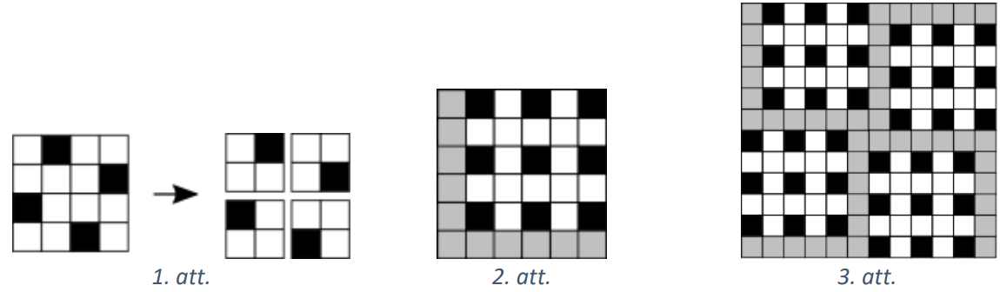
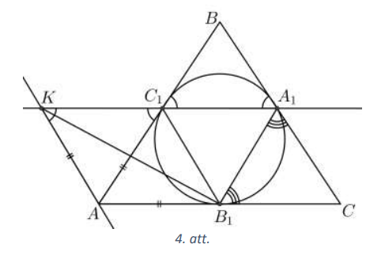
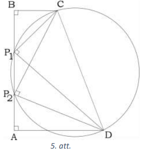
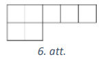
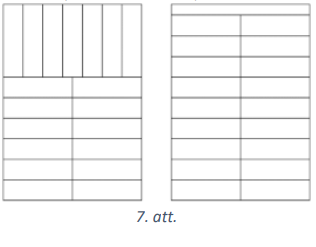
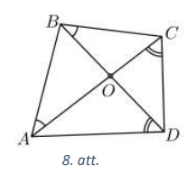
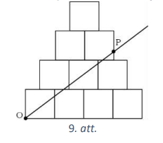
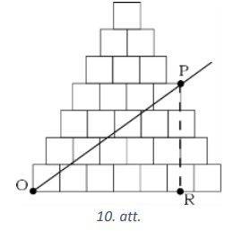
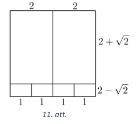
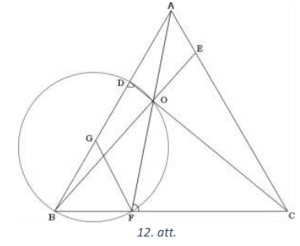

# <lo-sample/> LV.VOL.2021.9.1.

Dots, ka $a$ un $b$ ir kaut kādi reāli skaitļi. Pierādīt, ka vismaz vienam no 
vienādojumiem

$$\begin{aligned}
& x^{2}+2ax+b=0 \\
& ax^{2}+2bx+1=0 \\
& bx^{2}+2x+a=0
\end{aligned}$$

ir atrisinājums.

<small>

* questionType:
* domain:

</small>

## Atrisinājums

Pieņemsim pretējo. Tad visiem diskriminantiem jābūt negatīviem, tas ir,

$$a^{2} < b, \quad b^{2} < a, \quad 1 < ab$$

No pirmajām divām nevienādībām izriet, ka $a>0$ un $b>0$. Sareizinot pirmās 
divas nevienādības (to drīkst darīt, jo visas izteiksmes ir pozitīvas), 
iegūstam $a^{2}b^{2} < ab$. Izdalot abas nevienādības puses ar $ab>0$, iegūstam 
$ab<1$, kas ir pretrunā ar trešo nevienādību. Tātad pieņēmums bija aplams, 
līdz ar to vismaz vienam vienādojumam ir atrisinājums.

# <lo-sample/> LV.VOL.2021.9.2.

Dots naturāls skaitlis $n$. Pierādīt, ka $4n \times 4 n$ rūtiņu tabulā var 
aizkrāsot $4n^{2}$ rūtiņas tā, ka katrā rindā un katrā kolonnā ir aizkrāsotas 
tieši $n$ rūtiņas un nekādām divām aizkrāsotām rūtiņām nav kopīgu punktu (tas 
ir, iekrāsotās rūtiņas neatrodas blakus un nesaskaras pat ar stūriem).

<small>

* questionType:
* domain:

</small>

## Atrisinājums

Vispirms aplūkosim gadījumu, ja $n=1$. Tad $4 \times 4$ rūtiņu tabulā rūtiņas 
var aizkrāsot, kā parādīts 1.att. šis tabulas krāsojums atbilst visām prasībām.

Ievērosim, ka, sadalot aizpildīto tabulu $2 \times 2$ rūtiņas lielos kvadrātos,
iegūsim vienādi aizpildītus $2 \times 2$ rūtiņu kvadrātus, kas pagriezti 
attiecībā viens pret otru. Izmantojot šo ideju, veidosim tabulas aizpildījumu 
patvaļīgai $n$ vērtībai.

Vispirms izveidosim $2n \times 2n$ rūtiņu tabulu, kurā īpaši izdalīsim 
$(2n-1) \times(2n-1)$ kvadrātu, kam papildus ir viena tukša rinda un viena 
tukša kolonna. Šajā $(2n-1) \times(2n-1)$ kvadrātā aizkrāsosim $n$ rūtiņas 
katrā otrajā rindā un kolonnā, katrā virzienā atstājot pa tukšai rūtiņai starp 
iekrāsotajām (skat. 2.att., kur parādīts gadījums $n=3$).

Pagriežot šo kvadrātu un sakombinējot tā, kā $2 \times 2$ kvadrāti tika 
sakombinēti $4 \times 4$ tabulā, iegūstam nepieciešamo tabulas aizpildijumu 
(skat. 3.att.).

# <lo-sample/> LV.VOL.2021.9.3.

Atrast visus naturālu skaitļu pārus $(m; n)$, kuriem ir spēkā vienādība 
$m^{5}+5n^{4}=81m$.

<small>

* questionType:
* domain:

</small>

## Atrisinājums

Pārveidojam doto vienādību:

$$\begin{gathered}
5n^{4}=81m-m^{5} \\
5n^{4}=m\left(9+m^{2}\right)(3+m)(3-m)
\end{gathered}$$

Tā kā $m$ un $n$ ir naturāli skaitļi un iegūtās vienādības kreisās puses 
izteiksme ir pozitīva, tad $m=1$ vai $m=2$. Apskatām abus gadījumus:

- ja $m=1$, tad $5n^{4}=1 \cdot 10 \cdot 4 \cdot 2$ jeb $n^{4}=16$, no kā 
  iegūstam, ka $n=2$ (vērtība $n=-2$ neder, jo nav naturāls skaitlis);
- ja $m=2$, tad $5n^{4}=2 \cdot 13 \cdot 5 \cdot 1$ jeb $n^{4}=26$, no kā 
  iegūstam, ka naturālu atrisinājumu nav.

Līdz ar to esam ieguvuši, ka vienīgais derīgais skaitļu pāris ir $(1; 2)$.

# <lo-sample/> LV.VOL.2021.9.4.

Trijstūrī $ABC$ ievilktā riņķa līnija pieskaras tā malām $AB, BC$ un $AC$ 
attiecīgi punktos $C_{1}, A_{1}$ un $B_{1}$. Taisne, kas vilkta caur punktu $A$
paralēli $BC$, un taisne $A_{1}C_{1}$ krustojas punktā $K$. Pierādīt, ka 
$\sphericalangle KB_{1}A_{1}=90^{\circ}$.

<small>

* questionType:
* domain:

</small>

## Atrisinājums

Trijstūris $C_{1}BA_{1}$ ir vienādsānu trijstūris (jo $BC_{1}=BA_{1}$ kā 
pieskaru nogriežņi, kas vilkti no viena punkta), tāpēc 
$\sphericalangle BA_{1}C_{1}=\sphericalangle BC_{1}A_{1}$ (kā pamata pielenķi 
pie vienādajām malām). Līdz ar to

$$\sphericalangle AKC_{1}=\sphericalangle BA_{1}C_{1}=\sphericalangle BC_{1}A_{1}=\sphericalangle AC_{1}K$$

(pirmajā vienādībā ir iekšējie škērsleņķi, trešajā - krustleņķi, skat. 4.att.).

Tātad $\triangle KAC_{1}$ ir vienādsānu trijstūris (jo pamata pieleņķi ir 
vienādi) un $KA=AC_{1}$.

Tā kā $AC_{1}=AB_{1}$ kā pieskaru nogriežņi, kas vilkti no viena punkta, tad 
arī $KA=AB_{1}$. Tātad $\triangle KAB_{1}$ ir vienādsānu trijstūris un 
$\sphericalangle KB_{1}A=\frac{180^{\circ}-\sphericalangle KAB_{1}}{2}$. Tā kā 
$A_{1}C=CB_{1}$, tad arī $\sphericalangle CB_{1}A_{1}=\frac{180^{\circ}-\sphericalangle B_{1}CA_{1}}{2}$. Tātad

$$\sphericalangle KB_{1}A+\sphericalangle CB_{1}A_{1}=\frac{180^{\circ}-\sphericalangle KAB_{1}}{2}+\frac{180^{\circ}-\sphericalangle B_{1}CA_{1}}{2}=180^{\circ}-\frac{\sphericalangle KAB_{1}+\sphericalangle B_{1}CA_{1}}{2}=90^{\circ}$$

jo $\sphericalangle KAB_{1}+\sphericalangle B_{1}CA_{1}=180^{\circ}$ kā 
iekšējie vienpusleņķi. Līdz ar to

$$\sphericalangle KB_{1}A_{1}=180^{\circ}-\sphericalangle KB_{1}A-\sphericalangle CB_{1}A_{1}=180^{\circ}-90^{\circ}=90^{\circ}$$

# <lo-sample/> LV.VOL.2021.9.5.

Dotas $8$ kastes, sākumā tās visas ir tukšas. Divi spēlētāji spēlē sekojošu 
spēli, pirmais spēlētājs sāk. Vienā gājienā var izvēlēties jebkuras $7$ kastes 
un katrā no tām ielikt vienu ābolu (āboli ir pieejami pietiekamā daudzumā). 
Uzvar tas spēlētājs, pēc kura gājiena kādā no kastēm ir tieši $15$ āboli. Kurš 
spēlētājs - pirmais vai otrais - uzvarēs, pareizi spēlējot?

<small>

* questionType:
* domain:

</small>

## Atrisinājums

Pierādīsim, ka otrais spēlētājs vienmēr var uzvarēt.

Sanumurēsim kastes ar skaitļiem no $1$ līdz $8$ un apzīmēsim gājienu ar tās 
kastes numuru, kurā ābols netiek ielikts. Piemēram, gājiens " $3$ ", nozīmē, ka 
āboli tiek ielikti kastēs ar numuriem $1, 2, 4, 5, 6, 7, 8$.

Simetrijas dēļ pieņemsim, ka savā pirmajā gājienā pirmais spēlētājs veic 
gājienu " $1$ ". Tad otrais spēlētājs savos pirmajos $7$ gājienos neatkarīgi no 
tālākajiem pirmā spēlētāja gājieniem, var paiet gājienus 
" $2$ ", " $3$ ", " $4$ ", " $5$ ", " $6$ ", " $7$ ", " $8$ ". Aplūkosim situāciju pirms otrā spēlētāja 
astotā gājiena.

Pirmā spēlētāja pirmais gājiens kopā ar otrā spēlētāja pirmajiem $7$ gājieniem 
dod tieši $7$ ābolus katrā kastē. Pirmais spēlētājs vēl ir pagājis $7$ 
gājienus, tātad nevienā kastē nav vairāk kā $14$ āboli, bet noteikti ir vismaz 
viena kaste, kurā ir tieši $14$ āboli. Tajā tad savā $8.$ gājienā $2.$ 
spēlētājs var ielikt ābolu (kur likt pārējos $6$ ābolus nav svarīgi) un 
uzvarēt.

# <lo-sample/> LV.VOL.2021.10.1.

Naturāls skaitlis $S$ ir izsakāms formā $S=9n^{2}+42n$, kur $n$ ir kāds 
naturāls skaitlis. Pierādīt, ka, ja $S$ pēdējais cipars ir $6$, tad tā 
priekšpēdējais cipars ir $7$.

<small>

* questionType:
* domain:

</small>

## Atrisinājums

Aplūkosim skaitli $S+49=9n^{2}+42n+49=(3n+7)^{2}$.

Ja $S$ beidzas ar $6$, tad $S+49$ beidzas ar $5$. Vesela skaitļa, kas beidzas 
ar $5$, kvadrāts beidzas ar $25$.

Tātad $S+49=\cdots 25$ un tas nozīmē, ka $S$ decimālais pieraksts beidzas 
ar $76$.

# <lo-sample/> LV.VOL.2021.10.2.

Dota ģeometriskā progresija $x_{1}; x_{2}; x_{3}; x_{4}; x_{5}; x_{6}$, kuras 
locekļi ir pozitīvi skaitļi. Zināms, ka $x_{4}+x_{3}-x_{2}-x_{1}=3$. Pierādīt, 
ka $x_{5}+x_{6} \geq 12$.

$Piezīme.$ Ģeometriskā progresija ir skaitļu virkne, kuras pirmais loceklis ir 
$x_{1}$ un katru nākamo virknes locekli iegūst, iepriekšēo reizinot ar kādu 
fiksētu skaitli $q$, tas ir, $x_{2}=qx_{1}, x_{3}=qx_{2}$ utt.

<small>

* questionType:
* domain:

</small>

## Atrisinājums

Apzīmēsim ģeometriskās progresijas kvocientu ar $q$. levērojam, ka $q$ ir 
pozitīvs skaitlis un nav vienāds ar $1$ (citādi progresija būtu konstanta un 
nevarētu izpildīties $x_{4}+x_{3}-x_{2}-x_{1}=3$ ).

No dotā izriet, ka

$$\begin{gather*}
x_{1}q^{3}+x_{1}q^{2}-x_{1}q-x_{1}=3 \\
x_{1} \cdot\left(q^{3}+q^{2}-q-1\right)=3 \\
x_{1}\left(q^{2}(q+1)-(q+1)\right)=3 \\
x_{1}(q+1)\left(q^{2}-1\right)=3 \\
x_{1} \cdot(q+1)=\frac{3}{q^{2}-1} \tag{1}
\end{gather*}$$

Mums jāpierāda, ka 
$x_{5}+x_{6}=x_{1}\left(q^{5}+q^{4}\right)=x_{1}(q+1)q^{4} \geq 12$ jeb 
$q^{4} \geq \frac{12}{x_{1} \cdot(q+1)}$. levietojot šajā nevienādībā $(1)$, 
iegūstam, ka $q^{4} \geq 4 \cdot\left(q^{2}-1\right)$, kas ir patiesa 
nevienādība, jo $q^{4}-4q^{2}+4=\left(q^{2}-2\right)^{2} \geq 0$.

# <lo-sample/> LV.VOL.2021.10.3.

Dota taisnleņķa trapece $ABCD$, tās pamati ir $AD$ un $BC$ un $AB \perp AD$. Uz
malas $AB$ izvēlēts punkts $P$ tā, ka $\sphericalangle CPD=90^{\circ}$. 
Pierādīt, ka $BP=BC$ vai $BP=AD$, ja zināms, ka $AB=AD+BC$.

<small>

* questionType:
* domain:

</small>

## Atrisinājums

Aplūkosim divus punktus $P_{1}$ un $P_{2}$ uz malas $AB$ tā, ka $BP_{1}=BC$ un 
$BP_{2}=AD$ (skat. 5.att.). Tā kā trapeces pamati pēc definīcijas ir dažāda 
garuma, tad $P_{1}$ un $P_{2}$ ir atšķirīgi punkti.

Tad $\sphericalangle CP_{1}D=90^{\circ}$, jo $\triangle BCP_{1}$ un 
$\triangle ADP_{1}$ ir vienādsānu taisnleņķa trijstūri.

$\triangle BCP_{2}=\triangle ADP_{2}$, pēc pazīmes $m \ell m$ , jo 
$\sphericalangle CBP_{2}=\sphericalangle P_{2}AD=90^{\circ}, BP_{2}=AD$ un 
$BC=AP_{2}$. Tātad arī $\sphericalangle CP_{2}D=90^{\circ}$ un ap četrstūri 
$P_{1}CDP_{2}$ var apvilkt riņķa līniju, kuras diametrs ir $CD$.

Bet riņķa līnija nogriežņi var šķērsot ne vairāk kā divos punktos, tāpēc uz 
malas $AB$ nav citu punktu, kam nogriežņi uz $C$ un $D$ veido taisnu leņķi, 
līdz ar to $P$ sakrīt vai nu ar $P_{1}$, vai $P_{2}$. Tātad $BP=BC$ vai 
$BP=AD$.

# <lo-sample/> LV.VOL.2021.10.4.

Uz tāfeles sākumā uzrakstīts vienādojums $2019x^{2}+2020x+2021=0$. Divi 
spēlētāji pēc kārtas izdara gājienus, pirmais spēlētājs sāk. Vienā gājienā var 
izvēlēties jebkuru no trim koeficientiem vienādojuma kreisajā pusē (pie 
$x^{2}$, pie $x$ vai brīvo locekli) un no tā atņemt vieninieku. Zaudē tas 
spēlētājs, pēc kura gājiena uz tāfeles uzrakstītajam vienādojumam ir kāda 
vesela sakne. Kurš spēlētājs - pirmais vai otrais - uzvarēs, pareizi spēlējot?

<small>

* questionType:
* domain:

</small>

## Atrisinājums

Pirmais spēlētājs vienmēr var uzvarēt. Pierādīsim to.

Vispirms parādīsim, kā pirmais spēlētājs var noteikti nezaudēt. Lai to 
izdarītu, viņam jānodrošina, ka koeficienti pie $x^{2}$ un $x$ ir ar vienādu 
paritāti, bet brīvais loceklis ir nepāra skaitlis. Tādā gadījumā izteiksmes 
vērtība vienādojuma kreisajā pusē būs nepāra skaitlis pie jebkādas $x$ 
vērtības, tātad tā nevarēs būt nulle. Savā pirmajā gājienā pirmais spēlētājs 
var koeficientu pie $x$ samazināt no $2020$ uz $2019$ un visos tālākajos 
gājienos rīkoties šādi: ja otrais spēlētājs samazina koeficientu pie brīvā 
locekļa, tad to pašu dara arī pirmais spēlētājs, bet, ja otrais samazina 
koeficientu pie $x^{2}$ vai $x$, tad pirmais - attiecīgi pie $x$ vai $x^{2}$.

Atliek ievērot, ka spēle nevar turpināties bezgalīgi, jo noteikti pienāks 
brīdis, kad visu koeficientu summa būs vienāda ar $0$, un tātad $x=1$ būs 
vienādojuma sakne.

# <lo-sample/> LV.VOL.2021.10.5.

Taisnstūrveida tabulā, kurā ir $19$ rindas un $14$ kolonnas, ierakstīti kaut 
kādi reāli skaitļi. Zināms, ka skaitļu summa katrā 6.att. dotajā figūrā ir $1$,
turklāt šī figūra var būt pagriezta vai apmesta otrādi. Aprēķināt skaitļu summu
pirmajā rindā!

<small>

* questionType:
* domain:

</small>

## Atrisinājums

levērosim, ka no divām 6.att. figūrām var salikt $2 \times 7$ rūtiņu 
taisnstūri, skaitļu summa šajā taisnstūrī ir $2$. Visu tabulu $19 \times 14$ 
var noklāt ar šādiem $19$ šādiem taisnstūriem (pirmās $7$ rindas noklāj, liekot
tos vertikāli, pārējās $12$ rindas noklāj pa pāriem, liekot tos blakus 
horizontāli, skat. 7.att.), tātad skaitļu summa visā tabulā ir $38$. Bet visu 
tabulu bez pirmās rindas var noklāt ar $18$ šādiem taisnstūriem, liekot tos 
horizontāli (skat. 7.att.), tātad skaitļu summa šajā tabulas daļā ir $36$. 
Tātad pirmās rindas skaitļu summa ir $38-36=2$.

# <lo-sample/> LV.VOL.2021.11.1.

Pierādìt, ka $\sqrt[3]{6 \sqrt{3}+10}-\sqrt[3]{6 \sqrt{3}-10}=2$.

<small>

* questionType:
* domain:

</small>

## Atrisinājums

levērosim, ka $(\sqrt{3}+1)^{3}=6 \sqrt{3}+10$ un 
$(\sqrt{3}-1)^{3}=6 \sqrt{3}-10$. Līdz ar to

$$\sqrt[3]{6 \sqrt{3}+10}-\sqrt[3]{6 \sqrt{3}-10}=(\sqrt{3}+1)-(\sqrt{3}-1)=2$$

# <lo-sample/> LV.VOL.2021.11.2.

Dota ģeometriskā progresija $y_{1}; y_{2}; y_{3}; y_{4}; y_{5}; y_{6}$, kuras 
locekļi ir pozitīvi skaitļi. Zināms, ka $y_{4}+y_{3}-y_{2}-y_{1}=15$. Kāda ir 
$y_{5}+y_{6}$ mazākā iespējamā vērtība?

<small>

* questionType:
* domain:

</small>

## Atrisinājums

Pierādīsim, ka $y_{5}+y_{6}$ mazākā iespējamā vērtība ir $60$.

Vispirms parādīsim, ka $y_{5}+y_{6} \geq 60$.

Apzīmēsim ģeometriskās progresijas kvocientu ar $q>1$. No dotā izriet, ka 
$y_{1} \cdot\left(q^{3}+q^{2}-q-1\right)=15$ jeb

$$\begin{equation*}
y_{1} \cdot(q+1)=\frac{15}{q^{2}-1} \tag{1}
\end{equation*}$$

Mums jāpierāda, ka $y_{1}\left(q^{5}+q^{4}\right) \geq 60$ jeb ka 
$q^{4} \geq \frac{60}{x_{1} \cdot(q+1)}$. levietojot šajā nevienādībā $(1)$, 
iegūstam, ka $q^{4} \geq 4 \cdot\left(q^{2}-1\right)$, kas ir patiesa 
nevienādība, jo $q^{4}-4q^{2}+4=\left(q^{2}-2\right)^{2} \geq 0$.

Atliek parādīt, ka vērtība $y_{5}+y_{6}=60$ ir iegūstama. Lai tas tā būtu, 
visām nevienādībām ir jākļūst par vienādībām, tātad 
$q=\sqrt{2}$ un 
$y_{1} \cdot\left(\sqrt{2}^{3}+\sqrt{2}^{2}-\sqrt{2}-1\right)=15$ jeb 
$y_{1}=15(\sqrt{2}-1)$. Redzams, ka šajā gadījumā tik tiešām 
$y_{5}+y_{6}=y_{1}\left(q^{5}+q^{4}\right)=15(\sqrt{2}-1)(4 \sqrt{2}+4)=60$.

# <lo-sample/> LV.VOL.2021.11.3.

Naturālu skaitli sauksim par elegantu, ja tā decimālajā pierakstā nav nevienas 
nulles un šis skaitlis dalās ar savu ciparu summu. (Eleganti ir visi viencipara
skaitli, kā arī, piemēram, skaitļi $36$ un $322$.) Pierādīt, ka ir bezgalīgi 
daudz elegantu skaitļu!

<small>

* questionType:
* domain:

</small>

## Atrisinājums

Apzīmēsim skaitļa $x$ ciparu summu ar $S(x)$. Pierādīsim, ka, ja $A$ ir 
elegants, tad arī $\overline{AAA}$ (skaitlis, kas sastāv no trim pēc kārtas 
uzrakstītiem skaitļiem $A$ ) ir elegants.

levērosim, ka, ja $A$ ir $n$-ciparu skaitlis, tad 
$\overline{AAA}=A \cdot\left(1+10^{n}+10^{2n}\right)$ un 
$S(\overline{AAA})=3S(A)$. Tā kā $A$ dalās ar $S(A)$ pēc pieņēmuma, ka $A$ ir 
elegants, tad atliek pamatot, ka $1+10^{n}+10^{2n}$ dalās ar $3$, bet tas ir 
acīmredzami, jo tā ciparu summa ir $3$.

Šādā veidā, sākot ar jebkuru elegantu skaitli (piemēram, $36$), mēs varam iegūt
bezgalīgu elegantu skaitļu virkni ($36; 363636; 363636363636363636$ utt.).

# <lo-sample/> LV.VOL.2021.11.4.

Izliektā četrstūrī $ABCD$ ir spēkā $\sphericalangle CBD=\sphericalangle CAB$ un
$\sphericalangle ACD=\sphericalangle ADB$. Pierādīt, ka no nogriežņiem 
$BC, AD, AC$ var salikt taisnleņķa trijstūri!

<small>

* questionType:
* domain:

</small>

## Atrisinājums

Apzīmēsim $AC$ un $BD$ krustpunktu ar $O$ (skat. 8.att.).

Trijstūri $CBO$ un $CAB$ ir līdzīgi pēc pazīmes $\ell \ell$ 
($\sphericalangle BCA$ ir kopīgs un $\sphericalangle CAB=\sphericalangle CBO$ 
pēc dotā), tāpēc $\frac{CO}{BC}=\frac{BC}{AC}$ jeb $BC^{2}=CO \cdot AC$.

Tieši tāpat arī $\triangle ADO \sim \triangle ACB$ pēc pazīmes $\ell \ell$ 
($\sphericalangle CAD$ ir kopīgs un $\sphericalangle ADO=\sphericalangle ACD$ 
pēc dotā), tāpēc $\frac{AO}{AD}=\frac{AD}{AC}$ jeb $AD^{2}=AO \cdot AC$. Tāpēc

$$BC^{2}+AD^{2}=CO \cdot AC+AO \cdot AC=AC \cdot(AO+CO)=AC^{2}$$

un pēc apgrieztās Pitagora teorēmas izriet, ka no malām $BC$ un $AD$ kā katetēm
un $AC$ kā hipotenūzas var salikt taisnleņķa trijstūri.

# <lo-sample/> LV.VOL.2021.11.5.

Dotam naturālam skaitlim $k>1$ torni būvē šādi: simetriski attiecībā pret 
vertikālu simetrijas asi pirmajā rindā blakus saliek $k$ kvadrātus, otrajā 
rindā saliek $(k-1)$ kvadrātu, trešajā rindā saliek $(k-2)$ kvadrātus utt. līdz
$k$-ajā rindā liek vienu kvadrātu (skat. 9.att., kur parādīts tornis, ja 
$k=4$). No torņa pirmās rindas kreisā malējā kvadrāta kreisās apakšējās 
virsotnes $O$ novelk staru, kas torni sadala divās vienlielās figūrās. 
Pierādīt, ka bezgalīgi daudzām $k$ vērtībām šis stars iet caur kādas rindas 
labā malējā kvadrāta labo augšējo virsotni!

<small>

* questionType:
* domain:

</small>

## Atrisinājums

Pierādīsim, ka prasītais izpildās visām nepāra $k$ vērtīām $k=2n-1$. 
Pievērsīsim uzmanību $n$-tajai kvadrātu rindai pēc kārtas un tās pēdējā 
kvadrāta labējai augšējai virsotnei.

Pieņemsim, ka kvadrāta malas garums ir viena vienība. Aprēķināsim figūras 
laukuma daļu, kas atrodas zem stara $OP$ (skat. 10.att.). To veido trijstūra 
$OPR$ laukums un kvadrātu rindu galu "trepīte" (figūras daļa pa labi no $PR$):

$$\begin{gathered}
S_{OPR}=\frac{RO \cdot PR}{2}=\frac{\left(2n-1-\frac{1}{2}(n-1)\right) \cdot n}{2}=\frac{(3n-1) \cdot n}{4} \\
S_{\text {trepite }}=\frac{1}{2}\left(\frac{n(n-1)}{2}\right)=\frac{n(n-1)}{4} \\
S_{\text {ZemOP }}=\frac{(3n-1)n}{4}+\frac{n(n-1)}{4}=\frac{n(2n-1)}{2}
\end{gathered}$$

Kopējais visas figūras laukums ir

$$S_{visa}=1+2+\cdots+(2n-1)=\frac{2n(2n-1)}{2}=n(2n-1)$$

Puse no visa ir $\frac{n(2n-1)}{2}$, kas sakrīt ar aprēķināto 
$S_{\text {zemOP }}$. Tātad, ja $k$ ir nepāra skaitlis, tad figūras laukumu 
vienlielās daļās sadalošais stars iet caur kvadrāta virsotni.

# <lo-sample/> LV.VOL.2021.12.1.

Pierādīt, ka kvadrātu var sagriezt sešos taisnstūros, kuriem visiem īsākās 
malas attiecība pret garāko ir $2-\sqrt{2}$.

<small>

* questionType:
* domain:

</small>

## Atrisinājums

Zīmējumā (skat. 11.att.) attēlots, kā var sagriezt kvadrātu, kura malas garums 
ir $4$. Lielākajiem taisnstūriem īsākās malas attiecība pret garāko ir 
$\frac{2}{2+\sqrt{2}}=2-\sqrt{2}$, mazākajiem - arī tāda pati.

# <lo-sample/> LV.VOL.2021.12.2.

Doti reāli pozitīvi skaitļi $x, y, z$. Pierādīt, ka

$$\frac{x^{2}+y^{2}}{x+y}+\frac{y^{2}+z^{2}}{y+z}+\frac{z^{2}+x^{2}}{z+x} \geq x+y+z$$

<small>

* questionType:
* domain:

</small>

## Atrisinājums

Vispirms pamatosim, ka patvaļīgiem $x$ un $y$ ir spēkā 
$x^{2}+y^{2} \geq \frac{(x+y)^{2}}{2}$. Atverot iekavas un pārnest visu uz 
kreiso pusi, iegūstam

$$x^{2}+y^{2}-\frac{(x+y)^{2}}{2}=x^{2}+y^{2}-\frac{1}{2}\left(x^{2}+2 x y+y^{2}\right)=\frac{1}{2}\left(x^{2}-2 x y+y^{2}\right)=\frac{(x-y)^{2}}{2} \geq 0$$

Pielietojot šo visiem trim daļu skaitīājiem, iegūstam

$$\frac{x^{2}+y^{2}}{x+y}+\frac{y^{2}+z^{2}}{y+z}+\frac{z^{2}+x^{2}}{z+x} \geq \frac{(x+y)^{2}}{2(x+y)}+\frac{(y+z)^{2}}{2(y+z)}+\frac{(z+x)^{2}}{2(z+x)}=x+y+z$$

# <lo-sample/> LV.VOL.2021.12.3.

Agita ir iedomājusies naturālu skaitli $x$, kura ciparu summa ir $2021$, un 
Konstantīns cenšas skaitli uzminēt. Vienā gājienā Konstantīns nosauc patvaļīgu 
naturālu skaitli $a$, un Agita viņam pasaka skaitļa $|x-a|$ ciparu summu. Kāds 
ir mazākais gājienu skaits, ar kuru Konstantīnam noteikti pietiek, lai uzzinātu
Agitas iedomāto skaitli? 

<small>

* questionType:
* domain:

</small>

## Atrisinājums

Mazākais gājienu skaits ir $2021$. Vispirms parādīsim, kā Konstantīns var 
atrast Agitas skaitli $2021$ gājienā.

Pirmajā gājienā Konstantīns nosauc skaitli $a_{1}=1$. Ja Agitas skaitlis $x$ 
beidzas ar $k$ nullēm, tad viņa Konstantīnam nosauc skaitli $2020+9k$. Tādā 
veidā Konstantīns noskaidro, ar cik nullēm beidzas Agitas skaitlis. Apzīmēsim 
šo skaitu ar $k_{1}$ un tālāk aplūkosim skaitli $x_{1}=x-10^{k_{1}}$, kura 
ciparu summa ir $2020$.

Otrajā gājienā Konstantīns piemeklē skaitli $a_{2}$ tā, lai $x-a_{2}=x_{1}-1$ 
un līdzīgā veidā noskaidro, ar cik nullēm beidzas skaitlis $x_{1}$. Apzīmēsim 
šo skaitu ar $k_{2}$ un tālāk aplūkosim skaitli $x_{2}=x_{1}-10^{k_{2}}$, kura 
ciparu summa ir $2019$. Trešajā gājienā Konstantīns piemeklē skaitli $a_{3}$ 
tā, lai $x-a_{3}=x_{2}-1$ un līdzīgā veidā noskaidro, ar cik nullēm beidzas 
skaitlis $x_{2}$. Apzīmēsim šo skaitu ar $k_{3}$ un tālāk aplūkosim skaitli 
$x_{3}=x_{2}-10^{k_{3}}$, kura ciparu summa ir $2018$. Šādi Konstantīns 
turpina, līdz pēdējā solī tas iegūst, ka skaitlis $x_{2020}$, kura ciparu summa
ir $1$, beidzas ar $k_{2021}$ nullēm (tātad tas ir $x_{2020}=10^{k_{2021}}$).

Tātad Agitas iedomātais skaitlis ir 
$x=10^{k_{1}}+10^{k_{2}}+10^{k_{3}}+\cdots+10^{k_{2021}}$.

Atliek pamatot, ka ar mazāk gājieniem Konstantīns to izdarīt nevar. Pieņemsim, 
ka Agita ir atzinusies Konstantīnam, ka viņas iedomātais skaitlis sastāv tikai 
no vieniniekiem un nullēm. Konstantīnam ir jānoskaidro tikai, kurās pozīcijās 
atrodas vieninieki. Tas ir, Agitas skaitlis ir izteikts formā 
$x=10^{k_{1}}+10^{k_{2}}+10^{k_{3}}+\cdots+10^{k_{2021}}$, kur 
$k_{1} < k_{2} < k_{3} < \cdots < k_{2021}$, un Konstantīnam ir jānoskaidro visas 
vērtības $k_{i}$. Bet, ja izrādās, ka $10^{k_{1}}>a_{1}$, tad ar savu pirmo 
minējumu Konstantīns neko nenoskaidro par pārējiem skaitļiem 
$k_{2}, \ldots, k_{2021}$. Līdzīgi, ja $10^{k_{2}}>a_{2}$, tad ar savu otro 
minējumu Konstantīns neko nenoskaidro par atlikušajiem skaitļiem 
$k_{3}, \ldots, k_{2021}$. Līdzīgi turpinot, redzams, ka pat pēc $2020$-ā 
minējuma Konstantīns vēl neko nevarēs pateikt par skaitli $k_{1}$, tas var 
atrasties jebkurā pozīcijā.

# <lo-sample/> LV.VOL.2021.12.4.

Vienādmalu trijstūra $ABC$ malas garums ir $15$. Uz malas $AB$ atlikts punkts 
$D$ tā, ka $AD=5$, bet uz malas $AC$ - punkts $E$ tā, ka $AE=3$. Pierādīt, ka 
nogriežņi $BE$ un $CD$ ir perpendikulāri!

<small>

* questionType:
* domain:

</small>

## Atrisinājums

Caur $BE$ un $CD$ krustpunktu $O$ novelk nogriezni $AF$, kur $F$ atrodas uz 
$BC$ (skat. 12.att.). Pēc Čevas teorēmas 
$\frac{CF}{BF}=\frac{CE}{AE} \cdot \frac{AD}{DB}=2$ jeb $CF=10$ un $BF=5$. 
Tātad $\triangle BCD=\triangle ACF$ pēc pazīmes $m \ell m$. Attiecīgi 
$\sphericalangle BDC=\sphericalangle AFC$ un 
$\sphericalangle BDC+\sphericalangle AFB=180^{\circ}$, no kurienes izriet, ka 
četrstūrim $BDOF$ var apvilkt riņķa līniju.

Aplūkosim trijstūri $BDF$. Tā malu garumi $BD=10, BF=5$ un 
$\sphericalangle DBF=60^{\circ}$. Tātad $BDF$ ir taisnleņķa un ap $BDF$ 
apvilktās riņķa līnijas rādiusi $BG=GD=GF=5$.

Ap $\triangle BDF$ apvilktā riņķa līnija vienlaikus ir arī ap $BDOF$ apvilktā 
riņķa līnija.

Tā kā $\sphericalangle BOD$ balstās uz diametra, tad 
$\sphericalangle BOD=90^{\circ}$. Tātad $BE \perp CD$.

# <lo-sample/> LV.VOL.2021.12.5.

Atrast visus veselu skaitļu pārus $(a; b)$, kuriem

$$(19a+b)^{18}+(a+b)^{18}+(a+19b)^{18}$$

ir kāda vesela skaitļa kvadrāts.

<small>

* questionType:
* domain:

</small>

## Atrisinājums

Vienīgais šāds pāris ir $(0; 0)$, kurš der, jo $0^{18}+0^{18}+0^{18}=0$. 
Pierādīsim, ka neviens cits pāris neder. Pieņemsim, ka kāds skaitļu pāris 
$(a; b)$ atbilst uzdevuma nosacījumiem. Ja gan $a$, gan $b$ dalās ar $19^{k}$, 
tad arī skaitļu pāris $\left(\frac{a}{19^{k}}; \frac{b}{19^{k}}\right)$ atbilst
uzdevuma nosacījumiem. Tādā veidā mēs varam iegūt jaunu skaitļu pāri $(a; b)$, 
kurš atbilst uzdevuma nosacījumiem un kurā vismaz viens no skaitļiem nedalās ar
$19$.

levērosim, ka pēc mazās Fermā teorēmas, ja $x$ nedalās ar $19$, tad 
$x^{18}=1(\bmod 19)$. Tātad katrs no trim summas locekļiem pēc moduļa $19$ ir 
vai nu $0$, vai $1$. levērosim arī, ka, ja vismaz viens no skaitļiem $(a; b)$ 
nedalās ar $19$, tad vismaz divi no trim skaitļiem $19a+b; a+b; a+19b$ nedalās 
ar $19$. Līdz ar to šīs summas vērtība pēc moduļa $19$ ir vai nu $2$, vai $3$.

Bet ne $2$, ne $3$ pēc moduļa $19$ nevar būt naturāla skaitļa kvadrāts 
(pārbaude ar tabulu) - pretruna.

| $n(\bmod 19)$ | $n^{2}(\bmod 19)$ |
| ------------- | ----------------- |
| $0$           | $0$               |
| $\pm 1$       | $1$               |
| $\pm 2$       | $4$               |
| $\pm 3$       | $9$               |
| $\pm 4$       | $16$              |
| $\pm 5$       | $6$               |
| $\pm 6$       | $17$              |
| $\pm 7$       | $11$              |
| $\pm 8$       | $7$               |
| $\pm 9$       | $5$               |
