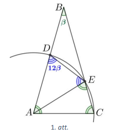
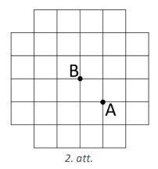
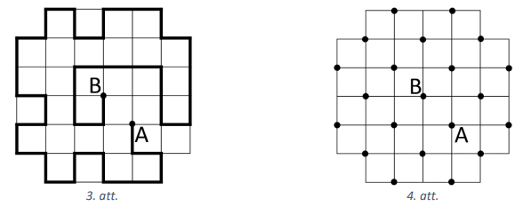
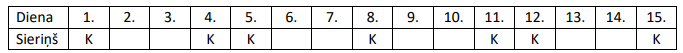
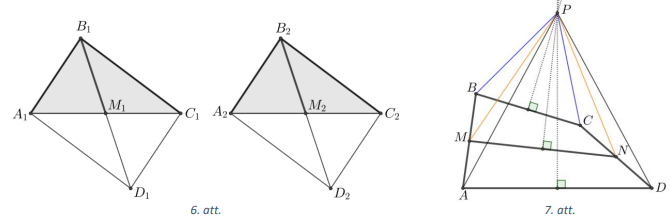
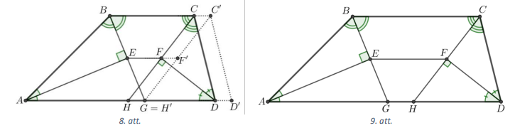
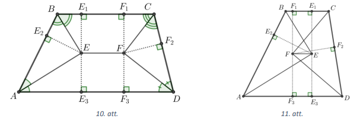
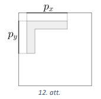

# <lo-sample/> LV.VOL.2022.9.1

Pierādīt, ka visiem reāliem skaitļiem $x$ un $y$ ir spēkā nevienādība 
$x^{2}+5y^{2}+4xy-6y+9 \geq 0$.

<small>

* questionType:
* domain:

</small>

## Atrisinājums

 Veicam ekvivalentus pārveidojumus:

$$\begin{gathered}
\left(x^{2}+4xy+4y^{2}\right)+\left(y^{2}-6y+9\right) \geq 0 \\
(x+2y)^{2}+(y-3)^{2} \geq 0
\end{gathered}$$

Tā kā skaitļa kvadrāts ir nenegatīvs, tad pēdējās nevienādības kreisajā pusē ir
divu nenegatīvu skaitļu summa, kas arī ir nenegatīvs skaitlis. Tātad pēdējā 
nevienādība ir patiesa. Tā kā tika veikti ekvivalenti pārveidojumi, tad arī 
dotā nevienādība ir patiesa visiem reāliem skaitļiem $x$ un $y$.

# <lo-sample/> LV.VOL.2022.9.2

Vienādsānu trijstūrī $ABC$ virsotnes leņķis $\sphericalangle ABC=\beta$. 
Ar centru punktā $A$ un rādiusu $AC$ novilkta riņķa līnija, kas krusto malas 
$AB$ un $BC$ attiecīgi punktos $D$ un $E$. Zināms, ka 
$\sphericalangle ADE=12 \beta$. Aprēķināt $\beta$ lielumu!

<small>

* questionType:
* domain:

</small>

## Atrisinājums

Tā kā $\triangle ABC$ ir vienādsānu, tad 
$\sphericalangle BAC=\sphericalangle BCA=\frac{1}{2}\left(180^{\circ}-\sphericalangle ABC\right)=\frac{1}{2}\left(180^{\circ}-\beta\right)$.
Ievērojam, ka $AD=AE=AC$ kā rādiusi (skat. 1.att.), tātad 
$\triangle DAE$ un $\triangle CAE$ ir vienādsānu trijstūri. Izsakām leķķus:

$$\begin{aligned}
& \left. \triangle CAE=180^{\circ}-2 \sphericalangle BCA=180^{\circ}-2 \cdot \frac{1}{2}\left(180^{\circ}-\beta\right)=\beta \text { (no } \triangle CAE\right) ; \\
& \quad \sphericalangle DAE=\sphericalangle BAC-\sphericalangle CAE=\frac{1}{2}\left(180^{\circ}-\beta\right)-\beta=90^{\circ}-\frac{3 \beta}{2} ; \\
& \quad \sphericalangle DAE=180^{\circ}-2 \sphericalangle ADE=180^{\circ}-2 \cdot 12 \beta=180^{\circ}-24 \beta \text { (no } \triangle DAE \text { ). }
\end{aligned}$$

Līdz ar to iegūstam vienādojumu:

$$90^{\circ}-\frac{3 \beta}{2}=180^{\circ}-24 \beta ; \quad 180^{\circ}-3 \beta=360^{\circ}-48 \beta ; \quad 45 \beta=180^{\circ} ; \quad \beta=4^{\circ}$$

# <lo-sample/> LV.VOL.2022.9.3

Pierādīt, ka katram naturālam $K>1$ var atrast tādu naturālu skaitli, kas dalās
ar $7$ un kura ciparu summa ir $K$.

<small>

* questionType:
* domain:

</small>

## Atrisinājums
 
 Apskatām divus gadījumus.

- Ja $K$ ir pāra skaitlis, tas ir, $K=2 n$, kur $n \in \mathbb{N}$. 
  Ievērosim, ka $1001$ dalās ar $7$ (jo $7 \cdot 143=1001$) un tā ciparu summa
  ir $2$. Uzrakstot skaitli $1001$ rindā aiz sevis $n$ reizes 
  $(100110011001\ldots )$, iegūsim $(4n)$-ciparu skaitli, kura ciparu summa ir 
  $2n$ un kurš dalās ar $7$.
- Ja $K$ ir nepāra skaitlis, tas ir, $K=2n+1$, kur $n \in \mathbb{N}$. 
  Papildus ievērosim, ka skaitlis $21$ dalās ar $7$ un tā ciparu summa ir $3$. 
  Aiz skaitļa $21$ uzrakstot $(n-1)$ reizi skaitli $1001$ 
  $(2110011001\ldots )$, iegūsim $(4n-2)$-ciparu skaitli, kura ciparu summa ir
  $3+(n-1) \cdot 2=2n+1$ un kurš dalās ar $7$ .

# <lo-sample/> LV.VOL.2022.9.4

Ziņkārīgs tūrists vēlas pastaigāties pa pilsētas ielām (plānā attēlotas kā 
rūtiņu malas) no krustojuma $\mathrm{A}$ līdz krustojumam B (skat. 2.att.), 
veicot pēc iespējas garāku ceļojumu un neatgriežoties nevienā krustojumā 
vairākas reizes. Kāds ir lielākais iespējamais ceļojuma garums, ja uzskatām, 
ka vienas rūtiņas mala ir vienu vienību gara?

<small>

* questionType:
* domain:

</small>

## Atrisinājums

Lielākais iespējamais ceļojuma garums ir $40$, to var veikt, piemēram, kā 
parādīts 3.att.

Pierādīsim, ka lielāks ceļojuma garums nav iespējams. Atzīmēsim katru otro 
krustojumu ar melnu aplīti (skat. 4.att.). Ievērosim, ka ik pēc diviem veiktiem
posmiem ceļotājs nonāk atzīmētajā krustpunktā. Tā kā sākumpunkts A ir atzīmēts 
un atzīmētu krustpunktu kopā ir $21$, tad apmeklēšanai atliek vairs tikai $20$ 
atzīmētu krustpunktu (ieskaitot B). Tātad ceļojums beigsies punktā B pēc ne 
vairāk kā $2 \cdot 20=40$ posmiem.

# <lo-sample/> LV.VOL.2022.9.5

Pierādīt, ka trijstūra augstumi nevar būt $19, 37$ un $41$ vienību gari!

<small>

* questionType:
* domain:

</small>

## Atrisinājums

Pieņemsim, ka šāds trijstūris eksistē un ka tā laukums ir $S$. Izmantojot 
trijstūra laukuma aprēķināšanas formulu $S=\frac{a \cdot h_{a}}{2}$, izsakām 
trijstūra malas garumu $a=\frac{2S}{h_{a}}$. Tad trijstūra malu garumi ir 
$\frac{2S}{19^{\prime}} \frac{2S}{37}$ un $\frac{2S}{41}$. Bet šiem malu 
garumiem neizpildās trijstūra nevienādība, jo 
$\frac{2S}{37}+\frac{2S}{41}<\frac{2S}{19}$. Šī nevienādība ir ekvivalenta 
nevienādībai $\frac{1}{37}+\frac{1}{41}<\frac{1}{19}$, kuras patiesumu var 
viegli pārbaudīt, piemēram, ar šādiem ekvivalentiem pārveidojumiem:

$$\frac{1}{37}+\frac{1}{41}<\frac{2}{38} ; \quad \frac{1}{37}-\frac{1}{38}<\frac{1}{38}-\frac{1}{41} ; \quad \frac{1}{37 \cdot 38}<\frac{3}{38 \cdot 41} ; \quad \frac{1}{37}<\frac{3}{41} ; \quad 41<3 \cdot 37$$

# <lo-sample/> LV.VOL.2022.10.1

Atrisināt reālos skaitļos vienādojumu sistēmu

$$\left\{\begin{array}{l}
x^{2}=y+2 \\
y^{2}=x+2
\end{array}\right.$$

<small>

* questionType:
* domain:

</small>

## Atrisinājums

Atņemot no pirmā vienādojuma otro un veicot ekvivalentus pārveidojumus, iegūstam

$$\begin{gathered}
x^{2}-y^{2}=y-x; \\
(x-y)(x+y)+(x-y)=0; \\
(x-y)(x+y+1)=0.
\end{gathered}$$

Tātad $x-y=0$ vai $x+y+1=0$.

- Apskatām gadījumu, kad $x-y=0$. Izsakām $y=x$ un ievietojam to dotās 
  vienādojumu sistēmas pirmajā vienādojumā. legūstam kvadrātvienādojumu 
  $x^{2}-x-2=0$, kuram ir divas saknes $x_{1}=-1$ un $x_{2}=2$. Tad attiecīgi 
  arī $y_{1}=-1$ un $y_{2}=2$. Pārbaudot redzam, ka skaitļu pāri $(-1; -1)$ un 
  $(2; 2)$ der.
- Apskatām gadījumu, kad $x+y+1=0$. Izsakām $y=-1-x$ un ievietojam to dotās 
  vienādojumu sistēmas pirmajā vienādojumā. legūstam $x^{2}+x-1=0$, kuram ir 
  divas saknes $x_{3}=\frac{-1+\sqrt{5}}{2}$ un $x_{4}=\frac{-1-\sqrt{5}}{2}$. 
  Tad attiecīgi $y_{3}=-1-x_{3}=\frac{-1-\sqrt{5}}{2}$ un 
  $y_{4}=-1-x_{4}=\frac{-1+\sqrt{5}}{2}$. Pārbaudot redzam, ka 
  $\left(\frac{-1+\sqrt{5}}{2} ; \frac{-1-\sqrt{5}}{2}\right)$ un 
  $\left(\frac{-1-\sqrt{5}}{2} ; \frac{-1+\sqrt{5}}{2}\right)$ apmierina doto 
  vienādojumu sistēmu.

Tātad dotajai vienādojumu sistēmai ir $4$ atrisinājumi:

$$(-1; -1); \quad(2; 2); \quad\left(\frac{-1+\sqrt{5}}{2}; 
\frac{-1-\sqrt{5}}{2}\right); \quad\left(\frac{-1-\sqrt{5}}{2}; 
\frac{-1+\sqrt{5}}{2}\right)$$

# <lo-sample/> LV.VOL.2022.10.2

Uz regulāra trijstūra $ABC$ malas $AB$ kā uz diametra konstruēta pusriņķa 
līnija ārpus trijstūra. Punkti $D$ un $E$ atrodas uz šīs pusriņķa līnijas un 
dala to trīs vienādos lokos. Pierādīt, ka nogriežņi $CD$ un $CE$ sadala malu
$AB$ trīs vienāda garuma nogriežņos!

<small>

* questionType:
* domain:

</small>

## Atrisinājums

Nogriežņu $CD$ un $CE$ krustpunktus ar $AB$ apzīmējam attiecīgi ar $M$ un $N$ 
(skat. 5.att.) un apzīmējam $AB=AC=CB=a$. No simetrijas izriet, ka $AM=NB$, 
tātad prasītais būs pierādīts, ja pierādīsim, ka $AM=\frac{a}{3}$.

Novelkam $CO \perp AB$ un $DK \perp AB$. Tā kā loki $AD, DE$ un $EB$ ir vienādi, 
tad katrs no tiem ir $60^{\circ}$ un $\sphericalangle BAD=60^{\circ}$ kā 
ievilktais leņķis, kas balstās uz loku $DB$.

levērojam, ka $O$ ir gan regulārā trijstūra $ABC$ augstuma pamats, gan pusriņķa
līnijas centrs. legūstam, ka $AO=OB=O D=\frac{1}{2} AB=\frac{a}{2}$. levērojam, 
ka trijstūris $AOD$ ir regulārs, jo tas ir vienādsānu trijstūris, kam leņķis 
pie pamata ir $60^{\circ}$. Tā kā punkts $K$ ir šī regulārā trijstūra augstuma 
pamats, tad $AK=KO=\frac{AO}{2}=\frac{a}{4}$.

Regulārie trijstūri $ABC$ un $AOD$ ir līdzīgi ar līdzības koeficientu 
$\frac{AB}{AO}=2$. Tas nozīmē, ka $\frac{CO}{KD}=2$.

Trijstūri $MOC$ un $MKD$ ir līdzīgi pēc pazīmes $\ell \ell$ (vienādi taisnie 
leņķi un krustleņķi). Tā kā līdzīgos trijstūros atbilstošās malas ir 
proporcionālas un $\frac{CO}{KD}=2$, tad arī $\frac{OM}{MK}=2$ jeb $OM=2MK$.

levērojam, ka $KO=OM+MK=3MK=\frac{a}{4}$, no kurienes $MK=\frac{a}{12}$.

Tātad $AM=AK+MK=\frac{a}{4}+\frac{a}{12}=\frac{a}{3}$.

# <lo-sample/> LV.VOL.2022.10.3

Pierādīt, ka katram naturālam $K>1$ var atrast tādu naturālu skaitli, kas dalās
ar $13$ un kura ciparu summa ir $K$.

<small>

* questionType:
* domain:

</small>

## Atrisinājums

Apskatām divus gadījumus.

- Ja $K$ ir pāra skaitlis, tas ir, $K=2 n$, kur $n \in \mathbb{N}$. levērojam, 
  ka $1001$ dalās ar $13$ (jo $1001=13 \cdot 77$) un tā ciparu summa ir $2$. 
  Uzrakstot skaitli $1001$ rindā aiz sevis $n$ reizes $(100110011001\ldots )$, 
  iegūsim $(4n)$-ciparu skaitli, kura ciparu summa ir $2n$ un kurš dalās ar $13$.
- Ja $K$ ir nepāra skaitlis, tas ir, $K=2n+1$, kur $n \in \mathbb{N}$. 
  Papildus ievērosim, ka skaitlis $10101$ dalās ar $13$ (jo $10101=13 \cdot 777$)
  un tā ciparu summa ir $3$. Aiz skaitla $10101$ uzrakstot ($n-1$) reizi skaitli 
  $1001$ $(1010110011001\ldots )$, iegūsim $(4n+1)$-ciparu skaitli, kura ciparu
  summa ir $3+(n-1) \cdot 2=2 n+1$ un kurš dalās ar $7$ .

# <lo-sample/> LV.VOL.2022.10.4

Vienādojuma $x^{3}-40 x^{2}+511x-2040=0$ saknes ir trijstūra malu garumi, kas 
izteikti centimetros. Aprēkināt šī trijstūra laukumu!

<small>

* questionType:
* domain:

</small>

## Atrisinājums

Dotā vienādojuma saknes apzīmējam ar $a, b, c$ un vienādojumu pārrakstām formā:

$$\begin{equation*}
(x-a)(x-b)(x-c)=0. \tag{1}
\end{equation*}$$

Atverot iekavas, iegūstam

$$\begin{equation*}
x^{3}-(a+b+c)x^{2}+(ab+ac+bc)x-abc=0. \tag{2}
\end{equation*}$$

Dotajā vienādojumā un vienādojumā (2), pielīdzinot koeficientus pie vienādām 
pakāpēm, iegūstam, ka

$$\begin{gathered}
a+b+c=40; \\
ab+a c+b c=511;
\end{gathered}$$

$$abc=2040.$$

Pēc Hērona formulas trijstūra laukums $S=\sqrt{p(p-a)(p-b)(p-c)}$, kur $a, b$ 
un $c$-trijstūra malu garumi, bet $p$ - pusperimetrs. Tā kā $a, b, c$ ir 
trijstūra malu garumi un $a+b+c=40$, tad pusperimetrs $p=20$.

Analogiski kā no (1) tika iegūts (2), iegūstam, ka

$$(p-a)(p-b)(p-c)=p^{3}-(a+b+c)p^{2}+(ab+ac+bc)p-abc$$

Tātad trijstūra laukums ir

$$\begin{gathered}
S=\sqrt{p\left(p^{3}-(a+b+c)p^{2}+(ab+ac+bc)p-abc\right)}= \\
=\sqrt{20 \cdot\left(20^{3}-40 \cdot 20^{2}+511 \cdot 20-2040\right)}= \\
=20 \sqrt{20^{2}-2 \cdot 20^{2}+511-102}= \\
20 \sqrt{409-400}=60\left(\mathrm{~cm}^{2}\right).
\end{gathered}$$

## Atrisinājums

Atradīsim trijstūra malu garumus. Ja tie ir naturāli skaitļi, tad tiem jābūt 
brīvā locekla $2040$ dalītājiem. levērojot, ka 
$2040=2^{3} \cdot 3 \cdot 5 \cdot 17$, var uzminēt sakni, piemēram, $x=17$.

Sagrupējot vienādojuma locekļus, iegūstam arī pārējās saknes:

$$\begin{gathered}
x^{3}-40 x^{2}+511 x-2040=x^{3}-17 x^{2}-23 x^{2}+391 x+120 x-2040= \\
=x^{2}(x-17)-23 x(x-17)+120(x-17)=(x-17)\left(x^{2}-23 x+120\right)= \\
=(x-17)(x-15)(x-8).
\end{gathered}$$

Tātad dotā vienādojuma saknes un attiecīgi arī trijstūra malu garumi ir 
$8,15,17$. Tā kā $8^{2}+15^{2}=17^{2}$, tad dotais trijstūris ir taisnleņķa 
trijstūris un tā laukums ir 
$\frac{1}{2} \cdot 8 \cdot 15=60\left(\mathrm{~cm}^{2}\right)$.

# <lo-sample/> LV.VOL.2022.10.5

Holivudas diētā katrās septiņās secīgās dienās kopā jāapēd tieši trīs sieriņi 
"Kārums", bet Bolivudas diētā - katrās vienpadsmit secīgās dienās kopā jāapēd 
tieši pieci sieriņi "Kārums". Kādu lielāko secīgu dienu skaitu var ievērot abas
diētas vienlaicīgi?

$Piezīme.$ Katru dienu var ēst veselu nenegatīvu skaitu sieriṇu.

<small>

* questionType:
* domain:

</small>

## Atrisinājums

Abas diētas vienlaicīgi var ievērot lielākais $15$ dienas pēc kārtas. Lai to 
izdarītu viens sieriṇš "Kārums" jāēd $1., 4., 5., 8., 11., 12., 15.$ dienā. 
Viegli pārbaudīt, ka abu diētu nosacījumi izpildās.

Pierādīsim, ka $16$ (vai vairāk) dienas abas diētas vienlaicīgi ievērot nevar. 
Pieṇemsim pretējo, ka to var izdarīt, un apzīmēsim $i$-ajā dienā apēsto sieriņu
skaitu ar $a_{i}$. No Holivudas diētas nosacījuma izriet, ka $a_{i}=a_{i+7}$ 
visiem $1 \leq i \leq 9$, bet no Bolivudas diētas nosacījuma izriet, ka 
$a_{i}=a_{i+11}$ visiem $1 \leq i \leq 5$. Apvienojot šos nosacījumus, iegūstam
divas vienādību virknes (pirmās vienādības locekļus apzīmējam ar $x$, bet 
otrās - ar $y$ ):

$$\begin{gathered}
a_{6}=a_{13}=a_{2}=a_{9}=a_{16}=a_{5}=a_{12}=a_{1}=a_{8}=a_{15}=a_{4}=a_{11}=x; \\
a_{7}=a_{14}=a_{3}=a_{10}=y.
\end{gathered}$$

Pirmajās septiņās dienās apēsto sieriṇu skaits ir 
$a_{1}+a_{2}+\cdots+a_{7}=5x+2y$, bet pirmajās $11$ dienās apēsto sieriņu 
skaits ir $a_{1}+a_{2}+\cdots+a_{11}=8x+3y$. No diētu nosacījumiem iegūstam 
vienādojumu sistēmu: 

$$ \left\{ \begin{array}{l}
5x+2y=3 \\ 
8x+3y=5
\end{array} \right.$$

kuru atrisinot, iegūstam, ka $x=1$ un $y=-1$, kas nav iespējams (apēsto sieriņu
skaits nevar būt negatīvs).

# <lo-sample/> LV.VOL.2022.11.1

Vai eksistē tāds naturāls skaitlis, kuram vienlaikus izpildās šādas trīs īpašības:

- to reizinot ar $2$, iegūst naturāla skaitļa kvadrātu;
- to reizinot ar $3$, iegūst naturāla skaitļa kubu;
- to reizinot ar $5$, iegūst naturāla skaitļa piekto pakāpi?

<small>

* questionType:ProveDisprove
* domain:

</small>

## Atrisinājums

Jā, piemēram, der skaitlis $2^{15} \cdot 3^{20} \cdot 5^{24}$, jo

$$\begin{aligned}
2^{15} \cdot 3^{20} \cdot 5^{24} \cdot 2 & =\left(2^{8} \cdot 3^{10} \cdot 5^{12}\right)^{2}, \\
2^{15} \cdot 3^{20} \cdot 5^{24} \cdot 3 & =\left(2^{5} \cdot 3^{7} \cdot 5^{8}\right)^{3}, \\
2^{15} \cdot 3^{20} \cdot 5^{24} \cdot 5 & =\left(2^{3} \cdot 3^{4} \cdot 5^{5}\right)^{5}.
\end{aligned}$$

# <lo-sample/> LV.VOL.2022.11.2

Četrstūra $ABCD$ malu $AB$ un $CD$ viduspunkti ir attiecīgi $M$ un $N$. 
Nogriežņu $AD, BC$ un $MN$ vidusperpendikuli krustojas vienā punktā. 
Pierādīt, ka $AB=CD$.

<small>

* questionType:
* domain:

</small>

## Atrisinājums

Vispirms pierādīsim lemmu: ja diviem trijstūriem ir vienādas divas malas un 
mediānas pret trešo malu, tad šie trijstūri ir vienādi.

\textit {Pierādījums.} Pieņemsim, ka ir doti divi trijstūri $A_{1} B_{1} C_{1}$ un 
$A_{2} B_{2} C_{2}$, kuros novilktas mediānas $B_{1} M_{1}$ un $B_{2} M_{2}$ un
kuros $A_{1} B_{1}=A_{2} B_{2}, B_{1} C_{1}=B_{2} C_{2}$ un 
$B_{1} M_{1}=B_{2} M_{2}$. Papildinām trijstūri $A_{1} B_{1} C_{1}$ līdz 
paralelogramam: uz taisnes $B_{1} M_{1}$ atliekam punktu $D_{1}$ tā, ka 
$B_{1} D_{1}=2 B_{1} M_{1}$ (skat. 6.att.). Tā kā četrstūra 
$A_{1} B_{1} C_{1} D_{1}$ diagonāles krustojoties dalās uz pusēm, tad šis 
četrstūris ir paralelograms. Analogi izdarām arī ar trijstūri $A_{2} B_{2} C_{2}$.

Trijstūri $A_{1} B_{1} D_{1}$ un $A_{2} B_{2} D_{2}$ ir vienādi pēc pazīmes 
$\mathrm{mmm}$, jo 
$A_{1} B_{1}=A_{2} B_{2}, A_{1} D_{1}=B_{1} C_{1}=B_{2} C_{2}=A_{2} D_{2}$ un 
$B_{1} D_{1}=2 B_{1} M_{1}=2 B_{2} M_{2}=B_{2} D_{2}$. Tātad 
$\sphericalangle A_{1} B_{1} M_{1} =\sphericalangle A_{2} B_{2} M_{2}$ (vienādos trijstūros 
attiecīgie leņķi ir vienādi). Analogi no trijstūru $B_{1} C_{1} D_{1}$ un 
$B_{2} C_{2} D_{2}$ vienādības izriet, ka 
$\sphericalangle M_{1} B_{1} C_{1}=\sphericalangle M_{2} B_{2} C_{2}$.

Tātad $\sphericalangle A_{1} B_{1} C_{1}=\sphericalangle A_{1} B_{1} M_{1}+\sphericalangle M_{1} B_{1} C_{1}=\sphericalangle A_{2} B_{2} M_{2}+\sphericalangle M_{2} B_{2} C_{2}=\sphericalangle A_{2} B_{2} C_{2}$, 
no kā izriet, ka trijstūri $A_{1} B_{1} C_{1}$ un $A_{2} B_{2} C_{2}$ ir 
vienādi pēc pazīmes $\mathrm{m \ell m}$. Lemma pierādīta.

Tagad dotajā uzdevumā vidusperpendikulu krustpunktu apzīmēsim ar $P$ 
(skat. 7.att.). Trijstūri $PBA$ un $PCD$ ir vienādi pēc iepriekš pierādītās 
lemmas, jo no vidusperpendikulu īpašībām vienādas ir to divas malas $PB=PC$ 
un $PA=PD$, un vienādas ir to mediānas $PM=PN$. Tā kā vienādos trijstūros 
atbilstošie elementi ir vienādi, tad $AB=CD$.

# <lo-sample/> LV.VOL.2022.11.3

Sākumā uz papīra lapas uzrakstīts skaitlis $16$. Ja uz lapas ir

- uzrakstīts skaitlis $x$, tad uz tās atlauts uzrakstīt arī skaitli $x^{2}$;
- uzrakstiti skaitļi $x$ un $y$, tad uz tās atļauts uzrakstīt arī skaitli $|x-y|+1$.

Vai var panākt, lai uz lapas būtu uzrakstïts skaitlis $2022$ (neviens 
uzrakstītais skaitlis netiek nodzēsts)?

<small>

* questionType:
* domain:

</small>

## Atrisinājums

Pamatosim, ka nevar panākt, lai uz lapas būtu uzrakstīts skaitlis $2022$.

Sākumā uzrakstītais skaitlis $16$, dalot ar $3$, dod atlikumu $1$.

- Ja skaitlis $x$ dod atlikumu $1$, dalot ar $3$, tad arī skaitlis $x^{2}$, 
  dalot ar $3$, dod atlikumu $1$, jo $1^{2} \equiv 1(\bmod 3)$.
- Ja skaitļi $x$ un $y$, dalot ar $3$, dod atlikumu $1$, tad arī skaitlis 
  $|x-y|+1$ dod atlikumu $1$, dalot ar $3$, jo $1-1+1 \equiv 1(\bmod 3)$.

Tas nozīmē, ka uz lapas var iegūt tikai tādus skaitļus, kas dod atlikumu $1$, 
dalot ar $3$. Tā kā $2022$ dalās ar $3$ (bez atlikuma), tad aprakstītajā veidā 
šo skaitli uz lapas iegūt nevar.

$Piezīme.$ Uzdevumu var risināt arī pēc moduļa $5$ vai pēc moduļa $15$.

# <lo-sample/> LV.VOL.2022.11.4

Vienādojuma $x^{3}-54 x^{2}+865 x-3480=0$ saknes ir trijstūra malu garumi, 
izteikti centimetros. Aprēķināt šī trijstūra laukumu!

<small>

* questionType:
* domain:

</small>

## Atrisinājums

Dotā vienādojuma saknes apzīmējam ar $a, b, c$ un vienādojumu pārrakstām formā:

$$\begin{equation*}
(x-a)(x-b)(x-c)=0. \tag{1}
\end{equation*}$$

Atverot iekavas, iegūstam

$$\begin{equation*}
x^{3}-(a+b+c)x^{2}+(ab+ac+bc)x-abc=0. \tag{2}
\end{equation*}$$

Dotajā vienādojumā un vienādojumā (2), pielīdzinot koeficientus pie vienādām 
pakāpēm, iegūstam, ka

$$\begin{gathered}
a+b+c=54; \\
ab+ac+bc=865; \\
abc=3480.
\end{gathered}$$

Pēc Hērona formulas trijstūra laukums $S=\sqrt{p(p-a)(p-b)(p-c)}$, kur $a, b$ 
un $c$ - trijstūra malu garumi, bet $p$ - pusperimetrs. Tā kā $a, b, c$ ir 
trijstūra malu garumi un $a+b+c=54$, tad pusperimetrs $p=27$.

Analogiski kā no (1) tika iegūts (2), iegūstam, ka

$$(p-a)(p-b)(p-c)=p^{3}-(a+b+c)p^{2}+(ab+ac+bc)p-abc$$

Tātad trijstūra laukums ir

$$\begin{aligned}
S= & \sqrt{p\left(p^{3}-(a+b+c)p^{2}+(ab+ac+bc)p-abc\right)}= \\
= & \sqrt{27 \cdot\left(27^{3}-54 \cdot 27^{2}+865 \cdot 27-3480\right)}= \\
= & \sqrt{27 \cdot 3 \cdot\left(9 \cdot 27^{2}-18 \cdot 27^{2}+865 \cdot 9-1160\right)} \\
= & 9 \sqrt{-9 \cdot 27^{2}+7785-1160}=9 \sqrt{64}=72\left(\mathrm{~cm}^{2}\right)
\end{aligned}$$

## Atrisinājums

Atradīsim trijstūra malu garumus. Ja kāds no tiem ir racionāls skaitlis, tad 
tas ir skaitļa $3480$ dalītājs. levērojot, ka 
$3480=2^{3} \cdot 3 \cdot 5 \cdot 29$, uzminam vienu sakni $x=24$.

Sagrupējot vienādojuma locekļus, iegūstam:

$$\begin{aligned}
 x^{3}-54x^{2}+865x-3480=x^{3}-24x^{2}-30x^{2}+720x+145x-3480= \\
= & x^{2}(x-24)-30x(x-24)+145(x-24)=(x-24)\left(x^{2}-30x+145\right)
\end{aligned}$$

Atrisinot kvadrātvienādojumu $x^{2}-30x+145=0$, iegūstam, ka tā saknes ir 
$15-\sqrt{80}$ un $15+\sqrt{80}$. Tātad trijstūra malu garumi ir 
$24,15+\sqrt{80}$ un $15-\sqrt{80}$. Lai aprēķinātu trijstūra laukumu, 
izmantosim Hērona formulu. Trijstūra pusperimetrs ir 
$\frac{1}{2}(24+15+\sqrt{80}+15-\sqrt{80})=27$ un tātad tā laukums ir

$$\begin{gathered}
S=\sqrt{27(27-24)(27-15-\sqrt{80})(27-15+\sqrt{80})}= \\
=\sqrt{27 \cdot 3 \cdot(12-\sqrt{80})(12+\sqrt{80})}=\sqrt{27 \cdot 3 \cdot 64}=72\left(\mathrm{~cm}^{2}\right)
\end{gathered}$$

# <lo-sample/> LV.VOL.2022.11.5

Naturālu skaitli $N$ sauksim par $amizantu$, ja katru $N$ secīgu 
naturālu skaitli reizinājums dalās ar $N^{2}$. Kuri skaitlļi nav amizanti?

<small>

* questionType:
* domain:

</small>

## Atrisinājums

Pamatosim, ka amizanti nav visi pirmskaitli, kā arī skaitlis $4$.

Ja $p$ ir pirmskaitlis, tad pirmo $p$ skaitļu reizinājums 
$1 \cdot 2 \cdot \ldots p$ nedalās ar $p^{2}$, jo neviens no pirmajiem $p-1$ 
skaitliem nedalās ar $p$.

Pirmo $4$ skaitļu reizinājums $1 \cdot 2 \cdot 3 \cdot 4$ nedalās ar $4^{2}$, 
tātad skaitlis $4$ nav amizants.

Pierādīsim, ka visi pārējie skaitli ir amizanti. Ja $N$ ir salikts skaitlis, 
kas ir lielāks nekā $4$, tad to var izteikt kā reizinājumu $N=a \cdot b$, kur 
$a \geq 2$ un $b \geq 3$. Tātad $N \geq 2 b$ un $N \geq 3 a$. No $N$ pēc kārtas
sekojošiem skaitļiem viens noteikti dalās ar $N$. Tā kā $2 b \leq N$, tad vēl 
vismaz viens cits no šiem $N$ pēc kārtas sekojošiem skaitļiem dalās ar $b$. Tā 
kā $3a \leq N$, tad vēl vismaz divi citi no šiem $N$ pēc kārtas sekojošiem 
skaitļiem dalās ar $a$ (tas nozīmē, ka kāds no šiem diviem skaitliem, kas dalās
ar $a$, noteikti nesakrīt ar to skaitli, kas dalās ar $b$ ). Tātad $N$ pēc 
kārtas sekojošu skaitļu reizinājums dalās ar $N \cdot b \cdot a=N^{2}$.

# <lo-sample/> LV.VOL.2022.12.1

Atrisināt reālos skaitļos vienādojumu $x^{2}-\cos x+1=0$.

<small>

* questionType:
* domain:

</small>

## Atrisinājums

Der vērtība $x=0$, jo $0^{2}-1+1=0$. Ja $x \neq 0$, tad $x^{2}+1>1 \geq \cos x$, 
tātad vienādība nevar pastāvēt.

# <lo-sample/> LV.VOL.2022.12.2

Trapeces $ABCD$ pamati ir $AD$ un $BC$. Leņķu $BAD$ un $ABC$ bisektrises 
krustojas punktā $E$, bet leņķu $BCD$ un $CDA$ bisektrises - punktā $F$. 
Pierādīt, ka $EF=\frac{|AD+BC-AB-CD|}{2}$.

<small>

* questionType:
* domain:

</small>

## Atrisinājums

Taisnes $BE$ un $AD$ krustpunktu apzīmēsim ar $G$, bet taisnes $CH$ krustpunktu
ar $AD$ - ar $H$ (skat. 8.att.).

Tā kā $\sphericalangle ABC+\sphericalangle BAD=180^{\circ}$, tad 
$\sphericalangle BAE+\sphericalangle ABE=90^{\circ}$ un no trijstūra $ABE$ iegūstam, ka 
$\sphericalangle AEB=180^{\circ}-90^{\circ}=90^{\circ}$. Tad 
$\triangle AEB=\triangle AEG$ pēc pazīmes $\ell \mathrm{m \ell}$ un $AB=AG$ 
kā atbilstošās malas vienādos trijstūros. Analoǵiski pierāda, ka $DC=DH$.

No tā, ka $BE=EG$ un $CF=FG$ izriet, ka $EF || BC$ un $EF || AD$ (caur punktu 
$E$ novelk taisni paralēli $AD$ un $BC$, pēc Talesa teorēmas šī taisne sadala 
nogriezni $CH$ uz pusēm, tātad tā iet caur punktu $F$).

Apskatīsim divus gadījumus, kādā secībā var būt izkārtoti punkti uz taisnes $AD$.

- Skat. 8.att. Trijstūri $HCD$ paralēli pārnesam par $\overrightarrow{HG}$. 
  Tad $CC^{\prime}=DD^{\prime}=FF^{\prime}=HH^{\prime}=HG$. Tā kā 
  $EF^{\prime}$ ir trijstūra $GBC^{\prime}$ viduslīnija, tad 
  $EF^{\prime}=\frac{BC^{\prime}}{2}=\frac{BC+HG}{2}$. legūstam, ka 
  $EF=EF^{\prime}-FF^{\prime}=\frac{BC+HG}{2}-HG=\frac{BC-HG}{2}$. 
  levērojam, ka $HG=AG+DH-AD=AB+DC-AD$. Tātad $EF=\frac{AD+BC-AB-CD}{2}$.
- Skat. 9.att. legūstam, ka 
  $EF=\frac{BC+HG}{2}=\frac{BC+AD-AG-DH}{2}=\frac{AD+BC-AB-CD}{2}$.

## Atrisinājums

No punkta $E$ novelkam perpendikulus pret malām $BC, AB$ un $AD$, to pamatus 
attiecīgi apzīmējam ar $E_{1}, E_{2}, E_{3}$ (skat. 10.att.). 
Līdzīgi no punkta $F$ novelkam perpendikulus pret malām $BC, CD, AD$ un to 
pamatus attiecīgi apzīmējam ar $F_{1}, F_{2}, F_{3}$.

Tā kā katrs leņķa bisektrises punkts atrodas vienādā attālumā no leņķa malām, 
tad $EE_{1}=EE_{2}$ un $EE_{2}=EE_{3}$. Līdzīgi iegūstam, ka 
$FF_{1}=FF_{2}=FF_{3}$.

Taisnleṇka trijstūri $EE_{1}B$ un $EE_{2}B$ ir vienādi (jo ir vienāda katete un
hipotenūza), tāpēc $E_{1}B=E_{2}B$ kā atbilstošās malas vienādos trijstūros. 
Līdzīgi iegūstam, ka $E_{2}A=E_{3}A, F_{1}C=F_{2}C$ un $F_{2}D=F_{3}D$.

Četrstūris $E_{1}F_{1}F_{3}E_{3}$ ir taisnstūris un $EF$ ir tā viduslīnija 
tāpēc $E_{1}F_{1}=E_{3}F_{3}=EF$.

- Ja uz nogriežṇa $BC$ punkti atrodas secībā $B, E_{1}, F_{1}, C$ 
  (skat. 10.att.; attiecīgi uz $AD$ tad punkti atrodas secībā 
  $\left.A, E_{3}, F_{3}, D\right. $), tad

$$\frac{BC+AD-AB-CD}{2}=\frac{BE_{1}+E_{1}F_{1}+F_{1}C+AE_{3}+E_{3}F_{3}+F_{3}D-BE_{2}-E_{2}A-CF_{2}-F_{2}D}{2}=\frac{E_{1}F_{1}+E_{3}F_{3}}{2}=EF$$

- Ja uz nogriežṇa $BC$ punkti atrodas secībā $B, F_{1}, E_{1}, C$ 
  (skat. 11.att.; attiecīgi uz $AD$ tad punkti ir šādā secībā: 
  $\left.A, F_{3}, E_{3}, D\right. $), tad

$$\frac{BC+AD-AB-CD}{2}=\frac{BE_{1}-E_{1}F_{1}+F_{1}C+AE_{3}-E_{3}F_{3}+F_{3}D-BE_{2}-E_{2}A-CF_{2}-F_{2}D}{2}=\frac{E_{1}F_{1}+E_{3}F_{3}}{2}=EF$$

# <lo-sample/> LV.VOL.2022.12.3

Pierādīt, ka divu vai vairāku secīgu naturālu skaitļu kubu summa nevar būt 
pirmskaitlis!

<small>

* questionType:
* domain:

</small>

## Atrisinājums

No kubu summas formulas $a^{3}+b^{3}=(a+b)\left(a^{2}-ab+b^{2}\right)$ redzams,
ka $a^{3}+b^{3}$ dalās ar $(a+b)$. Apskatīsim divus iespējamos gadījumus.

- Ja ir pāra skaits secīgu naturālu skaitļu, tas ir, $2k$ secīgi naturāli 
  skaitli, kur $k=1,2,\ldots $, tad šo skaitlu summu var uzrakstīt kā

$$S=(n-k+1)^{3}+(n-k+2)^{3}+\cdots+(n+k-1)^{3}+(n+k)^{3}.$$

Sagrupējot pirmo saskaitāmo ar pēdējo, otro saskaitāmo - ar pirmspēdējo utt., 
iegūstam, ka

$$\begin{gathered}
(n-k+1)^{3}+(n+k)^{3} \text { dalās ar } n-k+1+n+k=2 n+1, \\
(n-k+2)^{3}+(n+k-1)^{3} \text { dalās ar } n-k+2+n+k-1=2 n+1,
\end{gathered}$$

Tā kā visas šīs $k$ summas dalās ar $(2n+1)$, tad arī visu $2k$ kubu summa 
dalās ar $(2n+1)$, līdz ar to nav pirmskaitlis.

- Ja ir nepāra skaits secīgu naturālu skaitļu, tas ir, $(2k+1)$ secīgi naturāli
  skaitli, kur $k=1,2,\ldots $, tad šo skaitļu summu var uzrakstīt kā

$$S=(n-k)^{3}+(n-(k-1))^{3}+\ldots +(n-1)^{3}+n^{3}+(n+1)^{3}+\ldots +(n+(k-1))^{3}+(n+k)^{3}.$$

Ievērojam, ka pašā vidū šiem saskaitāmajiem atrodas skaitlis $n^{3}$, kas dalās
ar $n$. Pārējos saskaitāmos sagrupējam tāpat kā iepriekš, tas ir, sagrupējam 
pirmo saskaitāmo ar pēdējo, otro saskaitāmo - ar pirmspēdējo utt., iegūstam, ka

$$\begin{gathered}
(n-k)^{3}+(n+k)^{3} \text { dalās ar } n-k+n+k=2n \\
(n-(k-1))^{3}+(n+(k-1))^{3} \text { dalās ar } n-k+1+n+k-1=2n
\end{gathered}$$

Tā kā visas šīs summas dalās ar $2n$, un vidējais saskaitāmais $n^{3}$ dalās 
ar $n$, tad arī visu $(2k+1)$ kubu summa dalās ar $n$, līdz ar to nav pirmskaitlis.

$Piezīme.$ Uzdevumu var atrisināt arī ar matemātiskās indukcijas metodi.

# <lo-sample/> LV.VOL.2022.12.4

Vienādojuma $x^{3}-14x^{2}+63x-91=0$ saknes ir trijstūra malu garumi, kas 
izteikti centimetros. Aprēķināt šī trijstūra laukumu!

<small>

* questionType:
* domain:

</small>

## Atrisinājums

Dotā vienādojuma saknes apzīmējam ar $a, b, c$ un vienādojumu pārrakstām formā:

$$\begin{equation*}
(x-a)(x-b)(x-c)=0. \tag{1}
\end{equation*}$$

Atverot iekavas, iegūstam

$$\begin{equation*}
x^{3}-(a+b+c)x^{2}+(ab+ac+bc)x-abc=0. \tag{2}
\end{equation*}$$

Dotajā vienādojumā un vienādojumā (2), pielīdzinot koeficientus pie vienādām 
pakāpēm, iegūstam, ka

$$\begin{gathered}
a+b+c=14; \\
ab+ac+bc=63; \\
abc=91.
\end{gathered}$$

Pēc Hērona formulas trijstūra laukums $S=\sqrt{p(p-a)(p-b)(p-c)}$, kur $a, b$ 
un $c$ - trijstūra malu garumi, bet $p$ - pusperimetrs. Tā kā $a, b, c$ ir 
trijstūra malu garumi un $a+b+c=14$, tad pusperimetrs $p=7$.

Analoǵiski kā no (1) tika iegūts (2), iegūstam, ka

$$(p-a)(p-b)(p-c)=p^{3}-(a+b+c)p^{2}+(ab+ac+bc)p-abc.$$

Tātad trijstūra laukums ir

$$\begin{aligned}
& S=\sqrt{p\left(p^{3}-(a+b+c) p^{2}+(ab+ac+bc)p-abc\right)}= \\
& =\sqrt{7 \cdot\left(7^{3}-14 \cdot 7^{2}+63 \cdot 7-91\right)}= \\
& =\sqrt{7 \cdot 7 \cdot(49-98+63-13)}=7\left(\mathrm{~cm}^{2}\right)
\end{aligned}$$

# <lo-sample/> LV.VOL.2022.12.5

Kvadrātu ar izmēriem $9 \times 9$ rūtiņas pa rūtiņu līiijām sadalīia deviņos 
daudzstūros, kas katrs satur tieši $9$ rūtiņas, un katru no tiem nokrāsoja citā
krāsā. Katrā dotā kvadrāta rindā un katrā kolonnā atrodas tieši trīs dažādu 
krāsu rūtiņas. Pierādīt, ka visi iegūtie daudzstūri ir kvadrāti ar izmēriem 
$3 \times 3$ rūtiņas!

<small>

* questionType:
* domain:

</small>

## Atrisinājums

Aplūkosim, cik garas var būt katra daudzstūra projekcijas uz divām dotā kvadrāta 
perpendikulārajām malām. Abas projekcijas ir nogriežṇi, tās apzīmēsim ar 
$p_{x}$ un $p_{y}$ (skat. 12.att.).

Tā kā katrs daudzstūris satur $9$ rūtiņas, tad projekciju garumu reizinājums 
būs vismaz $9$ rūtiņas, tas ir, $p_{x} \cdot p_{y} \geq 9$.

Noteiksim, kāda ir mazākā iespējamā projekciju garumu summa. No nevienādības 
starp vidējo aritmētisko un vidējo ǵeometrisko iegūstam, ka

$$\frac{p_{x}+p_{y}}{2} \geq \sqrt{p_{x} \cdot p_{y}} \geq \sqrt{9}=3.$$

Tātad $p_{x}+p_{y} \geq 6$, pie tam vienādība izpildās tikai tad, ja 
$p_{x}=p_{y}=3$.

Tā kā katrā rindā un katrā kolonnā ir tieši trīs dažādu krāsu rūtinas, tad 
katrā rindā projekciju summa ir $1+1+1=3$ un arī katrā kolonnā projekciju summa
ir $1+1+1=3$. Tātad visu projekciju garumu kopsumma ir 
$3 \cdot 9($ rindas $)+3 \cdot 9$ (kolonnas $)=54$. Līdz ar to katrai no deviņu
daudzstūru projekciju garumu summām jābūt $6$ (pretējā gadīumā, ja kaut viena 
daudzstūra projekciju garumu summa pārsniegtu $6$, tad visu projekciju garumu 
summa pārsniegtu $9 \cdot 6=54$ ). Tātad visi daudzstūri ir kvadrāti ar 
izmēriem $3 \times 3$ rūtiņas.

