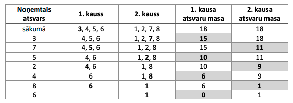
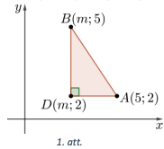
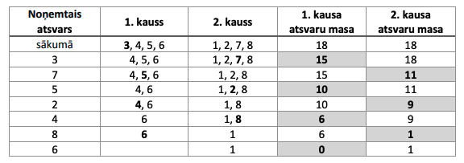
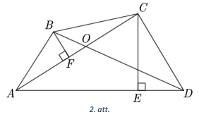
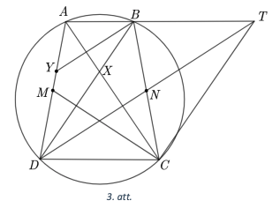
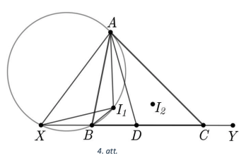

# <lo-sample/> LV.VOL.2023.9.1

Vai eksistē tādi naturāli skaitli $x$ un $y$, ka izteiksmes 
$x^{2}-x-y^{2}+y$ vērtība ir **(A)** $10$, **(B)** $2023$?

<small>

* questionType:ProveDisprove,ProveDisprove
* domain:Alg

</small>

## Atrisinājums

**(A)** Jā, piemēram, $x=4$ un $y=2$, tad $4^{2}-4-2^{2}+2=16-4-4+2=10$. 

**(B)** Nē, tādi naturāli skaitļi $x$ un $y$ neeksistē. Pārveidojot izteiksmi, iegūstam

$$x^{2}-x-y^{2}+y=x(x-1)-y(y-1)$$

Tā kā divu pēc kārtas esošu naturālu skaitļu reizinājums ir pāra skaitlis, 
tad abi saskaitāmie $x(x-1)$ un $y(y-1)$ ir pāra skaitļi. Divu pāra skaitļu 
starpība ir pāra skaitlis, tātad to starpība nevar būt $2023$, jo tas ir nepāra skaitlis.

# <lo-sample/> LV.VOL.2023.9.2

Doti $8$ atsvari, kuru masas attiecīgi ir $1,2,3,4,5,6,7$ un 
$8 \mathrm{~kg}$. Vai šos atsvarus var novietot uz sviru svaru 
kausiem tā, lai izpildās abi nosacijumi:

- sākumā uz katra svaru kausa būtu $4$ atsvari un svari atrastos līdzsvarā;
- atsvarus varētu pārmainus noņemt no viena svaru kausa un no otra tā, 
  lai pēc katra atsvara (izṇemot pēdējā) noṇemšanas tas kauss, 
  no kura noṇem atsvaru, kļūtu vieglāks nekā otrs svaru kauss?

<small>

* questionType:ProveDisprove
* domain:Alg

</small>

## Atrisinājums

Jā, var, atsvarus izvietojam šādi: uz viena svaru kausa liekam atsvarus, kuru masa ir 
$3, 4, 5, 6 \mathrm{~kg}$ (kopā $18 \mathrm{~kg}$), 
bet uz otra - $1, 2, 7, 8 \mbox{~kg}$ (kopā $18$ $~\mbox{kg}$). 
Atsvarus var noṇemt šādā secībā: $3$; $7$; $5$; $2$; $4$; $8$; $6$; $1$ 
(masas izmaina dota tabulā, kur pelēkā krāsā iekrāsots vieglākais svaru kauss).

{ width=300px }

# <lo-sample/> LV.VOL.2023.9.3

Pa apli uzrakstīti $n$ skaitļi, kur katrs no tiem ir $0$ vai $1$. 
Vienā gājienā Māris var izvēlēties kādu skaitli, kuram blakus 
abās pusēs (pa labi un pa kreisi) uzrakstītie skaitļi ir vienādi, 
un izvēlētā skaitļa vietā uzrakstīt otru skaitli (tas ir, skaitļa 
$0$ vietā uzrakstīt $1$ un otrādi). Vai Māris, atkārtojot šādus 
gājienus, vienmēr (neatkarīgi no sākotnējām skaitļu vērtībām un 
izkārtojuma) var panākt, ka visi pa apli uzrakstītie skaitļi ir 
vienādi, ja: **(A)** $n=72$; **(B)** $n=73$; **(C)** $n=74$?

<small>

* questionType:ProveDisprove,ProveDisprove,ProveDisprove
* domain:Comb
* method:AugmentationWithNewElements

</small>

## Atrisinājums

**(A)** Ja $n=72$, tad Māris ne vienmēr var iegūt prasīto. Piemēram, 
ja skaitli pa apli izkārtoti tā, ka $18$ reizes pēc kārtas atkārtojas 
skaitļu četrinieki "$0;0;1;1$", tad nav tāda skaitļa, 
kam abās pusēs uzrakstīti vienādi skaitļi. Līdz ar to Māris vispār 
nevar veikt nevienu gājienu un nevar panākt, ka visi aplī esošie skaitļi 
kļūst vienādi.

**(B)** Pamatosim, ka Māris vienmēr var panākt, ka pa apli uzrakstīti 
vienādi skaitļi. Ar bloku apzīmēsim vienādu skaitļu virkni, kurai abos 
galos blakus atrodas pretēji skaitli virknē esošajiem (piemēram, 
$\ldots ; 0 ; \underbrace{1 ; 1 ; \ldots ; 1 ; 1}_{b l o k s} ; 0 ; \ldots)$. 
Ievērosim, ka eksistē bloks, kura garums ir nepāra skaitlis. Ja tāds bloks neeksistētu,
tad bloku garumu summa būtu pāra skaitlis, kas ir visu skaitļu kopējais skaits. 
Iegūstam pretrunu, jo pa apli uzrakstīti $73$ skaitļi (nepāra skaitlis).

Nezaudējot vispārīgumu, pieṇemsim, ka šajā blokā ir $2k+1$ vieninieki 
(gadījums ar nullēm ir līdzīgs). Katram vieniniekam piešḳirsim indeksu $a_{i}$ 
pulksteṇa rādītāja virzienā. Sākumā Māris veic gājienus ar vieniniekiem, 
kuriem ir pāra indekss, tas ir, $a_{2}, a_{4}, \ldots, a_{2 k}$, un pēc tam 
veic gājienus ar vieniniekiem ar nepāra indeksu, tas ir, 
$a_{1}, a_{3}, \ldots, a_{2 k+1}$. Tādā veidā bloks ar vieniniekiem 
tiek pārveidots par bloku ar nullēm. Tā kā sākotnējam blokam abās pusēs 
ir divi bloki ar nullēm, tad pēc aprakstīto gājienu veikšanas visi trīs bloki 
saplūdīs kopā. Tātad kopējais bloku skaits samazinās par $2$. Šādi Māris turpina 
darboties - atrod bloku ar garumu, kas ir nepāra skaitlis, un sapludina 
to kopā ar blakus esošajiem blokiem. Kādā brīdī bloku skaits kļūs vienāds 
ar $2$, jo sākumā bloku skaits ir pāra (nuļļu un vieninieku bloki mainās 
pārmainus). Kad tas būs izdarīts, Māris var veikt gājienu ar to bloku, 
kura garums ir nepāra skaitlis, un tad visi uzrakstītie skaitļi būs vienādi.

**(C)** Ja $n=74$, tad Māris ne vienmēr var iegūt prasīto. Aplūkosim 
šādu skaitlu izkārtojumu: skaitlu četriniekam "$1;1;1;1$" no abām pusēm 
pārmaiṇus ir sarakstīti skaitļu pāri "$0;0$" un "$1;1$". 
Šādā gadījumā "$1;1;1;1$" no abām pusēm būs "$0;0$". Māris var veikt 
divus iespējamus gājienus: "$1;1;1;1$" pārrakstīt vai nu par "$1;0;1;1$" 
vai "$1;1;0;1$". Nezaudējot vispārīgumu, pieṇemsim, ka "$1;1;1;1$" 
ir pārtaisīts par "$1;0;1;1$" (otrs gadījums ir līdzīgs). Tādā gadījumā 
nākamais iespējamais gājiens ir skaitļu bloku "$0;0;1;0;1;1;0;0$" 
pārrakstīt par "$0;0;0;0;1;1;0;0$" vai "$0;0;1;1;1;1;0;0$". 
Tas nozīmē, ka Māris iegūs līdzīgu situāciju pirms diviem gājieniem 
esošajam skaitļu izkārtojumam. Līdz ar to Māris šajā gadījumā nevarēs 
iegūt uzdevumā prasīto.

# <lo-sample/> LV.VOL.2023.9.4

Plaknē atzīmēti punkti $A(5;2), $B(m;5)$ un $C(3;m)$. 
Kādām reālām $m$ vērtībām trijstūris $ABC$ ir taisnleṇka trijstūris?

<small>

* questionType:FindAll
* domain:Geom

</small>

## Atrisinājums

Apskatām taisnleṇka trijstūri $ADB$, kur $D(m;2)$, $AD=|5-m|$ un 
$BD=|5-2|=3$ (skat. 1.att.). Izmantojot Pitagora teorēmu $\triangle ADB$, 
aprēķinām nogriežṇa $AB$ garuma kvadrātu:

$$AB^{2} = AD^{2}+BD^{2}=(5-m)^{2}+(2-5)^{2}=m^{2}-10m+34$$

{ width=150px }

Līdzīgi, katram nogrieznim konstruējot taisnleṇka trijstūri, iegūstam, ka

$$\begin{gathered}
AC^{2} = (5-3)^{2} + (2-m)^{2} = m^{2}-4m+8 \\
BC^{2} = (m-3)^{2} + (5-m)^{2} = 2m^{2}-16m+34
\end{gathered}$$

Lai trijstūris $ABC$ būtu taisnlenka, divu malu garumu kvadrātu summai 
jābūt vienādai ar trešās malas garuma kvadrātu. Aplūkojam trīs iespējamos gadījumus.

1. Ja $AB^{2}+AC^{2}=BC^{2}$, tad

   $$\begin{gathered}
   m^{2}-10 m+34+m^{2}-4 m+8=2 m^{2}-16 m+34 \\
   2m+8=0 \\
   m=-4
   \end{gathered}$$

2. Ja $AC^{2}+BC^{2}=AB^{2}$, tad

   $$\begin{gathered}
   m^{2}-4 m+8+2 m^{2}-16 m+34=m^{2}-10 m+34 \\
   m^{2}-5 m+4=0 \\
   m_{1}=1, \quad m_{2}=4
   \end{gathered}$$

3. Ja $A B^{2}+B C^{2}=A C^{2}$, tad

   $$\begin{gathered}
   m^{2}-10 m+34+2 m^{2}-16 m+34=m^{2}-4 m+8 \\
   m^{2}-11 m+30=0 \\
   m_{1}=5, \quad m_{2}=6
   \end{gathered}$$

Esam ieguvuši, ka trijstūris $ABC$ ir taisnleṇka ja $m$ ir $-4;1;4;5;6$.

# <lo-sample/> LV.VOL.2023.9.5

Uz tāfeles uzrakstīti dažādi pirmskaitļi, kuru vidējais 
aritmētiskais ir $25$. Kāds vislielākais pirmskaitlis var 
būt uzrakstīts uz tāfeles?

<small>

* questionType:FindOptimal
* domain:NT
* method:ExtremeElements

</small>

## Atrisinājums

Lielākais uz tāfeles uzrakstītais pirmskaitlis var būt $127$. 
Pamatosim, ka lielāks pirmskaitlis nevar būt uzrakstīts. 
Ja viens no uzrakstītajiem pirmskaitļiem ir pirmskaitlis $2$, 
tad pārējie uzrakstītie skaitļi ir nepāra skaitļi un iespējami divi gadījumi:

1. visu uzrakstīto skaitļu kopējais skaits ir nepāra skaitlis un skaitļu summa 
   ir pāra skaitlis, tātad vidējais aritmētiskais nevar būt nepāra skaitlis 
   (var būt pāra skaitlis vai daļskaitlis);
2. visu uzrakstīto skait|u kopējais skaits ir pāra skaitlis un skaitļu 
   summa ir nepāra skaitlis, tātad vidējais aritmētiskais nav vesels skaitlis.

Abi gadījumi neatbilst uzdevuma nosacījumiem, tātad uz tāfeles nav uzrakstīts skaitlis $2$.

Lielāko uz tāfeles uzrakstīto pirmskaitli apzīmēsim ar $p$. Varam secināt, 
ka $p>25$, jo uzrakstītie skaitli ir dažādi un to vidējais aritmētiskais ir $25$. 
Uzrakstīsim uz tāfeles visus trūkstošos pirmskaitļus, kas mazāki nekā $25$, 
un nodzēsīsim visus uz tāfeles esošos pirmskait|us, kas lielāki nekā 25 , izṇemot $p$. Šādā gadījumā uz tāfeles uzrakstīto skaitlu vidējais aritmētiskais samazināsies. No tā iegūstam, ka

$$\frac{3+5+7+11+13+17+19+23+p}{9} \leq 25$$

Tātad $p \leq 127$. Tā kā 127 ir pirmskaitlis, tad uz tāfeles var būt 
uzrakstīti pirmskaitļi $3;5;7;11;13;17;19;23;127$, kuru vidējais aritmētiskais ir $25$.

# <lo-sample/> LV.VOL.2023.10.1

Atrisināt reālos skaitļos vienādojumu

$$3\left(x^{2}+y^{2}+z^{2}+4\right) - 2(xy + yz + zx) - 4(x+y+z)=0$$

<small>

* questionType:FindAll
* domain:Alg
* method:PolynomialTransformations

</small>

## Atrisinājums

Atverot iekavas un sagrupējot saskaitāmos, iegūstam

$$\begin{aligned}
\left(x^{2}-2 x y+y^{2}\right)+ & \left(y^{2}-2 y z+z^{2}\right)+\left(z^{2}-2 x z+x^{2}\right)+\left(x^{2}-4 x+4\right)+\left(y^{2}-4 y+4\right)+\left(z^{2}-4 z+4\right)=0 \\
& (x-y)^{2}+(y-z)^{2}+(z-x)^{2}+(x-2)^{2}+(y-2)^{2}+(z-2)^{2}=0
\end{aligned}$$

Tā kā katrs saskaitāmais ir starpības kvadrāts, tad visi saskaitāmie ir nenegatīvi. 
Vienīgā iespēja, kā, saskaitot sešus nenegatīvus skaitļus, iegūt $0$, ir tad, 
ja katra saskaitāmā vērtība ir $0$. Tātad $x=y=z=2$.

# <lo-sample/> LV.VOL.2023.10.2

Doti $8$ atsvari, kuru masas attiecīgi ir $1,2,3,4,5,6,7$ un 
$8 \mathrm{~kg}$. Vai šos atsvarus var novietot uz sviru svaru 
kausiem tā, lai izpildās abi nosacījumi:

* sākumā uz katra svaru kausa būtu $4$ atsvari un svari atrastos līdzsvarā;
* atsvarus varētu pārmainus noṇemt no viena svaru kausa un no otra tā, 
  lai pēc katra atsvara (izṇemot pēdējā) noṇemšanas tas kauss, 
  no kura noṇem atsvaru, kļūtu vieglāks nekā otrs svaru kauss?

<small>

* questionType:ProveDisprove
* domain:Comb

</small>

## Atrisinājums

Jā, var, atsvarus izvietojam šādi: uz viena svaru kausa liekam atsvarus, 
kuru masa ir $3,4,5,6\mathrm{~kg}$ (kopā $18 \mathrm{~kg}$), 
bet uz otra - $1, 2, 7, 8 \mathrm{~kg}$ (kopā $18 \mathrm{~kg}$). 
Atsvarus var noṇemt šādā secībā: $3; 7; 5; 2; 4; 8; 6; 1$ (masas izmaiṇa dota tabulā, 
kur pelēkā krāsā iekrāsots vieglākais svaru kauss).

{ width=300px }

# <lo-sample/> LV.VOL.2023.10.3

Rindā kaut kādā secībā uzrakstīti visi naturālie skaitli no $1$ līdz $2023$. 
Vienā gājienā tiek sareizināti katri divi blakus esošie skaitļi 
un zem tiem tiek uzrakstīta šī reizinājuma ciparu summa; šādā veidā 
tiek iegūta jauna rinda, kurā ir par vienu skaitli mazāk nekā sākotnējā 
rindā. Pēc pirmā gājiena tiek iegūta jauna rinda, kurā ir $2022$ 
skaitļi, pēc otrā gājiena tiek iegūta jauna rinda, kurā ir $2021$ 
skaitlis utt., līdz pēc 2022. gājiena tiek iegūta pēdējā jaunā rinda, 
kurā ir tikai viens skaitlis. Atrast visas iespējamās šī 
pēdējā skaitļa vērtības!

<small>

* questionType:FindAll
* domain:NT
* subdomain:FixedInvariant

</small>

## Atrisinājums

Pēdējais skaitlis vienmēr būs $9$. Pamatosim, ka uz tāfeles beigās nevar 
būt uzrakstīts kāds cits skaitlis. Ievērosim, ka, ja skaitlis dalās ar $9$, 
tad arī tā ciparu summa dalās ar $9$. Tā kā pirmajā rindā ir skaitļi, 
kas dalās ar $9$, tad, šos skaitļus sareizinot ar kādu citu skaitli un 
iegūstot reizinājuma ciparu summu, iegūtais skaitlis dalīsies ar $9$. 
Tātad arī otrajā rindā būs skaitļi, kas dalīsies ar $9$. 
Līdzīgi spriežot, iegūstam, ka arī pēdējā rindā esošajam skaitlim 
ir jādalās ar $9$.

Pamatosim vēl vairāk - ka priekšpēdējā rindā abi skaitļi dalās ar 9. Ja mēs katrai rindai atmetam pēdējo locekli, tad priekšpēdējā rinda kl⿱̣ūst par pēdējo. Tā kā sākotnējās rindas kreisajā daļā (bez labā malējā locekļa) noteikti kāds skaitlis dalās ar 9 , tad, spriežot kā iepriekš, arī pēdējais loceklis dalās ar 9. Tātad priekšpēdējās rindas kreisais loceklis dalās ar 9. Līdzīgi, atmetot pirmo locekli, secinām, ka arī priekšpēdējās rindas labais loceklis dalās ar 9 .

Aplūkosim, cik lieli var būt skaitļi katrā rindā. Pirmajā rindā lielākais 
skaitlis ir $2023$, tātad divu šīs rindas skaitļu reizinājums nepārsniegs 
$2023^{2}=4092529$, kas ir septiṇciparu skaitlis. Līdz ar to neviens no 
iegūtajiem skaitļiem otrajā rindā nebūs lielāks kā $9 \cdot 7=63$. 
Līdzīgi varam aplūkot otrās rindas lielāko iespējamo skaitļu reizinājuma 
vērtību $63 \cdot 63=3969$ un secināt, ka trešajā rindā neviens skaitlis 
nebūs lielāks kā $3+9 \cdot 3=30$. Līdzīgi secinām, ka trešās rindas divu 
skaitļu reizinājums nepārsniedz $30 \cdot 30=900$, tātad ceturtās rindas 
skaitļi nepārsniedz $8+9+9=26$. Tā kā $26 \cdot 26=676<899$, tad katrā 
nākamajā rindā lielākais skaitlis nepārsniegs $26$.

Kā secinājām iepriekš, priekšpēdējās rindas abiem skaitļiem jādalās ar $9$. 
Tā kā šie abi skaitļi nepārsniedz $26$, tad vienīgās iespējamās 
to vērtības ir $9$ vai $18$. Aplūkosim visus iespējamos gadījumus 
priekšpēdējās rindas skaitļiem:

- ja abi skaitļi ir $9$, tad $9 \cdot 9=81$, kura ciparu summa ir $9$;
- ja viens skaitlis ir $9$, bet otrs ir $18$, tad $9 \cdot 18=162$, kura ciparu summa ir $9$;
- ja abi skaitļi ir $18$, tad $18 \cdot 18=324$, kura ciparu summa ir $9$.

Tātad varam secināt, ka pēdējais uzrakstītais skaitlis var būt tikai $9$.

# <lo-sample/> LV.VOL.2023.10.4

Izliekta četrstūra $ABCD$ diagonāļu krustpunkts ir $O$. 
Zināms, ka $\sphericalangle CAD=30^{\circ}$, $\sphericalangle BCD=2 \sphericalangle BAD$ 
un $\sphericalangle ABC = 2 \sphericalangle ADC$. Aprēķināt $\sphericalangle COD$!

<small>

* questionType:FindAll
* domain:Geom

</small>

## Atrisinājums

Apzīmējam $\sphericalangle BAD=\alpha$ un $\sphericalangle BCD=2 \alpha$. 
Tad $\sphericalangle BAC=\alpha-30^{\circ}$.

{ width=200px }

No izliekta četrstūra iekšējo leṇķu summas iegūstam, ka

$$\sphericalangle BAD+\sphericalangle ABC+\sphericalangle BCD+\sphericalangle ADC=360^{\circ};$$

$$3 \alpha+3 \sphericalangle A D C=360^{\circ} \Rightarrow \alpha+\sphericalangle A D C=120^{\circ}$$

Tad $\sphericalangle ADC=120^{\circ}-\alpha$ un $\sphericalangle ABC=240^{\circ}-2\alpha$.

No trijstūra $ABC$ iegūstam, ka

$$\sphericalangle BCA=180^{\circ}-\sphericalangle A B C-\sphericalangle B A C = 
180^{\circ}-\left(240^{\circ}-2 \alpha\right)-\left(\alpha-30^{\circ}\right) = 
\alpha-30^{\circ}=\sphericalangle BAC.$$

Tātad $\triangle ABC$ ir vienādsānu un $AB=BC$.

No punkta $C$ pret malu $AD$ novelkam perpendikulu $CE$. 
Tad $\sphericalangle ACE=60^{\circ}$ un 

$$\sphericalangle DCE=\sphericalangle BCD-\sphericalangle BCA-\sphericalangle ACE = 
2\alpha-\left(\alpha-30^{\circ}\right)-60^{\circ}=\alpha-30^{\circ}.$$

Vienādsānu trijstūrī $ABC$ pret malu $AC$ novelkam augstumu $BF$, 
kas ir arī mediāna, tāpēc $AF=\frac{1}{2} AC$. No $\triangle AEC$ iegūstam, 
ka $CE=\frac{1}{2} AC$ kā katete pret $30^{\circ}$ leņķi. Līdz ar to 
$\triangle AFB=\triangle CED$ pēc pazīmes "$\ell m \ell$ ", jo 
$\sphericalangle BAF=\sphericalangle DCE=\alpha-30^{\circ}$, $AF=CE$ un 
$\sphericalangle AFB=\sphericalangle CED=90^{\circ}$. Tātad $AB=CD$ kā atbilstošās malas.

Tā kā $BC=AB=CD$, tad trijstūris $BCD$ ir vienādsānu un 
$\sphericalangle C B D=\frac{1}{2}\left(180^{\circ}-\sphericalangle B C D\right)=90^{\circ}-\alpha$.

Līdz ar to $\sphericalangle COD=\sphericalangle BCA+\sphericalangle CBD = 
\alpha-30^{\circ}+90^{\circ}-\alpha=60^{\circ}$ kā 
$\triangle BOC$ ārējais leṇkis.

# <lo-sample/> LV.VOL.2023.10.5

Pa apli sarakstīti $n$ skaitļi, kur katrs no tiem ir $0$ vai $1$. 
Vienā gājienā Kims var izvēlēties kādu skaitli, kuram blakus abās 
pusēs (pa labi un pa kreisi) uzrakstītie skaitļi ir vienādi, 
un izvēlētā skait!̣a vietā uzrakstīt otru skaitli (tas ir, 
skaitļa $0$ vietā uzrakstīt $1$ un otrādi). Kādām $n$ vērtībām Kims, 
atkārtojot šādus gājienus, vienmēr (neatkarīgi no skaitļu 
sākotnējām vērtībām un izkārtojuma) var panākt, ka visi pa 
apli uzrakstītie skaitļi kļūst vienādi?

<small>

* questionType:FindAll
* domain:Comb
* method:AugmentationWithNewElements

</small>

## Atrisinājums

Kims prasīto var panākt visiem nepāra skaitliem $n$. Vispirms pierādīsim, ka, 
ja $n \equiv 0(\bmod 4)$ un $n \equiv 2(\bmod 4)$, tad eksistē skaitļu 
izkārtojums, no kura Kims nevar iegūt izkārtojumu, kurā visi skaitļi 
ir vienādi. Aplūkosim abus gadījumus.

- Ja $n \equiv 0(\bmod 4)$ jeb $n=4 k$, tad aplūkojam tādu skaitļu izkārtojumu, 
  kurā ir $k$ pēc kārtas esoši skaitlu četrinieki "$0;0;1;1$". Šādā gadījumā nav 
  tāda skaitļa, kam abās pusēs uzrakstīti vienādi skaitļi, un Kims vispār 
  nevar veikt nevienu gājienu, līdz ar to nevar panākt, ka visi aplī 
  esošie skaitļi klūst vienādi.
- Ja $n \equiv 2(\bmod 4)$ jeb $n=4 k+2$, tad aplūkojam šādu skaitļu izkārtojumu: 
  skait|u četriniekam "$1;1;1;1$" no abām pusēm pārmaiṇus rakstīti skaitļu pāri 
  "$0;0$ " un "$1;1$". Šādā gadījumā "$1;1;1;1$" no abām pusēm būs "$0;0$". 
  Kims var veikt divus iespējamus gājienus: "$1;1;1;1$" pārrakstīt vai nu par 
  "$1;0;1;1$" vai "$1;1;0;1$". Nezaudējot vispārīgumu, pieṇemsim, ka 
  "$1;1;1;1$" ir pārveidots par "$1;0;1;1$ " (otrs gadījums ir līdzīgs). 
  Tādā gadījumā nākamais iespējamais gājiens ir skaitļu bloku 
  "$0;0;1;0;1;1;0;0$ " pārveidot par "$0;0;0;0;1;1;0;0$" vai 
  "$0;0;1;1;1;1;0;0$. Tas nozīmē, ka Kims iegūs līdzīgu situāciju pirms diviem 
  gājieniem esošajam skait|̣u izkārtojumam. Līdz ar to Kims šajā gadījumā 
  nevarēs iegūt uzdevumā prasīto. Pamatosim, ka gadījumā, ja $n$ ir 
  nepāra skaitlis, tad Kims vienmēr var panākt, ka pa apli uzrakstīti 
  vienādi skaitli. Ar bloku apzīmēsim vienādu skait|u virkni, kurai abos 
  galos blakus atrodas pretēji skaitli virknē esošajiem (piemēram, 
  $\ldots;0; \underbrace{1 ; 1 ; \ldots ; 1 ; 1}_{\text {bloks}};0;\ldots$). 
  Ievērosim, ka eksistē bloks, kura garums ir 
  nepāra skaitlis. Ja tāds bloks neeksistētu, tad bloku garumu summa būtu 
  pāra skaitlis, kas ir visu skait|u kopējais skaits. Iegūstam pretrunu, 
  jo pa apli uzrakstīts nepāra skaits skaitļu.

Nezaudējot vispārīgumu, pieṇemsim, ka šajā blokā ir $2k+1$ vieninieki 
(gadījums ar nullēm ir līdzīgs). Katram vieniniekam piešķirsim indeksu 
$a_{i}$ pulksteṇa rādītāja virzienā. Sākumā Kims veic gājienus ar 
vieniniekiem, kuriem ir pāra indekss, tas ir, $a_{2}, a_{4}, \ldots, a_{2 k}$, 
un pēc tam veic gājienus ar vieniniekiem ar nepāra indeksu, tas ir, 
$a_{1}, a_{3}, \ldots, a_{2 k+1}$. Tādā veidā bloks ar vieniniekiem 
tiek pārveidots par bloku ar nullēm. Tā kā sākotnējam blokam abās pusēs 
ir divi bloki ar nullēm, tad pēc aprakstīto gājienu veikšanas visi trīs 
bloki saplūdīs kopā. Tātad kopējais bloku skaits samazinās par $2$. 
Šādi Kims turpina darboties - atrod bloku ar garumu, kas ir nepāra skaitlis, 
un sapludina to kopā ar blakus esošajiem blokiem. Kādā brīdī bloku skaits 
klūs vienāds ar $2$, jo sākumā bloku skaits ir pāra (nuļļu un vieninieku 
bloki mainās pārmaiṇus). Kad tas būs izdarīts, Kims var veikt gājienu 
ar to bloku, kura garums ir nepāra skaitlis, un tad visi uzrakstītie 
skaitļi būs vienādi.

# <lo-sample/> LV.VOL.2023.11.1

Doti tādi reāli skaitli $x$ un $y$, ka $x+y=1$ un $x^{2}+y^{2}=3$. 
Pierādīt, ka izteiksmes $x^{11}+y^{11}$ vērtība ir naturāls skaitlis, 
un atrast šo vērtību!

<small>

* questionType:Prove,FindAll
* domain:Alg
* method:PolynomialTransformations

</small>

## Atrisinājums

Lai iegūtu prasīto vērtību, izmantosim šādu vienādību:

$$x^{n}+y^{n}=(x+y)\left(x^{n-1}+y^{n-1}\right)-x y\left(x^{n-2}+y^{n-2}\right)$$

Vispirms aprēķinām $xy$ vērtību:

$$2xy=(x+y)^{2}-x^{2}-y^{2}=1^{2}-3=-2 \quad \Rightarrow \quad xy=-1$$

Ja ar $a_{n}$ apzīmējam $x^{n}+y^{n}$ vērtību, tad šādi esam aprakstījuši rekurences sakarību:

$$a_{1}=1 ; \quad a_{2}=3 ; \quad a_{n}=a_{n-1}+a_{n-2}$$

Izmantojot šo sakarību, jāatrod $a_{11}$ jeb $x^{11}+y^{11}$. Pakāpeniski rēķinot, iegūstam, ka

$$
a_{3}=4 ; a_{4}=7 ; a_{5}=11 ; a_{6}=18 ; a_{7}=29 ; a_{8}=47 ; a_{9}=76 ; a_{10}=123 ; a_{11}=199
$$

## Atrisinājums

Vispirms noskaidrosim skaitla $xy$ vērtību:

$$2xy=(x+y)^{2}-x^{2}-y^{2}=1^{2}-3=-2 \quad \Rightarrow \quad x y=-1$$

Tālāk varam izmantot šādas vienādības, lai pakāpeniski aprēkinātu prasīto vērtību:

$$\begin{gathered}
x^{3}+y^{3}=(x+y)\left(x^{2}-x y+y^{2}\right)=1 \cdot(3+1)=4 \\
x^{5}+y^{5}=\left(x^{2}+y^{2}\right)\left(x^{3}+y^{3}\right)-(x y)^{2}(x+y)=3 \cdot 4-1 \cdot 1=11 \\
x^{6}+y^{6}=\left(x^{3}+y^{3}\right)^{2}-2(x y)^{3}=4^{2}+2=18 \\
x^{11}+y^{11}=\left(x^{6}+y^{6}\right)\left(x^{5}+y^{5}\right)-(x y)^{5}(x+y)=18 \cdot 11+1 \cdot 1=199
\end{gathered}$$

# <lo-sample/> LV.VOL.2023.11.2

Augoša aritmētiskā progresija sastāv no trīs trīsciparu skaitlliem. 
Zināms, ka jebkuru no šiem trīsciparu skaitliem var iegūt no 
jebkura cita, samainot vietām tā ciparus. Kāda ir mazākā iespējamā 
šīs aritmētiskās progresijas diference?

<small>

* questionType:FindOptimal
* domain:Alg

</small>

## Atrisinājums

Mazākā diferences vērtība ir $45$, kuru var iegūt, piemēram, 
ja dota aritmētiskā progresija $127;172;217$. 
Pamatosim, ka mazāku diferences vērtību nevar iegūt.

Vispirms pierādīsim, ka trīs doto skaitļu pierakstā ir izmantoti trīs atšķirīgi cipari.

Ja būtu izmantots tikai viens cipars, tad nebūtu iespējams izveidot trīs atšķirīgus skaitļus.

Pieņemsim, ka skaitļi veidoti no diviem atšķirīgiem cipariem $a$ un $b$ ($a<b$). 
Tad iespējami divi atšķirīgi trīs skaitļu komplekti: 
$\overline{aab}<\overline{aba}<\overline{baa}$ vai 
$\overline{abb}<\overline{bab}<\overline{bba}$. Tā kā šie ir vienīgie 
skaitļi, ko iespējams izveidot, tad skaitli tieši šādā secībā arī ir 
aritmētiskās progresijas trīs secīgi locekļi. Aprēkināsim otrā un pirmā locekļa 
starpību $\Delta_{1}$ un trešā un otrā locekļa starpību $\Delta_{2}$. 
Pēc aritmētiskās progresijas īpašībām $\Delta_{1}=\Delta_{2}$. Apskatām katru gadijumu:

- Ja $\overline{aab} < \overline{aba} < \overline{baa}$, 
  tad $\Delta_{1}=9(b-a)$ un $\Delta_{2}=90(b-a)$. No tā, ka 
  $\Delta_{1}=\Delta_{2}$, izriet, ka $b=a$ (pretruna).
- Ja $\overline{abb}<\overline{bab}<\overline{bba}$, tad $\Delta_{1}=90(b-a)$ 
  un $\Delta_{2}=9(b-a)$. No tā, ka $\Delta_{1}=\Delta_{2}$, izriet, ka $b=a$ (pretruna).

Tātad dotie skaitļi ir veidoti no trīs dažādiem cipariem.

Pieņemsim, ka šie cipari ir $a, b$ un $c$ ($a<b<c$). No šiem cipariem 
iespējams izveidot sešus skaitļus:

$$\overline{abc}<\overline{acb}<\overline{bac}<\overline{bca}<\overline{cab}<\overline{cba}$$

Aprēḳinām katru divu blakus skaitļu starpību:

$$\begin{gathered}
\Delta_{1}=\overline{acb}-\overline{abc}=9(c-b) \\
\Delta_{2}=\overline{bac}-\overline{acb}=90(b-a)-9(c-b) \\
\Delta_{3}=\overline{bca}-\overline{bac}=9(c-a) \\
\Delta_{4}=\overline{cab}-\overline{bca}=90(c-b)-9(b-a) \\
\Delta_{5}=\overline{cba}-\overline{cab}=9(b-a)
\end{gathered}$$

Mazāko iespējamo diferenci iegūsim, ja trīs skaitļi sešu skaitļu 
virknē būs pēc kārtas. Aplūkosim, kāda var būt trešā un pirmā meklētā 
skaitļa starpība. Šī starpība ir vienāda ar divu secīgu $\Delta_{i}$ summu:

$$\begin{gathered}
\Delta_{1}+\Delta_{2}=90(b-a) \geq 90 \\
\Delta_{2}+\Delta_{3}=90(b-a)-9(c-b)+9(c-a)=99(b-a) \geq 99 \\
\Delta_{3}+\Delta_{4}=90(c-b)-9(b-a)+9(c-a)=99(c-b) \geq 99 \\
\Delta_{4}+\Delta_{5}=90(c-b) \geq 90
\end{gathered}$$

Tātad divu diferenču mazākā iespējamā vērtība ir $90$. Līdz ar to esam 
pamatojuši, ka mazākā diference ir $90:2=45$.

*Piezīme.* Aplūkosim, kā var atrast tādas $a, b$ un $c$ vērtības, 
lai $\Delta_{1}=\Delta_{2}$.

$$\Delta_{1}=\Delta_{2} \quad \Rightarrow \quad 9(c-b)=90(b-a)-9(c-b) \quad \Rightarrow \quad c-b=5(b-a)$$

Tātad $b-a=1$ un $c-b=5$, jo $a, b$ un $c$ ir cipari. Derīgas $(a;b;c)$ vērtības ir 
$(1;2;7),(2;3;8)$ un $(3;4;9)$, bet aritmētiskās progresijas locekļi 
ir attiecīgi $127,172,217;238,283,328;349,394,439$.

Līdzīgu rezultātu var iegūt, ja meklē $a$, $b$ un $c$ vērtības, kurām $\Delta_{4}=\Delta_{5}$.

Tad $c-b=1$ un $b-a=5$ un derīgas $(a;b;c)$ vērtības ir $(1;6;7)$, $(2;7;8)$ 
un $(3;8;9)$, bet aritmētiskās progresijas locekļi ir attiecīgi 
$671,716,761$; $782,827,872$; $893,938,983$.

# <lo-sample/> LV.VOL.2023.11.3

Dota vienādsānu trapece $ABCD$, tās pamati ir $AB$ un $CD$ un 
diagonāles krustojas punktā $X$. Malas $AD$ viduspunktu 
apzīmēsim ar $M$. Caur $X$ vilktā taisne, kas paralēla $AB$, 
krusto malu $AD$ punktā $Y$. Pierādīt, ka punkti $B,C,M,Y$ 
atrodas uz vienas riṇka līnijas!

<small>

* questionType:Prove
* domain:Geom
* method:AugmentationWithNewElements

</small>

## Atrisinājums

Lai pierādītu, ka ap četrstūri $BCMY$ var apvilkt riņķa līniju, 
pietiek pierādīt, ka $\sphericalangle M Y B+\sphericalangle M C B=180^{\circ}$ 
jeb $\sphericalangle M C B=180^{\circ}-\sphericalangle M Y B$. Tā kā 
$\sphericalangle M Y B=180^{\circ}-\sphericalangle A Y B$ (blakusleṇku īpašība), 
tad jāpierāda, ka $\sphericalangle A Y B=\sphericalangle M C B$.

Ar $N$ apzīmēsim malas $B C$ viduspunktu, bet ar $T-$ taišņu $AB$ 
un $DN$ krustpunktu. Tā kā $\sphericalangle B N T=\sphericalangle C N D$ (krustleņķi), 
$BN=NC$ un $\sphericalangle N B T=\sphericalangle N C D$ (iekšējie škērsleņķi 
pie paralēlām taisnēm $AB$ un $CD$ ), tad $\triangle B N T=\triangle C N D$ 
pēc pazīmes $\ell m \ell$. Tādā gadījumā to atbilstošās malas 
$BT$ un $CD$ ir vienādas, tātad

$$\frac{AB}{BT}=\frac{AB}{CD}$$

Ievērojam, ka $\triangle BAX \sim \triangle DCX$ pēc pazīmes $\ell \ell$, tātad

$$\frac{AB}{CD}=\frac{AX}{CX}$$

Tā kā $YX \| CD$, tad no Talesa teorēmas iegūstam, ka

$$\frac{A X}{X C}=\frac{A Y}{Y D}$$

No vienādībām iegūstam, ka

$$\frac{A B}{B T}=\frac{A Y}{Y D}$$

Tātad $\triangle YAB \sim \triangle DAT$ pēc pazīmes $m \ell m$ un 
$YB \| DT$, tātad $\sphericalangle AYB=\sphericalangle NDA$ kā kāpšļu leņķi. 
Tā kā $\sphericalangle N D A=\sphericalangle M C B$ simetrijas dēļ vienādsānu trapecē, 
tad $\sphericalangle AYB=\sphericalangle NDA=\sphericalangle MCB$. 
Tātad ap četrstūri $BCMY$ var apvilkt riņķa līniju.

{ width=200px }

# <lo-sample/> LV.VOL.2023.11.4

Pierādīt, ka eksistē bezgalīgi daudz tādu naturālu skaitļu 
četrinieku $\left(a_{1}; b_{1}; a_{2}; b_{2}\right)$, 
ka $a_{1} \neq a_{2}, b_{1} \neq b_{2}$ un

$$2^{a_{1}}-\left(b_{1}\right)^{2}=2^{a_{2}}-\left(b_{2}\right)^{2}>0$$

<small>

* questionType:Prove
* domain:NT

</small>

## Atrisinājums

Ņemsim patvaļīgu naturālu skaitli $k \geq 2$ un aplūkosim skaitļu 
četriniekus $\left(2 k ; 2^{k}-1 ; k+1 ; 1\right)$. Visi šie skaitļu 
četrinieki atbilst uzdevuma nosacijumiem, jo

$$2^{2 k}-\left(2^{k}-1\right)^{2}=2^{2 k}-\left(2^{2 k}-2 \cdot 2^{k}+1\right)=2^{k+1}-1>0$$

# <lo-sample/> LV.VOL.2023.11.5

Sākumā uz tāfeles ir uzrakstīti visi naturālie skaiți no $1$ līdz 
$2023$ (katrs tieši vienu reizi). Vienā gājienā Ilmārs var 
izvēlēties jebkurus divus uz tāfeles uzrakstītos skaitļus, 
nodzēst tos, un vietā uzrakstīt to vidējo aritmētisko. 
Pēc $2022$ gājieniem uz tāfeles būs palicis tieši viens skaitlis. 
Kādas ir iespējamās naturālās šīs skaitļa vērtības?

<small>

* questionType:FindAll
* domain:Alg

</small>

## Atrisinājums

Uz tāfeles var būt palicis jebkurš naturālais skaitlis no $2$ līdz $2022$. 
Tā kā vidējais aritmētiskais no diviem dažādiem skaitļiem ir mazāks nekā 
lielākais skaitlis un lielāks nekā mazākais skaitlis, tad varam secināt, 
ka pēdējais uzrakstītais skaitlis nevar būt $1$ vai $2023$ (vai lielāks).

Aprakstīsim algoritmu, kā pakāpeniski iegūt jebkuru naturālo skaitli 
$4 \leq n \leq 2020$. Nezaudējot vispārīgumu, varam pieṇemt, 
ka skaitļi uzrakstīti augošā secībā.

Parādīsim, ka var panākt, ka skaitlim $n$ blakus ir uzrakstīti skaitļi 
$n-2$ un $n+2$ (citu skait|u uz tāfeles vairs nav). Vispirms parādīsim, 
kā panākt, ka uz tāfeles no skaitļa $n$ pa kreisi paliek tikai skaitlis 
$n-2$. Pirmajā solī skaitļi 1 un 3 tiek aizstāti ar 2, katrā nākamajā 
solī no kreisās puses divi mazākie skaitļi tiek aizstāti ar to aritmētisko vidējo:

$$\begin{aligned}
& 1 ; 2 ; 3 ; 4 ; 5 ; \ldots ; n-1 \quad \rightarrow \quad 2 ; 2 ; 4 ; 5 ; \ldots ; n-1 \quad \rightarrow \quad 2 ; 4 ; 5 ; 6 ; \ldots ; n-1 \quad \rightarrow \\
& \rightarrow \quad 3 ; 5 ; 6 ; \ldots ; n-1 \quad \rightarrow \cdots \rightarrow \quad \boldsymbol{n}-\mathbf{3} ; \boldsymbol{n}-\mathbf{1} \quad \rightarrow \quad n-2
\end{aligned}$$

Līdzīgi var iegūt, ka uz tāfeles no skaitļa $n$ pa labi var palikt tikai skaitlis $n+2$:

$$
\begin{aligned}
& n+1 ; n+2 ; \ldots ; 2019 ; 2020 ; 2021 ; 2022 ; 2023 \quad \rightarrow \quad n+1 ; n+2 ; \ldots ; 2019 ; 2020 ; 2022 ; 2022 \rightarrow \\
& \rightarrow \quad n+1 ; n+2 ; \ldots ; 2019 ; 2020 ; 2022 \quad \rightarrow \quad n+1 ; n+2 ; \ldots ; 2019 ; 2021 \quad \rightarrow \\
& \rightarrow \cdots \rightarrow \quad n+1 ; n+3 \quad \rightarrow \quad n+2
\end{aligned}
$$

Līdz ar to uz tāfeles ir uzrakstīti trīs skaitļi $n-2;n;n+2$. Lai uz tāfeles 
paliktu skaitlis $n$, rīkojamies šādi

$$\boldsymbol{n}-\mathbf{2} ; n ; \boldsymbol{n}+\mathbf{2} \quad \rightarrow 
\quad \boldsymbol{n} ; \boldsymbol{n} \quad \rightarrow \quad n$$

kur $4 \leq n \leq 2020$.

Parādīsim, kā iegūt skaitļus $2$; $3$; $2021$ un $2022$:

- Pēc iepriekš aprakstītā var panākt, ka skaitlim $2$ pa labi ir palicis tikai 
  skaitlis $4$, līdz ar to uz tāfeles ir palikuši tikai trīs skaitļi $1; 2 ; 4$, 
  no kuriem skaitli $2$ var iegūt šādi: $1 ; 2 ; 4 \rightarrow 1 ; 3 \rightarrow 2$.
- Skaitlim $2022$ pa kreisi var iegūt tikai skaitli $2020$, līdz ar to uz tāfeles ir 
  palikuši tikai trīs skaitļi $2020$; $2022$; $2023$, no kuriem skaitli 
  $2022$ var iegūt šādi: $2020; 2022; 2023 \rightarrow 2021; 2023 \rightarrow 2022$.
- Skaitlim $6$ pa labi var iegūt tikai skaitli $8$, līdz ar to uz tāfeles ir palikuši 
  tikai septiņi skaitļi $1;2;3;4;5;6;8$, no kuriem skaitli $3$ var iegūt šādi:

$$1 ; 2 ; 3 ; 4 ; 5 ; \mathbf{6} ; 8 \rightarrow 1 ; 3 ; 4 ; 4 ; 5 ; \mathbf{8} \rightarrow 1 ; 3 ; 4 ; 5 ; \mathbf{6} \rightarrow 1 ; 3 ; \mathbf{5} ; \mathbf{5} \rightarrow \mathbf{1} ; 3 ; \mathbf{5} \rightarrow \mathbf{3} ; \mathbf{3} \rightarrow 3.$$

- Skaitlim $2018$ pa kreisi var iegūt tikai skaitli $2016$, līdz ar to uz tāfeles ir 
  palikuši tikai septiṇi skaitļi $2016; 2018; 2019; 2020; 2021; 2022; 2023$, 
  no kuriem skaitli 2021 var iegūt šādi:

$$\begin{aligned}
2016; 2018; 2019; 2020; 2021; 2022; 2023 \rightarrow 2018 ; 2018 ; 2019 ; 2021 ; 2022 ; 2023 \rightarrow \\
\rightarrow \text { 2018; 2019;2020;2021;2023 } \rightarrow 2019 ; 2019 ; 2021 ; 2023 \rightarrow 2019 ; 2021 ; 2023 \rightarrow \\
\rightarrow \text { 2021;2021 } \rightarrow \text { 2021}.\\
\end{aligned}$$

# <lo-sample/> LV.VOL.2023.12.1

Doti tādi reāli skaitli $x$ un $y$, ka $x+y=1$ un $x^{3}+y^{3}=4$. 
Pierādīt, ka izteiksmes $x^{13}+y^{13}$ vērtība ir naturāls skaitlis, 
un atrast šo vērtību!

<small>

* questionType:Prove
* domain:Alg
* method:PolynomialTransformations

</small>

## Atrisinājums

Izmantojot kubu summas formulu, iegūstam, ka $(x+y)\left(x^{2}-x y+y^{2}\right)=4$. 
Tā kā $x+y=1$, tad $x^{2}-x y+y^{2}=4$. Veicot ekvivalentus pārveidojumus, 
iegūstam, ka $(x+y)^{2}-3 x y=4$, tātad $x y=-1$. Tālāk pakāpeniski iegūstam prasīto:

$$\begin{gathered}
(x+y)^{2}=1 \Rightarrow x^{2}+2 x y+y^{2}=1 \Rightarrow x^{2}+y^{2}=1-2 x y=3 \\
x^{5}+y^{5}=\left(x^{2}+y^{2}\right)\left(x^{3}+y^{3}\right)-(x y)^{2}(x+y)=3 \cdot 4-1 \cdot 1=11 \\
x^{6}+y^{6}=\left(x^{3}+y^{3}\right)^{2}-2(x y)^{3}=4^{2}+2=18 \\
x^{7}+y^{7}=\left(x^{6}+y^{6}\right)(x+y)-x y\left(x^{5}+y^{5}\right)=18 \cdot 1+1 \cdot 11=29 \\
x^{13}+y^{13}=\left(x^{7}+y^{7}\right)\left(x^{6}+y^{6}\right)-(x y)^{6}(x+y)=29 \cdot 18-1 \cdot 1=522-1=521
\end{gathered}$$

# <lo-sample/> LV.VOL.2023.12.2

Uz trijstūra $ABC$ malas $BC$ izvēlēts patvaļīgs punkts $D$. 
Punkti $I_{1}$ un $I_{2}$ ir attiecīgi trijstūros $ABD$ un $ACD$ 
ievilkto rinķa līniju centri. Trijstūrim $AI_{1}B$ apvilktā rinķa 
līnija krusto taisni $BC$ punktā $X$, kas nesakrīt ar $B$, bet 
trijstūrim $A I_{2} C$ apvilktā riņķa līnija krusto taisni 
$BC$ punktā $Y$, kas nesakrīt ar $C$. Pierādīt, ka $DX=DY$.

<small>

* questionType:Prove
* domain:Geom

</small>

## Atrisinājums

Pierādīsim, ka $\sphericalangle D X A=\sphericalangle X A D$ (skat. 4. att.). Tā kā apvilktā četrstūra
$AI_{1} BX$ pretējo leṇku summa ir $180^{\circ}$, tad $\sphericalangle DXA=180^{\circ}-\sphericalangle AI_{1}B$. 
Izmantojot trijstūra $B A I_{1}$ iekšējo leṇku summu, var izteikt 
$180^{\circ}-\sphericalangle AI_{1} B=\sphericalangle I_{1}AB+\sphericalangle I_{1}BA$, 
tātad $\sphericalangle DXA=\sphericalangle I_{1}AB+\sphericalangle I_{1}BA$.

Aplūkojot otrus divus pretējos leņķus apvilktajā četrstūrī $AI_{1}BX$, 
iegūstam, ka $\sphericalangle I_{1} A X=180^{\circ}-\sphericalangle I_{1} B X$. 
Izmantojot blakusleņu īpašību, varam izteikt $180^{\circ}-\sphericalangle I_{1} BX=\sphericalangle I_{1} BD$, 
tātad $\sphericalangle I_{1} AX=\sphericalangle I_{1} BD$. Ievērojam, ka 
$\sphericalangle DAX=\sphericalangle DAI_{1}+\sphericalangle I_{1}AX=\sphericalangle DAI_{1}+\sphericalangle I_{1}BD$.

Tā kā trijstūra ievilktās riṇka līnijas centrs atrodas bisektrišu krustpunktā, 
tad $\sphericalangle DAI_{1}=\sphericalangle I_{1}AB$ un $\sphericalangle I_{1}BA=\sphericalangle I_{1}BD$. 
Tādā gadījumā $\sphericalangle DXA=\sphericalangle I_{1}AB+\sphericalangle I_{1}BA=\sphericalangle DAI_{1}+\sphericalangle I_{1}BD=\sphericalangle DAX$, 
tātad $DX=DA$.

Līdzīgi, aplūkojot ap četrstūri $AI_{2}CY$ apvilkto riņķa līniju un ar to saistītos leņķus, 
pierāda, ka $DY=DA$. Tātad $DX=DA=DY$, kas bija jāpierāda.

{ width=200px }

# <lo-sample/> LV.VOL.2023.12.3

Uz tāfeles uzrakstīti $100$ reāli pozitīvi skaitļi (ne obligāti dažādi). 
Ja uz tāfeles ir uzrakstīti skaitļi $x$ un $y$ (ne obligāti dažādi), 
tad uz tās ir uzrakstīts arī skaitlis $\frac{2xy}{x+y}$. 
Kāda var būt visu $100$ uzrakstīto skaitlu summa, ja zināms, 
ka viens no uzrakstītajiem skaitliem ir $73$?

<small>

* questionType:FindAll
* domain:Alg

</small>

## Atrisinājums

Pierādīsim, ka visi $100$ uzrakstītie skaitļi ir vienādi.

Pieņemsim pretējo, ka uz tāfeles ir atrodami vismaz divi dažādi skaitļi. 
Sakārtosim visus skait|us nedilstošā secībā un ṇemsim divus ar mazākajām vērtībām 
$a<b$ ($a$ ir vismazākais skaitlis un $b$ ir otrs mazākais skaitlis). Pēc uzdevuma 
nosacījuma uz tāfeles ir rakstīts arī skaitlis $\frac{2 a b}{a+b}$. Parādīsim, ka 
$a<\frac{2 a b}{a+b}<b$, kas būs pretruna ar to, ka $a$ un $b$ ir divi mazākie skaitļi.

Lai pamatotu, ka $a<\frac{2ab}{a+b}$, reizinām abas nevienādības puses ar 
$a+b>0$ un iegūstam, ka $a^{2}+ab<2ab$ jeb $a^{2}<ab$, 
kas ir patiesa nevienādība, jo $a<b$.

Līdzīgi, lai pamatotu, ka $\frac{2ab}{a+b}<b$, reizinām abas 
nevienādības puses ar $a+b>0$ un iegūstam nevienādību $2ab<ab+b^{2}$, 
kas ir ekvivalenta patiesai nevienādībai $ab<b^{2}$, jo $a<b$.

Tātad visi uzrakstītie skaitļi ir vienādi un to summa ir 
$73 \cdot 100=7300$.

*Piezīme.* Skaitlis $\frac{2ab}{a+b}=\frac{2}{\frac{1}{a}+\frac{1}{b}}$ 
ir skaitlu $a$ un $b$ vidējais harmoniskais.

# <lo-sample/> LV.VOL.2023.12.4

Pierādīt, ka nevar atrast tādus pirmskaitlus $p$ un $q$, 
kuriem $p^{q-1}+q^{p-1}+1$ ir vesela skaitļa kvadrāts!

<small>

* questionType:Prove
* domain:NT

</small>

## Atrisinājums

Pieņemsim, ka $p$ un $q$ abi ir nepāra skaitļi. Tādā gadījumā $p-1$ un $q-1$ 
abi ir pāra skaitļi. Tā kā nepāra skaitļa kvadrāts dod atlikumu $1$, dalot ar $4$, tad

$$p^{q-1}+q^{p-1}+1=\left(p^{\frac{q-1}{2}}\right)^{2}+\left(q^{\frac{p-1}{2}}\right)^{2}+1 \equiv 1+1+1 \equiv 3(\bmod 4)$$

Taču neeksistē tāds vesela skaitla kvadrāts, kurš dod atlikumu $3$, dalot ar $4$. 
Līdz ar to varam secināt, ka vismaz viens no skaitlliem $p$ vai $q$ ir vienāds ar $2$.

Nezaudējot vispārīgumu, pieṇemsim, ka $p=2$. Tādā gadījumā $2^{q-1}+q+1$ ir jābūt 
vesela skaitļa kvadrātam. Ja $q=2$, tad izteiksmes vērtība ir $5$, kas nav vesela 
skaitļa kvadrāts. Līdz ar to varam pieņemt, ka $q$ ir nepāra skaitlis. Pierādīsim, ka

$$\left(2^{\frac{q-1}{2}}\right)^{2}<2^{q-1}+q+1<\left(2^{\frac{q-1}{2}}+1\right)^{2}$$

Tā kā $\left(2^{\frac{q-1}{2}}\right)^{2}=2^{q-1}<2^{q-1}+q+1$ ir patiesa nevienādība, 
tad atliek pierādīt, ka

$$\begin{gathered}
\left(2^{\frac{q-1}{2}}+1\right)^{2}>2^{q-1}+q+1 \\
2^{q-1}+2 \cdot 2^{\frac{q-1}{2}}+1>2^{q-1}+q+1 \\
2^{\frac{q+1}{2}}>q
\end{gathered}$$

Tā kā pie $q=3$ nevienādība ir ekvivalenta ar $2^{2}=4>3$ un tā kā eksponentfunkcija 
aug ātrāk nekā lineāra funkcija, tad varam secināt, ka pēdējā nevienādība ir patiesa. 
Tas nozīmē, ka skaitlis $2^{q-1}+q+1$ atrodas starp divu secīgu veselu skaitļu kvadrātiem, 
tāpēc tas nevar būt vesela skaitļa kvadrāts.

# <lo-sample/> LV.VOL.2023.12.5

Kādā valstī ir $100$ pilsētas, dažas no tām ir savienotas ar ceļiem. 
Katrs ceļš savieno tieši divas pilsētas un ārpus pilsētām ceļi 
nekrustojas (izmantoti viadukti). Kāds ir pats mazākais kopējais 
ceļu skaits, pie kura noteikti (neatkarīgi no celu izvietojuma) 
var apgalvot, ka no jebkuras pilsētas var aizbraukt uz jebkuru 
citu pilsētu (varbūt arī caur vienu vai vairākām citām pilsētām)?

<small>

* questionType:FindAll
* domain:Comb

</small>

## Atrisinājums

Pats mazākais ceļu skaits ir $\frac{100 \cdot 99}{2}-(100-2)=4852$. 
Atrisināsim uzdevumu vispārīgajā gadijumā ar $n$ pilsētām un pamatosim, 
ka mazākais iespējamais ceļu skaits ir $\frac{n(n-1)}{2}-(n-2)$, lai no 
jebkuras pilsētas noteikti varētu aizbraukt uz jebkuru citu pilsētu.

Vispirms pamatosim, ka ar mazāku ceļu skaitu nepietiek. Atliek parādīt vienu 
piemēru, kā pilsētām jābūt savienotām ar ceļiem, lai uz vienu no pilsētām 
nevar nokļūt. Aplūkosim gadīumu, kad kopējais ceļu skaits ir par vienu mazāks, 
tas ir, $\frac{n(n-1)}{2}-(n-1)$, un ka ir kāda pilsēta, uz kuru neiet neviens 
ceļs̆, bet katras divas atlikušās pilsētas ir savā starpā savienotas ar ceļu. 
Tādā gadījumā tam vajag tieši $\frac{(n-1)(n-2)}{2}=\frac{n(n-1)}{2}-(n-1)$ ceļus. 
Tātad meklētais piemērs ir atrasts un ceļu skaits nevar būt mazāks par 
$\frac{n(n-1)}{2}-(n-2)$.

Pamatosim, ka ar $\frac{n(n-1)}{2}-(n-2)$ ceļiem pietiek, lai no jebkuras pilsētas 
noteikti varētu aizbraukt uz jebkuru citu pilsētu. Uzbūvēsim no sākuma lielāko 
iespējamo ceļu skaitu starp $n$ pilsētām, tas ir, $\frac{n(n-1)}{2}$. Pēc tam nojauksim 
$(n-2)$ ceļus. Pamatosim, ka arī pēc to nojaukšanas izpildās uzdevuma nosacījumi. 
Aplūkosim divas patvaļīgas pilsētas, apzīmēsim tās ar $A$ un $B$, pārējās $(n-2)$ 
pilsētas apzīmēsim attiecīgi ar $X_{1}, X_{2}, \ldots, X_{n-2}$. Aplūkosim $(n-1)$ 
maršrutu, kā no pilsētas $A$ var nokļūt pilsētā $B$: maršrutu $A \leftrightarrow B$ 
un $(n-2)$ maršrutus $A \leftrightarrow X_{i} \leftrightarrow B$. Ievērojam, 
ka viena ceļa nojaukšana sabojā ne vairāk kā vienu no šiem maršrutiem, tāpēc pēc 
$(n-2)$ ceļu nojaukšanas vismaz viens no šiem maršrutiem, pa kuru nokļūt 
no pilsētas $A$ uz $B$, vēl paliks. Tātad ar $\frac{n(n-1)}{2}-(n-2)$ 
ceļiem pietiek, lai izpildītos uzdevuma nosacījumi.

