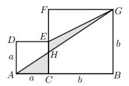
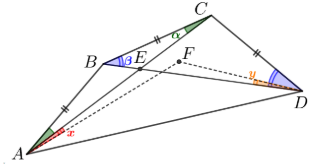
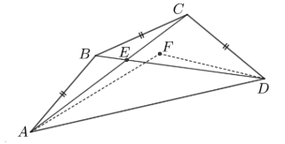
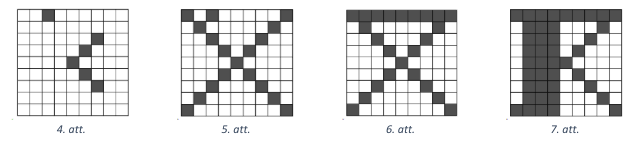
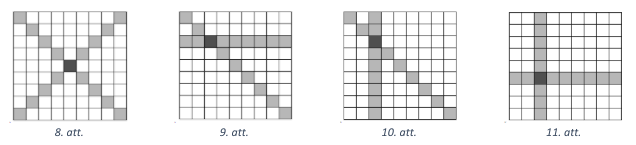
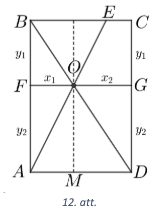
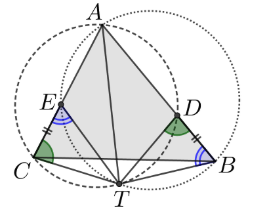

# <lo-sample/> LV.VOL.2024.9.1

Vai eksistē $5$ dažādi naturāli skaitļi ar īpašību, ka to vidējais aritmētiskais ir: 
**(A)** tieši $3$ reizes lielāks; **(B)** tieši $2$ reizes
lielāks nekā visu šo skaitļu lielākais kopīgais dalītājs?

<small>

* questionType:ProveDisprove
* domain:Alg
* method:ExtremeElements

</small>

## Atrisinājums

**(A)** Jā, tādi skaitļi ir $1; 2; 3; 4; 5$. To vidējais aritmētiskais ir 
$(1 + 2 + 3 + 4 + 5) ∶ 5 = 15 ∶ 5 = 3$ un lielākais kopīgais dalītājs ir $1$.  
**(B)** Nē, neeksistē. Pieņemsim, ka tādi skaitļi eksistē un to lielākais 
kopīgais dalītājs ir $d$. Tādā gadījumā skaitļi ir
$a_1d; a_2d; a_3d; a_4d; a_5d$, kur naturāli skaitļi $a_1,a_2,\ldots,a_5$ tiek iegūti 
sākotnējos piecus skaitļus dalot ar $d$. Ir jāizpildās vienādībai:
$$\frac{a_1d + a_2d + a_3d + a_4d + a_5d}{5} = 2d\;\;\text{jeb}\;\;a_1 + a_2 + a_3 + a_4 + a_5 = 10.$$
Visi $a_i$ ir dažādi; bet tā kā pat piecu vismazāko dažādo naturālo skaitļu summa ir 
$1 + 2 + 3 + 4 + 5 = 15 > 10$, tad šādi skaitļi neeksistē.

# <lo-sample/> LV.VOL.2024.9.2

Taisnstūrī $ABCD$ uz malas $BC$ atlikts punkts $E$. 
Nogrieznis $AE$ krusto taisnstūra diagonāli $BD$ punktā $O$. Taisne,
kas novilkta caur punktu $O$ paralēli $BC$, krusto malas $AB$ un $CD$ 
attiecīgi punktos $F$ un $G$. Zināms, ka trijstūra
$BOF$ laukums ir $4$, bet trijstūra $AOD$ laukums ir $63$. Aprēķināt četrstūra $OECG$ laukumu!

<small>

* questionType:FindAll
* domain:Geom

</small>

## Atrisinājums

Apzīmējam kvadrātu malu garumus ar $AC = a$ un $BC = b$ (skat. 1. att.).

Aprēķinām trapeces $CEGB$ un trijstūra $AGB$ laukumu:

* $S_{CEGB} = \frac{EC + BG}{2} \cdot BC = \frac{(a+b)b}{2}$;
* $S_{AGB} = \frac{AB \cdot BG}{2} = \frac{(a+b)b}{2}$. 

Tātad $S_{CEGB} = S_{AGB}$ un, 
atņemot no abām pusēm vienādu lielumu (trapeces $CHGB$ laukumu), vienādība
saglabāsies:
$$S_{CEGB} - S_{CHGB} = S_{AGB} - S_{CHGB}\;\;\text{un}\;\;S_{HEG} = S_{ACH}.$$

# <lo-sample/> LV.VOL.2024.9.3

Datorklasē ir $n$ ($n \geq 3$) datori, daži no tiem ir savienoti savā starpā. 
Ik pa brīdim kāds no datoriem, kurš pirms tam vēl neko nav sūtījis, 
nosūta ziņojumu visiem datoriem, ar ko tas ir savienots. Pierādīt, ka jebkurā laika brīdī
var atrast divus datorus, kuri ir saņēmuši vienādu ziņojumu skaitu!

<small>

* questionType:Prove
* domain:Comb
* method:ContradictionForExistence

</small>

## Atrisinājums

Pieņemsim pretējo, ka kādā brīdī katrs dators ir saņēmis dažādu ziņojumu skaitu. Tas nozīmē, ka
datoru saņemto ziņojumu skaits ir $0; 1; 2; \ldots ; n-1$ (kaut kādā secībā). 
Tālāk datorus attiecīgi apzīmējam ar
$D_0; D_1; \ldots, D_{n-1}$ atbilstoši saņemto ziņojumu skaitam, tas ir, dators $D_i$
ir saņēmis tieši $i$ ziņojumus. Tā kā $D_{n-1}$
ir saņēmis $n-1$ ziņojumu, tad tas ir savienots ar visiem pārējiem datoriem, 
turklāt visi pārējie datori ir nosūtījuši
tam ziņas. Pats $D_{n-1}$ nav sūtījis ziņojumu, jo $D_0$ neko nav saņēmis. 

Arī $D_{n-2}$ jābūt savienotam ar visiem pārējiem datoriem, jo pretējā gadījumā 
neatrastos tie $n-2$, kuri ar $D_{n-2}$ ir savienoti un nosūtījuši ziņojumu
(jo mēs jau zinām, ka $D_{n-1}$ vēl nav nosūtījis ziņojumu). 
Savukārt dators $D_0$ ziņojumus nav saņēmis, 
bet tā kā tas ir savienots ar $D_{n-2}$ (un $D_{n-2}$ ir nosūtījis ziņojumu), 
tad $D_0$ būtu bijis jāsaņem ziņojums no $D_{n-2}$. 
Iegūta pretruna. Tātad jebkurā laika brīdī var atrast
divus datorus, kuri ir saņēmuši vienādu ziņojumu skaitu.

# <lo-sample/> LV.VOL.2024.9.4

Uz tāfeles uzrakstīta izteiksme 
$\overline{abc} \cdot \overline{def} \cdot \overline{ghi} \cdot \overline{jkl}$, 
kas ir četru trīsciparu skaitļu reizinājums. Katrā gājienā
Gustavs izvēlas kādu nenulles ciparu un Maruta to ieraksta 
kāda burta vietā (Gustavs redz, kurā). Pierādīt, ka
Maruta vienmēr var panākt, 
ka pēc $12$ gājieniem iegūtās izteiksmes vērtība dalās ar $9$.

<small>

* questionType:Algorithm
* domain:NT

</small>

## Atrisinājums

Maruta var rīkoties tā:

* ciparus, kas, dalot ar $3$, dod atlikumu $1$ (cipari $1; 4; 7$), rakstīt pirmajā skaitlī;
* ciparus, kas, dalot ar $3$, dod atlikumu 2 (cipari 2; 5; 8), rakstīt otrajā skaitlī;
* ciparus, kas dalās ar $3$ (cipari $3; 6; 9$), rakstīt trešajā skaitlī.

Kad kādā no skaitļiem visi cipari ir aizpildīti, tad šo ciparu kategoriju 
Maruta var turpināt rakstīt ceturtajā skaitlī.
Šādi viņa var panākt, ka vismaz divos skaitļos visi trīs cipari dod vienu 
un to pašu atlikumu, dalot ar 3, tātad to
summa dalās ar $3$. Līdz ar to vismaz divi no šiem četriem trīsciparu 
skaitļiem dalīsies ar $3$, tātad visu skaitļu
reizinājums dalīsies ar $9$.

# <lo-sample/> LV.VOL.2024.9.5

Kims grib naturālos skaitļus no $1$ līdz $2024$ uzrakstīt pa apli tā, 
ka katrs skaitlis ir uzrakstīts tieši vienu reizi un
katriem trīs pēc kārtas uzrakstītiem skaitļiem $a,b,c$ izpildās īpašība, 
ka skaitlis $a + c$ dalās ar $b+1$. Vai Kims to
var izdarīt?

<small>

* questionType:ProveDisprove
* domain:NT

</small>

## Atrisinājums 

Nē, Kims nevar uzrakstīt skaitļus prasītājā veidā.
Vispirms pamatosim, ka, ja skaitļus varētu uzrakstīt, tad pāra un nepāra skaitļi 
pa apli būtu uzrakstīti pamīšus.
Ja tā nebūtu, tad kaut kur blakus būtu uzrakstīti divi nepāra skaitļi. 
Ejot tālāk pa apli līdz tuvākajam pāra skaitlim,
mēs atradīsim vietu, kur skaitļi ir uzrakstīti secībā $n,n,p$ 
($n$ ir nepāra un $p$ – pāra skaitlis). Esam ieguvuši pretrunu
jo $n+p$ ir nepāra skaitlis un nevar dalīties ar $n+1$, kas ir pāra skaitlis.

Aplūkojam skaitli $2024$, tam abās pusēs blakus ir uzrakstīti nepāra skaitļi. 
To summa ir pāra skaitlis, kas dalās ar
$2025$. Mazākais šāds pāra skaitlis ir $4050$, bet lielākais skaitlis, 
ko var iegūt, saskaitot kādus divus dotos nepāra
skaitļus ir $4044 = 2023 + 2021$, kas ir mazāks nekā $4050$. 
Esam ieguvuši, ka skaitlim $2024$ nevar atrast skaitļus,
ko uzrakstīt blakus. Tātad skaitļus pa apli prasītajā veidā nevar uzrakstīt.

# <lo-sample/> LV.VOL.2024.10.1

Vai var izvēlēties **(A)** $50$; **(B)** $51$ tādus dažādus naturālus skaitļus, 
kas nepārsniedz $100$, lai jebkuriem diviem izvēlētajiem skaitļiem to starpība 
(no lielākā skaitļa atņemot mazāko) nebūtu vienāda ar to lielāko kopīgo
dalītāju?

<small>

* questionType:ProveDisprove
* domain:NT

</small>

## Atrisinājums

**(a)** Jā, var. Ja izvēlas $50$ nepāra skaitļus, tad visas to starpības 
ir pāra skaitļi, bet nepāra skaitļu
lielākais kopīgais dalītājs ir nepāra skaitlis.
**(b)** Nē, nevar. Ja būtu izvēlēts $51$ skaitlis, tad noteikti būs izvēlēti 
divi blakus esoši skaitļi $x$ un $x+1$, bet šo skaitļu
starpība ir $(x+1)-x=1$ un $\operatorname{LKD}(x+1,x)=1$.

# <lo-sample/> LV.VOL.2024.10.2

Dots izliekts četrstūris $ABCD$, kuram $AB=BC=CD$. 
Četrstūra diagonāles krustojas punktā $E$, bet leņķu $BAD$
un $ADC$ bisektrises krustojas punktā $F$. Pierādīt, ka 
$\sphericalangle EAF = \sphericalangle EDF$.

<small>

* questionType:Prove
* domain:Geom

</small>

## Atrisinājums

Tā kā $AB=BC=CD$, tad trijstūri $BCD$ un $ABC$ ir vienādsānu un to pamata pieleņķi ir vienādi:
$\sphericalangle BAC = \sphericalangle BCA = \alpha$ un 
$\sphericalangle CBD = \sphericalangle CDB = \beta$. 
Apzīmējam $\sphericalangle EAF = x$ un $\sphericalangle EDF = y$ (skat. 2. att.).

Pēc dotā $AF$ un $DF$ ir leņķu bisektrises, tātad iegūstam:

* $\sphericalangle EAD = \sphericalangle EAF + \sphericalangle FAD = x + (\alpha + x) = \alpha + 2x$. 
* $\sphericalangle EDA = \sphericalangle FDA - \sphericalangle FDE = (\beta - y) -y = \beta - 2y$. 

Tā kā krustleņķi ir vienādi, tad 
$\sphericalangle AED = \sphericalangle BEC = 180^{\circ} - \sphericalangle BCE - \sphericalangle EBC = 180^{\circ} - \alpha - \beta$. Aplūkojot trijstūra
$AED$ iekšējo leņķu summu, iegūstam:

$$\begin{aligned}
180^{\circ} & = 180^{\circ} - \alpha - \beta + (\alpha + 2x) + (\beta - 2y); \\
180^{\circ} & = 180^{\circ} + 2x - 2y. \\
\end{aligned}$$

Līdz ar to esam ieguvuši, ka $2x = 2y$ jeb $x=y$, kas arī bija jāpierāda.  
*Piezīme.* Citiem punktu $E$ un $F$ izkārtojumiem risinājums ir analoģisks. 

## Atrisinājums

Tā kā pēc dotā $AB = BC = CD$ (skat. 3. att.), tad:

* $\sphericalangle BAC = \sphericalangle ACB = \alpha$, jo trijstūris $BAC$ ir vienādsānu;
* $\sphericalangle CBD = \sphericalangle CDB = \beta$, jo trijstūris $BCD$ ir vienādsānu.

Tātad $\sphericalangle AED = \sphericalangle BEC = 180^{\circ} - \alpha - \beta$ (trijstūra $BEC$ iekšējo leņķu summa), 
no kā iegūstam, ka $\sphericalangle EAD + \sphericalangle EDA = 180^{\circ} - \sphericalangle AED = \alpha + \beta$.

No četrstūra $ABCD$ un trijstūru $ABC$ un $BCD$ iekšējo leņķu summas iegūstam, ka
$\sphericalangle BAD + \sphericalangle CDA = 360^{\circ} - \sphericalangle ABC - \sphericalangle BCD = 
360^{\circ} - (180^{\circ} - 2\alpha) - (180^{\circ} - 2\beta) = 2(\alpha + \beta)$. 
Izmantojot bisektrises definīciju, iegūstam, ka
$\sphericalangle FAD + \sphericalangle FDA = \frac{1}{2}\sphericalangle BAD + \frac{1}{2} \sphericalangle CDA = 
\frac{1}{2}( \sphericalangle BAD + \sphericalangle CDA) = \alpha + \beta.$
Esam ieguvuši, ka $\sphericalangle EAD + \sphericalangle EDA = \sphericalangle FAD + \sphericalangle FDA$, tad
$\sphericalangle EAF = \sphericalangle EAD - \sphericalangle FAD = \sphericalangle FDA - \sphericalangle EDA = \sphericalangle EDF$. 

*Piezīme.* Uzdevuma beigās var arī izmantoto, ka ap četrstūri $AEFD$ var apvilkt riņķa līniju, 
tad $\sphericalangle EAF = \sphericalangle EDF$ 
kā ievilktie leņķi, kas balstās uz vienu un to pašu loku $EF$.

# <lo-sample/> LV.VOL.2024.10.3

Atrisināt reālos skaitļos vienādojumu sistēmu

$$\left\{ \begin{array}{l}
x + \frac{1}{x} = 2y^2 \\
y + \frac{1}{y} = 2z^2 \\
z + \frac{1}{z} = 2x^2 \\
\end{array} \right.$$

<small>

* questionType:FindAll
* domain:Alg
* method:PolynomialTransformations

</small>

## Atrisinājums

Vienādojot vienādojumu kreiso pušu izteiksmju saucējus, iegūstam

$$\left\{ \begin{array}{l}
\frac{x^2 + 1}{x} = 2y^2 \\
\frac{y^2 + 1}{y} = 2z^2 \\
\frac{z^2 + 1}{z} = 2x^2 \\
\end{array} \right.$$

Tā kā pirmā vienādojuma labās puses izteiksme $2y^2 \geq 0$ 
un kreisās puses daļas skaitītājs $x^2 + 1 > 0$, tad arī
daļas saucējs $x > 0$. Līdzīgi no pārējiem vienādojumiem 
iegūstam, ka $y>0$ un $z>0$.

Ievērojam, ka pozitīvam $x$ ir spēkā $x + \frac{1}{x} \geq 2$, 
jo to var ekvivalenti pārveidot par $x - 2 + \frac{1}{x} \geq 0$ jeb
$$\left( \sqrt{x} - \frac{1}{\sqrt{x}} \right)^2 \geq 0.$$
Pēdējā nevienādība izpildās, jo ir reāla skaitļa kvadrāts.
Tāpēc arī $2y^2 = x + \frac{1}{x} \geq 2$ jeb $y \geq 1$ 
(un līdzīgi arī $x \geq 1$ un $z \geq 1$). 

Saskaitot visus dotos vienādojumus, iegūstam  
$$\frac{x^2 + 1}{x} + \frac{y^2 + 1}{y} + \frac{z^2 + 1}{z} = 
2x^2 + 2y^2 + 2z^2;$$  
$$\frac{2x^3 - x^2 - 1}{x} + \frac{2y^3 - y^2 - 1}{y} + \frac{2z^3 - z^2 - 1}{z} = 0.$$

Tā kā $2x^3 - x^2 - 1 = x^3 - x^2 + x^3 - 1 = x^2(x-1) + (x-1)(x^2 + x + 1) = 
(x-1)(2x^2 + x + 1)$, tad iegūstam
$$\frac{(x-1)(2x^2 + x + 1)}{x} + \frac{(y-1)(2y^2 + y + 1)}{y} + 
\frac{(z-1)(2z^2 + z + 1)}{z} = 0.$$
Ņemot vērā, ka $x,y,z \geq 1$, un ievērojot, ka $2x^2 + x + 1 > 0$, 
$2y^2 + y + 1 > 0$ un $2z^2 + z + 1 > 0$ (jo $D < 0$ un atbilstošās 
kvadrātfunkcijas zari vērsti uz augšu), iegūstam, ka vienādojuma un dotās sistēmas vienīgais 
atrisinājums ir $x = y = z = 1$. 

*Piezīme.* Alternatīvi pēc tam, kad ir iegūts, ka $x,y,z \geq 1$, 
šo atrisinājumu var pabeigt šādi:
Simetrijas dēļ pieņemsim, ka lielākais no skaitļiem ir $x$ ($x \geq y$ un $x \geq z$). 
Aplūkojam vienādojumu $2x^2 = z + \frac{1}{z}$. Ievērojam, ka, ja $x > 1$, 
tad $x^2 > x \geq z$ un $x^2 > 1 \geq \frac{1}{z}$, tātad 
$2x^2 = x^2 + x^2 > z + \frac{1}{z}$. Iegūta pretruna. 
Tātad $x = 1$ un tā kā tas ir lielākais no skaitļiem, tad arī $y = 1$  un $z=1$. 

## Atrisinājums

Līdzīgi kā 1. atrisinājumā, iegūstam, ka $x,y,z \geq 1$. 
Nezaudējot vispārīgumu, varam pieņemt, ka
$x$ ir vislielākā vai viena no lielākajām vērtībām, tas ir, $x \geq z$ un $x \geq y$. Pierādīsim, ka tādā gadījumā
$$x + \frac{1}{x} \geq z + \frac{1}{z}.$$
Veicam ekvivalentus pārveidojumus:
$$\begin{aligned} \frac{x^2 + 1}{x} & \geq \frac{z^2 + 1}{z}; \\
zx^2 + z & \geq xz^2 + x; \\
(zx - 1)(x-z) \geq 0. \\
\end{aligned}$$

Tā kā $x,z \geq 1$ un $x \geq z$, tad iegūta patiesa nevienādība un 
arī pirmā nevienādība ir patiesa, jo tika veikti ekvivalenti pārveidojumi. 
Izmantojot nevienādību, iegūstam

$$\begin{aligned}
x + \frac{1}{x} & \geq z + \frac{1}{z} = 2x^2; \\
0 & \geq \frac{2x^3 - x^2 - 1}{x}; \\
0 & \geq \frac{(x-1)(2x^2 + x + 1)}{x}. \\
\end{aligned}$$

Tā kā $2x^2 + x + 1 > 0$, tad nevienādība ir patiesa tikai tad, ja $x = 1$. 
Tādā gadījumā $y = z = 1$, jo $x \geq z$ un $x \geq y$. 
Tātad dotā vienādojuma atrisinājums ir $x = y = z = 1$. 

# <lo-sample/> LV.VOL.2024.10.4

Skolas 10. klašu olimpiādē piedalījās 10.a un 10.b klases skolēni. 
Pirmo reizi saskaitot rezultātus, tika noskaidrots,
ka 10.a klases skolēnu vidējais rezultāts ir $37$ punkti, 
bet 10.b klases skolēnu vidējais rezultāts ir $11$ punkti.
Pārskatot darbus, atklājās, ka viens skolēna darbs bija pielikts 
pie nepareizās klases. Pārrēķinot vidējo rezultātu,
izrādījās, ka abās klasēs tas ir palielinājies tieši par 
$1$ punktu (un tagad ir attiecīgi $38$ un $12$ punkti). Cik skolēnu
kopā piedalījās šajā olimpiādē?

<small>

* questionType:FindCount
* domain:Alg

</small>

## Atrisinājums

Olimpiādē pavisam piedalījās $26$ skolēni.

Vispirms pamatosim, ka sajauktais darbs vispirms tika pierēķināts 10.a klases rezultātam, 
bet pēc tam to pārlika pie 10.b klases darbiem. Pieņemsim pretējo, ka sajauktais darbs 
no sākuma bija pielikts pie 10.b klases, bet
beigās to pielika pie 10.a klases. Tā kā 10.b klases vidējais punktu skaits, 
noņemot šo darbu, palielinājās, tad šī darba punktu skaitam jābūt mazākam nekā klases 
vidējais punktu skaits, tas ir, punktu skaits ir mazāks nekā $11$.
Līdzīgi, tā kā, pieliekot to pie 10.a klases darbiem, to vidējais punktu skaits palielinājās, 
tad darba punktu skaitam jābūt lielākam nekā 10.a klases vidējais punktu skaits, 
tas ir, vairāk nekā $37$ punktiem. Iegūta pretruna. Tātad
sajauktais darbs beigās tika pārlikts pie 10.b klases darbiem.

Ar $n$ un $m$ apzīmēsim attiecīgi 10.a un 10.b klases skolēnu skaitu, 
kas piedalījās olimpiādē un kuru darbi netika
sajaukti. Vēl ir viens skolēns, kuru sākumā pieskaitīja pie 10.b klases, 
bet tam jābūt pie 10.a klases, tā punktu
skaitu apzīmēsim ar $z$. Tātad kopējais skolnieku skaits, 
kas piedalījās olimpiādē, ir $n+m+1$.
Apzīmējam punktu summu bez sajauktā darba 10.a klasē ar $X$. Tā kā kopā ar sajaukto darbu vidējais punktu
skaits bija $37$, bet bez tā – $38$, tad iegūstam divus vienādojumus:

$$\frac{X+z}{n+1} = 37\;\;\text{un}\;\;\frac{X}{n} = 38;$$
$$X + z = 37n + 37\;\;\text{un}\;\;X=38n.$$
Ievietojot otro vienādojumu pirmajā, iegūstam, ka $z = 37 - n$. 

Līdzīgi, apzīmējot punktu summu bez sajauktā darba 10.b klasē ar $Y$, 
iegūstam divus vienādojumus:

$$\frac{Y}{m} = 11\;\;\text{un}\;\;\frac{Y+z}{m+1} = 12;$$
$$Y = 11m\;\;\text{un}\;\;Y+z=12m+12.$$
Ievietojot pirmo vienādojumu otrajā, iegūstam, ka $z = m+12$. 

No abām sakarībām iegūstam, ka $37 − n = m + 12$ jeb $m+n = 25$. Tātad kopējais skolēnu skaits ir
$m+n+1 = 26$.  
*Piezīme.* Parādīsim piemēru, ka šāda situācija ir iespējama. 
Pieņemsim, ka $n=2$ un $m=23$, abiem
"nesajauktajiem" 10.a klases skolēniem ir $38$ punkti, visiem "nesajauktajiem" 10.b klases 
skolēniem ir $11$ punkti. Sajauktajam darbam ir $35$ punkti.

# <lo-sample/> LV.VOL.2024.10.5

Tabulā ar izmēriem $9 \times 9$ rūtiņas dažas rūtiņas ir iekrāsotas, bet pārējās ir neiekrāsotas. 
Rūtiņu iekrāsošanai
izmanto šādus gājienus: ja kādā rindā, kolonnā vai uz kādas no divām 
galvenajām diagonālēm ir iekrāsotas
vismaz trīs rūtiņas, tad vienā gājienā var iekrāsot visas atlikušās šīs rindas, 
kolonnas vai diagonāles rūtiņas. Kāds
ir mazākais iespējamais sākumā iekrāsoto rūtiņu skaits, 
pie kura var gadīties, ka ar aprakstītajiem gājieniem var
iekrāsot visas tabulas rūtiņas?

<small>

* questionType:FindOptimal
* domain:Comb

</small>

## Atrisinājums

Mazākais sākotnēji iekrāsoto rūtiņu skaits ir $6$, piemēram, skat. 4. att. 
Parādīsim, kā ar atļautajiem
gājieniem iekrāsot visu tabulu. 
Vispirms iekrāsojam abas diagonāles (skat. 5. att.), jo katrā ir $3$ iekrāsotas rūtiņas.
Pēc šīs iekrāsošanas varam iekrāsot pirmo rindu (skat. 6. att.), 
jo tajā ir iekrāsotas $3$ rūtiņas. Pēc tam iekrāsojam
2., 3., 4. kolonnu (skat. 7. att.), 
beigās iekrāsojam visas atlikušās vēl neiekrāsotās rindas.

Pierādīsim, ka ar mazāku sākotnēji iekrāsoto rūtiņu skaitu nepietiek.
Lai kādu rindu, kolonnu vai diagonāli varētu iekrāsot, nepieciešams, 
lai uz tās jau būtu iekrāsotas vismaz trīs
rūtiņas. Lai varētu izdarīt otro gājienu, atkal nepieciešamas 
vismaz trīs iekrāsotas rūtiņas, no kurām ne vairāk kā
viena var būt tāda, kas tika izmantota pirmajā gājienā 
(ja būtu vismaz divas, tad tā būtu tā pati rinda, kolonna
vai diagonāle).
Pieņemsim, ka šāda rūtiņa bija. Tad pēc diviem gājieniem ir izmantotas piecas 
iekrāsotās rūtiņas un iekrāsojuma
varianti ir šādi: divas diagonāles (kopīga centrālā rūtiņa, skat. 8. att., 
kur ar gaiši pelēku iekrāsotas tās rūtiņas,
kur var atrasties 4 iekrāsotās rūtiņas), diagonāle un rinda (skat. 9. att.), 
diagonāle un kolonna (skat. 10. att.),
rinda un kolonna (skat. 11. att.). Nevienā no šiem salikumiem nav iespējams 
izdarīt vēl kādu gājienu (nevienā
neaizpildītajā rindā, kolonnā vai uz diagonāles nav vairāk kā divu iekrāsotu rūtiņu), 
tādēļ ir nepieciešama vēl
vismaz viena sākotnēji iekrāsota rūtiņa. 

# <lo-sample/> LV.VOL.2024.11.1

Atrast visus reālu skaitļu pārus $(a;b)$, kuriem ir spēkā nevienādība:
$$4a + 4b^2 + \sqrt{4a - 4b^2 - 1} \leq 1.$$

<small>

* questionType:FindAll
* domain:Alg

</small>

## Atrisinājums

Zemsaknes izteiksmei $4a - 4b^2 -1$ jābūt nenegatīvai, 
tāpēc $4a - 4b^2 - 1 \geq 0$ jeb 
$$4a \geq 4b^2 + 1.$$

Tā kā kvadrātsaknes vērtības ir nenegatīvas, tad no dotās 
nevienādības iegūstam, ka $4a + 4b^2 \geq 1$ jeb 
$$a \geq 4a + 4b^2.$$

Saskaitot abas iegūtās nevienādības, iegūstam, ka $0 \geq 8b^2$. 
Tātad vienīgā derīgā vērtība ir $b=0$. 
Ievietojot iegūstam nevienādības: 
$$4a \geq 1\;\;\text{un}\;\; 1 \geq 4a.$$
Tātad $a = \frac{1}{4}$. Esam ieguvuši, ka vienīgais 
derīgais skaitļu pāris ir 
${\displaystyle \left( \frac{1}{4}; 0 \right)}$

## Atrisinājums

Ja $a = \frac{1}{4}$ un $b = 0$, tad nevienādība ir spēkā. jo 
$4 \cdot \frac{1}{4} + 4 \cdot 0 + \sqrt{4 \cdot \frac{1}{4} - 4 \cdot 0 - 1} = 1 \geq 1$
Pamatosim, ka nevienādības vienīgais atrisinājums ir $a = \frac{1}{4}$ un $b = 0$. 
Aplūkosim trīs gadījumus.

* Ja $a < \frac{1}{4}$, tad $4a < 1$ un zemsaknes izteiksme $4a - 4b^2 - 1 = 4a - 1 -4b^2$
  ir negatīva, jo $4a - 1 < 0$ un $-4b^2 < 0$. Tādā gadījumā izteiksme nav definēta 
  un atrisinājuma nav. 
* Ja $a > \frac{1}{4}$, tad $4a > 1$. Tā kā $4b^2 + \sqrt{4a - 4b^2 - 1} \geq 0$, 
  tad $4a + 4b^2 + \sqrt{4a - 4b^2 - 1} > 1$, tātad nevienādībai nav atrisinājuma. 
* Ja $a = \frac{1}{4}$, tad nevienādību var pārrakstīt šādi: 
  $1 + 4b^2 + \sqrt{-4b^2} \leq 1$ jeb $4b^2 + \sqrt{-4b^2} \leq 0$. 
  Lai zemsaknes izteiksme būtu definēta, vienīgā derīgā vērtība ir $b = 0$. 

# <lo-sample/> LV.VOL.2024.11.2

Taisnstūrī $ABCD$ uz malas $BC$ atlikts punkts $E$. 
Nogrieznis $AE$ krusto taisnstūra diagonāli $BD$ punktā $O$. 
Taisne, kas novilkta caur punktu $O$ paralēli $BC$, 
krusto malas $AB$ un $CD$ attiecīgi punktos $F$ un $G$. 
Zināms, ka trijstūra
$BOF$ laukums ir $4$, bet trijstūra $AOD$ laukums ir $63$. 
Aprēķināt četrstūra $OECG$ laukumu!

<small>

* questionType:FindAll
* domain:Geom
* method:AlgebraicModel

</small>

## Atrisinājums

Apzīmējam nogriežņu garumus
$OF = x_1$, $OG = x_2$, $BF = CG = y_1$, $AF = DG = y_2$ (skat. 12. att.).

Tā kā $\sphericalangle BFO = \sphericalangle DGO = 90^{\circ}$ un 
$\sphericalangle BOF = \sphericalangle DOG$, tad $\triangle OFB \sim \triangle OGD$ 
pēc pazīmes $\ell\ell$. Tātad $\frac{x_1}{x_2} = \frac{y_1}{y_2} = k$ un
${\displaystyle \frac{S_{OFB}}{S_{OGD}} = k^2}$, no kā iegūstam, ka $S_{OGD} = \frac{4}{k^2}$. 

Apskatām trijstūru laukumu attiecību:
$$\frac{S_{OFB}}{S_{OFA}} = \frac{\frac{1}{2}OF \cdot BF}{\frac{1}{2}OF \cdot AF} 
= \frac{BF}{AF} = \frac{y_1}{y_2} = k\;\;\Rightarrow{}S_{OFA}=\frac{4}{k}.$$

Apskatām trijstūri $AOD$ (sk. attēlu, kur $OM$ ir trijstūra $AOD$ augstums):
$$S_{ODA} = S_{OMA} + S_{OMD} = S_{OFA} + S_{OGD} = \frac{4}{k} + \frac{4}{k^2} = 63.$$
Atrisinot iegūto kvadrātvienādojumu $63k^2 - 4k - 4 = 0$, iegūstam:
$$ k = \frac{4 \pm \sqrt{16 + 4 \cdot 4 \cdot 63}}{126} = \frac{4 \pm 32}{126};$$
$$k_1 = \frac{36}{126} = \frac{2}{7}\;\;\text{un}\;\;k_2 = -\frac{28}{126}\;\text{(neder)}.$$
Līdz ar to esam ieguvuši, ka $S_{OFA} = \frac{4}{k} = 4 : \frac{2}{7} = 14$ un 
$S_{OGD} = \frac{4}{k^2} = 4 : \left( \frac{2}{7} \right)^2 = 49$.
Tā kā $\triangle BOE \sim \triangle DOA$ pēc pazīmes $\ell\ell$, tad 
$\frac{S_{BOE}}{S_{DOA}} = \left( \frac{OB}{OD} \right)^2 = k^2$ un 
$$S_{BOE} = S_{DOA} \cdot k^2 = 63 \cdot \frac{4}{49} = \frac{36}{7}.$$
Izmantojot laukuma īpašības, iegūstam 

* $S_{ABD} = S_{BOF} + S_{OFA} + S_{DOA} = 4 + 14 + 63 = 81$;
* $S_{ABD} = S_{BCD} = \frac{1}{2}S_{ABCD}$
* $S_{OECG} = S_{BCD} - S_{BOE} - S_{OGD} = 81 - \frac{36}{7} - 49 = 32 - \frac{36}{7} = \frac{188}{7} = 26\frac{6}{7}$. 

# <lo-sample/> LV.VOL.2024.11.3

Datorklasē ir $n$ ($n \geq 3$) datori, daži no tiem ir savienoti savā starpā. 
Ik pa brīdim kāds no datoriem, kurš pirms
tam vēl neko nav sūtījis, nosūta ziņojumu visiem datoriem, ar ko tas ir savienots. 
Pierādīt, ka jebkurā laika brīdī
var atrast divus datorus, kuri ir saņēmuši vienādu ziņojumu skaitu!

<small>

* seeAlso:LV.VOL.2024.9.3
* questionType:Prove
* domain:Comb

</small>

## Atrisinājums

Pieņemsim pretējo, ka kādā brīdī katrs dators ir saņēmis dažādu ziņojumu skaitu. 
Tas nozīmē, ka datoru saņemto ziņojumu skaits ir $0; 1; 2; \ldots ; n-1$ 
(kaut kādā secībā). Tālāk datorus attiecīgi apzīmējam ar
$D_0; D_1; \ldots; D_{n-1}$ atbilstoši saņemto ziņojumu skaitam, tas ir, dators $D_i$
ir saņēmis tieši $i$ ziņojumus. Tā kā $D_{n-1}$
ir saņēmis $n-1$ ziņojumu, tad tas ir savienots ar visiem pārējiem datoriem, 
turklāt visi pārējie datori ir nosūtījuši
tam ziņas. Dators $D_0$ ziņojumus nav saņēmis, tātad tā kā tas ir savienots ar 
$D_{n-1}$, tad $D_{n-1}$ ziņojumus vēl nav
izsūtījis. Ne ar vienu citu datoru (izņemot $D_{n-1}$) dators $D_0$ nav savienots 
(citādi tas būtu no tā saņēmis ziņojumu).

Visbeidzot aplūkojam datoru $D_{n-2}$. Tā kā dators $D_{n-1}$ ziņojumus vēl nav sūtījis, 
tad šis dators ir savienots ar visiem pārējiem $n-2$ datoriem 
(un saņēmis no tiem ziņojumus). Tātad tas ir savienots arī ar datoru $D_0$. Bet tā
ir pretruna, jo $D_0$ ir savienots tikai ar $D_{n-1}$.

# <lo-sample/> LV.VOL.2024.11.4

Kādām naturālām $n$ vērtībām var atrast $2n+1$ naturālus skaitļus (ne obligāti dažādus) 
ar īpašību, ka, izvēloties jebkurus $n+1$ no tiem, to summa dalīsies ar atlikušo $n$ 
skaitļu summu?

<small>

* questionType:FindAll
* domain:NT
* method:ExtremeElements

</small>

## Atrisinājums

Ja $n=1$, tad skaitļiem $(1; 1; 1)$ izpildās uzdevuma nosacījumi 
(jebkuru divu izvēlēto skaitļu summa
dalās ar atlikušo skaitli). 

Ja $n=2$, tad skaitļiem $(2; 1; 1; 1; 1)$ izpildās uzdevuma nosacījumi.

Pamatosim, ka pie $n \geq 3$ neeksistē $2n+1$ skaitļi, 
kam izpildās uzdevuma nosacījumi. Pieņemsim pretējo, tas ir,
dotam $n$, kas ir vismaz $3$, var atrast $2n+1$ naturālus skaitļus, 
lai jebkuru $n+1$ izvēlēto skaitļu summa dalītos
ar atlikušo $n$ skaitļu summu. Dotos skaitļus sakārtosim nedilstošā secībā 
un apzīmēsim ar $a_1 \leq a_2 \leq \cdots a_{2n+1}$,
kā arī apzīmēsim summas $S_A = a_2 + \ldots + a_{n+1}$ un $S_B = a_{n+2} + \cdots + a_{2n+1}$. 
No pieņēmuma izriet, ka $S_A + a_1$ dalās ar $S_B$ un 
$S_B + a_1$ dalās ar $S_A$.
Tas nozīmē, ka $S_A + a_1 \geq S_B$. Tā kā 𝑆𝐵 satur 𝑛 lielākos skaitļus, 
tad $S_B \geq S_A$. Turklāt $a_1$ ir naturāls skaitlis, līdz ar
to $S_B + a_1 > S_A$, bet $S_B + a_1$ dalās ar $S_A$, tāpēc iegūstam, ka
$$\left\{ \begin{array}{l}
S_B + a_1 \geq 2S_A; \\
S_A + a_1 \geq S_B. \\
\end{array} \right.$$
Saskaitot abas nevienādības, iegūstam, ka $S_A + S_B +2a_1 \geq 2S_A + S_B$ 
jeb $2a_1 \geq S_A$. Tā kā $n \geq 3$, tad $S_A$ satur
vismaz $3$ saskaitāmos, kas nav mazāki kā $a_1$ jeb $S_A \geq 3a_1$. 
Rezultātā iegūstam, ka $2a_1 \geq S_A \geq 3a_1$. Veidojas
pretruna ar to, ka $a_1$ ir naturāls skaitlis. 
Tātad pieņēmums, ka pie $n \geq 3$ eksistē prasītie skaitļi, ir aplams.

# <lo-sample/> LV.VOL.2024.11.5

Dots naturāls skaitlis $n$, ar $M$ apzīmēsim pirmo $2n$ naturālo skaitļu kopu 
$M = \{1; 2; 3; \ldots ; 2n\}$. Divi spēlētāji
$A$ un $B$ spēlē spēli. Katrā gājienā vispirms spēlētājs $A$ no kopas $M$ izvēlas skaitli $a$, 
pēc tam spēlētājs $B$ no kopas
$M$ izvēlas skaitli $b$, turklāt skaitļi $a$ un $b$ nav vienādi un nesakrīt 
ne ar vienu no iepriekš izvēlētajiem skaitļiem.
Gājiena beigās tiek izveidota kvadrātfunkcija $y = x^2 - ax + b$
un uzrakstīta uz lapas. Pēc $n$ gājieniem ir izvēlēti
visi skaitļi no kopas $M$ un iegūtas $n$ kvadrātfunkcijas. 
Tālāk tiek aplūkoti visi iespējamie šo kvadrātfunkciju pāri.
Katram pārim tiek aprēķinātas to grafiku visu krustpunktu $y$ koordinātas, 
visas šādi iegūtās $y$ koordinātas tiek
saskaitītas. Pierādīt, ka spēlētājs $B$ var panākt, lai iegūtā summa būtu tieši $n^3 - n$.

<small>

* questionType:Prove
* domain:Alg
* subdomain:FixedInvariant

</small>

## Atrisinājums

Ja spēlētājs $A$ izvēlas skaitli $i$, tad spēlētājam $B$ jāizvēlas skaitli 
$2n + 1 - i$. Aplūkojam divu iegūto
funkciju krustpunktus, ja spēlētājs $A$ izvēlas skaitļus $i$ un $j$:
$$\begin{aligned}
x^2 - ix + (2n+1-i) = x^2 - jx + (2n+1 -j);\\
-(i-j) = x(i-j);\\
x=-1.\\
\end{aligned}$$
Tādā gadījumā funkcijas vērtība ir $y = (−1)^2 + i + 2n + 1 − i = 2(n + 1)$. 
Tā kā pavisam ir $\frac{n(n-1)}{2}$ 
dažādu kvadrātfunkciju pāru, tad $y$ koordinātu summa ir
$$2(n+1) \cdot \frac{n(n-1)}{2} = n(n^2 - 1) = n^3 - n.$$

# <lo-sample/> LV.VOL.2024.12.1

Atrisināt reālos skaitļos vienādojumu sistēmu

$$\left\{ \begin{array}{l}
x + \frac{1}{x} = y+z\\
y + \frac{1}{y} = x+z\\
z + \frac{1}{z} = x+y\\
\end{array} \right.$$

<small>

* questionType:FindAll
* domain:Alg

</small>

## Atrisinājums

No pirmā vienādojuma atņemot otro, iegūstam:
$$x - y + \frac{1}{x} - \frac{1}{y} = y - x;$$
$$2(x - y) = \frac{1}{y} - \frac{1}{x}\;\;\Rightarrow{}2(x-y) = \frac{x-y}{xy}.$$
Aplūkojam gadījumu, kad $x=y$. Tad no sistēmas pirmā vienādojuma izriet, 
ka $\frac{1}{x} = z$. No trešā sistēmas
vienādojuma iegūstam, ka
$$\frac{1}{x} = x+x\;\;\Rightarrow\;\;x^2=1\;\;\Rightarrow\;\;x=\pm 1.$$
Līdz ar to esam ieguvuši atrisinājumus $(1; 1; 1)$ un $(−1; −1; −1)$.

Ja $x \neq y$, tad $xy = \frac{1}{2}$. 
Analogi, saskaitot sistēmas 2. un 3. vienādojumu, kā arī saskaitot sistēmas 1. un 3.
vienādojumu, iegūstam, ka $yz = xz = xy = \frac{1}{2}$. 
Taču, ja $yz = xz, xz = xy, yz=xy$ un neviens no $x,y,z$ nav nulle (pēc definīcijas kopas), 
tad $y=x$, $z=y$, $z=x$, tāpēc $x=y=z$, kas ir jau apskatītais gadījums.

# <lo-sample/> LV.VOL.2024.12.2

Uz dažādmalu trijstūra $ABC$ malām $AB$ un $AC$ attiecīgi izvēlēti tādi punkti 
$D$ un $E$, ka $BD = CE$. Trijstūriem $ABE$ un $ACD$
apvilktās riņķa līnijas krustojas vēl arī punktā $T$. 
Pierādīt, ka $AT$ ir leņķa $BAC$ bisektrise!

<small>

* questionType:Prove
* domain:Geom

</small>

## Atrisinājums

Izmantojot ievilkta četrstūra īpašību un blakusleņķu īpašību, iegūstam:

* $\sphericalangle ABT = 180^{\circ} - \sphericalangle AET = \sphericalangle CET$
  (no četrstūra $ABTE$);
* $\sphericalangle ACT = 180^{\circ} − \sphericalangle ADT = \sphericalangle BDT$ 
  (no četrstūra $ADTC$).

Ņemot vērā, ka $BD=EC$ pēc dotā, iegūstam, ka $\triangle BTD = \triangle ETC$ 
pēc pazīmes $\ell{}m\ell$ (sk. 13. attēlu). Tā kā vienādu
trijstūru atbilstošie augstumi ir vienādi, tas ir, $h_{BD} = h_{EC}$, tad punkts $T$ 
atrodas vienādos attālumos no leņķa
$BAC$ malām, tātad punkts $T$ atrodas uz šī leņķa bisektrises jeb $AT$ ir leņķa $BAC$ bisektrise.

# <lo-sample/> LV.VOL.2024.12.3

Uz galda traukā ir $200$ konfektes. Brālītis un Karlsons pēc kārtas izdara gājienus, 
Brālītis sāk. Vienā gājienā var
paņemt no trauka un apēst vai nu vienu, vai divas konfektes. 
Uzvar tas spēlētājs, kurš apēd pēdējo konfekti. Kurš
uzvarēs pareizi spēlējot, ja papildus zināms, ka katrs no viņiem var apēst ne vairāk kā 
**(A)** $140$; **(B)** $110$ konfektes?
(Gadījumā, ja spēlētājs vairs nevar izdarīt gājienu, viņš zaudē).

<small>

* questionType:Algorithm,Algorithm
* domain:Comb
* subdomain:FixedInvariant

</small>

## Atrisinājums

**(A)** Vienmēr var uzvarēt Brālītis. Šajā gadījumā $140$ ir pietiekami liels skaitlis 
un neietekmē spēles gaitu, var spēlēt tā it kā šāda ierobežojuma nebūtu. 
Tādā gadījumā pirmā spēlētāja stratēģija ir klasiska: vajag
atstāt pretiniekam konfekšu skaitu, kas dalās ar $3$. Tas nozīmē, ka pirmajā 
gājienā Brālītim jāapēd $2$ konfektes,
pēc tam katrā nākamajā gājienā, ja Karlsons ēd vienu konfekti, tad Brālītim jāēd divas, 
bet, ja Karlsons ēd divas konfektes, tad Brālītim jāēd viena. 
Tādējādi pēc pirmā Brālīša gājiena traukā paliks 198 konfektes ($198$ dalās ar
$3$) un pēc katra nākamā Brālīša gājiena konfekšu skaits traukā samazināsies par 
$3$ un pēc $198 ∶ 3 = 66$ gājieniem
kļūs vienāds ar $0$. Kopā Brālītis būs izdarījis $1 + 66 = 67$ gājienus un 
katrā gājienā apēdis ne vairāk kā $2$
konfektes, tātad kopā viņš būs apēdis ne vairāk kā $67  \cdot 2 = 134$ konfektes.

**(B)** Vienmēr var uzvarēt Karlsons. Šajā gadījumā iepriekšējā stratēģija 
vairs nedarbojas, jo, ja Brālītis mēģinās to
pielietot un Karlsons katrā gājienā ēdīs vienu konfekti, tad Brālītim būs jāņem 
divas un jau pēc $55$ gājieniem viņš
būs pārēdies un vairāk ēst nevarēs, kaut gan apēstas būs tikai $2 + 54 \cdot 3 = 164$ konfektes.

Aprakstīsim stratēģiju, ar kuru Karlsons var uzvarēt. 
Pirmajos $70$ gājienos viņš katrā ēd vienu konfekti. Pēc šiem
gājieniem būs apēstas vismaz $140$ konfektes, tātad atlikušas $60$ vai mazāk konfekšu. 
Ja pirms viņa 71.gājiena
konfekšu skaits nedalās ar 3, tad viņš jau var pielietot **(a)** gadījuma stratēģiju, 
katrā atlikušajā gājienā paņemot
attiecīgi $1$ vai $2$ konfektes, lai pēc viņa gājiena atlikušais konfekšu 
skaits dalītos ar $3$. Tā kā viņš vēl var apēst
$110 − 70 = 40$ konfektes, tad ar to viņam pietiek vēl vismaz $20$ gājieniem 
un gājienu skaits noteikti nebūs
lielāks, jo ar šo stratēģiju katrā gājienā konfekšu skaits samazinās par $3$, 
tātad vairām par $20$ gājieniem vajadzētu
vairāk par $60$ konfektēm.

Interesantāka ir situācija, ja pirms Karlsona 71. gājiena konfekšu skaits dalās ar $3$. 
Tādā gadījumā tas ir $57$ vai
mazāks. Tagad katrā savā gājienā Karlsons var turpināt ēst vienu konfekti, 
līdz pēc kāda viņa gājiena konfekšu
skaits traukā dalās ar $3$ (un tad tālāk viņš var lietot atkal klasisko stratēģiju). 
Pierādīsim, ka šāds brīdis, kad pēc
Karlsona gājiena konfekšu skaits traukā dalās ar $3$, 
noteikti pienāks. Lai to nepieļautu, Brālītim katrā gājienā būtu
jāņem $2$ konfektes. Tādā gadījumā, kad traukā būs palikušas $0$ konfektes, 
Karlsons būs apēdis ne vairāk kā $70 + 57 ∶ 3 = 89$ konfektes un tātad Brālītis 
būs apēdis vismaz $200 − 89 = 111$ konfektes, kas ir pretrunā ar to, ka
viņš nevar apēst vairāk kā $110$ konfektes.

# <lo-sample/> LV.VOL.2024.12.4

Profesors Cipariņš iedomājās naturālu skaitli $n$ un uz tāfeles 
vienu aiz otra bez atstarpes uzrakstīja skaitļus $2^n$
un $14^n$ (tieši šādā secībā), uzrakstīto skaitli apzīmēsim ar 
$C$ (piemēram, ja $n=2$, tad $C = 4196$). Vai iespējams,
ka skaitlis $C-1$ ir pirmskaitlis? 

<small>

* questionType:ProveDisprove
* domain:NT

</small>

## Atrisinājums

Pamatosim, ka $C-1$ nevar būt pirmskaitlis. Pieņemsim pretējo, 
ka ir dots tāds naturāls skaitlis $n$,
ka $C-1$ ir pirmskaitlis. Skaitļa $2^n$ ciparu summa pēc moduļa $3$ ir 
$(−1)^n$. Līdzīgi arī skaitļa $14^n$
ciparu summa
pēc moduļa $3$ būs $(−1)^n$. 
Tas nozīmē, ka skaitļa $C$ ciparu summa pēc moduļa $3$ ir $(−1)^n + (−1)^n$. 
Ja skaitlis $n$ ir nepāra, tad skaitļa $C-1$ ciparu summa dalās ar $3$, jo 
$(−1)^n + (−1)^n − 1 \equiv −1 − 1 − 1 \equiv 0 \pmod 3$. Tātad
secinām, ka $n$ jābūt pāra skaitlim.
Tagad apskatām skaitļa $C$ pēdējo ciparu. To viennozīmīgi noteiks skaitļa 
$14^n$ pēdējais cipars. Tā kā mūs interesē tikai pēdējais cipars, tad varam pētīt skaitļa 
$4^n$ pēdējo ciparu.

| $n$            | $2$ | $4$ | $6$ | $8$ | $10$ |
| -------------- | --- | --- | --- | --- | ---- |
| $4^n \pmod 10$ | $6$ | $6$ | $6$ | $6$ | $6$  |

Ievērojam, ka skaitļa $C$ pēdējais cipars vienmēr būs $6$, ja $n$ ir pāra skaitlis. 
Tas nozīmē, ka skaitļa $C-1$ pēdējais cipars būs $5$ jeb skaitlis $C − 1$ dalīsies ar $5$. 
Iegūstam pretrunu ar pieņēmumu, ka $C - 1$ ir pirmskaitlis.

# <lo-sample/> LV.VOL.2024.12.5

Atrast lielāko reālo skaitli $A$ ar īpašību, ka 
$3x^2 + y^2 + 1 \geq A(x^2 + xy + x)$ visiem reāliem skaitļiem $x$ un $y$.

<small>

* questionType:FindOptimal
* domain:Alg

</small>

## Atrisinājums

Vispirms ekvivalenti pārveidojam doto nevienādību:
$$\begin{aligned}
(3 − A)x^2 + y^2 - Axy - Ax + 1 & \geq 0; \\
\left(y - \frac{A}{2}x \right)^2 + \left( 3 - A - \frac{A^2}{4} \right) x^2 - Ax + 1 & \geq 0 \\
\end{aligned}$$

Tā kā saskaitāmais ${\displaystyle \left( y - \frac{A}{2}x \right)^2}$ 
vienmēr būs nenegatīvs, un pie atbilstošas $y$ izvēles vienāds ar $0$, 
tad mums atliek atrast tādu lielāko $A$ vērtību, lai nevienādība
$$\left( 3 - A - \frac{A^2}{4} \right)x^2 - Ax + 1 \geq 0$$
būtu patiesa visiem reāliem skaitļiem $x$. Tātad atbilstošās kvadrātfunkcijas zariem 
jābūt vērstiem uz augšu, tas ir, ${\displaystyle \left( 3 - A - \frac{A^2}{4} \right) \geq 0}$
je $A^2 + 4A - 12 \leq 0$, un diskriminantam jābūt nepozitīvam, tas ir,
$$A^2 - 4 \left( 3 - A - \frac{A^2}{4} \right) = 2A^2 + 4A - 12 \leq 0.$$
Ievērojam, ka $A^2 + 4A − 12 \leq 2A^2 + 4A - 12$, tāpēc jebkuram $A$, 
kam izpildās diskriminanta nosacījums, atbilstošās kvadrātfunkcijas 
zari būs vērsti uz augšu. Maksimālais $A$ būs tad, kad 
$2A^2 + 4A − 12 = 0$, jo tad ir
iespējams, ka sākotnējā nevienādība pārvēršas par vienādību, 
tas ir, esam atraduši lielāko $A$. Lielākā vienādojuma 
$2A^2 + 4A − 12 = 0$ sakne ir $\sqrt{7} - 1$. 
Līdz ar to esam ieguvuši, ka lielākā $A$ vērtība ir $\sqrt{7} - 1$.

## Atrisinājums

Apskatām trīs tādus pozitīvus skaitļus $\alpha, \beta, \gamma$, 
kuriem $\alpha + \beta + \gamma = 3$. Tad, lietojot nevienādību
starp vidējo aritmētisko un vidējo ģeometrisko, iegūstam
$$3x^2 + y^2 + 1 = (\alpha + \beta + \gamma)x^2 + y^2 + 1 = 
\alpha{}x^2 + (\beta{}x^2 + y^2) + (\gamma{}x^2 + 1) \geq \alpha{}x^2 + 2\sqrt{\beta}xy + \sqrt{\gamma}x.$$

Tā kā pierādāmajā nevienādībā labās puses izteiksmes saskaitāmo koeficientiem jābūt vienādiem, 
tad izvēlamies
tādas $\alpha$, $\beta$ un $\gamma$ vērtības, lai $\alpha = 2 \sqrt{\beta} = 2\sqrt{\gamma}$, 
kas ir ekvivalents ar
$$\begin{array}{c}
2\alpha^2 = 4\beta + 4\gamma; \\
2\alpha^2 = 4(3 − \alpha); \\
\alpha^2 + 2\alpha − 6 = 0; \\
\alpha = −1 \pm \sqrt{7}. \\
\end{array}$$
Tātad $\alpha = \sqrt{7} - 1$, jo $\alpha$ ir pozitīvs. 
Tātad $\beta = \gamma = 2 - \frac{\sqrt{7}}{2}$. Paņemot šādus koeficientus sanāk, ka
$$3x^2 + y^2 + 1 \geq (\sqrt{7} − 1)(x^2 + xy + x)$$
visiem reāliem skaitļiem $x$ un $y$, kas nozīmē, ka skaitlim $\sqrt{7} - 1$ 
izpildās dotā nevienādība. Turklāt, ja izvēlamies skaitļus $x$ un $y$ ar īpašību, ka
$$\begin{array}{c}
\beta x^2 = y^2 = 1;\\
\left( 2 - \frac{\sqrt{7}}{2}\right) x^2 = 1;\\
x = \frac{1 + \sqrt{7}}{3},\;\;y=1\\
\end{array}$$
tad nevienādība kļūs par vienādību, no kā secinām, ka visas skaitļa $A$ 
vērtības lielākas nekā $\sqrt{7} - 1$ neapmierina
uzdevuma nosacījumus, no kā var secināt, 
ka lielākais skaitlis $A$ ar prasīto īpašību ir $\sqrt{7} - 1$. 
