# <lo-sample/> LV.VOL.2025.9.1

Ap apaḷu galdu sēž 8 bērni. Katriem trīs pēc kārtas sēdošiem bērniem 
kopā ir nepāra skaits konfekšu. Pierādīt, ka katram bērnam ir vismaz viena konfekte!

<small>

* questionType:
* domain:

</small>

## Atrisinājums

Prasītais būs pierādīts, ja pamatosim, katram bērnam ir nepāra skaits konfekšu.
Apzīmējam katram bērniem esošo konfekšu skaitu, kā parādīts 1. att. 
Pēc dotā $a+b+c$, $d+e+f$, $g+h+a$ ir nepāra skaitļi. Tad arī 
$(a+b+c)+(d+e+f)+(g+h+a)$ ir nepāra skaitlis; tas nozīmē, ka 
$2a+(b+c+d+e+f+g+h)$ ir nepāra skaitlis. Tātad $(b+c+d)+(e+f+g)+h$ 
ir nepāra; tātad $h$ ir nepāra. Līdzīgi pierāda, ka arī 
$a;b; \ldots;g$ ir nepāra skaitļi.

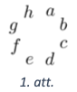

# <lo-sample/> LV.VOL.2025.9.2

Uz trijstūra $ABC$ malas $AB$ atlikts tāds punkts $D$, ka 
$AD:DB = 2:1$. Trijstūra $ABC$ mediāna $BE$ krusto $CD$ 
punktā $F$. Pierādīt, ka $BF=FE$.

<small>

* questionType:
* domain:

</small>

## Atrisinājums

Novilksim nogriezni $EG$ tā, lai $G$ ir $CD$ viduspunkts 
(skat. 2. att.). Tādā gadījumā $CG = GD$ un $AE = EC$ 
($BE$ ir trijstūra $ABC$ mediāna), tātad $EG$ ir trijstūra 
$ADC$ viduslīnija un $EG \| AD$.
Iegūstam, ka $\triangle DBF=\triangle GEF$ pēc pazīmes $\ell m \ell$:

- $\sphericalangle FDB=\sphericalangle FGE$ (iekšējie šk̦ērsleņki pie $EG \| AD$);
- $EG = \frac{1}{2}AD = DB$, jo $EG$ ir $\triangle ADC$ viduslīnija un $AD:DB = 2:1$;
- $\sphericalangle DBF = \sphericalangle GEF$ (iekšējie šķērsleṇki pie $EG \| AD$).

Tātad $BF = FE$ kā vienādo trijstūru atbilstošās malas.

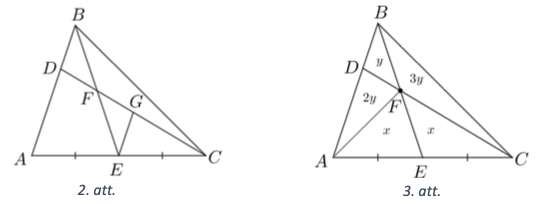

## Atrisinājums

Izmantosim faktu, ja trijstūra malas dalās attiecībā $a:b$ 
un augstumi pret šīm malām ir vienādi, tad trijstūru laukumi 
arī dalās attiecībā $a:b$. Līdz ar to:

- ja $S_{DFB}=y$, tad $S_{DFA}=2y$ ($BD:AD=1:2$ un kopīgs augstums no $F$);
- ja $S_{AFE}=x$, tad $S_{FEC}=x$ ($AE=EC$ un kopīgs augstums no $G$).

Ievērosim, ka arī $S_{ABE}=S_{BEC}$ ($AE=EC$ un kopīgs 
augstums no $B$), tad $S_{BFA} = 3y = S_{BFC}$ (skat. 3.att.).
Tā kā $S_{ADC} = 2S_{BDC}$ ($BD:AD=1:2$ un kopīgs augstums no $C$), 
tad $2y + 2x = 2 \cdot 4y$ jeb $x=3y$.
Tas nozīmē, ka $S_{FEC} = x = 3y = S_{BFC}$. 
No apgrieztā fakta $BF:FE = 1:1$ jeb $BF = FE$.

# <lo-sample/> LV.VOL.2025.9.3

Bezgalīgā naturālu skaitḷu virknē katru nākamo skaitli, 
sākot no otrā, var iegūt iepriekšējam pieskaitot vai nu $54$, 
vai $77$. Pierādīt, ka šajā virknē ir skaitlis, 
kuram divi pēdējie cipari ir vienādi!

<small>

* questionType:
* domain:

</small>

## Atrisinājums

Ievērosim, ka $2 \cdot 77=154$, kas nozīmē, ka pieskaitīt $54$ ir 
tas pats, kas divas reizes pieskaitīt $77$ (mums interesē 
tikai skaitla divi pēdējie cipari). Aplūkosim citu virkni $b_{i}$, 
kurā pirmais loceklis ir dotās virknes pirmais loceklis, 
bet katru nākamo, iegūst, iepriekšējam loceklim pieskaitot $77$:

$b_{0}=a_{1}$; $b_{1}=a_{1}+77$; $b_{2}=a_{1}+2 \cdot 77$; $b_{3}=a_{1}+3 \cdot 77$; 
$\ldots$ jeb $b_{i}=a_{1}+77 \cdot i$, kur $i=0;1;2;3;\ldots$.

Tad mūsu dotās virknes locekḷus var iegūt no šīs virknes, 
sākot no $a_{1}$ un katrā solī ejot uz priekšu vai nu par $1$ vietu 
(uz nākamo locekli) vai par 2 vietām (uz aiznākamo).
Pierādīsim, ka šajā virknē ir visas $100$ iespējamās pēdējo ciparu 
vērtības (no $00$ līdz $99$). Aplūkosim pirmos $100$ šīs 
virknes locekļus. Ja kāda no vērtībām nebūtu sastopama, 
tad pēc Dirihlē principa kādiem diviem no pirmajiem $100$ 
virknes loceklliem būtu vienādi divi pēdējie cipari. 
Tādā gadījumā to starpība dalītos ar 100. Ja sakrīt $b_{i}$ ar 
$b_{j}$ locekli, tad 
$b_{j}-b_{i}=a_{1}+77 \cdot j-\left(a_{1}+77 \cdot i\right)=77(j-i)$, 
kas dalās ar $100$. 

Tā kā $77$ un $100$ ir savstarpēji pirmskaitļi, tad no tā var 
secināt, ka $i-j$ dalās ar $100$. Kas ir pretruna, jo gan $i$, 
gan $j$ ir mazāki nekā 100 (mēs aplūkojām pirmos $100$ locekļus).
Tātad kaut kur šajā virknē $b_{i}$ ir loceklis, $b_{k}$, 
kas beidzas ar $11$. Bet tas nozīmē, ka nākamais loceklis 
$b_{k+1}$ beidzas ar $11+77=88$. Tā kā mums ir divi locekļi 
pēc kārtas, kam pēdējie cipari ir vienādi, tad tiem 
"pārlēkt pāri" nevar, tā kā mēs katrā solī ejam vai nu uz nākamo, 
vai aiznākamo locekli, tad uz viena no šiem diviem mēs noteikti trāpīsim.

# <lo-sample/> LV.VOL.2025.9.4

Dotas septiṇas pēc ārējā izskata vienādas monētas, no 
kurām piecas ir īstas (tām visām ir vienāda masa), 
bet divas ir viltotas (abām viltotajām ir vienāda masa), 
turklāt zināms, ka viltotā monēta ir vieglāka nekā īstā. 
Kā ar $3$ svēršanām uz sviru svariem bez atsvariem 
atrast abas viltotās monētas?

<small>

* questionType:
* domain:

</small>

## Atrisinājums

Pirmajā svēršanā uzliksim uz katra svaru kausa $3$ monētas. 
Tad ir iespējami divi gadījumi.

1. Svaru kausi ir līdzsvarā. Tas nozīmē, ka uz katra svaru kausa 
   ir tieši divas īstās un viena viltotā monēta.
   Apzīmēsim monētas, kas atradās uz kreisā svaru kausa, ar $a$, $b$ un $c$. 
   Otrajā svēršanā uzliksim uz viena svaru kausa $a$, bet uz otra - $b$. 
   Ja tagad viens no svaru kausiem ir vieglāks, tad attiecīgā monēta 
   ($a$ vai $b$) ir viltota. Ja svaru kausi ir līdzsvarā, tad monēta 
   $c$ ir viltota. Trešajā svēršanā analoǵiski rīkojamies ar tām trim 
   monētām, kas pirmajā svēršanā atradās uz labā svaru kausa.
2. Svaru kausi nav līdzsvarā. Tas nozīmē, ka uz smagākā svaru kausa 
   visas monētas ir īstas, bet uz vieglākā ir viena vai divas viltotas.
   Apzīmēsim monētas, kas atradās uz vieglākā svaru kausa, ar 
   $a$, $b$ un $c$, bet to monētu, kas pirmajā svēršanā nepiedalījās, 
   ar $d$. Otrajā svēršanā uzliksim monētas $a$ un $b$ katru uz sava svaru kausa.

   - Ja svaru kausi ir līdzsvarā, tad vai nu tās abas ir viltotas, 
     vai arī tās abas ir īstas, un tādā gadījumā viltotās ir $c$ un $d$.
     Kurš no šiem gadījumiem ir īstais, var noskaidrot trešajā svēršanā, 
     salīdzinot, piemēram, monētas $a$ un $c$.
   - Ja viena no tām ir vieglāka (simetrijas pēc pieṇemsim, ka tā ir 
     monēta $a$), tad mēs zinām, ka monēta $a$ ir viltota, monēta 
     $b$ ir īsta un otra viltotā ir viena no monētām $c$ un $d$. 
     Kura tieši, var noskaidrot trešajā svēršanā, tās salīdzinot.

# <lo-sample/> LV.VOL.2025.9.5

Uz tāfeles uzrakstīti visi naturālie skaitlli no 1 līdz 2025. 
Alise un Kate spēlē šādu spēli. Spēli sāk Alise, viṇas gājienus 
veic pamǐšus un katrā gājiena katra meitene nodzēš vienu skaitli. 
Spēle beidzas, kad uz tāfeles palikuši divi skaitļi. Ja šo skaitlu 
summa ir kāda naturāla skaitla kvadrāts, tad uzvar Alise, 
pretējā gadījumā uzvar Kate. Kura meitene, pareizi spēlējot, noteikti var uzvarēt?

<small>

* questionType:
* domain:

</small>

## Atrisinājums

Vienmēr var uzvarēt Alise. Savā pirmajā gājienā viṇai jānodzēš 
skaitli 2025. Tālāk visus skaitlus Alisei jāsadala pāros tā, 
lai katrā pārī esošo skaitḷi summa ir $2025$:

$$(1 ; 2024); (2 ; 2023); \ldots ;(1012 ; 1013).$$

Kad Kate nodzēš kādu skaitli, tad Alisei pēc tam jānodzēš atbilstošā pāra 
otrais skaitlis. Beigās uz tāfeles paliks divi skaitli, kuru summa ir 
$2025$, kas ir naturāla skaitla kvadrāts ($2025 = 45^{2}$).

# <lo-sample/> LV.VOL.2025.10.1

Vai eksistē tādi veseli skaitli $a, b, c, d$, ka $|a-b|+|b-c|+|c-d|+|d-a|=2025$?

<small>

* questionType:
* domain:

</small>

## Atrisinājums

Ievērojam, ka $|x-y| \equiv x+y \pmod 2$. (Citiem vārdiem, 
$|x-y|$ un $x+y$ dod vienādus atlikumus, dalot ar $2$ -- vai nu 
abas izteiksmes ir pāra skaitļi vai abas ir nepāra skaitļi.)

No šejienes iegūstam, ka

$$|a-b|+|b-c|+|c-d|+|d-a| \equiv (a+b)+(b+c)+(c+d)+(d+a)$$

$$(a+b)+(b+c)+(c+d)+(d+a) = 2(a+b+c+d) \equiv 0 \pmod 2.$$

Tāpēc izteiksme vienmēr būs pāra skaitlis un tā nevar būt $2025$.

# <lo-sample/> LV.VOL.2025.10.2

Dots vienādsānu trijstūris $ABC$, kuram $AB=AC$ un 
$\sphericalangle BAC=80^{\circ}$. Uz malas $AC$ atlikts punkts $E$ tā, 
ka $\sphericalangle EBC=30^{\circ}$, bet uz nogriežṇa $BE$ 
atlikts punkts $M$ tā, ka $\sphericalangle MCB=10^{\circ}$. 
Aprēḳināt $\sphericalangle AMC$ lielumu!

<small>

* questionType:
* domain:

</small>

## Atrisinājums

Novelkam virsotnes leṇka bisektrisi (kas ir arī mediānu 
un augstums) $A F$, tās krustpunktu ar $BE$ apzīmējam ar $D$ 
(skat. 4.att.). Savienojot $C$ un $D$, iegūstam divus vienādus 
trijstūrus $BAD$ un $DAC$ pēc pazīmes $m \ell m$ ($AB=AC$, $AD$ - kopīga, 
$\sphericalangle BAD = \sphericalangle CAD$). 
Tātad $\sphericalangle ACD=\sphericalangle ABD=20^{\circ}$. 
Līdz ar to 

$$\sphericalangle DCM = \sphericalangle ACB - \sphericalangle MCB- 
\sphericalangle ACD=50^{\circ}-10^{\circ}-20^{\circ}=20^{\circ}.$$

Leņk̦is $\sphericalangle EMC = \sphericalangle MBC + \sphericalangle MCB = 
30^{\circ}+10^{\circ}=40^{\circ}$ kā trijstūra $BMC$ ārējais leņk̦is. 
Izmantojot iekšējo leṇḳu summu, iegūstam:

* no $\triangle ADC$: 
  $\sphericalangle ADC = 180^{\circ} - \sphericalangle DAC - \sphericalangle ACD=120^{\circ}$;
* no $\triangle CDM$: 
  $\sphericalangle MDC = 180^{\circ} - \sphericalangle DMC - \sphericalangle DCM = 180^{\circ}-40^{\circ}-20^{\circ}=120^{\circ}$.

Tātad $\triangle ADC = \triangle MDC$ pēc pazīmes 
$\ell m \ell$ ($CD$ - kopīga, $\sphericalangle CDM = \sphericalangle ADC$, 
$\sphericalangle ACD=\sphericalangle MCD$). Līdz ar to $AC=CM$ un 
$\triangle ACM$ ir vienādsānu trijstūris ar virsotnes leņki 
$\sphericalangle ACM=40^{\circ}$ un 
$\sphericalangle CMA=\left(180^{\circ}-40^{\circ}\right): 2=70^{\circ}$.

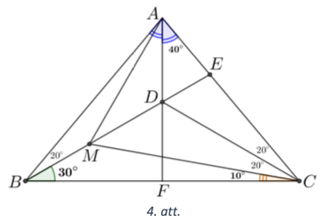

# <lo-sample/> LV.VOL.2025.10.3

Dots naturāls skaitlis $n>1$. Katram skaitla $n+1$ pozitīvam 
dalītājam $d$ (ieskaitot 1 un $n+1$ ) Petrs izdalīja skaitli 
$n$ ar $d$ (ar atlikumu), dalījumu uzrakstīja uz tāfeles, 
bet atlikumi ierakstīja kladē. Pierādīt, ka uz tāfeles un 
kladē ir uzrakstīti vieni un tie paši skaitļi!

<small>

* questionType:
* domain:

</small>

## Atrisinājums

Ievērosim, ka, ja $n+1 = ab$, tad skaitli $n$, dalot ar $a$, 
dalījumā iegūstam $b-1$ un atlikumā $a-1$ (jo $n=(b-1) \cdot a+(a-1)$, 
savukārt, $n$ dalot ar $a$, dalījumā iegūstam $a-1$, bet atlikumā 
$b-1$ (jo $n=(a-1)$. $b+b-1$). Tas nozīmē, ka ja skaitlis $x$ 
parādās uz tāfeles kā dalījums, dalot ar $d$, tad tas parādīsies 
arī kladē kā atlikums, dalot ar $\frac{n+1}{d}$. Un otrādi,
ja skaitlis $y$ parādās kladē, kā atlikums, $n$ dalot ar $d$, 
tad tas parādīsies arī uz tāfeles, kā dalījums, $n$ dalot 
ar $\frac{n+1}{d}$ (spriedums ir spēkā arī tad, ja 
$d=\frac{n+1}{d}$ ). Tas nozīmē, ka uz tāfeles un kladē 
ir uzrakstīti vieni un tie paši skaitḷi.

# <lo-sample/> LV.VOL.2025.10.4

Dots $5 \times 5$ rūtiṇu kvadrāts, kurā katrā rūtiṇā ierakstīts 
skaitlis no $1$ līdz $25$ (skat. 5.att.). No šī kvadrāta 
izgrieza $6$ figūras, kas katra bija vai nu $1 \times 4$ 
rūtiņu taisnstūris (vertikāls vai horizontāls), vai arī 
$2 \times 2$ rūtiṇu kvadrāts, pāri palika viena rūtiņa. 
Kāds skaitlis var būt rakstīts uz šīs rūtiņas?

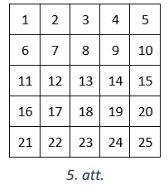

<small>

* questionType:
* domain:

</small>

## Atrisinājums

Parādīsim, ka pāri palikusī rūtiṇa ir stūra rūtiṇa, t.i., uz tās 
ir rakstīts $1$, $5$, $21$ vai $25$. Tas, ka tā var būt stūra rūtiṇa, 
redzams šajā piemērā (skat. 6. att.), lai iegūtu pārējās stūra 
rūtiṇas, attēls jāpagriež. Atliek pamatot, ka citu iespēju nav.

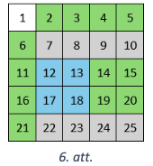

Vispirms ievērosim, ka katrā izgrieztajā figūrā ir divi pāra un 
nepāra skaitļi. Tātad atlikusī viena rūtiṇa noteikti satur nepāra 
skaitli (jo to mums ir vairāk). Aplūkosim rūtiṇas, uz kurām rakstīts 
$8$, $12$, $14$ un 18 (kas visi ir pāra skaitļi, tātad šīs rūtiṇas 
noteikti tika izgrieztas). Ievērosim, ka

- šīs rūtiṇas pieder vismaz trim dažādām figūrām, kas izriet no tā, 
  ka jebkura figūra, kas satur divas no šīm rūtiṇām, satur arī centrālo rūtiņu $13$,
- neviena figūra, kas satur kādu no šīm rūtiṇām, nevar saturēt nevienu stūra rūtiṇu.

Tas nozīmē, ka uz visām četrām stūra rūtiņām mums ir atlikušas tikai 
trīs figūras, kam tās var piederēt. Tā kā divas stūra rūtiṇas nevar 
atrasties vienā figūrā, tad viena no tām paliks neizgriezta.

## Atrisinājums

Parādīsim, ka pāri palikusī rūtiņa ir stūra rūtiņa, t.i., uz tās 
ir rakstīts $1,5,21$ vai 25. Tas, ka tā var būt stūra rūtiņa, 
redzams šajā piemērā (skat. 6. att.), lai iegūtu pārējās 
stūra rūtiṇas, attēls jāpagriež. Atliek pamatot, ka citu iespēju nav.
Lai pamatotu atrisinājuma otro daḷu, (ka nevar būt izgriezta 
neviena cita rūtiṇa, izṇemot stūra rūtiṇu) var izmantot arī 
šādu alternatīvu spriedumu:
Ierakstīsim skaitḷus rūtinās tā, kā parādīts 7. att.

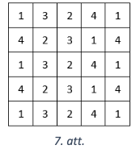

Ievērosim, ka jebkura pieḷaujamā $1 \times 4$ vai $2 \times 2$ 
figūra satur skaitļus, kuru summa ir $10$. Tā kā visu skaitļu 
summa ir $61$, tad skaidrs, ka vienīgā pāri palikusī rūtiṇa 
satur skaitli $1$. Ja tā būtu kāda cita rūtiṇa, kas satur $1$, 
izṇemot stūra rūtiņu, tad pagriežot visu "griezumu" par $90$ 
grādiem vienu vai atspogulojot pret vertikālo simetrijas asi, 
mēs vienmēr varēsim panākt, ka pāri palikusī rūtiṇa satur 
kādu citu skaitli, kas nav $1$ (kas nav iespējams). 
Tātad vienīgā iespēja ir, ka neizgriezta ir palikusi stūra rūtiņa.

# <lo-sample/> LV.VOL.2025.10.5

Naturālu skaitli ar vismaz diviem cipariem sauksim par īpašu, 
ja, nodzēšot jebkuru vienu tā ciparu, iegūst sākotnējā skaitḷa 
dalītāju. Piemēram, $120$ ir īpašs skaitlis (dalās gan ar $12$, 
gan ar $20$, gan ar $10$, nodzēšot attiecīgi $0$; $1$ vai $2$). 
Atrast visus deviņciparu īpašos skaitlus, kuri dalās ar deviṇi!

*Piezīme.* Gadījumā, ja pēc pirmā cipara nodzēšanas atlikušais 
skaitlis sākas ar vienu vai vairākām nullēm, tad liekās nulles tiek atmestas.

<small>

* questionType:
* domain:

</small>

## Atrisinājums

Pierādīsim, ka katram īpašam skaitlim, kuram ir vismaz 
trīs cipari, pēdējais cipars noteikti ir 0, kā arī nodzēšot 
šo pēdējo ciparu, ir iegūts cits īpašais skaitlis.
Aplūkosim $n$-ciparu skaitli 
$A=\overline{a_{1} a_{2} a_{3} \ldots a_{n-1} a_{n}}$. 
Tā kā skaitlis ir īpašs, tas dalās ar skaitli, kuru iegūst, 
nodzēšot pēdējo ciparu $a_{n}$ jeb tas dalās ar skaitli 
$\overline{a_{1} a_{2} a_{3} \ldots a_{n-1}}$. 
Šī dalītāja reizinājums ar 10 ir 
$\overline{a_{1} a_{2} a_{3} \ldots a_{n-1} 0}$, 
līdz ar to $a_{n}=0$, jo, reizinot aplūkoto dalītāju ar 
naturālu skaitli, kas ir lielāks vai mazāks nekā 10, 
iegūtais reizinājums būs lielāks vai mazāks nekā $A$ attiecīgi, 
salīdzinot šķiras sākot ar desmitiem 
(jo $\overline{a_{1} a_{2} a_{3} \ldots a_{n-1}}$ 
ir vismaz divciparu skaitlis). Ja nodzēstu jebkuru skaitļa 
$A$ ciparu, kas nav pēdējais, iegūtais skaitlis $D$ būs 
skaitļa $10$ daudzkārtnis, jo pēdējais cipars būs $0$. Tā kā 
gan $A$, gan iegūtais dalītājs $D$ dalās ar 10, arī 
$\frac{A}{10}=\overline{a_{1} a_{2} a_{3} \ldots a_{n-1}}$ 
dalās ar $\frac{D}{10}$. Tā kā $\frac{D}{10}$ iegūts no 
$\overline{a_{1} a_{2} a_{3} \ldots a_{n-1}}$ nodzēšot 
kādu brīvi izvēlētu ciparu, tad arī skaitlis 
$\overline{a_{1} a_{2} a_{3} \ldots a_{n-1}}$ ir īpašs.
No tā izriet, ka deviņciparu īpašie skaitḷi ir uzrakstāmi 
formā $\overline{a_{1} a_{2} 0000000}$, kur 
$\overline{a_{1} a_{2}}$ ir īpašs divciparu 
skaitlis (tātad $a_{2} \neq 0$ ). Tā kā $\overline{a_{1} a_{2}}$ 
dalās ar $a_{1}$, tad arī 
$\overline{a_{1} a_{2}}-\overline{a_{1} 0}=a_{2}$ dalās ar 
$a_{1}$. Šāds nosacījums izpildās visiem divciparu
skaitḷiem, kas mazāki nekā $20$, un arī skaitḷiem 
$22$, $24$, $26$, $28$, $33$, $36$, $39$, $44$, $48$, $55$, 
$66$, $77$, $88$ un $99$. 
Lai $\overline{a_{1} a_{2} 0000000}$ dalītos ar $9$, 
skaitlim $\overline{a_{1} a_{2}}$ arī jādalās ar $9$. 
Tātad derīgie skaitļi ir $18$, $36$ un $99$.
Nosacījums, ka $\overline{a_{1} a_{2}}$ dalās ar $a_{2}$ 
neizpildās vienīgi skaitlim $18$. Tātad $360000000$ un $990000000$ 
ir vienīgie deviṇciparu īpašie skaitḷi, kuri dalās ar $9$.

# <lo-sample/> LV.VOL.2025.11.1

Dotas septiṇas pēc ārējā izskata vienādas monētas, no kurām 
piecas ir īstas (tām visām ir vienāda masa), bet divas ir 
viltotas (abām viltotajām ir vienāda masa), turklāt zināms, 
ka viltotā monēta ir vieglāka nekā īstā. Kā ar 3 svēršanām 
uz sviru svariem bez atsvariem atrast abas viltotās monētas?

<small>

* questionType:
* domain:

</small>

## Atrisinājums

Pirmajā svēršanā uzliksim uz katra svaru kausa 3 monētas. Tad ir 
iespējami divi gadījumi.

1. Svaru kausi ir līdzsvarā. Tas nozīmē, ka uz katra svaru kausa ir 
   tieši divas īstās un viena viltotā monēta.

   Apzīmēsim monētas, kas atradās uz kreisā svaru kausa, ar $a, b$ 
   un $c$. Otrajā svēršanā uzliksim uz viena svaru kausa $a$, 
   bet uz otra - $b$. Ja tagad viens no svaru kausiem ir vieglāks, 
   tad attiecīgā monēta ($a$ vai $b$) ir viltota. Ja svaru kausi 
   ir līdzsvarā, tad monēta $c$ ir viltota.
   Trešajā svēršanā analoǵiski rīkojamies ar tām trim monētām, 
   kas pirmajā svēršanā atradās uz labā svaru kausa.

2. Svaru kausi nav līdzsvarā. Tas nozīmē, ka uz smagākā svaru kausa 
   visas monētas ir īstas, bet uz vieglākā ir viena vai divas viltotas.
   Apzīmēsim monētas, kas atradās uz vieglākā svaru kausa, ar $a, b$ un 
   $c$, bet to monētu, kas pirmajā svēršanā nepiedalījās, ar $d$. 
   Otrajā svēršanā uzliksim monētas $a$ un $b$ katru uz sava svaru kausa.

   - Ja svaru kausi ir līdzsvarā, tad vai nu tās abas ir viltotas, 
     vai arī tās abas ir īstas, un tādā gadījumā viltotās ir $c$ un $d$. 
     Kurš no šiem gadījumiem ir īstais, var noskaidrot trešajā svēršanā, 
     salīdzinot, piemēram, monētas $a$ un $c$.
   - Ja viena no tām ir vieglāka (simetrijas pēc pieṇemsim, ka tā ir 
     monēta $a$), tad mēs zinām, ka monēta $a$ ir viltota, monēta $b$ 
     ir īsta un otra viltotā ir viena no monētām $c$ un $d$. 
     Kura tieši, var noskaidrot trešajā svēršanā, tās salīdzinot.

# <lo-sample/> LV.VOL.2025.11.2

Četrstūris $ABCD$ ievilkts riṇk̦a līnijā, tā diagonāles krustojas 
punktā $E$. Uz hordām $AC$ un $BD$ attiecīgi atlikti tādi punkti 
$F$ un $G$, ka $AF=BE$ un $DG=CE$. Pierādīt, ka punkti 
$B,F,G,C$ atrodas uz vienas riṇḳa līnijas!

<small>

* questionType:
* domain:

</small>

## Atrisinājums

Izmantojot krustisku hordu īpašību, iegūstam, ka $BE \cdot ED = AE \cdot CE$ 
(skat. 8. att.). Izsakām nogriežṇus $ED$ un $AE$: 
- $ED = EG + GD = EG + CE$;
- $AE = AF + FE = BE + EF$.

Līdz ar to iegūstam:

$$\begin{gathered}
BE \cdot (EG+CE) = (BE + FE) \cdot CE; \\
BE \cdot EG + BE \cdot CE = BE \cdot CE + FE \cdot CE; \\
BE \cdot EG = FE \cdot CE.
\end{gathered}$$

Tātad punkti $B,F,G,C$ atrodas uz vienas riṇḳa līnijas, jo izpildās krustisku hordu īpašībai aprieztā īpašība.

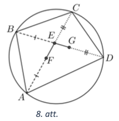

# <lo-sample/> LV.VOL.2025.11.3

Divas dažādas skaitḷu virknes $a_{1} ; a_{2} ; \ldots ; a_{2025}$ un $b_{1} ; b_{2} ; \ldots ; b_{2025}$ katra satur visus naturālos skaitļus no $1$ līdz $2025$ 
(katru tieši vienu reizi), bet skaitlu virkne $c_{1} ; c_{2} ; \ldots ; c_{2025}$ 
satur visus pāra skaitlus no $2$ līdz $4050$ katru tieši vienu reizi. Pierādīt, ka

$$\frac{c_{1}^{2}-4 a_{1} b_{1}}{a_{1}+b_{1}+c_{1}}+\frac{c_{2}^{2}-4 a_{2} b_{2}}{a_{2}+b_{2}+c_{2}}+\cdots+\frac{c_{2025}^{2}-4 a_{2025} b_{2025}}{a_{2025}+b_{2025}+c_{2025}}>0$$

<small>

* questionType:
* domain:

</small>

## Atrisinājums

Ievērosim, ka $(a+b)^{2} \geq 4 a b$ jebkuriem skaitļiem 
$a$ un $b$ (tas ir ekvivalents $(a-b)^{2} \geq 0$ ), 
turklāt vienādība izpildās tad un tikai tad, ja $a=b$. Tas nozīmē, ka

$$\frac{c^{2}-4 a b}{a+b+c} \geq \frac{c^{2}-(a+b)^{2}}{a+b+c}=\frac{(c-a-b)(c+a+b)}{a+b+c}=c-a-b$$

turklāt vienādība izpildās tad un tikai tad, ka $a=b$. Tad

$$\begin{gathered}
\frac{c_{1}^{2}-4 a_{1} b_{1}}{a_{1}+b_{1}+c_{1}}+\frac{c_{2}^{2}-4 a_{2} b_{2}}{a_{2}+b_{2}+c_{2}}+\cdots+\frac{c_{2025}^{2}-4 a_{2025} b_{2025}}{a_{2025}+b_{2025}+c_{2025}} \geq \\
\geq\left(c_{1}-a_{1}-b_{1}\right)+\left(c_{2}-a_{2}-b_{2}\right)+\cdots+\left(c_{2025}-a_{2025}-b_{2025}\right)=0
\end{gathered}$$

Turklāt tā kā virknes $a_{n}$ un $b_{n}$ ir dažādas, tad vismaz vienā 
(patiesībā vismaz divās) izteiksmēs nevienādība ir stingrā, līdz ar to 
rezultāts arī ir stingri lielāks nekā $0$.

# <lo-sample/> LV.VOL.2025.11.4

Dots $7 \times 7$ rūtiṇu kvadrāts. No šī kvadrāta izgrieza 12 figūras, kas katra bija vai nu $1 \times 4$ rūtiṇu taisnstūris (vertikāls vai horizontāls), vai arī $2 \times 2$ rūtiṇu kvadrāts, pāri palika viena rūtiṇa. Kurā vietā sākotnējā kvadrātā varēja atrasties šī pāri palikusī rūtiṇa?

<small>

* questionType:
* domain:

</small>

## Atrisinājums

Pierādīsim, ka pāri palikusī rūtina varēja atrasties tikai un vienīgi 
sākotnējā kvadrāta centrā, piemēru skat. 9.att.

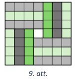

Vēl jāparāda, ka neviena cita rūtiṇa pāri palikt nevar. Lai to pamatotu, 
ierakstīsim skaitḷus rūtiṇās tā, kā parādīts 10.att.

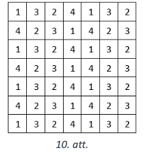

Ievērosim, ka jebkura pieļaujamā $1 \times 4$ vai $2 \times 2$ figūra 
satur skaitḷus, kuru summa ir 10 . Tā kā visu skaitlu summa ir 121, 
tad skaidrs, ka vienīgā pāri palikusī rūtina satur skaitli 1. 
Ja tā būtu kāda cita rūtiṇa, kas satur 1, izṇemot centrālā, 
tad pagriežot visu "griezumu" par 90 grādiem vienu vai atspoguḷojot 
pret vertikālo simetrijas asi, mēs
vienmēr varēsim panākt, ka pāri palikusī rūtiṇa satur kādu citu 
skaitli, kas nav 1 (kas nav iespējams). Tātad vienīgā iespēja ir, 
ka palikusi ir centrālā rūtiṇa.

# <lo-sample/> LV.VOL.2025.11.5

Uz tāfeles sākumā uzrakstīti divi vieninieki. Vienā gājienā var:

- nodzēst vienu uz tāfeles uzrakstīto skaitli un tā vietā uzrakstīt 
  divas reizes lielāku;
- ja uz tāfeles uzrakstītie skaitḷi ir dažādi (apzīmēsim tos ar $x>y$), 
  tad nodzēst skaitli $x$ un tā vietā uzrakstīt skaitli $x-y$.

Vai, atkārtojot šādus gājienus, var panākt, ka uz tāfeles ir uzrakstīti 
skaitļi **(A)** $20$ un $24$; **(A)** $20$ un $25$?

<small>

* questionType:
* domain:

</small>

## Atrisinājums

**(A)** Var, piemēram, šādi:

$$\begin{gathered}
(1;1) \rightarrow (1;2) \rightarrow (1;4) \rightarrow (1;3) \rightarrow (2;3) \rightarrow\\
\rightarrow (4;3) \rightarrow (8;3) \rightarrow (5;3) \rightarrow (10;3) \rightarrow\\
\rightarrow(20;3) \rightarrow(20;6) \rightarrow (20;12) \rightarrow (20;24).
\end{gathered}$$

**(B)** Tas nav iespējams. levērosim, ka katrā solī uz tāfeles uzrakstīto skaitḷu 
lielākais kopīgais dalītājs vai nu nemainās, vai arī palielinās divas reizes. 
Tā kā sākumā skaitlu lielākais kopīgais dalītājs ir $1$, tad beigās tas nevar pieṇemt 
vērtību $5=\text{LKD}(20;25)$.

# <lo-sample/> LV.VOL.2025.12.1

Pierādīt, ka visām naturālām $n$ vērtībām $2^{2n-1} 3^{n-1}+5^{n}$ dalās ar $7$.

<small>

* questionType:
* domain:

</small>

## Atrisinājums

Veicam ekvivalentus pārveidojumus:

$$2^{2 n-1} 3^{n-1}+5^{n}=2 \cdot 2^{2 n-2} \cdot 3^{n-1}+5^{n}=2 \cdot 12^{n-1}+5^{n} = 
\frac{12^{n}+6 \cdot 5^{n}}{6}=\frac{12^{n}-5^{n}+7 \cdot 5^{n}}{6}$$

Starpība $12^{n}-5^{n}$ dalās ar $7$, tātad skaitītājs dalās ar $7$. Tā kā sākotnējā 
izteiksme ir naturāls skaitlis visām naturālām $n$ vērtībām, un $7$ un $6$ 
ir savstarpēji pirmskaitļi, tad arī sākotnējā izteiksme dalās ar $7$.

## Atrisinājums

Izmantosim matemātiskās indukcijas metodi.

Indukcijas bāze. Ja $n=1$, tad $2^{1} \cdot 3^{0}+5^{1}=7$, kas dalās ar $7$.
Induktīvais pieñēmums. Pieņemsim, ka apgalvojums ir patiess, ja $n=k$, t. i.,

$$2^{2 k-1} 3^{k-1}+5^{k} \vdots 7$$

Induktīvā pāreja. Pierādīsim, ka apgalvojums ir patiess arī tad, ja $n=k+1$, t. i.,

$$2^{2 k+1} 3^{k}+5^{k+1} \vdots 7$$

Pārveidosim izteiksmi:

$2^{2k+1} 3^{k}+5^{k+1} =4 \cdot 2^{2k-1} \cdot 3 \cdot 3^{k-1}+5 \cdot 5^{k} = 
12 \cdot 2^{2k-1} 3^{k-1}+5 \cdot 5^{k} =\text{}$

$\text{}=\underbrace{5 \cdot\left(2^{2 k-1} 3^{k-1}+5^{k}\right)}_{\vdots 7\;\text{pēc ind.pieņ.}}+
\underbrace{7 \cdot 2^{2 k-1} 3^{k-1}}_{\vdots 7}.$

Ja katras saskaitāmais dalās ar 7 , tad visa summa dalās ar 7.
Secinājums. Tā kā apgalvojums ir patiess, ja $n=1$, un no tā, ka apgalvojums ir patiess, ja $n=k$, izriet, ka apgalvojums ir patiess arī $n=k+1$, secinām, ka apgalvojums ir patiess visām naturālām vērtībām.

# <lo-sample/> LV.VOL.2025.12.2

Četrstūris $ABCD$, kuram $AB + CD = AD$, ir ievilkts riṇka līnijā. 
Pierādīt, ka leṇḳu $ABC$ un $BCD$ bisektrišu krustpunkts atrodas 
uz četrstūra malas $AD$.

<small>

* questionType:
* domain:

</small>

## Atrisinājums

Apzīmējam $\sphericalangle B C D=2 \alpha$ un $\sphericalangle A B C=2 \beta$. No tā, ka četrstūrim $A B C D$ var apvilkt riṇḳa līniju, iegūstam, ka $\sphericalangle B A D=180^{\circ}-2 \alpha$ un $\sphericalangle A D C=180^{\circ}-2 \beta$. Uz malas $A D$ atliek punktu $E$ tā, ka $A B=A E=a$ un $D E=D C=b$. Tad $\triangle A B E$ un $\triangle C D E$ ir vienādsānu trijstūri, kuriem $\sphericalangle A E B=\sphericalangle A B E=\alpha$ un $\sphericalangle C E D=\sphericalangle E C D=\beta$. Ap trijstūri $B C E$ apvelkam riṇk̦a līniju. lespējami divi gadījumi.
2. Četrstūra mala $A D$ ir šīs riṇka līnijas pieskare un punkts $E$ ir vienīgais punkts uz $A D$, kas kopīgs šim nogrieznim un riṇka līnijai (skat. 11. att.). Tad $\sphericalangle B C E=\sphericalangle A E B=\alpha$ kā ievilktais leṇkis un hordas-pieskares leṇkis, kas abi balstās uz vienu un to pašu loku $B E$. Līdz ar to $\sphericalangle E C D=\sphericalangle B C D-\sphericalangle B C E=2 \alpha-\alpha=\alpha$. Tātad $C E$ ir leṇka $B C D$ bisektrise. Līdzīgi pierāda, ka $B E$ ir leṇḳa $A B C$ bisektrise.
3. Riṇḳa līnija krusto $A D$ gan punktā $E$, gan vēl otrā punktā $H$ (skat. 12. att.). Tad $\sphericalangle B E H=180^{\circ}-\alpha$. No tā, ka ap $B C H E$ var apvilkt riņķa līniju, izriet, ka $\sphericalangle B E H+\sphericalangle B C H=180^{\circ}$ jeb $\sphericalangle B C H=\alpha$. No tā seko, ka $C H$ ir leņḳa $B C D$ bisektrise. Līdzīgi pierāda, ka $B H$ ir leņka $A B C$ bisektrise. Tātad bisektrises krustojas punktā $H$, kas atrodas uz malas $A D$.

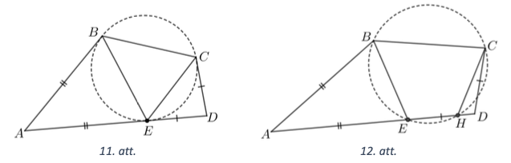

## Atrisinājums

Apzīmējam $\sphericalangle B C D=2 \alpha$ un $\sphericalangle A B C=2 \beta$. 
No tā, ka četrstūrim $A B C D$ var apvilkt riṇḳa līniju, 
iegūstam, ka $\sphericalangle BAD=180^{\circ}-2 \alpha$ un 
$\sphericalangle ADC=180^{\circ}-2 \beta$. Uz malas $AD$ atliek 
punktu $E$ tā, ka $A B=A E=a$ un $D E=D C=b$ (skat. 13. att.). 
Tad $\triangle ABE$ un $\triangle CDE$ ir vienādsānu trijstūri, 
kuriem $\sphericalangle AEB=\sphericalangle ABE=\alpha$ un 
$\sphericalangle CED = \sphericalangle ECD=\beta$.
Izmantojot kosinusu teorēmu trijstūrī $ABE$, iegūstam, ka

$$\begin{gathered}
BE^{2} = AB^{2} + AE^{2} - 2AB \cdot AE \cdot \cos \left(180^{\circ} - 2 \alpha\right) ; \\
BE^{2} = a^{2}+a^{2}+2a^{2} \cos 2 \alpha=2 a^{2}(1+\cos 2 \alpha)=2 a^{2} \cdot 2 \cos ^{2} \alpha ; \\
BE = 2a \cdot \cos \alpha .
\end{gathered}$$

Pēc sinusu teorēmas trijstūrī $B C E$ iegūstam, ka

$$
\begin{equation*}
\frac{B C}{\sin \left(180^{\circ}-\alpha-\beta\right)}=\frac{E B}{\sin (2 \alpha-\beta)}=\frac{2 a \cdot \cos \alpha}{\sin (2 \alpha-\beta)} . \tag{1}
\end{equation*}
$$

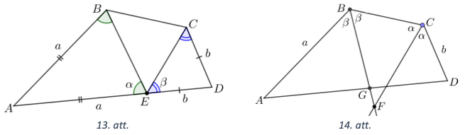

Tagad novelkam leṇku $ABC$ un $BCD$ bisektrises, kas krustojas kādā 
punktā $F$ (skat. 14. att.). Bisektrises $BF$ krustpunktu ar $AC$ 
apzīmējam ar $G$.  Tad 
$\sphericalangle AGB = 180^{\circ}-\sphericalangle BAG-\sphericalangle ABG = 
180^{\circ}-\left(180^{\circ}-2 \alpha\right)-\beta=2 \alpha-\beta$.
No sinusu teorēmas trijstūrī $ABG$ iegūstam, ka

$$\begin{equation*}
\frac{a}{\sin (2 \alpha-\beta)} = \frac{BG}{\sin \left(180^{\circ} - 2 \alpha\right)} = 
\frac{B G}{\sin 2 \alpha} . \tag{2}
\end{equation*}$$

No leņḳu sakarībām trijstūrī $BCF$ leņḳu sakarībām izriet, ka 
$\sphericalangle BFC = 180^{\circ} - \alpha - \beta = \sphericalangle BEC$ un

$$\frac{BC}{\sin \left(180^{\circ}-\alpha-\beta\right)} = 
\frac{B F}{\sin \alpha} \quad \stackrel{(1)}{\Rightarrow} \quad 
\frac{2 a \cdot \cos \alpha}{\sin (2 \alpha-\beta)} = 
\frac{B F}{\sin \alpha} \quad \Rightarrow$$

$$\Rightarrow \quad \frac{a}{\sin (2 \alpha-\beta)} = 
\frac{BF}{\sin 2 \alpha} \quad \stackrel{(2)}{\Rightarrow} \quad 
\frac{BF}{\sin 2 \alpha}=\frac{BG}{\sin 2 \alpha} \quad 
\Rightarrow \quad BF=BG.$$

Tas nozīmē, ka punkti $F$ un $G$ sakrīt un atrodas uz $AD$.

# <lo-sample/> LV.VOL.2025.12.3

Pozitīviem reāliem skaitliem $x, y, z$ izpildās $x+y+z=1$. Pierādīt, ka

$$\frac{1}{x y-z+2}+\frac{1}{y z-x+2}+\frac{1}{x z-y+2} \geq \frac{27}{16}$$

<small>

* questionType:
* domain:

</small>

## Atrisinājums

Izmantojot doto vienādību $x+y+z=1$ un veicot ekvivalentus pārveidojumus, iegūstam:

$$\begin{gathered}
\frac{1}{x y+x+y+1}+\frac{1}{y z+y+z+1}+\frac{1}{x z+x+z+1} \geq \frac{27}{16} \\
\frac{1}{(x+1)(y+1)}+\frac{1}{(y+1)(z+1)}+\frac{1}{(x+1)(z+1)} \geq \frac{27}{16} \\
\frac{z+1+x+1+y+1}{(x+1)(y+1)(z+1)} \geq \frac{27}{16} \\
\frac{4}{(x+1)(y+1)(z+1)} \geq \frac{27}{16} \\
\frac{1}{(x+1)(y+1)(z+1)} \geq \frac{27}{64} 
\end{gathered}$$

Pierādīsim, ka pēdējā nevienādība ir patiesa, izmantojot nevienādību 
starp aritmētisko vidējo un ǵeometrisko vidējo pozitīviem skaitliem 
$x+1, y+1$ un $z+1$:

$$\begin{gathered}
\frac{(x+1)+(y+1)+(z+1)}{3} \geq \sqrt[3]{(x+1)(y+1)(z+1)} \\
\frac{4}{3} \geq \sqrt[3]{(x+1)(y+1)(z+1)} \\
\frac{64}{27} \geq(x+1)(y+1)(z+1) \\
\frac{1}{(x+1)(y+1)(z+1)} \geq \frac{27}{64}
\end{gathered}$$

# <lo-sample/> LV.VOL.2025.12.4

Pirmskaitlli $p$ un $q$ ir tādi, ka $p^{2}+p q+q^{2}$ ir kāda naturāla skaitla kvadrāts. Pierādīt, ka $p^{2}-p q+q^{2}$ ir pirmskaitlis!

<small>

* questionType:
* domain:

</small>

## Atrisinājums

Ja $p=q$, tad $p^{2}+p q+q^{2}=3 p^{2}$ un tas nav naturāla skaitla kvadrāts.
Nezaudējot vispārīgumu, varam pieṇemt, ka $p<q$. Tādā gadījumā $p^{2}+p q+q^{2}=k^{2}>1$. Veicot ekvivalentus pārveidojumus, iegūstam:

$$\begin{gathered}
p^{2}+2pq+q^{2}-k^{2} = pq\\
(p+q)^{2}-k^{2} = pq\\
(p+q-k)(p+q+k) = pq
\end{gathered}$$

Tā kā $p$ un $q$ ir pirmskaitl̦i, tad iespējami divi gadījumi:

1. Ja $p+q-k=1$ un $p+q+k=p q$, tad $k=p+q-1$ un, ievietojot 
   otrajā vienādībā, iegūstam $p+q+$ $(p+q-1)=pq$. 
   Pārveidojam iegūto vienādību:

   $$\begin{gathered}
   pq+1-2p-2q = 0\\
   pq+4-2 p-2q = 3\\
   (p-2)(q-3)=3
   \end{gathered}$$

   Tā kā ir tikai viens veids, kā skaitli 3 izteikt kā divu naturālu 
   skaitļu reizinājumu, tad $p-2=1$ un $q-2=3$ jeb $p=$ 3 un $q=5$. 
   Līdz ar to $p^{2}-p q+q^{2}=9-15+25=19$ un tas ir pirmskaitlis.

2. Ja $p+q-k=p$ un $p+q+k=q$, tad no otrās vienādības iegūstam, 
   ka $p=-k$ un šis gadījums neder.

# <lo-sample/> LV.VOL.2025.12.5

Uz tāfeles uzrakstīti divi polinomi $P(x)=x^{2}+2$ un $Q(x)=x+1$. 
Vienā gājienā Ilmārs izvēlas kādus divus uz tāfeles jau uzrakstītus 
polinomus $a$ un ( $a$ un $b$ var būt arī viens un tas pats polinoms) 
un uzraksta uz tāfeles kādu no polinomiem $a+b, a-b$ vai $a \cdot b$ 
(rezultātā var sanākt arī nulltās pakāpes polinoms, kas ir skaitlis). 
Vai, atkārtojot šādas darbības, viṇam kādā brīdī var izdoties uz 
tāfeles uzrakstīt polinomu: **(A)** $x^{3}+2$; **(B)** $x^{4}+2$ ?

<small>

* questionType:
* domain:

</small>

## Atrisinājums

**(A)** Nē, neizdosies. levērosim, ka sākotnējiem polinomiem $P(2)=6$ 
un $Q(2)=3$, tātad polinoma vērtība punktā $x=2$ dalās ar $3$. 
Tas paliek spēkā arī pēc jebkuras no atlautajām darbībām 
(ja polinomi $P_{1}(x)$ un $P_{2}(x)$ punktā $x=2$ dalās ar $3$, 
tad arī $P_{1}(x)+P_{2}(x), P_{1}(x)-P_{2}(x)$ un 
$P_{1}(x) \cdot P_{2}(x)$ punktā $x=2$ dalīsies ar $3$). 
Bet polinoms $R(x)=x^{3}+2$ punktā $x=2$ pieṇem vērtību 
$R(2)=2^{3}+2=8$, kas nedalās ar $3$.

**(B)** Tas ir iespējams, piemēram, uzrakstot uz tāfeles šādus polinomus:

$$\begin{gathered}
P_{1}(x)=Q(x) \cdot Q(x)=(x+1)^{2}=x^{2}+2 x+1 \\
P_{2}(x)=P 1(x)-P(x)=x^{2}+2 x+1-\left(x^{2}+2\right)=2 x-1 \\
P_{3}(x)=P(x) \cdot P(x)=\left(x^{2}+2\right)^{2}=x^{4}+4 x^{2}+4 \\
P_{4}(x)=P_{2}(x) \cdot P_{2}(x)=(2 x-1)^{2}=4 x^{2}-4 x+1 \\
P_{5}(x)=P_{3}(x)-P_{4}(x)=\left(x^{4}+4 x^{2}+4\right)-\left(4 x^{2}-4 x+1\right)=x^{4}+4 x+3 ; \\
P_{6}(x)=P_{5}(x)-P_{2}(x)=x^{4}+4 x+3-(2 x-1)=x^{4}+2 x+4 \\
P_{7}(x)=P_{6}(x)-Q(x)=x^{4}+2 x+4-(x+1)=x^{4}+x+3 \\
P_{8}(x)=P_{7}(x)-Q(x)=x^{4}+x+3-(x+1)=x^{4}+2
\end{gathered}$$

